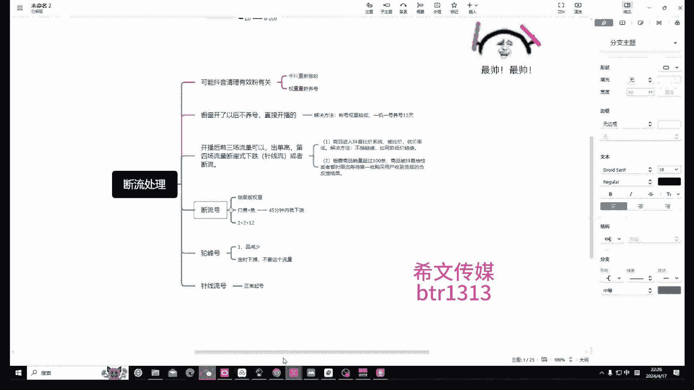
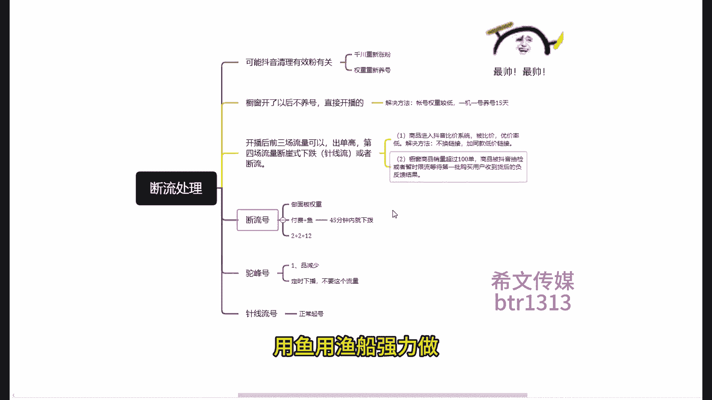
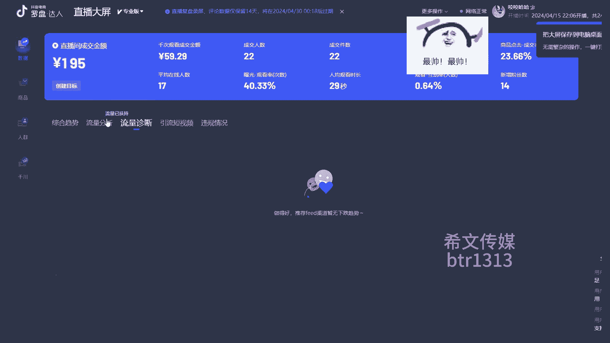
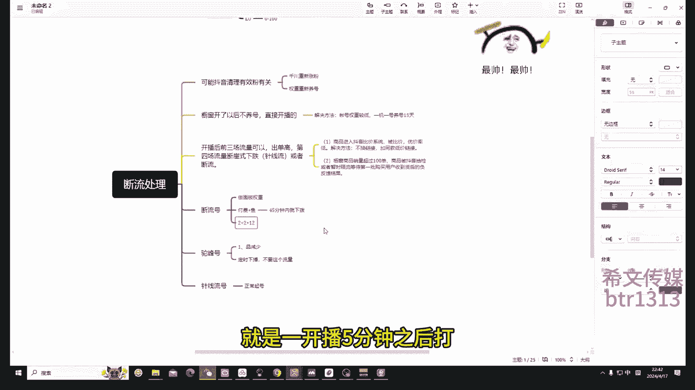

# 2024抖音直播起号方法-不推流怎么办？没有流量的必看！ - P1 - 无人直播中的纯白 - BV1FE42157Zj

今天最主要的总重点讲一讲，你的断流怎么处理的啊，这里我也给大家看看什么叫断流，大家一定要明白在哪看，不是不会看平了，我一看评论是很忠诚的，你进来的话是这种，知道吧，你不要看这个啊，不要看这个没什么用啊。

没什么用，看流专业评的流量分析，知道吧，音量信息，这时候你可以把付费都关掉，然后就看你的看划线，不是直播伴侣吗，你看你的直播伴侣，你看我这个就是典型的断流是吧，中控好长时间推一个，好长时间推一个。

这就是典型的风暴，就是现在大家都常见的都常见了，而且重要的一点是好，就其他流量会占比很高，你的直播推荐流量占比很少，有可能你的西瓜头条比你高，有可能你的速度比你高，反正就是推荐无，并非这就是断流啊。

但是往往这就是一中控或者大脑的比差，看到很差，咱们这个就是这个啊，之前啊我们理解这个特点，或者讲讲，之前我们可以理解为就是你的信号信号是L1，L1的LE的流量升级啊，我是说这个L0等等，现在是二零。

你现在是L1吗，以前是L1吗，LOG大概是大概是推流会不取个地方，应该是100~500吧，我举个例子，现在你的信号是什么呢，你现在你的信号是二零，好吧你说我说你的推流了吧，这个流量池用的是0~100。

就你到现在就是因为什么呢，因为大家都在打付费啊，都在打付费，所以对，然后抖音想提高门槛，现在做直播人太多了是吧，抖音想提高门槛怎么办是吧，他就给你留下师往下降了，然后你现在你的信号都是二零。

那么L0L1爬的这个重要的一点是什么，是你的权重，你的账号权重不够，因为你之前的权重就是在L1，他会给你推一一百到500，这个流量是在里边，所以说你是我举个例子吧，就这个流量吧曝光了。

如果这时候你就去打一针，就去建模就可以了啊，但是发现这个顺序最后大家都找到这种规律，咱们抖音提高门槛的，3月16号之后，他把你的信号给你降到二零，二零推流少了，有可能这些流量大家都共用，我那是吧。

那你可能好几分钟就给你推一个，好几分钟才给你推一个，他会导致这种，所以说我们现在要做的就是从二零要提权，重提L1L1去建模，再去干LGL6L七干到爆发，不像这样一个层级的一个模式。

现在是改了规规则就改了，所以说你现在你当新号通通为零啊，通通为零啊，然后对应的话有几个方面，一个是一个是一呃抖音清理有效本身有关，因为大家都知道抖音出了个规则，是有效粉丝嘛，然后之前你说的号啊，说的很。

包括你说的各种粉都是手工粉，掉的很快，而且都是一些机器粉，所以说这个等于不承认不承认了，他提高账号的质量，所以说他会给你分控分控，那怎么办去解决怎么去解决对吧，1000川去重新找粉，第二啊。

同时啊这个战略是同时要干的事，第二就是你的权重要重新养号，最好养养养一段时间再去多去用，你的账号太差了，还在封控，然后还有一种情况是什么呢，都让开了，你你不养号再开播的这种方法是断流的。

那么解决方法就是一机一卡，然后15天，15天之后的局部，这样就不用讲了，刚才一起听了，然后还有一种就是断流浪，就是开播前三场还可以存档，还挺高的，第四场C线程或者断流浪，那这个我说这种情况是什么原因啊。

一个是一抖音进入到比价系统了啊，被比价了啊，你的预算就太低了是吧，然后不行，然后那个现在大家还还有人问我，这个这个这个评价系统在哪里，去，你的手页去看哈，你首页看优价率，优价率是吧，你不要想着光选择高。

用了高，为什么鸟用了是吧，你这打的挺用，性价比高才行啊，所以说你的U战队一定要注意啊，然后这种处理的方式就是二连接，加同款B加链接，知道吗，你去加那个哪去弹会好一些，第二个就是抖音啊。

这个你这个商城这个橱窗，你可能是卖了100单了，我是说卖到一定的单量，抖音商品会有一个收藏会等着你的好评，会等到那个收那个购买用户，收到你的之后会反馈，结果反馈到哪里呢，它会体现在你的扣分对吧。

然后那个商家会给你拿合作分啊，这都是你的卖100单去累积的成果，恰好你在这个节点啊，你是会限流的，那是这个好，然后那个然后我讲一讲这个钻头啊，怎么去系统的去做这个东西啊，看见了给大家讲讲啊。

因为我就是断流是吧，断流我给大家看我怎么去做啊，看我去打强档付费，打了大概几笔，打了三笔，三体不配去添加头的，然后那个我们我们要做的是什么，我们要做的是什么，我们要做的是这个。

做了这个大屏的所有数据，知道吧，做的所有数据干什么，怎么做1~3场的累加，你比如说第一场我是这个情况，对我是这个情况，那有点严重，那我又打出一个数据，我起码有个基础数据在，我要比我没开过的数据要强对吧。

要成交要求成交人数，要要求转化率，点击率，签字等，粉丝在线对吧，这几个数据吧，然后那个这是一个啊，然后你如果说做不了怎么办啊，两种方式，一个是枪打付费，枪打破费，第二个是用鱼，用鱼，用鱼墙墙面做。

然后这种呢我们不建议去拨很长，第85分钟之内就好了，因为设置5分钟之后就会生成电压数据，这个就过45分钟，因为我这个我这个当时测了，我这个老话术，你感觉做的差不多了，你就下吧，然后你第二天再去开。

记不住记不住。

就是我感觉应该比比那个还要好看啊，就应该更早用好，这个是更早，这个这个是驼峰号，一会给他讲这些很典型，这个号遇到的情况太多了，都是好案例，当你第一场去做了，然后第二场去做，第二场也是做面板权重啊。

做的也是技术屏障，这些面板权重一样的啊，你要去看，你要去看这个价啊，这几个数据，这几个数据你要做的比第一场要好要高，你看我这每个都是不是都比以前高，包括增粉对吧，观看你看我那个是不是那个是不是比他要少。

所以你要做递增了是吧，然后那个你在播这个的时候，你要观察一下曲线，在45分钟左右观察一下曲线，如果说你在45分钟，你看一下你的流量回来了，可以在网上找的，就比如说我举个例子，休息45分钟吧。

这5分钟的经验我播了15分钟，然后我的流量呢从那里回来了，回来了，然后我突然上去了，这样你就去拉，那恭喜你，你就把他从那个洞里面拉出来了，如果说你的流量就这样，这样这样这样越来越走低了。

像我这样越来越走低了，你就下你45分钟之内你就下了，知道吧，你要你要在30分钟到45分钟之间，你要去观察，你要去观察，是你看这就是我有权利吧，这就说这就是3分钟，你要观察这个流速是吧，你要看这个流数线。

如果说流速好了，拉拉拉拉好了，你就不下播了，如果没拉好，反而越来越来越差，一般会越来越差，那你就下播，你现在是越来越差，你就下播了，你播了三个小时了，我这个是做实验嘛，前面后背做实验嘛。

你不要你不要跟我这个什么，我们现在都在自习，这个5分钟就解，我刚才都讲了，你好好听好吧，15分钟啊，不要像我一样，我40，如果我45分钟呃，比如说我这个第二场我45分钟了，但是我的那个签字啊。

成交元素啊，建筑啊都没有比第一场好，我就可以再拉一下咯，那不能拉了，那你为什么会做的不好呢，那你提前不会考六级吗，你在20分钟的时候，你就要想想不到这个事儿是吧，你在20分钟的时候。

你这个流速我之前你你你之前有基础，那个才25分钟投的那个节点，看流速，基本上你的流速线就基本就定了，你这时候你就要考虑了，你说这个图书线大概是什么样的啊，赶紧赶紧去找找找一些措施。

如果说付费的你没有准备语音，就再打一局不配，你开头打到300km，做起来再打一笔付费嗯，超不了多少不了多少钱啊，45分钟嗯，之内比第一场的书记好，对你就加20分钟，你要考虑这个事，你用鱼就提前用鱼是吧。

然后不用约，你就再打电付费，因为你45分钟收到付费，收不了多少钱，不要信徒，这个钱是收不了多少，你要的就是把数据做上去就对了啊，然后做上去就是我这个第三个这个好点了，没密度，密度高了没有高了。

然后那个我的鞋子今天拉也能拉起来，但是我这边网络像今天下午一样卡了，卡了好了，然后我一下因为这个网速退，网速太影响我了，我预计的我在这里，我在这里我就能拉起来，你看我这个后退我就打了，打了四笔。

达到四笔付费强了，我把他的数据都要做起来，强了来了之后，我发现我这个我这个容量还可以啊，还可以，然后包括这个往后这个节点就往上升了，上升了，怎么突然间那个网络不好了，而且我这个投资占比还可以啊。

如果有监测，有成交了，还没有成交了，有成交了，这个是最好的，有签测了好有成交完了，这是最好的情况好，然后就想到这个距离拉，但是这个网络掉了，比如说这个文件就拉这个也是一样的，就第二场和第一场一样的。

你要做的还是这些面板上的数据给他做上去，然后那个还是技术型的面板数据做上去，我再看看74下五四了是吧，这个人均87秒，可能这个无关紧要啊，然后主要是这个啊，我们说这个成交密度和GMV他比较重要。

比较重要啊，而且停留也相对来说还可以，也比较重要，因为这样就是你三笔打起来，基本就是前摇比你打的好打的一招，那你基本就是这样要好点了，知道吗，所以说那个就是这样打，你这个这个商场是在同一天播的。

不是同一天播的，不是同一天播的，是睡觉了吗，这三天一天一场，这是下午重开了一场啊，一天不能重开两场，那就不不多于两场，是好，是这样的，然后你去拿一般三天都能做成这个品没问题，首先你账号粉丝没问题。

我刚才说了，你账号不是因为粉丝通过，第二不是因为品控，然后是因为你的权重低，你要说L0跳到L1，你就去算导啊，那个那个那个群里那个小单说这个没什么鸟，用，来看一下，第四层给他一巴掌啊，最后一场一场。

所以说那个所有的都是打递增的内合计，你想对肯定是没有任何毛病啊，这个是这个啊，同括号头括号给大家讲讲同封号，这个老号重启的第一层同封号，你看4月15号的很有用啊，可不就是前面都是乱流，关键节来了一下子。

紧接着就土地了，就没有流量，这种配件呢推荐进来的都是50加的，人群一点都不行了，人群一点都不精神，你看我这个黑来这么多人有成交吗，没有是吧，都是付费啥的，所以说这个公众号它会导致你形成这个。

它会形成你这场知道吧，所以说普通话怎么处理，我们不要他那个流量啊，很多流量啊有可能是你的，你那个你看这是我那天过了啊，我自己去拉吧，很多情况下是因为你的品啊，它会有一定的这个有受到流量在里边。

另外一个是因为什么呢，同城同城给关掉，总能给关掉，然后这个设置成智能，一般不要写，不要写3。0，不要写商品名，我们不要让垃圾流量了，以前可以玩，现在不玩了，就不要打这个商品流量了。

因为之前我们知道就做那个搜索流的时候，你打这个行业很多收租企业能收到你直播间，如果这种条件，我们这种流量往往推进来了，就做多了之后会做成其他，然后你再做就拉不出来了，所以说我们就不要了啊。

然后那个不要给你推荐来这波流量，你就下，你就下二胎，我不要不要这个流量啊，就遇到高分号很简单，那些之后你这时候你就要在这个节点，你就看到了，我这个在线四五十才第三个没有成交，而且前面付费打了那么多场面。

前面付费已经成交了，我那期模型有基础模型了，对吧，为什么这里面这个推荐不推啊，不成交，你就要你就要判断了，肯定是有问题，也没说驼峰吹的人群都是饭量特别不均衡，尤其是老年回家我们就不要了。

我们就下播二开啊，他就不会再给你推这种了是吧，所以说这个同盟就就就这么简单，就是一个是你设置问题，你把这个东西都设置好，不要受不能量啊，第二个就是你遇到这种流量啊。

就他那操纵50人在线直播推荐一单都不出，下就下是吧，你不要再去拉了，无谓的增长越拉你的数据会越差，知道吧，就是这种，然后那个电线有喜好啊，这个就比较简单了，这个就是我们说这个比较好的一种状态啊。

正常打就可以，正常打这个神经就可以这样的情况，到后来这个你们一对一盯盘的时候，是顾老师和朱老师给你们证明一下，自动挡就可以，全部还可以是吧，当我们说这个不贴地流数是更好的。

那么那么你从这些流变成不贴地流数，只需要一个水晶杯，但我认为啊你说这个没什么好讲的，就这两个，就目前大家遇到的情况是最多的，尤其是断流，大家去处理一下，先去排查你的，但是你们在下或者你有没有在想要。

或者是你的品和你的标题有违规，你考虑考虑排查完没问题，那就是你的权重太低，你就要做面板权重啊，我我有一个号就是投封号啊，同胞就是同胞号是不是很垃圾的，怎么样，我第一第一场就不是驼峰号。

第一场就是刘思涵稳定，然后第二场还是变成这种头发了，然后我第三场第四场，第五场都拉不起来了啊啊第四场，第五场，第六场，第七场全部都是贴地的，我现在这个号就停了，就废了，废了还能打回来啊，很难打回来。

帮帮号处理，把南拿回来的，结果要画质，你要砸钱，想打付费吗，想打付费一个，今天我觉得就没必要了，不如说建信号花得花一两千块钱吧，这样就没必要打，我跟你说，你为什么为什么你那个地上波还好。

你为什么第二场是是这个这个这个驼峰号，首先你要看你的这个流量架构有没有问题，是不是说你的其他的流量升级，会不会比你的要高，就是你的破坏在下场，可能你的关注我新发头条比你的直播间高，而且他们有出单。

他们有出单，你的直播推荐没有出单，另外一个就是你的付费出单，打的成交密度太低，他没有给到直播推荐，知道吧，然后就会导致什么情况呢，导致你的流量加速乱了，这不乱了，然后他推荐的就是犯了。

所以说遇到这种情况，下坡二开三小时就给顶掉，这是最好的一个方式，老板杨少，那其他的同志们有没有问题，我想知道那个呃，就是断流之后，不是要开三场提提升面板的数据吗，那个第一场，第二场。

第三场他们的间隔时间是哦，然后还有驼峰号的，就是下播之后重开，那个是多久之后重开的，5分钟，5分钟，5分钟后从2K你接着开出来，也没有什么影响，这里往往漏了一点，还没给大家讲，就是三体不会怎么挡。

2+2加12，当然也有人讲是2+2，3+5加12都一样，你就按2+2加12，就是你弟弟是打自动推荐两个小时的成交是吧，不限任何人群，就让他看5分钟之后再打一笔一样的，然后再隔五到10分钟开始揉术。

再打一笔12小时的，明白了，第二小时了，进到哪三场就到哪三场啊，就是一开播5分钟之后打打一笔两小时的。

你一开播你先看看流速哥，你的牛说万一出来是好的呢，你就你还能再打吗，你可以你出来零售都可以啊，是不贴近流速啊，我说这个流量数据让你好吃那种不贴地流出，你就按照我们之前的成本大法打败对吧，如果说你出来。

我看你就是断流了，因为这种这种这种状态啊，你要看一个8分钟，一般我我我希望8分钟这个节点会看，一般一般八二十五四十五，基本就能摸清楚我那个流量升级怎么样了，所以说在调节点你要注意一个是8分钟。

我去看看我前面的流速是怎么样，如果说8分钟之前我的线是这样的，一条线的，那你这个多半是断流，知道吧，如果说8分钟我是真限流，那你可以拉一拉，能拉什么，不贴地流速不贴地流出。

就这种这种对到这就不贴近的时候，它黑就是黑色，但它不贴地是吧，在这种，然后那个然后你要看什么呢，看你的这个8分钟，还要看一下是不是那个流量架构有没有问题，流量架构看这看看是不是都是直播推荐是吧。

到时候你再去考虑你这么打，要打就赶快打哦，你你的老师，你的意思就是说看看看那个节点，8分钟，30分钟，还有45分钟是吧，你看你要看你修成什么样，你只要所有的型号，最基础的。

就是你知道你是你的直播模型是什么样的，你明白怎么处理，那么你也写了哪个号都差不多都能起来是吧，就是比如说你感冒啊，你知道你又吃了感冒药，真的好，你对症下药就能干，这就是起号的要点。

你不知道这个流量模显示怎么搞对吧，所以说你要对流量模型的处理方法和感知能力，有有点基础，那你去干这个事，我觉得百分百应该是成功了哦，就是一开播之后，我要看一下这个黄线，他如果是单线流的话。

那就可以考虑打两小时付费，然后5分钟后再打第二笔，然后5分钟后再打第三笔是吧，这个意思吗，首先你8分钟去快乐，如果说是不贴地流速或者真限流对吧，而且正线流的密度比较高，那你就打两个小时。

自动推荐成就和他们那些信号，你不看模型，判定模型就可以了，知道吧，刚刚那个如果说是如果是断流，8分钟就不推流了，那你就要8分钟，2分钟，两个小时直接打进去之后，这5分钟直接再打一点，这样的明白吗。

啊啊你的意思就是说我前8分钟如果是贴地的，我就打一笔两小时的，我5分钟再打一笔两小时的，不用他们怎么给你讲，不明白呢，你不贴地流出，你这流速还可以，还有那种情况算法吗，你就用他之前就写过号了，你写挂号。

你就用之前的小号可以吗，你用这个两个小时的去去拉，去探探了之后，你看你的流速不贴近，一直不贴近对吧，你就不用打了，然后那个那个谁经得速度大，直播推线速度大，根据你的流速来达到时间维度就可以了。

回归到成功能好吗，如果说我说的三指截图什么情况，你断流8分钟之前你断流了，知道吧，断流了，而且你的流量架构不造，你去打三比零打三比你高的流量是断流的，别提了，不推流一点都没有好吧，我觉得你不应该啊。

这种好吧，这种老学员了，你这两块钱不知道吗，我之前还挺挺挺清楚的，可能今天没听听清楚，那这个就是断流，就是你看我就不给你推人，或者是4分钟给你推个好几分钟，推人就断了吧，好你就记住你断流，你就得打好吧。

然后不断流流量还好，流量还好，和咱之前那个正常情况一样，你就按正常情况去写对吧，那其他其他同事看有没有问题，我没有，可是这流量模型但是一定要分清啊，你在你直播过程中肯定会遇到，你如果说不出我所料的话。

这里都是这个不行啊，可能就是你这个风和这个风离得近一点啊，他差不差，所以你怎么挡，还有那个说法去搞啊，不要去一味的拉丝糖，没用号都有浪费，没有拉丝糖说拉食堂能拉回来，给他两巴掌，什么叫胡说八道。

什么年代了，现在主打的就是权重和人群建模，就这你说就这两点是吧，我们打的旗号就是你对选手起来之后，我们是用随心推去看你的人群，让他的人群我想给到直播推荐，是不是杨生啊。

然后这时候你的直播推荐就知道你要什么人了，他会给你推家里人，你到时候就会有成交了，然后这时候你关注的就几点，一个是你的签字，因为有三角机制嘛，成交键数，成交密度，每分钟的成交键数就成交密度嘛对吧。

成交密度决定了你的退休速度嘛，你想让他退出来，那么别扭啊，你把它搞上去怎么搞，用，于是吧，搞两条鱼到五条鱼，一个人拍多单，一个链接，拍多单或者是拍五个链接，就是12345，你可以拍五个，拍五个链接。

当然你也可以让他一个链接，一号链接让他拍四单，看我的也可以，打的也是成交价数，每分钟的成交密度是吧，但是会决定你的猛啊啊，然后其他的就很少去关注了，那个商品点击率肯定是和你的品有关系的。

就是你的人群都说不精准，但第一他简历很低对吧，然后另一个就是你的点击率特别低的话，低于1。5的话，那肯定是你的品味有点问题是吧，但你号起来的话，你就不太会关注这个问题是吧。

然后就关注了这个和这个就可以了啊，看看看看这个，然后队伍二是这个MV，你想打击大家MV就是你要做大的GMV，那你的前提一定是你的成交密度非常高啊，然后你的签字非常高，你肯定是能卖到大键位的。

我们说10万5万1万买这种大件MV一起的话，就这么简单了，就不需要看下数据，因为你没起号之前，你看这数据就就你基础学的做一个数据，看你做的就是做的就是叠加好，今天就讲这些吧，然后一会把那个。

一会儿把那个视频给大家传下去，这个视频啊，大家不要不要乱传了好吧，之前那个讲的课，有些人会放到别的人的群里啊，你不要再搞了，你看这个之前随机推我们去拉去带学员，大家都每个机构都在交好，然后大家用的多了。

收入门槛就低了，对于现在大家想法又困难了，所以说这个一定就是都行，就是他给你付费型对吧，你可以交给他，他不给你付费白嫖，那你就不要分享，是对你没有什么好处吗，好吧今天就讲这么多，有什么问题再说什么是吧。

没什么问题。