# 2024新版小红书起号开店教程，0基础新手如何做一个小红书账号，教你快速学会怎么开小红书店铺！简单易学！小红书起号开店教程新手入门做自媒体教程全新！ - P1 - 这个人不神秘的普鲁士 - BV1mx4y1n7ir

。要说最近什么项目最火啊，那就必须要提到小红书电商。最近几个月呢，几乎整个互联网都在讨论小红书电商。我关注的几个商业博主啊，包括一些付费社群都在讨论他。我朋友圈月入5位数甚至6位数的比比皆是。

这个项目在年初的时候，我其实就有让团队跟进测试。我还在市面上买了一些课程学习，到现在单人单店，一个月能做个一两万块吧。今天我就用一个视频详细的给大家拆解一下，就是小红书电商到底怎么玩。

我会把整个小红书电商的流程，包括一些注意点，比如怎么开店，怎么选品，怎么做流量，一次性给大家讲清楚，你甚至都不用再去看别的相关视频和培训啊，你就跟着我的视频去按足佐骥，就足够你在这个事频上开始盈利了。

视频的结尾呢，我还会给大家准备一份资料，里面有我找的课程啊，对你运营小红书电商呢会有很大的帮助，有需要呢直接去拿就可以了。言归正传啊，整个项目的逻辑啊，其实也非常简单，它就三件事儿，第一个呢开店。

第二个选品，第三个流量，我们一个一个来讲，先说开店。呃，开店其实没什么好说的。那，首先就是打开小红书，然后点击左上角的菜单图标，再选择创作中心，然后点击更多服务这个选项，选择店铺，点击立即入驻就可以了。

你就按它官方要求的提交资料入住就行了。我居然看到有人把小红书开店包装成一个项目拿出来卖。居然还有不少人买，这也是很奇特。这里跟大家说一下，小红书店铺的两种形式，个人店和企业店，其中个人店有两种。

分别是个人店和个体工商户店，个人店只需要身份证加1000保证金就可以开通了。个体工商户呢还要多一个营业执照。企业店呢就多一点，企业店有三种呃，有包括那个普通的企业店，有专卖店和旗舰店。

企业店都需要营业执照，而且还要缴纳600个年费。我们刚开始运营小红书电商的时候，你直接选择个人店就可以了。我们实测下呀，企业店和个人店一样，平台并没有对企业店有什么流量倾斜。唯一的区别是个人店。

你只能开一家，而一份营业执照呢，你可以开三个店，你一个店如果都没做好，你开再多的店都是没有用的。而且小红书电商，我觉得是。

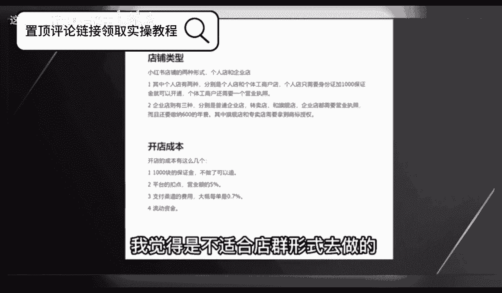

适合店群形式去做的。这是因为小红书的流量机制，它的电商自然流占比非常低。那你铺再多的店再多的货有什么用呢？所以只要你看到有博主跟你讲什么小红书店群，我都觉得是在扯淡。小红书是要做矩阵的啊。

但不是店铺矩阵，而是账号矩阵。这个后面在流量获取那里，我会跟大家细说，开店的成本呢有这么几个。第一个就是1000钱的保证金啊，不做了可以退。第二个呢是平台的扣点营业额的5%。第三个呢是支付渠道的费用。

大概呢每单是0。7，第四个就是自己的流动资金啊，一开始大家做呢可以有无货源的方式去做啊，对资金要求也不高。你刚开始呢准备个20003000块完全够了。呃，开完店以后呢，我们下一步就是选品。

我们应该在小红书上卖什么呢？选品其实也简单，在其他平台上的爆款大概率在小红书上也能报。目前小红书呢我是推荐三个渠道进行选品的。第一个是通过某东某宝上面找那种小红书平台调性的爆款产品。呃。

身边有做电商的朋友，他自己在某宝的店铺卖爆款，搬到小红书上。第一篇笔记就开始。第二篇笔记单量就已经破百了。第二个呢是通过某音的那个精选联盟。你在某音的精选联盟排行榜，你可以看到现阶段哪些品卖的好。

只要符合小红书用户调性的产品，直接搬运测试就可以了。第三个就是某多多的这个销量排行榜选择适合小红书的类目排行榜，从中选择相应的爆品搬运到小红书整个选品的逻辑。就是我们要利用市场来帮助我们选品。

而不是自己在那瞎想，我们要借助大卖家的选品能力来弥补自己选品上的不足。所以我们只要判断一个东西啊，就是这些排行榜上的爆品是否跟小红书的人群有匹配的可能，如果有我就搬过来测一下，对吧？

相当于是借助了别人的能力来帮我们自己选品，这样反而是最快捷，而且是最稳妥的选品方式，肯定比你瞎测成功率要高很多。然后等你这个产品上架以后呢，就到了最重要的环节了，我们应该如何获取流量。

小红书它是个种草平台。你店铺九成以上的流量啊，都是来自你发发的笔记。这就是为什么我之前说小红书不要铺店群，而要做账号矩阵，尽可能多的发笔记耗流量。它的通路就是。用户通过你的笔记啊后对你推的产品产生兴趣。

然后到达你的店铺完成购买，你堆一堆店铺，对吧？你铺一堆店铺一就还不如多发笔记，多发几篇笔记的这个效果好。所以怎么在小红书上发笔记，对吧？就是你小红书电商是否成功的关键。小红书这个平台，你直接发硬广。

我觉得效果非常差，对吧？本来小红书的这个用户群体认知就比较高，你直接发广告没有办法获得信任的啊，更不要提转化了，你发笔记的时候，一定要用一个素人的角度，你知道吧？就是用户的角度去切入。

站在用户的角度去做种草内容，而不是官方视角，这才是真正有效的。呃，这种种草笔记怎么做，其实也很简单，就是去各大平台的商品评论里找。比如某音某宝某东的商品买家秀找到好看的素材，你直接copy下来用嘛。

对吧？文案呢在买家评价上去做修改。这些买家的评价呢就是商品用户的使用体验，天然的适合用来做这个中考笔记，而且可以说是取之不尽了啊，然后呃当你单个账号的SOB跑通了是吧？我们就可以开始举阵引流了啊。

通过批量上小红书账号批量发布笔记。给我们的店铺来引流来放大。那基本上整个小红书的电商的运营啊，就是我上面分享的这些外面不管多少钱的培训啊，000块也好，600块、1万块也好，其实就是这些东西。

有些培训可能还没有讲的清楚啊。根据上面几个点，我给大家准备了一份资料，里面包括了小红书账号的起号运营的方法，以及一份小红书电商的视频课程。你如果打算经营小红书电商，你也不用看别的东西。

就跟着这份资料走足够你开始盈利了。有需要的点赞加关注，在评论区回复红书电商，我分享给你。😊，🎼要有自信啊，你是最好的，知道吗？大家好，今天给大家分享一个小红书全集系列的一个整体的一个分享啊。

这整个系列呢是我们从小红书，从它的一个本字到小红书整个三大主体啊，全部的一个内容。呃，包括我们整个小红书市场的一个运营起好，呃，创建，包括我们的一些网络博主啊、引流啊、店铺啊，怎么去操作。

就是全集为什么要讲全集呢？我呢是从小红书最基础，一直给大家讲到最后啊进行的一个系列分享。因为这期的课程的话，它是非常多的一个内容，而且这一个分享内容的话，我也准备了比较长的一个时间。

首先呢我们就需要知道小红书，了解小红书。然后才能去做好小红书啊。我呢会分成好几十节课啊，大致的内容的话，我给大家先看一下啊。从小红书的本字开始，什么叫小红书的本质呢？就是说我们只有先了解小红书。

它到底整体的一个小红书平台，它的主作用是什么啊，我们要了解它整个主作用以后的话。把它进行拆分。拆分的话就是说小红书它这里面包含了6个内容在里面。我们从这6个内容里面，我们自己结合自身啊。

我是想做小红书开店也好，想做网络博主也好，想做小红书引流到其他平台也好啊。在这个里面的话，我们要先了解小红书整个系列的一个分享。就是把小红书把它拆分开来。

我们在这个小红书里面结合我们自身能够在小红书做什么。这个呢就是小红书的本质。第二个呢是小红书的一个市场，它的整体市场的话，怎么说呢？就是说小红书主要定位的话，它都是中高端人群。说实话，低端人群的话也有。

但是没有那么多啊，普遍的话都是女性用户为主啊，高校学生及网红等。其中的话你年轻女性用户占比的话。年龄呢多都集中在15到吧，18到35。但是正常来说的话，它里面包括从12岁一直到45岁左右。

基本上都是这个概括年龄。但是整体集中的话就是说在18到35这个范围以内是最多的啊，而且是女性。所以说小红书它的一个市场。为什么说小红书场市场？小红书市场的话，我们要考虑在小红书里面开店。

它就分为一个热门商品和一个热门话题。热门话题的话就是说我们在小红书上面什么样的话题比较适合小红书的一个用户啊，对我们的一个发展的话比较熟悉。所以说我们要从这个热门商品和热门话题里面去选。第三个大课时呢。

就是说给大家分享一下小红书起好，为什么？因为小红书的话呃，怎么说呢？账号的权重越高，它整体系统给我们的权重也就越高。我也就是说我们把基础把它做好了以后的话，我们后面这个账号你想把它做爆才容易。

如果说你前期的一个小红书起号定位之类的，你都做不好。那我们这个小红书整体来说的话，你想把它操作起来是非常困难的。这就是第三大课时。第四大课是啊，小红书的一个规则。为什么说要是了解小红书的规则啊？

我们前面了解了小红书的一个本质，把它解析以后啊了解它的市场，然后通过市场啊判定我们要做什么账号。我们把小红书的账号做起来以后啊，我们要规避小红书平台的一系列的规则。这个就是整个全套系列往下面的啊。

包括了解规则以规则以后，小红书的它的一个主体就是小红书笔记啊。了解规则以后呢，就是小红书的主体笔记怎么去自作。这是第五课时。第六啊大点就是说小红书变现方式。什么叫小红书变现方式呢？

就是说我们通过小红书怎么来赚钱？小红书。我们前面做的只是基础啊，就是说把前面的东西全部学会以后，我们才取了解小红书变现。但是你要也要先了解变现的方式，你然后再把它整体结合起来啊。

然后从一到5你我们就可以了解到这个小红书到底要怎么做，它通过什么样的一个方式进行变现，变现以后，我们怎么把钱弄出来啊，这是一个整体最后一节课呢？也就是第七大课时，也是内容最多的一个课时啊。

小红书的三大主体，什么叫小红书三大主体呢？第一个是小红书开店。第二个是思域引流，就是我从小红书上面我自己创建一个账号，然后把这些啊对我发布的内容感兴趣的人引流到我自己的思域。最后一个主体就是网络播主。

网络播主整个来说的话，它还啊就是网红相对来说的话，稍微简单一点啊，包括网红啊，你我到后面我们的一个小红书变现呢，包括接广告啊啊。等等都可以在这个上面进行实现。所以说我整个一个小红书系列的话。

我是我在这里呢是给大家把它分为了七大部。内容啊七大部内容里面的话，它这个内容大家要了解一点啊，它不是只有7个课时，它是7个大的组成部分，然后分成无数个。因为我现在这整体来说的话。

我自己己都不知道这整套课程下来，我需要给大家分析分享多长的一个时间段。因为它的整个内容的话是非常多的啊，从小红书开头一直到小红书结尾，它可以贯穿我们小红书，整个前中期的一个操作啊，中后期操作的话呢。

不包含在这个里面，为什么因为中后期的话，它要看我们自己整体规划的一个思路和规划的方向方式不一样，它的操作方式也是不一样，就相当于我们。怎么说呢？就说以前很多答疑分享啊，或者说是你在其他地方了解做规划。

中后期说实话你不了解你不了解对应属性的一个产品。不了解对应属性的一个利润，还有对应属性的一个。怎么说呢？就是说目的。你让别人呃定个小目标，定个一个亿，对吧？不知道你的终终极目的在什么地方。

你要通过什么方式通过投入多少来判断你中期和后期的一个投入和规划。啊，只有了解这些以后，你中后期才好做。所以说我们要把小红书做好，你前中期的话，一定要把这一套整个全集系列全部都了解一下。

你才能去把整个小红书做好。因为这一期的话，我给大家分享的，就是说我们从第一期。第一大节啊到第七节课，整个大节你如果说真的用心的去听去了解的话，那我相信大家对小红书会有一个自的。跨越啊，对小红书。

也就是说你后续不管怎么去操作，你包括你小红书不好做了，你去做抖音也可以啊。你觉得抖音不好做了，你想做店啊，你去淘宝去拼多多或者去京东去其他任何地方这一套方式都可以用的下去。因为我这个整体的话。

我是拿小红书做主体来给大家进行分享的。但是我们其实所有的一个网上运营平台，它基本上都是差不多的，只是说它有的一个模式多一点复杂一点，有的模式少一点啊，精细化一点。但是小红书对于其他的平台模式来说的话。

目前对我们新手来说是最好的一个平台模式。为什么淘宝时间太长了啊，有市场，但是说我们想挤进去，你没有一定的基础，我们把它做不起来。你一个新手，你不可能说你做了刚了解。你就去跟人家十几年的老店去，拼不过的。

对不对？拼多多更不用说了，那是做批发的啊，全是商家，你怎么去拼抖音？抖音的话它不是卖货啊，它没有那么直观的商品带货渠道。它的话就是说。网红博主什么都有啊，他带货也是只是说一个小部分，他只是说给市场啊。

主要是做网红做广告，给大家一些了解。一些分析。但小红书不同。小红书的话，它因为是出来，虽然说啊也出来几年了，但是整体来说的话，对于网络营销平台的话，它还是刚入门的一个小新手啊。

那我们一个小新手在小新手里面去找的话，它也有很好适合我们的一个市场。所以说这整个一个系列的小红书全集系列分享啊，主要是让大家了解小红书，知道小红书，并且呢最后做好小红书。

从这个里面获得我们的一个经济来源，或者说是一个精神资助。啊。从下一节开始呢，我会从第一课到第七课对大家进行嗯给大家进行一个全系列的一个分享。好吧，因为时间的一个原因呢啊这节课呢主要是给大家讲解一下。

让大家了解一下我这一个小红小红书全系列分享，给大家分享的是什么内容，让大家进行一个初步的了解。好吧，那么这一个分享呢就到这里。下节课呢我们从小红书的一个本字开始。最后呢会给大家一个小福利。

整理了小红书运营实操资料，可以评论区私信的方式领取。通过之后会第一时间发给大家，注意领取资料，不收费不收费，不收费，重要的事情说三遍。

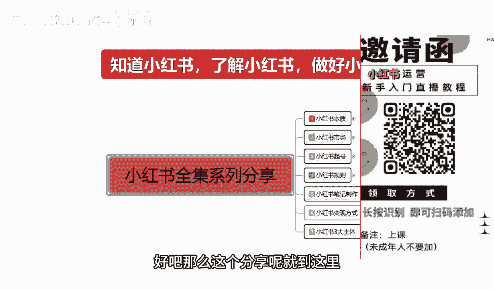

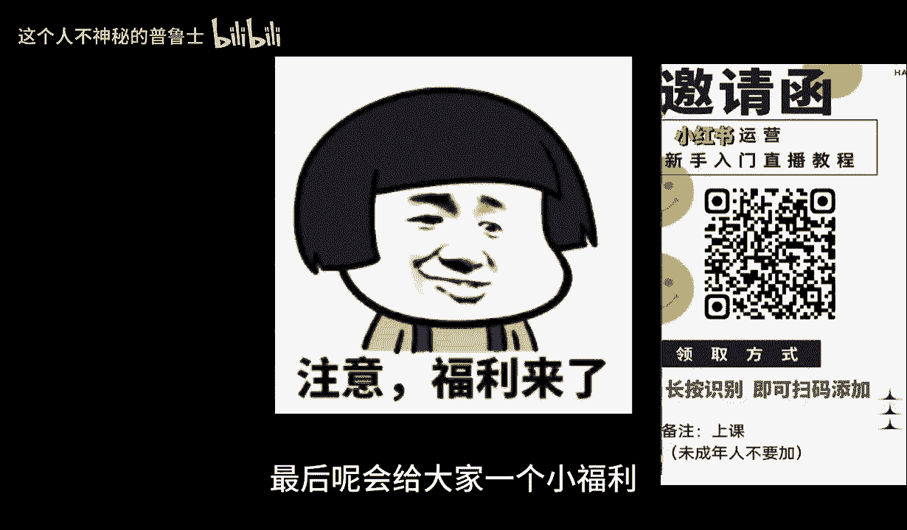

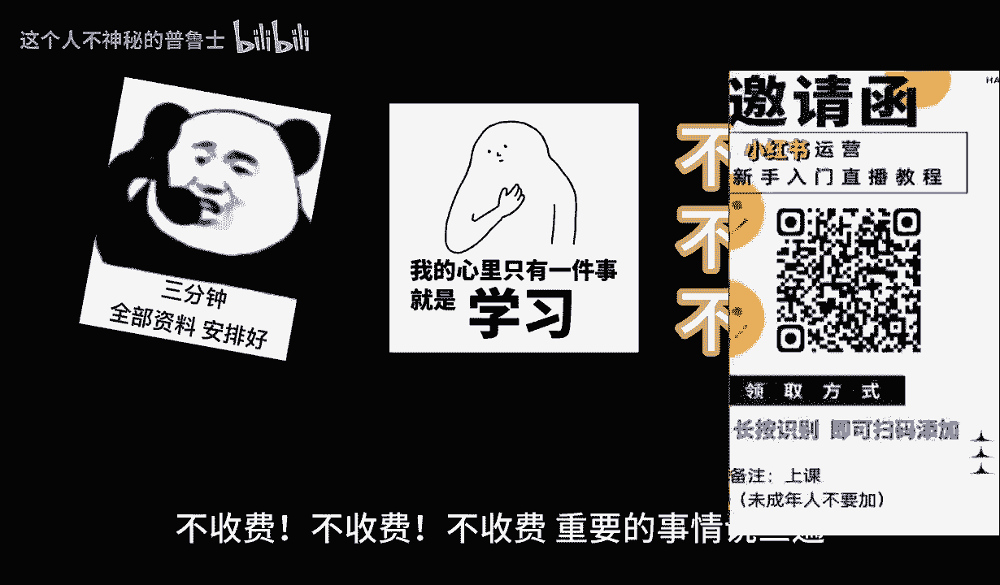

大家好，今天给大家分享的是小红书。全系列啊的一个分享课。呃，之前呢是给大家解了一个讲了一个课程介绍。这一课呢我们开始从小红书的一个本字开始啊，什么是小红书的本字啊。

小红书本字呢其实说就是说我们需要了解我们。做小红书这个平台啊，它整个平台它一个运行模式，包括它主营的一个项目是什么样的啊，我们只有了解小红书的一个本质以后，我们才能通过分析它的本质啊。

才能了解小红书它给予了我们怎么样的一个市场。好了，废话不多说，直接呢开始进入我们的一个真题。嗯，小红书的本字啊，其实在这个点的话，我们其实把它分为6个导向啊，六步就可以了。为什么说是6个的导向六步呢？

我们在这里啊，我们首先来了解一下什么什么是小红书的一个本质啊。第一个是。小红书它对于各大平台的一个区分，先给大家讲区分，然后呢给大家讲一下小红书它到底是怎么原因的。

首先它小红书对于各大平台的区分是什么样的平台呢？就结合我们现在啊网络实际运营效果来说的话，小红书它和其他的一些平台不一样，它不是一个纯卖货的平台啊，它是结合了抖音。

还有淘宝、拼多多等这些平台的一个综合体。这样来额外做出来的一个。网络交流平台。为什么说是综合体呢？因为它上面有你比方说我们拿抖音做比方啊，抖音的话，说实话它无非就是一个小视频制作和少量的文案制作。

它95%以上基本上都是小视频制作。它通过视频的内容宣传。啊。我们不管是娱乐效果也好，是生活知识也好，各种常识也好，它都是通过视频啊进行一个讲解。但是小红书它是一个图片文案模式进行一个讲解。

那它和淘宝和拼多多的区别是什么呢？淘宝它是商品卖货。拼多多是商家卖货。啊。但是小红书是结合了这三个主流的一个营业方式，然后单独区分出来的一个嗯模式。为什么？因为小红书它上面有卖货的内容。

也有我们图文的一个内容，也有我们视频的一个内容。但是你光说抖音的话，抖音它是有。有店啊有抖音小店，但是抖音小店的话，整体它不是说卖货，它是带货啊，带货和卖货可不一样啊。带货的话是说我没有产品。

我是一个网红啊，你把你的产品放到我这儿，我帮你做宣传，通过这种方式来达到网红主播的一个盈利，或者说是你这边有广告需要我帮你宣传你的产品啊，或者说你有一个游戏需要我帮你宣传一下等等。

通过这些方式来方式来盈利。淘宝和拼多多是什么呢？他们是纯卖产品的一个地方，就是说你需要买衣服啊，去淘宝，你需要买食品，买内饰，买便宜的一些小件，你去拼多多。啊，他是通过这种方式，他们有一个主体的一个。

就是。各大平台它都有自己的一个主体啊当。你的主体和你对应的一个本质不相同的话，那么你在你去操作。你比方说你本来是做直播的对吧？你去你想去开个小店，你然后在淘宝上面，淘宝也有直播啊，你去淘宝上面直播。

那你觉得你的一个播放量，它和抖音呢？差别有多大呢？对不对？它就是一个纯卖货的一个平台。它不是说让你去做直播的，你要去做真的要去做直播，那么你就只能去选择抖音。它是类似于这种，但是小红书小红书啊。

它和他们的一个本质区别呢，就是说它是三个平台的一个综合体。在这里面我们去做小红书，你去商品卖货也可以，我自己做文案，啊文案做美了以后，我自己去卖货也可以，我做网红店也可以，我做美食博主也可以。

我做书类博主也可以，我做游戏宣传博主也可以，这是博主，然后是引流，为什么叫引流呢？你我们在了解一部分的内容的时候，小红书它其实是三大主体，一个引流。它应该呢是网最后面一节课给大家讲的啊。

这里呢先给大家这做一个大概的一个介绍。小红书三大主体，就是说一个店铺运营，一个私域引流和一个网络博主，网络博主其实正常在算的话，它是抖音的一个网络博主。但是抖音网络博主的话，它的竞争压力太大了啊。

小红书也有这方面的一个需求。所以说它是一个全新的市场啊，适合我们新人，或者说我们对网络不了解。我们把小红书的网络博主我们做好了，我们同样可以在抖音上面去扩展。一样的道理啊，私欲引流。

就是说把小红书的流量。引流到我们自己宣传的一个嗯。怎么说呢？就是你宣传到其他的一些。交流群就是我们自己创造的交流群，给自己打造一个包装，打造一个整合体，或者说是打造一个分享专区啊，这叫思域引流。

然后打造成功以后，再通过你我们自己的一个宣传，把酷客。把这帮人留住，然后他们都是因为有一个共同的目的。你比方说宝妈群。对吧。宣传孩子1岁到2岁、2岁到5岁、5岁到10岁，这孩子需要什么穿什么用什么啊。

什么样的营养品好，那我们就可以在这个里面去卖产品。所以说小红书的三大主体就是店铺运营，直接硬卖产品。第二个就是私域引流。第三个就是网络播。那我们了解小红书的本质。这个。区分以后的话，我们就和和抖音也好。

淘宝也好，拼多多也好，我们就和他们抢流量。这是小红书抢流量啊，这就是小红书，它整个平台一个运行系统。它因为一个新的模式发展出来以后，它需要有新的一个接收方式，所以说就创造出了小红书。那小红书在。

这三个基础点就是已经有三位前辈了啊，他在这基础点上面进行了一个整体的综合啊，创造出了小红书。那小红书的主营方式是什么呢？第一个是生活方式的一个分享社区。就是说小红书的话。

它是以一个用户生存内容为核心的生活方式分享平台。因为它和抖音不一样，抖音的话你想把自己做红做火啊，你每天我们正常普通人去拍抖音视频，拍这个拍那个你了不起有1000的粉丝已经很厉害了。啊。

正常的话也就30到50个。为什么正常普通人你每天拍的自己的一些形形色色的东西，因为竞争力太大了。你拍上去以后的话，你的第一我们没有专业的美工。第二，我们没有专业的摄影。第三，我们没有专业的设备。第四。

我们没有专业的知识。在抖音上面去抢占我们的流量。那我们来去操作的话，我们就需要。去了解啊，有没有其他的可以来对我们进行一个全方位的升级了解。所以说小红书现在的话，现阶段它是非常适合我们新手来去操作的。

这里呢整个小红书的本质的话，它是分为6个点。那我们从这6个点里面的话，对应的筛选看有没有我们自己适合去操作的一些内容。第一个是生活分享啊，生活方式的一个分享社区这个。分享社区里面的话。

它包括了一个产品评价。啊，旅游的就说旅游我去什么地方旅游啊，我在这个地方旅游。有没有什么好好吃的好喝的好玩的啊，也是一个精行分享。然后是一个美食体验，也就相当于类似美食博主之类的。

或者说我自己做的美式产品啊，我自己做的泡菜啊，做的饭。啊，用什么调料，先用什么，后用什么都可以。而且它和抖音不一样，它的整体平台系统的话，它的一个推流是非常均衡的，它不会额外的突突出去对你进行。

流量的一个推广啊，你比方说我在抖音上面，我发同样一篇美食文章上去，我在小红书上面的话可能会有3000到5000个浏览。但是你在抖音上面，你最多有200。啊，因为抖音上面它已经成熟了。

你要再想去做这类似的一个事情的话，你需要去花钱，让抖音主动进行推流。但是我们正常在做的话，是不会去那么去做的啊。所以说小红书是给了我们一个很好的一个本质的。推推广渠道啊，然后是时尚穿搭等内容。

形成了一个围绕生活方式的一个信趣社交网络。就是说我们正常的话，你如果说想做网络播主。就可以往这个方面去靠啊，通过分享我自身的一个美食的一个经验，旅游的一个经验，产品的一个评价、时尚穿搭等等等一些方式啊。

形成了一个。庞大的生活圈。这个呢就是小红书本质的一个区别啊，包括后面5条内容。因为时间的原因呢，我会在下一分解里面给大家进行讲解啊，我这个。分享内容的话，因为我这边的一些技术原因。

或者说我们这边的一些内容原因。我如果说把视频做的太长的话，嗯，导致后续的话我们上传会很很缓慢。所以说我一节课的话，我大概的话是控制在10到15分钟左右啊，希望大家理解一下。呃。

下一节分享呢我就给大家讲解一下小红书本子下面5个整体的一个内容啊，让我们去了解一下我结合我们个人自身啊。怎么通过小红书啊？了解他的本质以后，知道我自己要去做什么。😡，啊，方便我们后续的一些小红书了解啊。

做电影也好，做网红也好啊，做引流也好。我们把这些基础的知识了解透了以后，扫走关注。好吧，那么这节课呢就到这里。最后呢会给大家一个小福利，整理了小红书运营实操资料，可以评论区私信的方式领取。

通过之后会第一时间发给大家注意领取资料不收费不收费，不收费，重要的事情说三遍。大家好，今天给大家分享的是小红书全集系列第二课时小红书本字啊，是接着我们上一节的内容给大家进行讲解。

上一节呢主要是讲解了一下小红书它整体的话和其他三大组平台的一个。

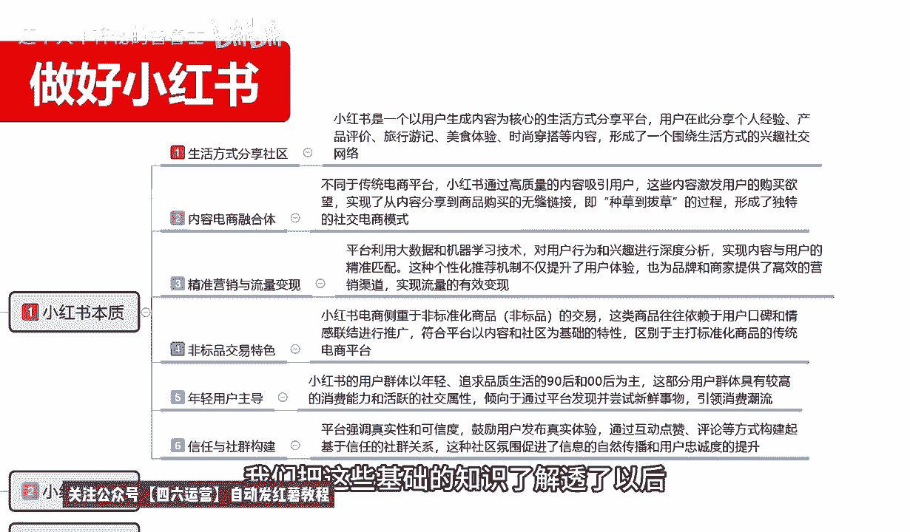

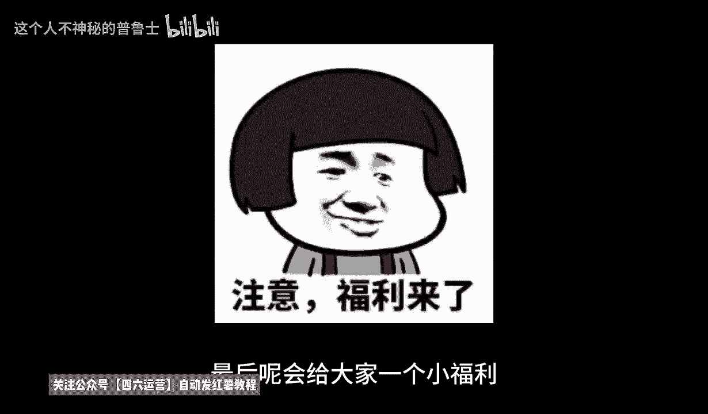

区分啊，接着我们上节课的内容的话是上节课给大家讲的是生活方式的一个社区分享。它主要的话比较适合的话，就是说嗯。做网红博主啊。为什么网红博主的话，他在这个里面的话，就是说只需要我们自己对这某一个方面。

某一个行业方面啊有一定的经验，有一定的了解，或者说有自己的体会，都可以去操作这个生活方式，社区的一个分享内容。简单来说就是我们日常的一个嗯网红博主分类。选择一项我自己感兴趣的。我对这个。

对这一内容很了解的啊，进行一个。匹配啊。我们要匹配系，我们要匹配平台，平台也要匹配我们。如果说你找到的平台不适合你去操作。那说实话啊，你匹你在小红书本子里面的话，你都找不到适合自己的一个定位的话。

那我就建议的话就不要去做小红书了。因为那样的话，你把小红书你就算了解透了。你的自身的一个社交应用内容。你包括卖产品也好，做博主也好，或者说其他的也好，你不适用于小红书。那我建议你的话。

或者说多花点其他的精力啊，去做其他平台可能会好一点。那第二个内容呢就是。内容电商的一个融合体？什么叫内容电商啊？它不同于传统电商平台。小红书的话，它通过高质量的内容来信，说说直白了啊。

小红书80%到90%的一个女性用户里面的话，他的。整体定位就一个，我们全部定位在这个地方了。他通过高质量内容信用户是什么意思呢？其实小红书他这只是给自己的一个评价。我们正常了解的话。

就是说小红书里面他卖的都是非标品的一个产品。什么叫非标品产品？没有品牌，自主制造啊。实用。然后自己用过以后有效果的，就是小的一个平台。他通过这种高质量的一个方式来吸引小红小红书的一个女性用户来。

小红书啊，我们进行分享的笔记里面来购买产品。这些内容的话，它比较接比较容易激发用户的一个购买欲望。为什么？因为这些产品我们是自己试验过的，我们对它进行了一些一系列的详细讲解。他的图片也好，文章也好。

内容也好，它都基本上都是要包括产品的一个价格、实用性、适用范围等等啊。他和其他的一些平台不一样，其他的平台他只管把产品放上去，图片放上去，大概的一个效果放上去。通过这种方式啊来进行促进成交。

小红书在这种成交方式上面进一步进行了优化啊，这就需要看我们自己的一个文章笔记怎么去调整，怎么去写了。就是说它整体来适合的话，就是说我们非标品的一个产品，非常容易在。小猪上面去操作啊，就是我们自己的产品。

然后的话这个产品没什么品牌，没什么名气。我想从小红书上面给他打上标签啊，通过小红书这种网络形式的话，把它推广到全国各地。这种方式的话其实非常适合内容电商的一个融合体。啊，也就是小红书平台。

给我们创造的一个卖货渠道。第三个呢就是说啊精准营销引流量的一个变现。为什么要叫精准营销与流量变现啊？平台它小红书平台它是呢是利用大数据和机械啊，学习技术。就是说他把别人三个总体的一个数据量。

相当于是半拷贝过来了，然后进行了优化啊，对用户的一个行为和兴趣进行深度分析。实现内容与用户的精准匹配。这种个性化的一个推荐机制的话，它就是说我们在前期建立账号的时候，就是小红书账号建立的时候。

就已经给我们定型了。它不需要我们再去强行的去做达标啊，我们刚开始前期小红书创号建立的时候，它就有那么多的一个兴趣选择。那你选择了这几个主体兴趣以后，除非你去手动搜索其他的一个。不是同类型的一个东西呃。

内容的话，他才会给你推荐。不然的话他基本上都是会推荐给你选所选的三个内容。比方说我们刚开始选择的是美妆美食。关运弄，那他基本上给我们推广的就是什么呀？美妆的一个内容，美食的一个容。还有一个户外运动。

其他的很少给我们推，只有5%的几率。啊，就是说。我们在创建小红书账号的时候，他基本上上来就给我们定性了啊，就看我们这个账号，我们自己怎么去调整。但是作为我们啊，你是想做博主也好，做商家也好，做用户要啊。

账号前期是非常重要的。所以说在这里面呢，它有一个精准营销与流量变现。它这个是小红书的一个系统。我们了解这个系统以后就知道小红书前期最重要的是什么账号权主。只有把账号全重做好了。

我们小红书后面你是做店铺也好，做引流也好啊，做博主也好，你对应的一个。兴趣爱好选择对了，那么你的流量会多70%到80%。如果说你的兴趣流量没选择。对你本来是做美妆博主的。

你选你选的一个兴趣爱好里面反而没有美妆博主，你选的其他几个，或者前期我们没有打算做。但是账号已经创建了。选择这种方式以后的话，你再想去做这个博主，他给你推的流量其实是不匹配的。啊。

所以说内容电商的一个融合体。包括这个精准营销的一个流量变现啊，它是给我们定位的。啊，只有我们定位定准确了以后，我们才好去操作。包括了啊第四点非漂病也好。第五点，年轻用户的一个主导也好。

和信任与社会的一个结构。啊，这个都是小红书，他对自己啊，我现在给大家讲的这个小红书的本字啊。它是不是我打出来的啊，这个我给大家说一下，这个是整个网络系统对它的一个评价。

我只是说通过这个评价给大家去进行分析我们要做什么啊，下面的才是我主要的一个展开内容。前面的话我实际上先大家先了解什么是小红书啊，非标非标品的一个交易特色就是我刚刚给大家说的啊。

第二点的一个主要内容的一个分支。内容电商的一个融合体。在小红书里面做非标品，比做标品效果还要好。标品。说实话，别人做卖标品的基本上都是去淘宝、拼多多、京东、大件京东啊、标品、淘宝散货就是拼多多类似这种。

但是我们正常的这种非标品的话，你去拿到另外三个大平台去卖，也不好卖的。所以说非标品在小红书里面是非常非常好做的。小红书电商侧重的非标品。商品啊的一个交易。这个这个类型的商品的话，往往依赖用户的一个口碑。

就是我之前跟大家说的，我们产品的一个介绍，它是通过图文并茂和我们自己用过以后的一个体验啊，传导过另外一个人，或者说传导给另外一个群体，让他们了解这个产品对自身有什么好处啊，对自身有什么提升。

通过这种方式来宣传的一个产品，他会直接卖货是有很大区别的啊，就是说非标品交易的话，在小红书上面是非常好做的。第五个就是年轻用户主导。什么叫年轻用户主导。小红书的一个用户群体。

以年轻追求品质生活的90后啊和00后为主。这个东西都是可以去考证的。你们如随便去百度也好，或者是去谷歌也好，去其他任何地方去搜索一下小红书，它整体的一个主导和一个消费用户都是90%以上。啊。

都是女性用户，而且是18到35岁为主。啊。那这一部分人的话，他追求的什么生活的品质新奇。啊，我没自己没见过东西，好看的东西，好玩的东西，好吃的东西。等等这些。所以说我们在选产品或者选内容的时候。

一定要往这个方面去靠啊。18到35岁，李迅喜欢什么，喜欢什么的类型啊，一定要有一定的了解。最后一个就是信任与社会的一个结构。什么叫信任与社会的结构？就是说。平台他强调的是真实性和可控性。

鼓励用户发布真实的一个体验。我们自己拍摄的东西，自己制作的东西不要去倒倒也有权重。但是权重的话，只要是说没在没有在小红书平台上面出现过。它都会给你展示，但是展示的不多。

但是我们如果说发布的是自己创建的一些东西，或者自己创建的一些内容。这些都这些东西的话，其实我们自己制作也好，AI制作也好，或者是其他制作也好，只要你选定的方式，它都有很高的一个流量扶持和流量加成。啊。

然后通过它里面的一个互动点赞评论等方式构建起了它的一个整体运行系统啊，基于信任的一个社会关系。喜欢你的内容，它的点赞评论评价啊，收藏越多。那么你所整体展示的账号权重也好，内容权重也好啊，就越高。

它通过这种精品的一个产品给了你一定的流量上升空间它不像。其他的你比方说你卖商品好，你在淘宝在拼多多卖商品也好。你只要要说关键词。啊，要做关键词选种。

店铺选种、店铺等级、销量评价啊等等这些东西你全部做好以后，你再去推广这个商品。他才会从整个大数据里面分流一部分流量给你去进行展示。但是你要你本来就是一个新手，你要通通过这种方式去里面抢流量。

那么你的难度是多少呢？对不对？因为淘宝它是没有技术权重的，拼多多也没有技术权重，你包括去抖音做。操作它也没有技术基础权重，但是小红书不一样，小红书它整体来操作的话，就是说它适应了后面几个阶段。

它把所有的流量基本上都平均分流了。他是通过计算你的分数，但是这个分数虽然说也是分数，但是它的分数评价很低，而且它每一个产品，每一个小红书的一个图文文案，小红书的一个笔记，它最少给你3000的一个曝光量。

只说你这三000曝光量里面，你自己自身有多少一个点击，多少一个展示，多少一个收藏加构。你的数据越好。他给你的展示越越高，你也要去淘宝做店。那么你一个新店新产品上上去以后的话，他给你的展示可能不到50。

你去拼多多做的话，基本上不到10个展示，你去抖音做也就50左右。但是平。但是小红书它可以给到你1000到3000的一个基础展示量。当然，这1000到3000的技术展虽上大家还有一个前提啊。

就是你前期要把账户的全重做，才有你前期不做好的话，大概也就500到1000左右。但是你对比。拼多多的10个，淘宝的50个。抖音的5数个来说小红书，它在这个里面啊，它整体的一个流量分流。

是不是对我们新用户或者说我们刚接触网络营销没赶上时代变化的。一些朋友来说是不是非常大的一个诱诱惑力，对不对？你本来能展示给10个人看，50个人看的一个。产品或者说分享分享的一个内容。

在但是你在小红书上面的话，你就可以分享给3000人。这就是小红书本质的一个区别啊，它和其他。这种网络运营模式，网络电商平台的一个模式，包括网络宣传的一种。自我营销模式啊的一个本质区别。

所以说我们在做小红书的时候，一定要了解小红书，它对我们用户对我们商家也好啊，对我们博主也好，对我们的一个引流也好。他对我们整体来说啊是非常不错的一个发展环境。但是如果说你要去做其他的，说实话。

对比小红书蓝队的话难度的话可能是1比51比升的比例。这个就是小红书的一个整体本质啊。同时呢也是通过这两个的一个分享，让大家了解一下小红书到底适不适合我们自己去做。如果说大家不觉得你做小红书。

听我听我这么说了以后的话，接实小红书也就那样啊，它整体的一个展示权重展示数据啊，没有淘宝好，没有拼音做好，没有抖音好。那么大家可以去操作一下，然后再来考虑小红书。这是实话啊，但是我认个人认为的话。

后面2到3年的时间，小红书。没有太大变化变变化的情况下，他可以从淘宝也好，拼多多也好，抖音也好。还会继续截留下去。啊，他已经截留了那三个平台30%以上的流量啊，他还会继续加大力度。

这个就是小红书的一个本字，好吧。那么下一节课呢主要给大家讲解一下小红书的一个市场。为什么说是小红书的一个市场呢？小红书的话，我们先了解它本质以后的话，就是说下一步就是了解小红书怎么变现的一个市场。

这个里面的话可以把它分为两步。第一个是热门的一个商品。第二个是热门的话题。我们只有了解小红书什么商品在小红书上面好卖啊，什么样的话题在小红书上面才算热门。只有了解这两个点以后，我们才能去把小红书做好。

好吧，那么这一节课分享课呢就到这里。下一节课呢给大家讲解一下小红书整体市场的一个运行。最后呢会给大家一个小福利，整理了小红书运营实操资料，可以评论区私信的方式领取。

通过之后会第一时间发给大家注意领取资料，不收费不收费不收费，重要的事情说三遍。大家好，这节呢给大家分享的是小红书全集系列分享的第二课时。

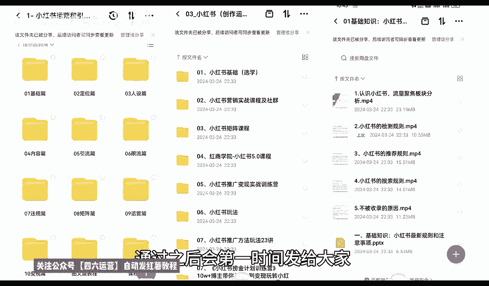

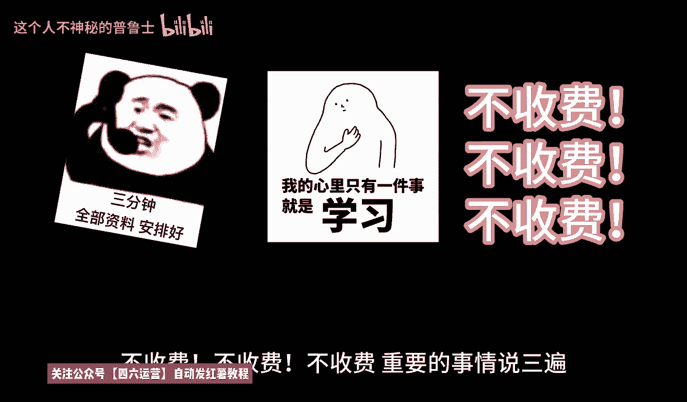

啊，第二大课时。小红书的一个市场。什么叫小红书的一个市场呢？就是说我们通过第一大课时，小红书的一个本质的话，就是了解了小红书它整体啊是否适应我们的一个市场环境啊，对应我们的一个产品。

那我们从产品里面的话，它其实还是有区分的。我们要从。小红书本子里面。了解小红书的市场，通过小红书的市场啊，发现我们的产品适不适合在小红书上面去操作。所以说我们需要对它进行一系列的分析和了解。

那我们首先来看一下啊，小红书的市场有什么。小红书的话，它主要定位的是。中高端的一个人群，核心用户群体的话，包括都是白领高校。高校的一个学生啊以及网婚等。其中的话年轻女性用户占比较大。

他的整体女性用户占比的话其实是在85到90。男性可能只占10%左右到15%。啊，年龄多的话，他基本上都是集中在35到。18岁。整体分层的话，就说他在这个里面。20多岁的占主体，18岁的话也比较多。

35岁的也比较多。但是12到48他这个里面的人群也有，只是说比较少。这种的话就相当于类似家里面有那种不听话的小孩啊，比较喜欢玩手机，对新技术比较感兴趣的。12到18的这个之间的用户群体也有。

35岁往上啊年纪偏大的一点也有。只是说他对于整体小红书来说的话，嗯，人群没有那么广。就是人数没那么多，小红小红书目前的话接近3亿的一个。浏览记录和访客的话，它可能里面18到35的话占2。5亿。

剩下的5000万才是18比1八小的比35大的啊，它的整体一个分流的话就是说女性用户占90%。18到35。就占了剩下那么大的一部分数据啊。基本上。2。5亿的一个数据量占全球全国女性范围接近。一半。

接近一半没有一半。然后是小红书，整体的话，我们了解它的人群年龄和划分以后的话，就是了解小红书的商品。为什么呀？只有先了解这这一一整块的小红书女性她喜欢什么样的内容和小红书。

商品的一个投放内容和他所感兴趣的热门话题。啊，只有你了解他的一个性别了以后，你才能去进行分析。如果说你连性别都不了解，你就想去分析小红书上面卖什么产品好啊，对吧？我能卖个男装啊，卖个汽车对不对？

那不现实，对吧？所以说只有了解他的一个人群用户了以后，我们才好确定他的一个热门商品，包括它的一个热门话题，热门商品这边的话，我只是说给大家列了一些例子啊，呃，热门话题里面的话，信息就稍微多一点。

因为商品的话，说实话，对于小红书来说的话，它不是整体数据的话不高。在小红书上面直接搜索商品的话，它的热门话题就是人群搜索度的话不到20%。正常的话也就10%到15%左右。其他的话基本上都是收小红书。

收热门话题的比较多啊，就是说小红书。只要他去搜商品了，那么成交概率就很高。但是他搜索商品的整体人数的话没有那么多啊。热门商品上面的话，就是说呃小红书上面因为女性偏多，它整体的话热门商品也就是一个美容。

一个家居，一个女性，一个食品，一个电子配件和服饰。啊。这7个大类目是最好做的。你其他的类目去做的话，嗯，你要做产品也好，做推广也好，呃，做其他等等一系列的东西去做的话其实是没那么好做的。

因为他女性的需求量基本上都集中在这几块。美容化妆品啊。眉笔唇膏。口红对吧？睫毛、耳环、坠饰等等，都包括它的视频里面也都在里面。嗯，家居里面的话就是说家居里面的一些日日常用的什么开关器啊，对吧？

菜刀啊、剪子啊等等都在这个里面。就说方便他生活日常所需的你都可以去做啊。有一个前提啊，女性用品不要把它划分到男性里面，男性的5%到百分百10%到15%的男性用户。说实话我们去做小红书市场的话。

你尽量你就不要考虑那些人了啊，因为那些。男同志进来别有目的。好吧。正常的话，女性在这个里面啊，我们去操作这个类目的产品都是可以的。就是说你要做店也好，做网红也好，做博主也好，做引流也好。

最好是从这些产品里面去写。你其他的产品也能做，只说效果没有这些产品好。这是我给大家进行的一个热门商品的一个推荐。好吧，第二个呢就是。热门话题。小红书市场热门话题的话，它就比较多了。热门话题我在这里面。

我给大家把它分了7个点，第一个是有用的信息，第二个是娱乐内容。第三个有达人分享。第四个产品测评，然后美食时尚旅行。啊，我把它全部给大家进行了一个分类。热门话题的话，说实话做你要了解热门话题。

你要从热门话题里面去做商品，也可以去做引流，也可以去做博主也行啊。你要先了解什么样的商品，什么样的话题，对我们整个的一个权重，对我们整个了解小红书操作步骤啊，有提升就行。什么叫有用的信息呀？

有用的信息的话。嗯，怎么说呢？就是针对我们的一个生活技巧，专业的一个指南。教程与教学它就类似于知识类的一个分享。我们在分享小红书的时候，比方说生活技巧如。办点签证也好啊，健康养生知识也好。

家具收纳方案也好。嗯，包括呃饭后吃什么水果，美食保健对吧？化妆怎么化，都可以在生活技巧里面。专业指南的话，就是说如点正激光恢恢复过程。这个的话就是说它比较涉及的就是医疗科技。这种啊，然后就是餐饮。

这个城市有什么好吃的，那个城市有什么好吃的啊，比方说就是类似于做美食博主这种。教师性教学的话，其实就是嗯补习班。美妆博主健身教练啊。穿搭篮球技术的一些演练演示和教学。这种的话，它是因为是用图案描述的啊。

小红书笔记的话，虽然说也有那种视频笔记，但是视频笔记的话，说实话它没有文案笔记容易爆。你视频笔记的视频笔记报的概率给。如果说我们呢把爆款概率按10百来划分。视频笔记的一个爆款概率可能不到5%到10%。

文案笔记爆款概率的话可能就有90%，它的差距就这么大，它不主推视频。主推视频的话，说实话它的一个流量的话还没有文案的流量高的啊，大家一定要把这个了解一下啊。比如说有用的信息的话。

就是分享我们日常生活中的一些生活技巧，专业指南、教程与教学。我们可以往这个三个方面去靠。通过这三个方面，如果说我们是想做商品啊，通过分享这三个内容方面的一个知识，结合到我们产品上面去。

比方说我做美容的对吧？做美容之前，我们先要了解。有用的信息对用户有用的信息，你进行发布，你让人家了解你这个产品怎么去发布以后的话，别人才会去问你你在哪里买的配件。你要知道啊，在小红书里面做商品。

一定要把它当配件处理掉。你不能当主主流去处理掉啊。我们正常打开小红书以后的话，它的整个搜索页面，20个笔记里面才有一个是附带商品的一个笔记。而且这个是推广还要花钱的。

不然正常搜索的话是没有商品笔记展示给你的啊，那一定要把这个弄清楚啊。所以说我们一定要从笔记里面去找商品。啊，而不要从商品里面去找笔记。所以说我们在发布呃商品笔记或类似的有用信息的时候。

一定要先把我们自己的人设打招好啊。这个里面的话就是有用的信息，占主要最重要的一个点啊。第二个呢就是内容娱乐。什么叫内容娱乐呢？内容娱乐的话，说实话这个的话你就是完全往网红方面去考。

搞笑与宣春时刻的一个分享，用户分享趣幽默视频、趣事等提供休闲娱乐。这种的话说实话你要把它变现的话有点难度。但是你接广告啊之类的嗯，做好了以后，接广告之类的，或者做以前分享还是比较容易的。

第二个就是美女帅哥的一个时尚秀，展示个人的一个风采，紧跟潮流的一个装扮语。赵平啊。这个的话说实话就是教程与教学里面的啊，你传达也好。你健身也好，美妆也好，你要通过这个方式对别人进行一个教学。

教育的一个配。教育的一个培训。这个呢就是舆论内容。第三个是达人分享类的啊，为什么说是达人分享类？达人分享的话呃。它和娱乐内容不一样啊，娱乐的话它是以。搞笑轻松，通过这种方式。来进行的一个分享。

这种好容易起，但是变现困难。达人分享的话就是说你要自己有一定的知名度才行。说实话。这个达人分享美妆就小于时尚的话，你要在。怎么说呢？在这一领域做了一定的时间，或者说你有一个团队，你才能去做达人分享。

你没有团队，你个人想做达人分享。那我建议大家的话还是以娱乐为内容为主好一点啊，因为娱乐内容的话，你个人就能做达人分享，你个人做不了。你没有团队，你后续的一个。设备资源你做不到内容你不好找，对吧？

你的产品对应的一个效果也不好。你没有自己主做的一个产品，你没有名气，别人不会去判你的。你只有先把娱乐内容做透啊，通过自己的一些方式，保留一定的粉丝和权重了以后。让商家来联系你，你再去做单才可以。啊。

但是达人类分享的一个热门话题，它热度是非常高的啊。在小红书上面。他的美妆具巧也时尚大，时尚穿搭啊，达人分享的一个个人美妆心得。他比怎么说呢？他比抖音的效果还要强大。为什么说他比抖音的效果还要强大？

抖音的人群它是包括男性和女性，他都有，而且男性占多大部分。女性抖音的用户不到30%，但是男性抖音的用户占70%的一个比例。那小红书的一个占比的话就是90%85到90的一个女性比例。

所以说我们做达人分享的时候，在女性方面这个里面做美妆也好，穿搭也好，在这个里面是非常吃香的。而且女性对于小红书这个平台来说啊。粘合力更高。所以说达人分享类的，你要想把它做起来，先把娱乐内容做好。

你平常的一个娱乐内容，一个化妆或者说一个穿搭。影响到了你后续做达人分享的一个整体圈中。就是你先把账号提升起来，把自己提的稍微有一点名气，有个200粉，000粉。对吧你就可以去做达人。把账号一申请啊。

把数据一提交，把经验公示范围一提交，就会有人来主动推广啊，这个就是小红书达人类的一个分享内容。好吧，嗯，后面还有产品测评美食分享时尚穿搭和旅行。啊，邮寄。这四个点啊。

通过下一节课再给大家进行详细的一个讲解。然后我把这几个内容给大家讲解完成以后的话，我会教大家啊怎么判断热门商品和热门话题综合考量。我们来去做小红书的一个整体账号。好吧，那么这节课呢就到这里。

最后呢会给大家一个小福利，整理了小红书运营实操资料，可以评论区私信的方式领取。通过之后会第一时间发给大家，注意领取资料，不收费不收费不收费，重要的事情说三遍。大家好，今天给大家分享的是小红书全集系列啊。

第二大课时小红书市场的第二节课。啊。

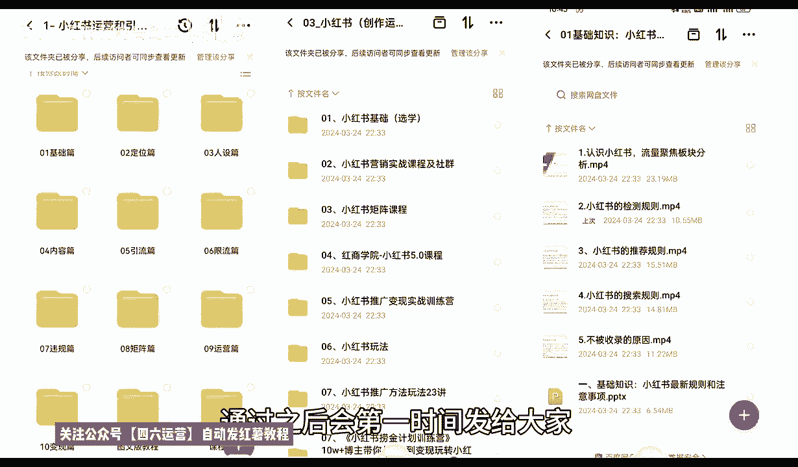

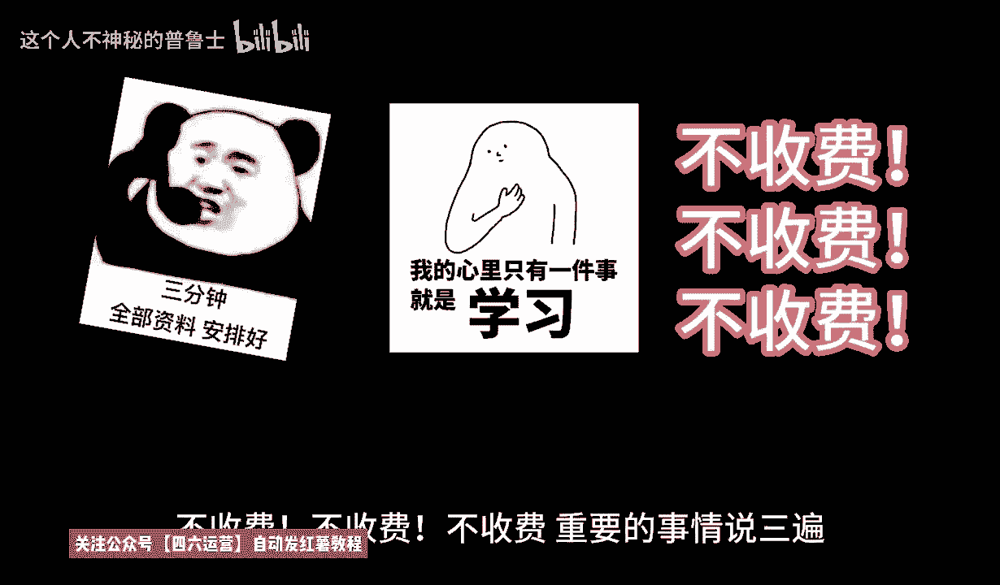

我们直接连着上一节课程往下面给大家进行一个分享。上一节课呢我们是讲到了达人分享内。这节课呢我们接着往后面讲。小红书热门话题里面啊第四个内容，产品测评。什么叫产品测评啊？护肤品化妆品试用的一个反馈。

食品的试用反馈啊，就是我们用户亲身体验和使用这个感受的一个效果和评价。类似于这种就是。抖音上面的探店对吧？我们只是说把它扩小，探店的话，它需要出去。我我们呢只是说把它扩小了以后，把产品买过来。

我们自己试。这种的话也相当于是一种反向的宣传和正向宣传的一种对比。啊，通过这种产品的一个测评来提高我们个人的一个知名度。而且这种产品测评的话比较好做，为什么？因为它不是视频，是图案。啊。

是我们通过图片的对比，我们直接在家里面就能操作的。对化妆品适用的一个反应测试就可以。然后数码产品家居用品测试的话，科技产品、生活、小物的性能测试和线价分析比也是一样的道理。

比如说我们在小红书上面去做产品测评的话，它有一定的市场潜力。只要你把类目选定了，你比方说我想做。拿个什么例子呢？就拿化妆品来说吧，口红口红它有一个色号，有一个呃掉不掉色，对吧？它都分很多种类型。

我对这一块虽然说不是很了解啊，但是所有的大字类目的话基本上都是差不多的。那么他对于一个产品测试，你比方说网络上面比较熟悉的。什么样的一个口红，你买两支回来做一个成本投入也不用太贵的。差不多啊。

在中层阶段用的那种几10块钱几百块钱一支的都可以。然后你自己这边的话，如果说我们是本来就是卖口红的，那么你就可以拿这两种产品做对比，把你的优点凸显出来。用两张图片去解决别人需要拍视频讲解的一些东西。

而且他的特定用户的话，人群是非常精准的，你也可以拍视频。比如说拍视频的话，它流量没那么大。整体的话，我们的一个小红书笔记里面的话。图案笔记和视频笔记的比例最好是3比1或者5比1，也就是三篇笔记。

一个视频效果是最好的啊。你要是效果是距离想拉长一点，5篇笔记一个视频也可以啊。这个是做产品测评。就看我们自己本身适不适合去做产品测评啊，有没有这方面的一个经验，对别人一个分享。当然了。

你如果说本身没有产品，你也可以去做，知道吧？提升自己的一个认知。这方面的认知做好以后，你大概有个2000粉丝到3000粉丝以后的话，你。你再去找产品，让别人帮你做推广的话，是非常容易的，知道吧？

你就出他广告费，我帮你代言，你产品卖出去以后阉格多少钱啊，在这个里面的话，也是呃产品测评里面的一个变现方式啊，只是我给大家大概的介绍一下。然后是美食分享，什么叫美食分享呢？餐厅推荐的一个美食。

这个就是抖音上面的美食餐厅。每次参见的话，说实话，因为你可能对自己的颜辞不怎么。信任。那么我们在做图片处理的时候，不拍人，只拍视频。然后对这个食品进行的一些分析进行了一些话题宣传啊，就可以。

这个就是美食分享。然后的话烹饪的一个教程。烹饪教程的话，说实话这个的话做引流比较适合啊。家庭烹饪食谱，这个菜怎么做？做完以后这个菜对我们身体有什么好处等等之类的都是可以的。啊。这几个呢就是美食分享。

第6个啊热门话题是什么？时尚搭配。啊，潮流追踪。介绍最新时尚的一个趋势，提供穿搭的一个建议。品牌合作与推广品牌服饰。配饰的一个展示与合作推广啊，时尚搭配的话，说实话我之前啊前面给大家讲过。

小红书上面说实话，它不适合做那个品牌的一个内容，它比较适合做非标品的一个内容。但是如果说你要讲穿搭的话。有品牌商跟你合作是最好的，没有品牌商的话也能做啊，而且效果不差。做这个类型的一个时尚分享。

或者说这个类型的一个笔记分享。你不管说是我卖产品也好，我卖服装也好，卖装饰品也好啊，卖耳环、首饰、吊坠、戒指、项链也行，对吧？我再不行，我卖。指甲油、指甲刀之类的都行，知道吧？

就是说你看它的一个时尚搭配的一个创。怎么去搭配啊，胖的有有胖的，有瘦的，人有胖有瘦啊，有体重高的，有体重轻的。你通过这种方式圈定你的人群以后，就是说我们先要了解整个他1个18到35岁一个人群。

你有没有他们喜欢类型的一个产品？啊，你通过他们喜欢类型的产品，你把这些次品。给他就直接码名面上面进行产品的一个拍照重组。或者说是你去抖音上面也好，去淘宝也好，去拼多多也好，你把别人的图片弄过来啊。

然后搭配一下怎么穿怎么弄都是可以的。当然这个只是说小红司市场里面它的热门讨论的话题啊，因为它的人群的话就是18到35岁。18到35岁的女性的话，她喜欢的就是这些主要的这几个点。最后一个就是女性。

旅行的话说实话没有上面6个点吃香，但是相对于旅行的话，它可以做一些情侣之类的一些攻略，目的地的一些介绍形成的一些规划酒店民宿。这种的话是比较适合。情侣的啊，你如果说往旅行这个方面靠的话，说实话你就是。

奔着那种户外的。配饰配件实用工具去操作了，你去做电也好啊，做网红也好，做博主也好，宣传你的产品，做引流也好啊，都是往这个方面去靠的。这个呢就是热门话题的整体的一个内容。嗯，之前呢我也给大家说过了啊。

我把这个几个重点给大家讲解以后的话，我就会结合整个小红书市场给大家详细讲解一下啊。热门商品和热门话题他们相结合是怎么做的？因为小红书整个市场的话，我们只有把这两个点结合起来以后，它才叫小红书的一个市场。

啊，他单独把它划分以后的话，你要了解热门商品。你说实话，你这小红书上面做店的啊，不好做，你也做不起来，难度系数非常大啊。你要是专门讲这门话题，你后面变现很难，所以说我们要把它结合起来。

我们才能做电影也好啊，做博主也好，做影流也好，你变现才容易。知道吧？我们要去了解小红书，整个市场的话，你无非就是说你想做网红也好，做博主也好，做引流也好，做商品也好，做其他等等也好。你不管怎么去操作。

最后无非一个就是想赚钱。那在这个里面的话，你单独做热门商品，就是小红书上面我就想开个店，想去把这个店做起来赚钱，行不行？行。100个人里面有2到3个人可以成功，你觉得你是2到3个人吗？

你有做店的一个技术数据量吗？没有，所以说你需要进行了解。那你如果说我觉得我做商品不行的话，我做热门话题的一些内容分享行不行？也行。但是10个人里面的话，可能只有1到2个人，或者说20个人、30个人。

他才能成功1到2个。那你觉得你是幸运之子吗？啊，对吧我从来不抱留这样的幻想，我所有的一些努力和成果和我研究分析的一些数据量都是通过我个人。分析了解过后啊，了解他整个平台的一些数据以后，我们再去做。

你才能把自己做的包装起来。好吧，那。小红书市场这里面一个热门商品和热一个热门话题，我们怎么把它结合起来？选商品之前一定要选话题。话题选完以后再选商品。比方说呃这里面我随便给大家。做个比方吧，说上大吧。

好吧。😡，实上传单里面，他这个里面我们适合做的商品是什么？美容。家具不适合。服装就这两个点。你把时尚穿搭这两个点，你做美容也好，做服装也好。你比方说你做。时穿搭里面做服装。你自己有产品。

你想把这个店做起来，那么你的所有内容不能以。热商品来去做笔记，一定要以时尚穿搭。也就说你的产品适合在什么地方？一定不要去发商品笔记，商品笔记少发啊，发正常的人文交流笔记去，你才有推广流量。

你不发人文交流笔记的话，它是没有流量的。你商品笔记流量的话不到20%。那么点那么一点流量的话，你你想去抢那个关键词排名难度是非常大的。所以说要先把账号做起来，我们先做热门话题。

把这个话题就是通过时尚穿搭的一些方式，方案把它了解透了以后，再把我们的产品挂到我们这个时尚穿搭里内容里面去就可以。一定要了解啊，先做话题后做商品，这就是小红书的一个市场。你要是想直接做商品，不做话题。

那你还不如去做淘宝或者做拼多多，因为你的商品卖不出去啊，这个大家一定要了解清楚啊。整个小乌猪市场的话，你把它相结合起来，你从下面选时尚穿搭的话，这对应的就是服装。旅行邮寄的话，你说实话。

对应的就是旅行内的一个产品站不篷。夜灯、手电筒、配饰。都可以在这个里面找到，对吧？美食分享就是食品分享里面的。你也想把食品自己的食品是通过什么方式制作宣传啊，都都可以通过图片。优化。去进行宣传。

然后给他编一个背景故事去做。这个就是整个小红书的一个市场。你小红书万变不离其踪，你再怎么去操作，它都在这个里。啊，热门的一个商品局限都在这个里面。热门的一个话题局限都在这个里面。

就是说我们了解小红书的本质，了解小红书的市场以后，我们再从这个里面去选择我们想上要做的产品就可以。对吧，当然我这只是说选择了一部分比较好做的内容啊，分享给大家了，其他的也能做，只是说难度的话会比这些啊。

我所给大家分享的内容会大一点，好吧，你包括家具类的家具类的话，你。家具啊不是家居啊，家具的话大型的那种床啊，那些东西在小户上面做是能做，但是基本上做不起来，很难的啊。家居的话。

你无非就是衣家、鞋帽之类的这种。居家比较便利的东西好做一点啊，这个呢就是整体小红书的一个市场。好吧，那么这一节课呢也就到这里啊，同时呢我们的。系列全集的第二个啊小红书的一个整体市场呢也给大家讲完了。

下一节课呢给大家讲解一下小红书起好啊，我们了解它的本质，了解它的市场以后，我们要下一步叫创前账号。创建账号里面，它其实有很多的一个点需要我们去。对自身的一个完善。好吧，下节课呢就给大家讲解小红熊旗好。

那么这节课内容呢就到这里。大家好，今天给大家分享的是小红书全集系列的一个整体分享。第三大课时啊，小红书的一个起号。呃，包括之前给大家讲解的小红书的一个本质小红书的市场。我们了解本质市场以后的话。

第三步我们就是要给小红书账号起号，为什么说是上号起号呢？如果说我们之前已经了解过小红书操作过小红书的呃朋友呢？你的账号如果说定位跟我这节课有冲突的话，我个人建议的话，大家是重新起一个号。

如果说你有一定的数据量了以后的话，嗯，定位有偏差。这个里面的话它也是可以改数据的啊。我先给大家把这个小红书账号起号里面一个改数据给大家说一下啊。呃，大家稍等。呃。

首先呢小红书起号这边呢有一个改号的一个设定。本来呢是想给大家放到后面去讲的。但是的话呃因为针对于小红书起号里面，它包括一个定位一个资料，完善养号和寻找对包对标末的一个账号，包括参与互动。在这个里面的话。

我们有些朋友如果说听我这节课以后的话，他可能会已经做过小红书或者说是没做过小红书的朋友啊，没做过小红书的朋友，呃，建议大家就是把这一课听完以后，整体全部听完。这5个内容点全部听完以后。

你再去自己小红书创建账号，然后根据你自己想做的一些内容去完善你的一个账号的部分的一些内容。如果说已经有号的朋友的话，我建议大家的话就是说你最好的话是根据自身的一个定位，把自己的一些呃属性都会改一下。

这个属性在什么地方改，我先给大家说一下啊，首先是我们进入小红书以后的话，直接到我的主页我的主页面。页面里面去啊，然后点击那个。设置。这字的话在什么地方？在我们。编辑资料旁边那边有一个那个色三钮。

点进去以后的话，里面有一个内容偏好设置的一个调节。在这个里面的话可以设置我们自己的一个。喜爱的一个偏好啊。在这个偏好里面的话，它有一个更多的一个调节内容。就说如果说你们要做呃足球配饰、婚礼准备等等。

这里面都有啊。这里面的话推荐的它这边给我账号显示的一个推荐是体育运动、时尚兴趣才与生活、家居人文等等。这些里面的东西，它都是大范围的一个定位。我们准确定位的账号的话，就说我们小红书，你想把它做起来。

整体做起来的话，不需要有那么多内容。你选择一个到两个的一个组内容去推广就可以了啊。这个就是。选择我们。小红书账号定位里面的一个。

内容偏好调节是调整我们整个账号的一个权重权重和那个推广给我们的一个人流量的。好吧，如果说我们做商品之类的货呃，人群可能稍微广一点。但是你做定位，做引流之类的。那么你的人群的话一定要把它做准。好吧。

这是一个小方式给大家先讲解一下。嗯，接下来呢我们直接进入我们本科的一个正题。小红书起号啊，小红书起号的话和其他的平台它是不一样的。你起号它就有选种。你不起号的话，怎么说呢？就说你按照流程去做的一个起号。

他在前面我也给大家讲过了啊，小红书它的一个本质的话就是说它和别的平台不一样，别的平台是你做了权重以后。做了数据以后，你的整个账号，整个店铺，整个商品，或者说是你的整个数据链，它才有权重。小红书不一样的。

你上来，你如果说它就是根据你设定的。小红书创建账号支出，你设定的越前面，你的定位越精准，它给你的一个数据量也就越准。也就是说它从第一步就开始，已经给我们在划分我们的一个等级了。

就以说我们在小红书起号里面的话，一定要注意了啊，自己的资料一定要完善。如果说你不完善的话，你后续的一些操作方式。他导进来的人不准确，你发放出去的资料，别人不感兴趣，没人看，对吧？你的点点击率拉不起来。

暂时拉不起来。收藏加购没有，那你这个号你想把它做包的话就很难很难了啊，基本上。简单的说，第一步做不好，你后续就没有后续了啊，你准备换号吧。😡，有权重的朋友。听完了以后，如果说你觉得你自己资料不对。

可以去修改一下，但是也不能修改的太频繁了啊。如果说没有起号的一个朋友的话，呃，你们起一下号。按照自己定位的一个方式去走。然后这个里面的话就说起号了以后。想把这个号不要了，换掉，也重新起一个号。说实话。

因为你重新起号的话，比你换资料的话要好一点，好吧。那首先我们了解小红书起号的第一个定点啊。定位。什么叫定位呢？小红书里面的话，我们这个这里面我给大家列了三个点，第一个是商品定位，第二个是网红定位。

第三个是达人定位。就是说你在小红书上面，你到底要走什么？什么样的环节，什么样的路子啊，商品定位商品选择的市场范围、人群年龄和消费能力。这个里面的话，他说实话呃，内容是非常大的。然后第二个是网红定位。

第三个是达人定位。就是说我们从这三个人里面三个方位里面，我们要选择一个定位的一个方向去走。因为它每一个定位的话，它对应起号的时候，他所选的内容都是不一样的。你比方说商品定位的话。我们在商品定位里面选择。

它的一个整体选项的话，也就给我们限制的很死了啊。因为商品定位它本来商品的话，你无非就是。嗯，家居家装时尚。然后还有美食、美妆、数码科技这几个大的一个品牌。如果说你要做亲子啊，要做宠物啊。

或者做其他的一些商品的话，也可以，就看我们自己怎么去定。就所以说我们在选择商品定位的时候，一定要把自己的账号前期的一个偏好设置啊，我们自己的兴趣偏号设置一定要选对。商品定位的话。

我们前期选择三个定位的时候，根据你的商品范围选择最精准的三个范围就可以了。这是第一个商品定位，网红定位什么？搞笑科学文情、文化情怀等等也是一样的。包括达人啊、食品穿搭便装等等。达人的话。

其实和商品定位它是有一点那个偏重叠的。但是说达人的话，他只是说是介绍我们的一个食品是否好吃，穿搭是否合理，变装是否有效等等啊，商品定位的话，前期我们如果说直接去做商品的话。

小红书上面你想把商品直接做起来，你必须要把账号起起来，账号起起来以后，你还有一定的粉丝权重和属性权重你而且发笔记的时候，你还不能直接发商品笔。商品笔记没有权重的啊。这里面我给大家说说清楚啊。

说定位一定要准确。你定位不准确的话，我们包括后续的一些能力啊。规则范围的话，我们是没办法去操作的。这里面我只是说给大家。几号做了一个大概的一个定位。

后续的话我会再给大家详细讲解一下我们定位里面需要注意的是什么啊，市场的范围人群、年龄和消费能力。我在这里呢只是说给大家先把三个点固定下来。我们从这三个点里面的话，只能选一个去操作。因为你三个都做的话。

不可能最多做两个。做达人带货。啊，店铺里面有卖产品，你要是做三三项全做的话，你。做不到的啊，一个人群混乱，第二个属性不集中，你可以多做几个账号，你可以。按照这种方式走。但是如果说你就个人的话。

我建议大家只说一个内容。因为三个定位的话，三个节奏它操作的模式和节奏它都是不一样的。你商品定位本来就是。自己有商品，在小红书上面看有没有市场，给自己扩展一下思路，扩展一下渠道。

然后的话把商品拿到小红书上面去卖。那我们发展的话，你前期肯定是以以牛魔兽为。什么样引年陌生？就是说我根据我的商品编辑一套程序，然后的话把访客先留住，然后去宣传我的商品，通过这种方式去做。用网红定位的话。

那就不一样了。网红的话，你无非就是搞笑科学文化情怀等等。你是给别人创造机会，创造搞笑，然后以接广告的方式来进行变现。这是网红定位。达人定位的话，你食品穿搭便装等等。

是以直播或者说是以文案内容的一个形式给别人做一个产品介绍。他也是通过接广告或者是托接宣传类的。一个方式，所以说你定位做不准确的话，你后期操作你比你本来想卖商品的，结果你觉得商品不好做，我后期想做网红。

对吧我粉丝还可以，但是我商品卖不出去怎么？我想做网红，你然后再去转变店铺的性质的话，他不好转的，知道吧？所以说前期定位一定要准确，所以把定位做好了以后的话，我们后续你才好继续跟进的一个操作。

如果说你前期定位不准，你后续你根本就没办法操作了。第二个点呢就是资料完善啊，这个的资料的一个完善是什么意思呢？完善个人主页，包括背景简介简介中要简明扼要的介绍我们自己和内容的一个方向。

可以适当的体现个人特色，或者说是人设。背景的颜色。主页的图片选择个人资料的一个完善，个人喜欢的一个类型。越全面越好。因为为我们说实话你定位商品。你是做什么的？对不对？你做这个东西多少年了，卖多少年了。

对这个东西有都有什么经验？你都了解吧。对不对？然后了解了以后，别人对你第一印象是什么？决定后面别人进不进入你的粉丝团。啊，会不会持续跟据你的后续笔记或者后续商品的一个产品售卖？啊，你能吸引到别人。

就靠你的个人完善资料。因为你没办法直接去跟别人沟通。后续的话我会给大家说一下啊，这个小红书里面的话，它那个变现方式里面，你也就是说跟别人跟其他人用户去做私聊或也好，不是好友做聊天也好。

或者其他方式聊天也好，有限制的，限制非常大。所以说我们是没办法正常交流的，不像微信啊，你跟我说话，我跟你说话，对吧？交流起来多方便，但是小红书不一样，小红书它就是你一个留言版，懂吧？

让我们去了解这一部分的内容。所以说你的资料越完善，别人了解也越深，你资料越不完善，别人对你越不了解。你觉得我这边的话，我介绍了我这十几年的经历，我是做什么的，卖什么产品的等等。然后我们俩做同一样的东西。

你什么简介都没有，你就是直接把商品放上去，然后发两个笔记。商品一对比，我就算卖100，你卖50，也是我卖的比你好。技术的区别对吧？所以说资料一定要完善好啊。😡，呃，包括后面的一个养号。

寻找对标的一个账号，包括参与互动啊。在下一节课呢我会给大家进行一个详细的讲解，好吧。那这一节呢就到这里。大家好，今天给大家分享的是小红书全集系列啊。第三大课时小红书起号啊第二课时的一个内容。

因为整体内容较多，所以说我把这个所有的一个内容的话都给大家进行了一个分散啊。每节课的话给大家讲1到2个点的一个整体内容。这节课呢主要给大家讲解小红书喜号啊，养号开始。

往后续我们再进行一个详细的一个讲解啊，包括上面的定位和完善资料。嗯，上个课时呢我已经给大家进行了一个详细的介绍啊，包括一个改变我们账号的一个小技巧。这节课呢我们从养号开始啊，养号什么叫养号啊？

小红书养号我们。我不管大家是怎么想的啊，我在这里的话，我建议大家的话，就是说像现在小红书很多人都宣传做什么。店群啊，说实话，现在店群小红书你做不了的，你去做小红书的话，很难起来的。

我建议大家的话就是说我们做小红书，你真的感觉小红书市场非常不错的话，你想去这个里面投入的话，说实话你有个3到5个账号就可以了。就是同时起3到5个店铺就可以了啊。好吧，过多的额外话题我就不跟大家说了。

因为这个的话说实话也是另外的一些内容。在这里面的话，我没有给大家那个做详细的讲解，因为它在后续会陆续出现的，好吧。嗯，他只是说会影响我给大家分享我们小红书旗号养号里面的一个内容。

我只是说把所有的内容提前给大家透露一下。好吧，养号什么叫一G一卡一账号啊？一G一卡一账号是什么意思呢？就是说一台手机，一张卡，一个账号，你不能一台手机，一张卡，两个账号，三个账号，4个账号。那样的话。

你整个整个数据链的话会嗯系统会判判定你啊。操作异常直接给你把整个号封掉了，就把你的手机的一个型号。手机型号里面的话，它都有那个定位系统和手机型号的专业认证的，所有的手机都有。这种的话。

如果说别人在这个大数据运运营下面一检测你这个是。系统数据异常。系统数据异常。直接给你把号下掉啊，这种的话是没用的。包括你这个整个wifi，就是说你一个wifi下面连了多少个小红书账号。

别人都能查得出来的。现在不要大家不要觉得这我说的这个是假的啊，因为我接触的范围是非常广的，尤其是对网络这一块，我是非常清楚的。不能连接wifi啊，我说实在话，如果说大家想避免这种方式啊。

你用一G一卡两账户或者是其他的都不行，最好的操作方式就是1G一卡一账号。啊，你做分号过来，在我这边连wifi都不行，连wifi了，你就是在一个wifi下面同时有多个账号啊。这个大家一定要注意了啊。

因为你如果说。一G两卡两个号这种的话，就说一一台手机手机它都是有型号的，型号下面它都是有。手机出厂设置里面它都有一个手机编码，这个是每一台手机单独配配的。一台手机，两个卡，你的卡上传去以后的话。

它显示的两个卡是一台手机也是重复的，也不行。所以说大家一定要把这个点弄清楚啊，包括连wifiwifi的话，你所使用的网络线条反馈过去给别人的也是在一个点里面。所说大家一定要注意了啊。

这个的话千万不要去做一G一卡一个账号。就是说你创建一个账号，一部手机就可以，你创建4个账号，你就有4部手机。啊，你在电脑上面，你同时登多号，也要用分机去做啊。下一个就是杨浩。啊，应该不说下一个是养号。

也是养号里面的一个内容。小红书账号的话，这个里面它都是有一个技术权重的。我们创建账号最好是一次性创建3到4个。啊，我刚给大家说的是3到5个，其实就是三个账号往上走做统一的数据。但是分享内容的话不相同啊。

在发送前三份笔记的时候，看哪一个账号选重好就操作哪一个账号，这是最最基础的选号，但是说实话这里面的话还有进阶版。待会呢我会给大家讲讲解一下什么叫境阶版啊，就是我们自己把定位资料完善全部做完以后的话。

我给大家讲境阶版它是怎么做的。然后注册以后的话，我们是不急于发布内容的。先通过正常的一个浏览、点赞、评论、互动、互动等方式养几连号，让账号显得更加自然活跃。这有助于我们提升整体账号的一个权重。

为后续发布的话，就是说打下一个坚实的基础。因为你。只有把账号养活跃了啊，别人让系统判定你我们不是在跟人斗，我们是在跟机器斗，跟系统斗，跟计算机斗。那你要从计算机里面去寻找漏洞，像我们玩游戏一样，对吧？

有些人发展的话，有些人发展的慢，那他们就是找到了漏洞，而你只是默默无闻的在那耕田。啊，这就是区别，好吧。然后这里面的话我给大家讲讲一下，刚刚给大家说的，我们养号这个里面的话，它有一个详细的一个过程。

我在这一节呢就给大家详细的分解一下啊。养号这个过程的话，整体持续时间的话应该是在8到15天，也就是接近半个月。你真想把一个数据量做好的话。你前期养号都会花8到15天，这8到15天里面的话。

就说我们大家不要着急的的去改我们的一个基础数据。比方说称离改介绍。这8到15天我们前面几天怎么做呢？每天只需要刷刷小红书就好。但是这个刷小红书也有内容啊，别。那要看我们自己。你想去发布什么内容？😡。

我们统一发布，然后。调解内容里面的一些数据量。怎么说呢？就说。我们前面是准备资料，前面8天里面啊，我们是属于养号期间。这8天里面的话，我们用3到4天的时间让这个账号像一个新号一样。

让抖抖音判断我们是一个新号。新号创建进来以后，我们首先是定位。然后把资料做完，定位里面的话，我再给大家结合一下，讲一下啊。定位里面我们商品定位往后定位达人定位也好，我们三选一选择一个定位以后。

比方说我想选达人定位，我做视频好吧。我做食品做做什么呢？做婴儿保健吧。就是对于小孩子10岁以下小孩子的一个食频调节。我选达人的一个定位，往这个方面走。那我们叫做统一的发布，我们每天去小红书上面浏览。

我搜索就是视频类。1岁一下儿童膳食纤维啊，星期一吃什么，星期二吃什么，星期三吃什么整个7天的一个食品搭配啊，什么样的一个营养均衡，身儿儿儿童的一个身体条件，儿童的一个。呃。

吃饭时间、休息时间等等这一些东西啊。按照这种达人定位的方式去做。我们先把定位做完以后，或者说我们做商品型。我做儿童的一个膳次纤维的一个食品推广。我这边有柴食材，对吧？你买不到食材。

我这边有你买得到食材的话，你有些食材，我会选择一些我这边特定的一些食材进行推广，比你买的便宜，你到我这边来，或者说我这边能给你保证质量。我做商品定位也可以通过这种po去做，对吧？

所以说我们要宣传的内容是这个，前面3天到4天，我们是养号，就去查找这些资料，查找我定位食品这需需要的资料。然后在小红书里面搜别人怎么做的，我去参考一下哪些做的好，哪些做的不好。只看这个内容。

其他内容不看，知道吧？所以说这个就是我们养号。让淘宝标签认为我很喜欢这个内容，或者说我对这个内容的一些食材内容特别感兴趣。那么你后续发布的一个小红书笔记的话，它就会把你定义为食材类的。同理啊。

同理你要搞做科学的，也可以做文化的，也可以做情怀的，也可以做书本的，也可以做传达也的，也可以做编装的，也可以，它都是同类的。你就搜索同类的一个内容。三四天。就行啊，这里面呢同时光看肯定是不行的啊。

这个里面的话我们要有动作，点赞关注啊，要找到好的一个爆品爆款的一个作品，点赞留言，点赞，不一定要上来去点赞啊，你要找好的作品以后点赞，要把作品看完以后再去点赞，你不能说一上来，我感觉他这个人气比较高。

我上去直接点赞，那不行的啊，那个太假了，你要瞒过系统，你不要把别把系统当啥子，系统它是按照机器的固定方式去操作流动啊。所以说我们要把这个方式的话。把自己当做一个真实客访客，去浏览他所有的内容。

等看完以后点赞收藏，然后去评论区里面进行评论，让别人对你的这个账号。就是因为他下面本来就已经有很多粉丝了。你在里面发表一下自己特定的一个看法，或者参与一下讨讨论。懂么提高自己的活跃度。

让别人认可你对你有个第一印象，你才好后面的一个操作。三四天以后的话，我们再按照。花个几天的时间。把自己的笔记整理一下，做一个数据模板出来。然后在后面8天左右，这个号基本上就养的差不多了。

再去发布你的数据。啊，8天左右账号出栏。14天左右。到15天左右，你的笔记发布出去以后，基本上就有一定的成效了。这个就是8到15天前期养号，我们需要操作的重点。前面15天你肯定是你要做商品的话。

前面15天肯定是不能上传商品的。你网红定位你新号你进来了，你定位定啥，对不对？你本来就是给自己人设都没有做好，你再去宣传自己，我想当网红，不可能对吧？就以说你的账号起码要15天的成淀期。

你才能慢慢的步入你卖商品，做网红，做达人的一个定位里面去啊，有一定的数据量了以后才能去做。你不然的话。😡，你这个号哎呀啊，数学也白做了，好吧。😡，这个呢就是这一整节的一个内容给大家啊。介绍的一个养号啊。

包括后续的话，其实这两个内容参与互动和寻找对标账号的话，都是在我刚刚给大家说的这个养号的内容方式里。啊，只是说我把这三个点给大家结合了一下，给大家进行行一个讲解。呃。

寻找对标的一个账号研究和分析你内容领域相表现优秀的账号，学习他们的内容策略。这个呢我只是说给大家打了一个大概，但是我刚刚给大大家讲解的这个内容的话，是整体的一个实际操作部分。啊。就是8天到15天。

这15天前8天的话就。看别人的数据，然后自己准备自己的笔记。后8天以后的话，等账号定型以后，你再去发布笔记，大概15天左右，你就能知道你这个号能不能好起来。能好起来，你就去操作这个好，不能好起来。

换一个账号继续所以说为什么我在这个里面的时候，我给大家说的是。😡，我们创建账号一次性最少创建三个账号，就是这个原因。啊，你不能说保证我的每个账号都能按照这种方式起来。

那么你最少要保证三个账号同步的操作这个事情。你才好做。如果说你觉得我资资源不够，我自己只能做一个账号的话，说实话，做一个账号也行，只是说节奏会稍微慢一点，别人可能需要半个月的事情，你可能需要两个月。啊。

节奏会慢一点而已，就看大家自己怎么去理解，怎么去操作。😡，这个呢就是整个一个呃小红书起好啊，这个里面我们才到起好，所以说大家对这个方面的内容一定要进行一定的了解。而且我这个给大家说的一个定位的话。

我说实话还没说完，因为定位里面的。内容太多了啊，我后面的话我会再给大家讲那个小红书传家主体里面啊。综合的进行讲一下。因为小红书定位的话，它不光要定账号的位啊，还要定用户的位，还要定我们商品的位。

达人的位，定网红的位啊，它每一个定位的一个选项的话，它不一样，它的。属性量非常大，所以说我就是放在后期给大家进行讲解的。好吧，那么这一期的课程呢，应该说是这节啊，第三大节的一个课程呢。

就给大家讲解到这小红书的一个起号。下一节呢给大家讲解一下小红书的规则。啊，我们了解小红书的本质市场起号以后的话，我们要了解小红书市场整体的一个规则。了解规则以后，我们才能去做下一步。

所以说这些基础的一个属性资料的话，其实前面的课程还是比较快的。后面的课程内容的话就会稍微比较多。好吧，那么这节课呢就到这里。下节课给大家讲详细介绍一下小红书整体的一个规则变化。大家好。

今天给大家分享的是小红书全集系列的一个第四大课时啊，小红书的一个规则。小红书的规则，为什么说是这一科要给大家讲解这个呢？因为上面给大家讲解的包括本质也好，市场也好，喜好也好。

我们了解的只是说我们小红书入门的一些了解市场范围啊，和我们自己做什么怎么起好。啊，起好之后我们还要避免小红书的规则和了解小红书的规则。这两个点啊，在这里呢今天就给大家详细介绍一下。

而且这个的话就是正式进入我们。大课时的一个范围内了啊，前面三个就是说我简单的给大家介绍了一下我们小红书。我们所需要了解的一些东西，从这几个开始，正式内容正式上线啊。

因为它涉及到的小红书整体来说就是方方面面，包括我们所了解的所不了解的一些规则和范围。建议大家的话，如果说没有听懂，或者说是不是太了解的话，多听几遍啊，对大家来说有好处，没有坏处啊。

那我们来了解一下啊什么是小红书的规则。小红书的规则的话，我在这里呢给大家分为了4个点。大家不要看只有四个点啊，这四个都是大点。为什么说是四个大点？因为它的内容其实。展示的是很多的啊。

我在这里的话给大家打开看一下啊。光这四个点啊，我们所占据的页面的话，其实是对比前面三个的话，它不会太小，而且它的内容的话是非常多的。所以说我们一定要了解清楚，好吧。

那首先我们了解一下这四个点是哪4个点啊，第一个是推荐规则。什么叫推荐规则啊？推荐规则里面的话，它是通过小红书它的一个。我、小红书系统啊对我们进行的一个。推荐就说我在里面发笔记也好，做商品也好。

做网红也好，做代理也好啊，做引牛也好，做任何东西都好。小红书不给你流量和访客，你怎么办？对不对？所以说小红书它整个系统的话，它是通过。系统来判定你是否属于小红书的忠实用户忠实粉丝。

包括我们前期给大家讲的一些内容的话，说实话它都是在这个规则范围以内。什么叫规则推荐规则？小红书录入你的账号，了解你账号设置的信息，了解你账号上发布的笔迹。他就会对你的账户进行一个定位。

你的账号是做什么的啊，什么成绩？对这个网络有多少了解等等，他会给你分析出来一个模式。这个推荐规则就是小红书，它通过你的所有的信息给你推荐用户，给你多少的一个基础展示流量曝光。通过这种方式。

来给你增加权重。你要了解这一部分的权重以后，你的数据才做的好。你不了解这一部分权重的话，你的数据做不好。啊，推荐规这里面的话，它分为为用户行为、自序商品和图文应应三个大点。这个里面的话。用户行为啊。

就是说我这里面的打勾的是我们不能做的，不打勾的是我们能做的，打叉的是我们不能做的啊，所以说我们要避免这一方面的一个内容去经。进行了解啊，首先了解一下，所有内容不得含有营销词汇。就是说你不管是做笔也好。

做三品也好，做其他的东西也好，什么样营销词汇？这个里面的话给大家分解出来的是微信号、二维码、代购水印某某店铺。大平面什么意思吗？我的店铺我开了4个账号，我这个账号的话，我只是说说他拿它做引流。

我想把这个账号里面的用户导到我主店里面去购买产品。然后我在我的笔记内容里面的话，宣传我这个账号的一些属性内容。不行。这就是所有内容不得含营销词汇的意思。就是不行。你可以通过艾特这个店铺。

就比方说我们在那个评论区里面，对吧？我这个笔记。有2万的一个房客了。但是我这个笔记里面没有商品，我这个账号里面没有商品，我这产品卖不出去怎么办？我想把我那个主店的账号商品放过来。

那你就用你这个账号再去找一个另外的一个小号去这个商品里面啊，打上官方的字顶，用你自己这个主号打上官方的字顶艾特你这个小号，然后去做啊，然后再引导到另外一个账号，或者说引导到微信，引导到其他地方都可以。

就看我们自己怎么做了。这个这个说实话，它是整个。嗯，做引流模式套用的一些东西。但是如果说因为我们账号起号的话，本来前期建的三四个账号，它不是4个账号都能起来，偶尔起来一个或者两个就已经不错了。

那起来的一两个访馈又不高。仿科高，但是又没有商品怎么办？所以说你要学会导号啊，它就会存在这个某某店铺。啊，所以说但是小红书它里面又不得含有营销词汇，那你就得想办法啊，我这只是说给大家教了一个小技巧啊。

用用户行为这种方式，我们去避免这种啊出现某某店铺。那你怎么避免代代购和水印呢，怎么避避避免微信号和二维码呢？这需要我们自己大家又要去想办法了啊，我这里呢只是说给大家介绍了一个小技巧啊，避免出现某某店。

就是宣传我们自己的产品或者宣传别人的产品，接广告也好打。打数据好，对吧？都是通过这种方式来去操作的。所以说这里面的话，我们用户行为的话，它是不能包含这几个，这是最重要的几点啊。

其他的我还没给大家列出来呢啊，这是最敏感的内容，微信号、二维码代购水晶萌萌店，这是最敏感的5个内容。但是他已经把我们那个做引流的已经封散了一大半了，封散了95%以上。而剩下的你要去做引流的话。

你还得想别的办法，对吧？你要做店的话，说实话影响不大。但是你做引流啊，做网红，做博主啊，你想引到自己的微信群、QQ群啊，博主群、微博群等等都不行。所以说我们要想其他的办法去避免这种方式啊。

后续的话我会给大家进行一个呃讲解，好吧，让大家了解一下，我们怎么避免这种方式啊，这节课的话内容的话，我只是给大家介绍一下规则啊，不在这个里面做过多的一个讲解。然后用户行为就说这是正常账号。

我们还没开始卖商品呢，就是我们前面建号那8天范围到15天范围一内的啊，你包括你后续发产品之类的这只是前期的一个基础规则介绍啊，大家不要弄混了啊，这是用户行为啊。允许的行为是什么？个人允许存在邮箱。啊。

微博用谐音。用话术引导微信。这是我刚给大家说的啊，用话术引导微信，你只能说是在你的图片文案里面把它变成。其他的一种显示方式显示你的微信号，但是你在聊天里面也不能显示过多。

你每天的话最多最多也就就4到两个人给人家发一下，你多了以后的话还是会被封号啊，没必要，就是说风险性还是比较高的。后续的话我会在这个。缴互变现里面。好像是小红书边线里面。啊，对。

小红书变现里面会给大家详细讲解一下这个里面我们怎么操作这个方式。这里的话我就不。呃，不过多给大家讲解了，好吧。所以说这个里面的话啊允许孕用或者允许的范围啊。就说我们要对它自进行整个的一个了解。

第二个点就是自序商品。第三个是图文阴影啊，自序商品就是说啊。因为小红书它在这个里面的话，卡控的还是比较放松的。你对其他平台来说的话，你出现这种问题直接就给你封号了。那你别说流场上了展示就没有的。好吧。

小红书还是比较宽容的了啊，相对来说至于商品里面不能做的，就是说不能轻易给人医疗和投资建议。他涉及诈骗。啊，这个大家一定要避免一下啊，就说你个人医疗我在是什么地方看病比较好，你可以去那边就行。啊。

然后投资建议的话，我觉得这只股票可以涨，那只股票觉肯定跌，赶紧卖了换这只也不行。啊，不管他对你有多信任，你在你在小红书上面的话，你绝对不能出现这样的敏感词汇。啊，包括其他的一些投资建议也是一样的。哎。

这边房地产不错，来这边买房，明年卖了啊，这车不错的保值都不行，知道吧？就是说不要轻易的给人医疗和投资的一方面建议，其他内容就无所谓了啊，这是两个重点。同时最多登录三个账号。这个登录三个账号啊。

大家记住啊，是电脑啊。不要弄混了，好吧。因为他你就说你在我们在电脑上面操作的话，你一次性最多登录三个账号，再登录第四个的话，你就说而且这三个账号的话，你还要用那个雷电分流。啊，雷雷电去分流。

不知道雷电是什么的，建议大家去百度一下啊。就是说超再超过这个账号的话不行，因为11机一卡一账号，你去用手机操作。说实话，你做你要做网红直播，做电商，做电商，你不会给自己弄台好的电脑。

你做这个东西很不方便的，用手机也能做小红书，但是。相当麻烦啊。建议大家还是佩台电脑，好吧，但是一个电脑上面用雷电，用那种分流做的话，你把那个你的。IP改了数据改了以后的话，最好。你要注意一下啊。

不要超过三个账号。超过3三个账号的话，容易被检测。啊，经验之谈，大家。呃，可能的话对这个方面不是。太了解啊，但是我对这个方面了解比较多，所以说建议大家啊不要超过上个账号，好吧。你要登第四个账号。

就把前面退掉一个就行。啊，然后是投音影。什么叫投影？就是我们发放笔记的时候啊。能做的和不能做的。首先能不能做的啊，不得诱导用户。如关注领奖抽奖，做活动送呃，你关注我了，我送你什么东西。

我这些资料给你什么东西等等，这些都不行。啊，就是不能有引导形式，你让别人去什么地方领奖。啊。这种的话其实它的限制显示的这么。怎么说呢？就是显示的非常严格，但是它其实没有那么严，有有各种方式去规避的啊。

这个的话说实话是有各种方式去规避的。比方说你那个开个店，店铺里面打折，打折里面的一个标题，对吧？标题里面，但是它的一个搜索权重不重啊，而且搜到你店铺产品的概率不大。比如说它权重的话。

没有我们直接发布的一个权重高啊，回续再给大家讲吧，然后。这里面的话建议大家就是说你我们发布笔记也好，做产品也好，内容原创度越高。你前期获得的一个基础流量扶持也就越高。你如果说是去其他平台导的一个图片。

然后自己做的文案那种的话，原创度50%的，它也有一定的流量数据。但是你把别人的图片文案方式拿过来，直接放店自己的一个账号里面去发的话，那你这号基本上就废了。就是尽量的话就不要那么去做。

除非说你做店群或者做做些基础小数据的话，可以那么做。那么做的话，整体权重的话不高，但是也有一定的展示，比比做其他的那种。起步就十级难度的那种好的多了，这个起步最多只有三级的一个难度。

所以说小红书的话还还是非常适合。新人啊错过以前的一个这种流量高峰期的朋友去做一下。好吧，这个呢就是推荐规则整体的一个内容啊，因为课程内实间那个原因，这节课程就给大家讲解到这儿。

下节课给大家讲解一下啊被推的一个核核心逻辑啊，推荐规则啊，这只是说让我们去了解规则啊，被推的一个核心逻辑的话啊是。我们的数据发出去以后，系统认定我们是好是坏啊，他通过什么方式给我们的一个流量数据访客？

好吧，那这节课呢就到这里。大家好，这一期呢给大家分享的是小红书全击系列的第四大课时，小红书的一个规则。第二节。这节课啊给大家讲解一下是什么呢？背推核心逻辑这个背推核心逻辑是什么意思呢？

就是小红书整个系统。给我们啊推广笔记的一个规则。什么意思呢？就是说我们通过被推广的一个笔记，它会给我们额外的一个权重。啊，推广规则里面的话，我们首先了解一下啊，推广笔记。与小红书存在利益相关的一个比记。

就是说品牌或者相关方的一个赠送，它都是有账号基础权重加成的。比方说我们这个账号，如果说有品牌方或者说是相关的一个权威性的一个呃第三方介入，你去。就是你有其他第三方的一个认证的话。

你在小红书上面的话去做这个呃。品牌认证或者相关方的一个赠送数据认证的话，他会给你额外的一个流量辅助。哦，我们正常起号的话，基础展现可能在1000到300，但是你有这个认证的话，可能就翻倍了。

2000到40002000到6000都有可能。啊，就看你这个品牌大不大，相关发证送的一个数据量多不多啊，小红书认不认可你的一个存在。啊，就是说小红书存在利益相关，就是跟小红书有合作的。你去做它的产品。

做它做它的数据，做它推流的话，它都会给你额外的一个流量属性。啊，这个就看我们自己有没有这方面的一个资源。第二个是付费。小红书里面的话，它还有一个付费系统啊，它会把你的你如果说卖卖商品啊。

可以去了解一下它里面有一个付费推广，但是这个付费推广的话也加权。但是正常来说的话，我不建议大家去做啊，因为它的一个付费推广的话，我们在中后期再去拿它去做。可以前期的话没必要啊浪费资源，而且效果不是太好。

因为它整体的话，小红书笔记里面展展示10到15个或者是接近20个才会出现一个呃小红书店铺的一个商品。你要去弄的话，你就是抢20个里面的这一个的一个付费费用。竞争太大，而且的话流量没有那么多。

不是那么好做啊，付费的话加权重是加权重。但是不建议大家前期去做啊，这个比较适合中后期你店铺碰到瓶颈以后再去通过这种方式去推广，可以。第三个就是机情私用。第四个就是晒单抽奖，这个都是官方的一个活动啊。

就是官方的激情你参加什么什么的一个品牌开方的一个活动。它是对你的账号有一定的信心，对你感所感兴趣的一些一些东西有信心啊，他才会去帮你。做推广，你没有的话，你就只能和其他的账号的话做同样的一个步骤啊。

这个就是被推的一个核心逻辑。里面，我们做笔级推广也好，做商品推广或者其他的推广也好啊，它只是有一个额外的加加成。大家可以了解一下啊，就是这四个四个单点啊，这是系统的，但是后续还有默认的啊。

然后第二个点就是。推广规则嗯，这个怎么给大家说呢？推广规则里面的话，其实他还是比较容易理解的啊。我在这边呢已经给大家打出来了三个点啊，发布须资注意思想和违规处罚。嗯。

发布的话就是说要符合社区的一个行为规则。说实话，这个东西你不是你我们了解这个点啊，推荐规则里面你把这几个。点啊不能做的，把它规避掉，你基本上全部都能发布啊。发布以后的话，你按照它的一个行为规则的话。

它会有一个自然权重。但是有些如果说你碰到这这个里面的话。他不给你展示的啊，你碰到这个里面的东西的话，他就不给你展示了，它系统自动就给你检测出来了啊，然后避开长期试用才体现功效的一个产品。

就是比方说我们去卖商品的话，你这个商品的话就说。你不能做虚假宣传，意思就是说你这个产品一个月见效，两个月见效，三个月见效这种功能功效型产品啊。😡，肯定是不行的。你比方说我的之前给大家讲的那个嗯。

随便给大家举个例子，我们做膳食纤维的内容一个星期啊，第一天吃什么，第二天吃什么，第三个天吃什么。这个只是说我们发布笔记，你要去在这个小数上面通过这种方式去做商品的话，它会被限留的啊。比是说长期试用的。

你做是可以做，你要有有固定的粉丝的话，嗯，也能做。但是的话就是说流量的话没有做其他产品的话那么大啊，这是做商品的。但是你做笔记啊，做那个推广，你把人群定位以后做的话，再去操作这个的话。

其实是没多大的问题。第二个就是注意思想。什么叫注意思想呢？就是说禁止对笔记进行数据人工关干预或者造假。你比方说嗯。罚单。不单。😊，啊，类似这种你比方说嗯。我今天那个。粉丝数量不够啊，我去找人找找些人。

他们有那种卖粉丝的，给我不点粉丝啊啊，不点关注啊。我这个笔记展示量够了，但是点击率不够啊，对吧？我去找人把我这个笔记推广一下，让他们搜索一下，帮我点一下笔这种人工干预造假很容易被抓的。

因为小红书的话说实话他给你的一个展示权重已经非常高了。他就是内容为王啊，他跟抖音不一样，抖音的话就是前两前两秒的一个展示。你前两秒能把用户留住，别人才会干观看你的一个展示内容。但是小红书不一样。

小红书的话，他内容为王。就说你前面做的稍微差一点，关系都不是太大。啊，但是内容一差，你就直接整体就废了啊。所以说我们在这个发布笔记进行数据人工干预的时候，你把前期的基础数据做好。

你后续就是把自己的一个笔记做好就行了。你没有必要去做人为干预的啊。因为人为干预的话，说实话权重也不是特别高啊，有权重，但是你整体操作下来的话也。除非说是你不知道下步怎么做了。

然后的话有或者是自己有一个什么样的一个计划啊，这种计划的话，你自己需要需要自己有思路，有方式啊，了解整个小红书的一个系统。你然后把计划做出来以后的话，通过它的规则了解规则，然后加大杠杆的一个原理。

他才会给你翻倍的一个数据。如果说没有的话，你普遍的就是说你没有这种计划去操作人工干预的话，说实话没有效果，知道吧？没有效果，不说没用是效果不大，没有太大的一个效果，你就没必要去做了，知道吧？

你像那个笔记的一个数据数据进行干扰的话，你没有计划没有方式，或者说你不了解它整体的规则的话，你这么做了，你还被封号，没有必要啊，就是说注意事项里面一定要把这个人为造假方面的话，自己掂量掂量再去做，好吧。

第三嗯第二个点就是说不要连续发布两篇推广笔记。什么意思呢？就是说我们。小红说笔记啊，你一个账号，每天我给大家建议，就是说发两篇。啊，你如果说有商品的话，发两篇就可以。没有商品，最多也就发5篇。

超过5篇以后的话，你每天发那么多笔记。继做引流做推广，说实话没什么太大作用。有两篇精品的一个笔记内容就已经非常不错了。你发多了以后的话，反而没有权重，尤其是超过5篇。两篇以后，两第一篇第二篇的权重最高。

第三45篇的话有一定的权重。第五篇以后包括你第一第二篇都没权中了啊。而且这个是单品推广，还不算店铺。店铺的话是就是整个账号的话，最多每天发5个。嗯单品的话，每天最多只能发两个啊。

后续我会再给大家讲解一下，这现在还不涉及到这个。这个点但是我也给大家把它列到注意思项里面，需要大家注意一下啊，就说我们前期创建账号的时候，你不要每天盲目的发那么多数据，发那么多笔记，没什么没什么鸟用啊。

发个一篇两天一天一天或者两天发个一篇两天就够了啊，发那么多没什么了。然后就是违规处罚管家的警况。就是小红书，他有一个管家，你包括你抖音啊，你直播过啊，他都有一个那个管家啊，他都是一样的，有有是机器人。

有是那个真人啊，都有机器人的话，他就按规则般是真人的话，还嗯酌情心情不好，随便给你来一下，心情好的时候那就无所谓了，对吧？笔记归他这这个管家，如果说来警告你的话，你的笔记就会被限制曝光。

本来之前给你退2000的，现在给你退200，可能200都不到啊。然后每月占比超过20%出发，什么意思呢？就是说嗯我们数据异常超过上下浮动波动超过20%，除非你是正常的一个笔记爆款。啊。

你比方之前有2万粉，下一个月的话，你做到了24万002000、26000，或者说是这个粉丝涨幅的话不会。太大。区别内容不是太大的话，每个月不要超过20%，就是不会触罚惩罚。超过20%以后的话。

它系统就会对你进行检测。检测如果说你是作假，他就会有惩罚措施就过来就是。你每一组数据你做出去以后，你的惩罚幅度在20%以下，系统就直接把你默认就不管你了啊。你本来比方说有100万。

你下个月涨到150万了，他就有人过来监测你的数据是不是真实的。如果说你是100万涨到了120万以内，系统管都不管方问题，那直接跳过这个是正常的下一家。啊，类似这种它的一个。嗯，惩戒措施的话就是说。

还是有很多漏洞让我们去做的，好吧。这个呢就是被推的一个核心逻辑，我们需要注意的一些。重点啊，我在这里呢只能说是我们需要注意的一些重点。大家了解一下就行，好吧。呃。

下一节课呢给大家讲解一下它整个小红书规则里面一个推流的一个。规则。推流规则的话和上面两个这个推荐规则和核心逻辑，它是不一样的啊。推流的话就是。了解我们整个流量的一个来源。

它是通过什么方式给我们的一个流量啊，给我们的一个展现和曝光。好吧，那这节课呢就到这里。大家好，今天这节给大家分享的是小红书全集系列分享的第四大节课程。小红书规则里面的第三小节。

这节课的话主要给大家分享的是小红书，它整体的一个推流的规规则。什么叫小红书推流规则呢？就是说小红书啊根据我们店铺的账号，或者说是根据我们网络也好，网红也好，引流也好。

它都是根据我们的一个账号权重进行的一个推流。那它它它整体的一个推流规则啊。是什么样的呢？首先我们了解一下啊，他的一个推流规则，首先是发现流量。发行流量它是根据平台啊，平台的根据的话是账号的一个标签。

笔记的一个标签，设置话题或重复的一个关键词进行筛选的。这个里面他怎么去解析呢？首先。我们账号前期就是我之前给大家讲课的时候，小红书旗号啊、市场啊、本质啊分析这些内容的时候。小红书的规则。

它就是根据我们起号的时候，这些账号标签进行设定的。比方说我里面的一个内容文案啊，一个账号的一个设置，一个兴趣爱好的一个选项，这个就是账号标签。笔记标签的话，就是说我们所发布的一个笔记对应适应的一个人群。

这个私营人群他是怎么调整和选项的呢？就比方说我们发随便发布了一篇笔记，笔记的内容选择的话，我们随便拿个。服装吧。因为服装的话，这个是属于大类目，或者说是我们拿呃。化妆品一类的也行，知道吧？

就说我们发布了一这样一篇笔记以后，小红书会判定我们的品。笔记它属于什么样的一个类型的人群？他呢是通过什么？如果说你发的是产品笔记。啊，产品笔记或者说是不带产品的笔记，这两种都是不一样的啊。产品笔记的话。

它只会推广给搜索里面。别人书。呃，用户用关键词进行搜索以后才能看到你的产品。但是有一个引流笔记的话，它是不需要的啊，就是不带商品，直接发放。笔记笔记的话。发数据以后。

我们在里面再引导用户来去搜索我们的产品，这是两种选项。但是这两种选项的话，它的一个笔记标签就通过这种方式去判定我们用户所选对应用户所选的一个年龄消费成绩。年龄是什么呢？18到数345岁之间。

你在这个里面发布的一个产品，你的产品是卖给18到24、24到28、28到35这三个年龄段。嗯。当然我这个年龄段的话，我是随意给大家划分的啊，正常的话它都是有一个成呃年龄段划分的。

应该是18到24、24到26、26到3030到35，按这种形式去划分的，我只是随意给大家做了一个介绍。然后通过你笔记适用的一个年龄。在这个年龄段范围的用户点击你这个笔记，观看的人数越多啊。

那你后续的话平台他就会根据你笔记进行一个标签定型。喜欢你的一个。嗯，发所发布的笔记内容的用户进行推流。比方说你发的是30到35岁的一个笔记，点击率对比30岁以前的一个笔记比例达到了40%以上。

那么他后续的话就会尽量的给你推30到35岁的这一批以及用户爱好者。他是按照这种笔记的一个标签。去分序的啊，首先是账号标签，账号标签之后就是笔记标签。最后的话就是设置的话题和重复的一个文键词。呃。

话题里面我们发布笔记的时候，不是都有一个笔记标题吗？你笔记标题里面所选的关键词的话和重复搜索类的一个关键关键词就是。你比方说我们呃发了一个。儿童。膳时培养。对吧那他后续只要说是搜过类似关键词的。

或者是观察过类似关键词的一个词汇。他点进去以后，小红书就会对这些用户进行自动匹配。那你的小红书笔记发放出去以后，你的标题里面附带这些关键词，系统也就会对应的再匹配给你。他这是三重匹配啊，先装好标签。

然后笔记标签，最后的话就是我们的一个关键词标签。通过这三种标签来给你推广精准流量啊，它的一个整体的话就是。我们在发现一流量的时候，不是说你的笔记做出来以后，随便发送上去啊，它是有根据给你选择进行排序的。

他的一个人群定位的话是相对于你就算是抖音也好，淘宝也好，拼多多也好，它的一个精准推流，它比这三个还要严重。嗯，这个的话对于我们商户或者说是对我们卖家来说，或者对我们网红博主之类的来说，它是好的一个选项。

但是对于我们用户来说，它不是一个好的选项。因为我可能的话今天对这个新东西感兴趣，但是我以后搜基本上都是这这一类的东西，我可能就会对这个平台的话嗯。怎么说就有点松，除非我们主动用搜索把我们的标签形态改变。

但这个搜索改变我们标签形态话最少要3到7天。才能改变用户的一个标签形态啊。当然这不是我们操心的啊。我们如果说既要想把小付书做好的话。

我们就要根据他的一个三三个啊平台根据的一个三个标签来定位我们店铺的一个。笔记标签，我们不管是桌店也好，你做网红也好，做博主也好，你首先你要确定你自己的人群是什么啊。

这就是我之前给大家一直强调的一个主体内容。第二个就是打标签，我们怎么去打啊。打标签，它是用平台，是跟我们的一个账号进行打标签的啊。第一个推送给同领域的一个小部分人观看啊。转发评论、收藏点赞越多。

那么你同类型的一个标签也就越明显。他就会推给更多的人。也就说我们前面如果说我们把这三个关键词。系统所需要的三个标签关键词全部做到位以后，它就会。退给同领域的一个小部分人观看，为什么说是小部分人？

他不可能因因为你整个账号权重是不高的，他只是说暂时性的选定通过这三个方式选定了一部分啊，可能有100万人，选定了一部分2000到3000个人，因为你是信号没那么高的权重。如果说你的权重高的话。

可能就是12万。啊，这是根据账号权重来的。通过这些类似的人打的标签推送给他们以后，他们如果说在同领域内小部分人观看以后，他的一个点击率。点击转发、评论、收藏点赞。这些数据越多。

后面就会给你推广更多的流量，这就是我们需要做做的啊，流量它是有成级的。包括后续我会给大家讲小红书笔记里面，它还有一个流量成级的啊，这里面内容是非常多的。通过这种打标签的方式，他推给更多的人观看以后。

因为他对这个部分的一个内容感兴趣。感兴趣的人他才会去找这个内容的产品。比方说如果说我做了一个食品的，我，但是我的一个笔记标现里面是不包含食品的。然后我的账号设置里面也是错的。

那别人给你推荐服装的之类的这些人他不会去点击你的一个笔记进行观看。为什么不是我所要的类。你本来是要卖化妆品的，他给你推个汽车，你会看吗？啊，偶尔感兴趣的可能会看一下一点兴趣都不敢的，他不会不敢的。

他绝对不会去看。所以说你的笔发上出去也没用。最重要的前期标签你一定要做好，你才有后续的发展。前期标签做不好的话，你后续发展很难。你要想把标签改过来的话，你最少需要。15天左右。前期标签定位很简单。

3天左右，你后续7天改一个小标签，15天改一个大标签。什么叫改小标签呢？就是小标签，它去改变你的一个小红书，它根据平台的一个系统判定你的账号，如果说是属于。服装类的对吧？但是你自己其实不是服装类的。

你是化妆品类的那你要去搜索的话，但是它是所有显示的基本上全部都是那种嗯。服装类的一个笔记推推流给你什么化妆好看，这个衣服穿着好看，这个搭配好看，他推给这种，你不感兴趣，那你就要去搜索关键词里面啊。

搜索化妆品一类的，他才会给你推。但是他会搭配服装和化妆品给你推。你观看的化妆品越多，偶尔观看一下服装，那么他就会进行一个排序啊。这种排序时间的话可能会达到7天，你要完全把它改变过来。

会以后不出现服装类的，只出现化妆品类的那可能就需要15天的一个。嗯，定未。所以说打标签的时候，前面一定要严谨啊。包括我们前期养号的时候，为什么说让我们去观看同类型的一个产品，或者同类型的一个笔记。

也是为了打标签，先把我们标账号标签做好，再做笔记标签，再做设置的一个关键词，然后推广给给更多的人啊，它是这种方式的话，会给我们更多的流量。如果说这种方式做不到的话，平台他给你2000基础质量。

你人群本来就不准2000里面你再给你个。七八十个小眼睛，你点进去了以后，那你这个笔记你做了不是白做吗？啊，效果也没那么大是吧？所以说我们前面一定要把标签做好。嗯，下面呢就是给大家介绍一下那个。

账号标签设置的一个方法啊，还有。笔记标签设置的一个方法。这个点呢我现在呢啊因为课程时间那个原因我就不给不多说。下节呢我再给大家详细的讲解一下啊，包括我们后面的一个搜索引流，还有我们被推的核心的一个逻辑。

啊。那么这节课呢就到这里。大家好，这节给大家分享的是小红书全集系列分享的第四大课时，小红书规则啊也是第四小节课程。呃，接着我们上一节课程的一个内容继续往下面讲。

上一节课呢给大家讲的是推荐规则里面的啊一个发现流量。发现流量把前面两个大点给大家讲。下面的话就是说我们标账号标签的一个设置方法和笔记标签的一个设置方法。账号标签设置方法的话。

其实就是我们小红书起号的时候，就已经给大家已经呃大概的说过了啊。首先如何给账号和笔记打上精准的标签，让平台精准推流啊。第一个多看自己和同领域的内容，增加用户标签。就说我们在这个时间段的话。

之前我也给大家把时间小红书起号的时候，我也给大家把时间段给说过了啊。我们养号的时候就是这个啊。哎，养号不是养号的话，是三个账号同时操作，我看一下啊。哦，这个。寻找对标账号的一个标签。

研究分析我们领域类相似，并且表现优异的一个账号，学习他们内容标题技巧啊。我们去观察别人的时候，也同时也是学习一下，同时再给我们自己打上这个类型的一个标签就行啊。这个的话还是比较简单的。

然后入驻新账号感兴趣的内容选择同领域的一个选项。就是我们在创建账号的时候。啊，然我们三个兴去选项的话。你尽量的去框。可能对这个兴趣感。对我们这个产品也好，对我们所发布的内容也好，感兴趣的去框。

你要是不框的话，你就根据我们平台的一个规定，我们账号就没色标签就没色到。啊，然后是。日常浏览及及时点赞同领域的一个笔记或视频啊，这里面大家要注意点啊，嗯之前也给大家说过，就是说我们浏览别人的一个产品。

浏览别人的一个笔记，或者浏览别人一个内容的同时，我们需要观察它的内容到底是不是精品，它不是精品的内容，你别去点了啊。那种不精准流量，你点了以后也是浪费。然后的话啊给大家一个。怎么说呢？

就说给大家一个保底吧。小眼睛低于5000的，你就不用去管他了啊，除非他是是刚上传一天两天的，你可以去看一看，然后嗯抢个排头，抢个位置去和别人聊一聊。如果说两天以后都没有超过5000的这容。

他就不属于爆款笔记了，你就没必要去观看他了，直接跳过就行啊。因为他的内容话题的话，他本来自己做别人的表现自己做的。就那个样，你去看他了，对你自己没什么好处，对吧？别把自己的账号给作废了。

所以说我们日常浏览的话啊，点赞啊关注啊，你跟别人做互动啊啊，你感兴趣的内容你去看一看，然后点赞关注收藏这种的话。尽量找5000小眼睛以上的账号。然后笔记标签测试的方法。

发布笔记或内容选择要相同的一个话题。就是说我们的标题一定要跟你的。笔记内容描述相关，不然的话，你光做标题档，你的一个笔记内容跟实际内容性质完全不一样的话，说实话这种的话只适合搞笑主播那种啊。

就是我们前期起号的时候做。怎么说呢？就是小红书市场里面的话，我做任何话题，你可能适合这个方式，不然的话你基本上都要匹配我们自己的一个。账号标签需求，你要是做搞笑网红，做这种后期的，做后期啊。

想把它做大了以后，然后的话通过呃账号的权重去把它转变成。提款的话啊，就是接广告啊之类的，可以按照这种方式啊。就是。呃，怎么说呢？标题非常吸引，其实内容一般啊。说实话，那么做的话，权重不高。

想起来也很困难啊。你没有没有什么才华的话，尽量不要往这边靠。第二个的就是标题和文字重复和标签的一个相关的一个关键词啊，尽量的话就是不要有重复的关键词。然后呢。

你的关我们所搜索的关键词和我们笔记所发放的内容。尽量保持一样啊，你可以带站美词啊，在优化词候带其他的一些词汇都可以。最后一个就是标题文字等要和定位相关。

你不能说是你一个笔记发出去了以后和你的定位关系不大，那引流是能引流，但是你后期不好转化啊。这个就是推荐流量里面的一个。怎么通过这种方式去把更多的流量引入到我们的一个账号里面来？这个是搜索流量啊。

刚刚给大家讲的是发现的一个流量啊，这只是系统推荐的。啊，搜索流量才是重点。搜索流量它超过60%的流量来源于搜索呃，检查搜索。就是说我们打开小红书的时候，小红书。在搜索页面，它有一个放大镜。

放大镜的话在里面输入关键词进行搜索。它的一个准确率流量达到65%以上。这个才是我们所有流量的一个核心点。因为其他的自然推广流量，说实话给我们推再多的话，它的转化率。你要是做店的话。

它转化率或者说是其他一些东西它都不是太高的，准确率没有那么多，知道吧？搜索流量就是通过关键词进行搜索的这种笔记流量才是最精准的。这里面的话，它有一个默认的一个提示。提示词就是我们在输入关键词以后呃。

我们做标题的时候，你就说你可以去参考一下这些提示词，在关键词搜索栏里面看什么是热门话题啊，和我们相关的一个热门话题。然后搜索发现热门的一个搜索词，可以把它做到我们的关键词。

就比方说我今天呃搜索了一个经线，什么什么什么什么关键词。对吧他这个搜索热度排第一排第二排第三，我们也可以用这种方式去把我们的笔记标签给换成这样的。那么他的展示几率就会变高。因为这种的话。

它的整个搜索流量来源的话会达到65%啊，这是搜索流量。人体搜索流量的话，其实在小红书。800眼里面按80%算，搜索流量只有20%，但是它也是不搞忽视的一个部分啊。然后补充联想的一个关键词。

后面的词汇就看我们自己怎么去补充了啊，把这几个点的话，就是说这四个点把它做好的话，基本上嗯可以从里面抢个1%到2%的一个搜索能量词汇出来，就是按热门词汇去做。不要小瞧这1%到2%。

因为搜索词汇它的准确性是非常高的。所以说很多人都在做这个关键词的一个流量截流。你要把这个词做好了，你能截留1%到2%，那最少都是2万到5万的一个。再次。你如果说点击。评论啊。这些数据做好以后的话。

它的展次还会更大。然后他是按照权重越高，排名越靠前啊，就说他的权重是怎么划分的呢？点赞收藏评论越多，排名越靠前，同时增加相关领域及该篇文章的笔迹显入。就比方说呃笔记里面它有成绩划分。20展现。

0到200展现200到500500到2000吧，好像是。啊，他对于一个笔记笔记展现的一个整体数据。这个我没记，但是我有一个。呃，小红书笔记。算了，骗题了，这就不给大家讲了。

他这个里面的话是嗯小红书笔记里面有一个流量层级。这个流量层级的话就是展示流量成级的。好吧，所以说我们把这几个点把它。了解一下就好了。主体的话就是说我们推荐规则里面有一个发现流量和一个搜索流量。

搜索流量虽然说只占20%，但它整体的一个65%的搜索流量来源的话是非常准确的。剩下35%就是看着好玩的，整体65%的搜索流量准确性是什么意思呢？就说。这部分人如果说他去搜索商品。

他1100个人里面有65个都可能去分校。啊，只是说在不在你店里面成交的问题，看你的产品有没有嗯那么高的一个吸引力，或者说拿你的商品进行参考。所以说他的成交概率是非常大的。你比方说嗯。你那个。T恤对吧？

用户通过搜索你的T恤关键词进来以后，如果说有展现，他看个十几个产品里面就有。65%的概率，他去成交十几个里面。那100个人进来就是65个人，65个人看十几个产品，十几个产品的话，里面有你的展示。

最少也能成交两三单。啊。你按概率学算的，如果说你的产品还比较优秀，价格还比较公道。然后后续的一个展示介绍和自己相关细的一个笔记话题都是非常好的。对吧一篇笔记成交个几单，然后他后续再成交过后再给你加权。

再给你展示，按照这种方式去做的。所以说大家不要忽视这个搜索流量啊，小红书的搜索流量是直接成交最关键的一个重点。如果说你要是。做商品。你可以忽视发现那发现页的一个流量都可以，但是你不能不做搜索页。当然了。

你要是做引流，做网红的话，你就必须要发现一个流量啊，这个就是人体推流的一个规则。呃，包括我们下一节课的话就给大家讲一下啊被推的一个核心逻具。好吧。😊，那这节课呢就给大家讲解到这里。大家好。

这节课给大家分享的是。小红书全集系列的第四大节啊，最后一节课第五课时小红书规则。接着我们上节课的一个内容，上节课的话主要是给大家讲解了一下我们推荐的一个整体规则啊，平台是通过什么样的方式啊？

进行的一个整体推流啊，包括我们的一个发现源流量和一个搜索页流量两个区分。这节课呢主要给大家讲解一下啊，被推的一个核心逻辑和我们需要有哪些地方不能采的啊，尽量去避免的一个。

内容点被推的一个核心逻辑是什么意思呢？就是说我们笔记发送出去以后。通过什么样的方式，比方说我这一篇我账号是星号，我正常发数据的话，大概有1000个展示流量，或者说是50到200个小眼睛的一个点击率。

那他通过什么样的一个方式可以把它跨越到200到500的一个啊小眼睛。或者说是有三千展示。或者是。更高的一个层次。就是跨越成级，它是通过什么样的一个方式来进行一个升级的？因为我们了解这个升级过程以后的话。

我们才知道我们的流量截流到底是出现了什么问题啊，是我的笔记做的不行，数据做的不行，定位做的不行，还有什么啊？就说他的一个整体。核心的一个逻辑。首先第一个点是打开率。打开率是什么呢？

小红书我们在打开的时候，大家可以做一个示饭啊。你们打开手机以后，把小红书点进去以后，它上面第一个页面展示的。是4个小红书笔记啊，当然了，你如果说点进去的话，它有一个主动推广的那个小红书页面。

那个基本上有人看内容吸引内容做的好，有人看。但是那个不是我们主要做的啊，那个是付费的啊。我们现在的话还涉及不到做做了一块的一个高高层级的一个流量推广啊，没有必要。就是说我们第一要意就是说打开以后。

小红书展示的一致。推荐的一个流量，那推荐的一个。流量来源，我们笔记发放出去以后的话，它会在里面展示一个页面大概是4到6个产品啊，看我们手机的一个大小，手机小的话就是4个手机大一点的话可能会达到6个。

看我们把页面放大或者缩小啊，看你们有没有这个操作。有些人习惯的话，可能看小一点的图片，可能会展示6个。正常的话，他说是4个产品已展示。不能说是产品，应该说是四个笔记一展示啊。

然后这四个笔记我们往下面拉的话，它会选择性出现20条笔记，然后进行一次的刷新。也就说我们在这20个笔记里面进行展示以后，有人点进来。给了你1000个展示，比方说基础展示是1000点。

那我们平均打开率的话要超过11%，你才能进入下一个层级，他才会给你2000到5000的一个呃展示量。如果说你连11%都没有，那它就一波推流。就给你2000的一个反思。所以说第一个第一要点打开率是11%。

在20个同类型的笔记里面啊。你的笔记最少就是给了你1000个，你最少要有1110个小眼睛。给了你2000个，那你最少要220个小眼。以此类推啊，他才会跳到下一季给你翻倍的一个展示数据。

如果说你连平均11%的打开率你都没有，那你就是10000是100000就是2000啊。这个基础的一个展示量的话，它是根据你账号来的啊，你账号权重越高，技术展示率也越高。但是你的笔记发布推广出去以后。

如果说你的平均点击率就是小眼睛不到11%。那不好意思，你这个笔记内容不行，对别人的一个吸引不行。你的笔记图片不行。啊，他就不会继续给你推流了，就是一波的事情，三天就结束了，好吧。二个是互动率。

平均互动率3%是什么意思呢？如果说有人在你的笔记里面进行留言。我已经通过了第一阶段的11%的一个概率，他给我进行了第二次的一个推流。那你的互动率低于3%是什么意思呢？就是我们进来以后。

比方说我们以前0进来的110个人，110个人里面，如果说。连4个评论的都没有。啊，就是连四个评论的都没有。那你的互动率就不到位。超过4个数据越高，他给你推流的数据也就越多。通过这种方式去定位的。

所以说我们大家一定要了解啊，先是打开率，然后是互动率。啊，超过3%以后，你我们已经升了一级了，你下一级升的话就要靠互动率去升了。就是20001000升到2000到5000。

下级就从2000到5000里面升到1万到2万。应该说是5000到2万这个范围以内。给你的一个展示量。如果说你的平均互动率再次超过了3%。他会根据你的内容选项再次进行升级。啊，就是2万到10万的一个。

小眼睛。应该说是2万到10万的一个展示，你能获得多少小眼已金啊，就看我们整体的一个图片做的怎么样，标题有没有吸引力，内容做的优不优秀啊，靠这些的，但是它的一个推流推流程序的话，就是这个样子的啊。

先点击后互动，升两级。你想升升第三级基本上不可能啊。因为你的技术权重不够。你如果说新号的话，你最多分到第三级。如果说你一是老号，你起步就是第三级，你就可以升到第四级、第五级。你是第5级的话，那不好意思。

你已经到顶了啊。6级、7级、8级那个流流量互动的话，那是大的网后博主去做的。我们正常的话基本上到第4级，第5级就已经不错了啊。超过第5集开始第6集、第7集、第8集都是那个是要花钱的，而且是要花很多的钱。

好吧，不过那个时候你有那么多的一个数据量也就不会在乎这一点钱了啊，但是你的内容要好，你内容不好的话，那个钱也是白花。最后的话就是说它的整个搜索结果是打开率，然后在搜索结果中点击率较大。

打开以后点击了进行你的一个收藏、评论、关注啊之类的啊，这些数据如果说。他还有一个。整体核心整体核心的话就是我之前给大家介绍的这个。嗯，给账号打上精准标签，不是看一下啊。老子有点过仔了啊。是这个。

点赞、关注、收藏、互动。分享这四个点，它都是有评分的。所以说我们需要把评分做好，你当然啦，这是基础属性啊，你评分如果说做不起来的话还好，但是你基础属性达不不达标的话，那你评分给你再多都没用啊。

你最起码要先把基础属性给达标啊，11%的评分打开率啊，3%的以上的互动率啊，你才会有那个。分享点赞、关注啊，才会有这种权重。你要这个都不达标的话，那些权重给你了也和没给没区别。好吧。

所以说大家一定要把这个被推的核心逻辑先了解清楚啊，这个就是整个小红书。他的一个推流规则。啊，最后一点内容给大家讲解一下啊，小红书有哪些坑不能踩。比如说我们在了解小红书规则的时候。

你要避免我们自己所犯的一个错误啊。这里呢我也给大家把它给列出来了，大家可以看一下啊。嗯，首先第一个点就是新号呢，他不要立刻发布笔记啊，我不知道大家之前有没有仔细听我说新号需要养号的，你号不养的话，你。

今天见号早上建号，下午发。顶多给你200个。小影音的一个点击量，就是你已经把第一波的。平台就是小红书平台给你的权重用掉了。你后续再发的话，就是5050807080。

偶尔出个10010多的一个小眼睛点击率。那你这账号就已经半废了，你就得重新去打标签或者重新去做了啊，没必要，所以说我们新号的话，不要立刻的去发放笔记。第二个就是说违规会降权笔记推荐和排名的话。

它都是会受影响的。我们尽量的话就是把那个发送笔记的时候啊，之前给大家那个推荐的一个规则给大家错误。小红书整体规则里面的话，就是说尽量的话不要去。怎么说呢？不要去违规，因为违规一次你降90%的流量。7天。

那你这个号你后续你。连半跟7天的一个笔记的话你。后续想把它做起来的话，难度最少提升百分之。60以上。就比本来以前做的话吧，百分之百的概率还能往上面提两级。你这一被降全，你就只有40%的概率把它提两级了。

啊，所以说尽量的话就不要违规。然后就是确定标签后，就是我们整体的一个标签，店铺标签也好，人群标签也好，账号标签也好，不要去反复修改。啊。有一定流量呢在修改的话，就是说它就容易限流。

就是我有我这个账号已经有流量了，但是我觉得我的人群不准，我想把它改一下。改了以后，你就相当于自己给自己做了个。手讼啊。把自己一半给砍掉了。左右两只手本来挺好的，你非得觉得另外一只手不好用。

把它给一刀给咔切了。虽然说是残废的一双手啊，但是也没必要给他切了，累就更惨了。所以说确定标签有后的话，不要进行反复的一个修改。然后就是不要一个手机登录多个账号，这个给大家也说过。

一级一级一卡一张号保证这个节奏就行。你要操作的话不行，电脑最多也就分三个号。然后谨慎发布推广引流的一个内容，谨慎处理留言私信。这个呢我就不给大家一一一念啊，就是我打的这些内容，大家了解一下。啊。

自己截个图，自己心里面有个底，有些东西能做，有些东西不能做啊。好吧，那这节课呢呃小红书第四大节的一个课程给大家讲解完了啊，当然了这说实话前面几节课都只是说让我们了解整个小红书。我们后续怎么去操作。

后面三个点啊，才是我们正式步做小红书的一个节奏点。我们只有了解了我们前面几个点，才能去做后面这几个点。好吧，那么这一节课呢就到这里，下一节课呢给大家讲解一下小红书，我们整体的一个笔记到底应该怎么去做。

呃，而且这个内容的话是比较多的啊，它比前面的小红书规则。启号市场这些加起来可能都还要过。先了解小红书笔记怎么做，然后我们再了解小红书通过什么方式去变现。最后小红书三大主体，我们到底要做什么？

给自己定个明确的目标。同时从三大主体里面的话，我们可以了解我小红书做店怎么做啊，小红书引牛怎么做？小红书，我想做博主怎么做。好吧，那这期课的课程呢就到这里，下一节呢给大家讲解小红书系列的第五大课时。

小红书笔记的一个制作。大家好，今天给大家分享的是小红书全集系列的一个第五大课时。小红书笔记的一个制作啊。从这节课时开始，包括我们第六节、第七节三大主体课程。嗯。

这三节课程的话是我们小红书正式入门的一个课程内容学习。上面四个说实话嗯，上面四节整体的一个课程的话，我们不管是本次也好，市场也好，起好也好，规则也好，只是说我们了解了整个小红书。他是做什么的。

它的市场有哪些啊？我们应该在小红书上怎么起账号。最后呢就是我们小红书它里面有一些规则，我们可以去利用和规避。从第五节课小红书的一个笔记制作，包括小红书怎么去通过什么样的方式去变现。

最后包括小红书的一个三大主体。第三节课拆除我们正式步如小红书。整体操作的一个实操步骤。好吧，废话不多说，啊后开始我们今天的一个课程。第五大课时，小红书笔记的一个制作。小红书笔记。在这里啊。

我给大家强调一点啊，笔记它分为很多种的类型，但是它万变不离其中的话，说实话也就是4个点，笔记核心。产品封面标题和话题。这个产品是什么意思呢？小红书如果说你想把小红书的店铺整体把它做好。

我们在小红书上面光起号是没有用的。正常你就算说是都做网络博主也好，做引流也好，你必须要有一个商品账号挂上去，也就是你必须在小红书上面去开一科。商品店这个商品店里面的产品，你卖或者是不卖，你卖资料也好。

你卖商品，真的真正的卖商品也好，或者说你。随便挂个链接也好，但是你一定要有这个店，为什么？😡，小红书账号里开店以后，它有额外的加权。就是给你提升我们基础账号的一个权重。而不是说我们普通的网红店也好。

引流店也好啊，它不像商品店一样，商品店你本来你在小户上面，我就是准备去卖商品的。所以说小红书的核心，你要真想版在小红书上面去赚钱。不管你有没有产品，你在小红书上面啊，不管你有没有产品，一定要去开一个店。

😡，只是说这个店运营或者是不运营，就靠我们自己呃，怎么说呢？自己怎么打算吧，对吧？你是想在上面小红书上面边宣传边做，还是说在小红书引流到外面去，或者说我准备做直播带货之类的。但是你做直播带货，说实话啊。

你去帮主家推广产品也好，你去帮主家打广告也好，你最好也是要开一个店，在你的店铺里面去对别人进行一个宣传。同时的话，你自己的话术话题也是要通过这种店铺的一个形式去传达给用户的。所以说小红书开店必不可少。

你要真想在小红书里面赚钱，或者说想把小红书玩好，你做网红书播主这个店你必须要开你就算是开完以后放在这个地方啊，一键产品不上一个笔记不发不发笔记不可能不发商品笔记就可以了啊，个人正常笔记要发的。

就说你这个产品放上去，你不用去管它啊，其他的就跟你没有关系，你就是开个店，只说给自己增加一点技术权重。如果后期我们店铺遇到瓶颈，或者遇到其他东西的了，我们再通过这个店铺。

我再把这个店铺运营起来再去操作也是可以的。但是小红书你真想去赚钱的话，你不得不开店。你就算是做引流的，你都不不得不开店啊，你如果说小红书在小红书上面，你的一个整体的话，你不去开店，你的核心笔记。

它的一个就是我们推广笔记的时候，小红书，我们做笔记的时候。你的正常笔记发放出去要比普通的用户权重少接近5分之1。接近5分之1或者说是10分之2。啊。就是平白无故减少10%20%的流量，你愿意吗？对不对？

而且小红书上开个店的话，说实话就1000块钱保证金。这个保证金的话，你到时候还可以退出去花个十来块钱。啊，他有一个税收，但是这个的话我们就可以不用去在意他了，对吧？1000块钱的事情。

你增加10%到20%的一个流量。对于我们来说的话，其实是差别很大的。你本来正常短信曝光1000的话，给你12001200。那么你在技术属性上面，你。根据我们之前讲的课给大家起的那些数据量。

我们再去分析你的一个点击啊，数据啊，你再把这个账号做起来的权重就会又会高很多。而且这个钱你又不是不能取出来。所以说我们在小红书上面做笔记的时候，一定要有产品。好吧，这是给大家讲课之前让大家先了解一下啊。

就说我们小红书你是发笔记也好，你是。嗯，做网红也好，你做引流也好，你做商品也好，你必须要有一个店，好吧。然后。笔记的核心是什么？就是我们小红书，我们去发布笔记也好。其实在这个里面的话。

小红书的一个整体笔记的一个核心是什么？我们打开手机，在小红书上面会显示很多不同的内容。但是一个画面的话，就是说我们。手机打开小红书以后，它正常显示画面是4个。就是四篇笔记往下面拉，这个是推荐的。

就推荐的一个笔记啊，往下面拉大概有20个左右，然后会进行一次刷新。20个刷新里面的话，它有一件是。嗯，小红书自带的推荐。笔记这个笔记的话，它会挂一个店铺上。这个是什么？这个是。产品笔记。

就是这个店我正在开卖产品。这样吧我给大家这么讲的话，大家可能没有什么太大的一个印象。嗯，你们如果说真的感兴趣的话，那我给大家边说啊，我因为我这边手机的话投屏它不是很方便。所以说我在这里呢就直接给大家讲。

我们小红书笔记的一个核心啊，产品封面标题话题。这个里面就说我们小红书笔记的话做核心。我们打开手机在小红书上面的话，它会显示很多的内容。不管我们怎么去搜索啊，我们或者是不用搜索。

我们直接在发现里面小红书发现里面，它直接给我们推荐的推荐的笔记也好，视频也好，直播也好，艺术也好，穿大也好，摄影也好，等等这些东西都是一样的。知道吧？我们打开的话，打开小红书以后，进来以后的话。

它都是4个4个笔记页面。四个笔记页面。当我们往下面拉的时候，我们偶尔会在。右下角啊就是小红书笔记，右下角看到看见赞助两个字，这个是小红书商品通过头流啊进行的一个封面抢抢赞。

也就是说大概有8到10个正常笔记里面会附在一个商品推送。以前的话还没这么多，以前的话可能20个。作右才会出现一个那个赞助的一个商品。现在的话基本上就是。10个左右，七八个也有可能他是随机投放的。

看他现在的一个推广力度。就是往后的话，他这种呃商品的类型的话可能会越来越多。因为以前的话我们想找商品都找不到。但是现在小红书他在这个里面发现3机了以后，他把这个。小红书商品的一个数据量放大了啊。

由以前的百20分之1，现在提升到接近10分之1，提升了一倍的一个展示量。就说。😡，产品笔记你如果说要把产品笔记做好的话，这个里面的话它有一个产品笔记推流，但是不适用于新手。

因为你们点进这些赞助里面有我们大家可以发现啊。嗯，我这边随便点了一个。笔记我们去看他的一个基础粉丝数量和一个货在与收藏，基本上都是粉丝，起码是在3000家到5000家往上走。

货赞与收藏的话是18000到2万2万5万40万这种形式。因为别人是已经把店做起来了，账号已经做起来了，然后去开始推推广的产品，然后再提升他整体的一个价子，卖它的一个产品属性。通过这种方式来获利的。

所说我们前期的话不需要去投这个，但是我们也要知道。小红书核心笔记里面它是有这个成分的，就是它的推广力度是越来越大了。以前我们看笔记的话，可能很少有人会注意它的。右下角这个地方有一个赞助。

这种的话是现阶段小红书刚推出的啊。商品头流。就和我们做淘宝也好，做其他的也好，它都有一个付费付费的一个直通车推广啊，转展等等之类的，它都是类似的，这个是花钱弄的，好吧。然后小红书整体的一个核心笔记。

如果是抖音，我们每回刷的时候，它只会显示一个产品。但是小红书的话它是4个笔记。所以说从这个里面我们要去抢留。我们现在要了解的是小红书核心笔记在产品封面标题和话题四个当中，什么是最重要的啊。

在这里的话其实也是非常简单的封面最重要。标题。第二，产品和话题其实。跟我们去产品的核心啊，影响不是太大，但是它也是一个步入点。如果说我们没有这个没有这个封面和标题。有封面和标题，没有产品和话题的话。

我们它是没有后续力量的。它和抖音不一样啊。抖音的话，每次我们去刷抖音，它都只会给你显示一个文章，一个视频，一个内容。你不愿意看就两秒钟就两秒钟。第一四眼的2秒钟，你看见这个抖音不舒服，啪就下一个。

下一个又不是哈，就又下一个。抖音只有2秒的展示时间。但是小红书不一样。小红书每次显示的是4个，大概的展示时间是在5秒钟左右。也就是说你的小红书要在5秒之中吸引到用户，那么你的封面就是最重要的。

标题排其次你。这个笔记里面的内容，我们现在不说产品内容啊，我们说笔记里面的内容和你的内容话题，别人是看不见的。也就是说你在5秒之内，你的这个封面能不能？封面和标题能不能吸引到用户进行点击。

然后进行你的一个笔记观看，或者说是话题的一个欣赏讨论啊，就在于封面和标题。封面整体占比的话达到了70%到80%。标题的话说实话只有20%到30%。他们两个整体结合起来就是笔记的一个核心。

当然这只是表面核心，我们还有后续的一个核心。后续核心是什么？我们做产品也好，做。笔记内容介绍也好，做网红也好，做引流也好，做话题也好啊，这两个才是后续核心。也就是说封面和标题是表面核心。

内容的话是产品和话题，这个才是最真实的一个核心。我们只有把这四个点结合了你的一个小红书笔记核心就找到了。围绕这四个点先去走封面。前期70%的投入要放到这个上面，因为你的封面吸引不了用户。

别人不会点进来4个展示画面，或者说20个，你从20个里面去挑。啊。20分笔记里面，你能不能达到你的一个点击率达到11%，接近13%以上。进入下一个成绩，就靠你的封面和标题。

这个就是整个小红书笔记制作的一个整体核心。如果说我们把这个核心把握住了。你后续操作再怎么去操作都简单。如果说你把这个核心把握不住，我们笔记核心你把它把握不住。你不管做父字笔记也好，做制作笔记也好。

笔记引流也好，笔记发布也好，你。后面你做的任何东西都没有用，因为你没有把握到用户的一个心理层面。啊，你的话题不够吸引人，你的封面做的不够漂亮，不够好啊，内容不是我感兴趣的。

那你觉得你的整体数据流量会爆复起来吗？不可能的，对不对？所以说封面是第一要以70%，接近80%，应该说是75%往上标题是占25%。因为你封面再好，你的标题不吸引人。标题内容做的不好。也是白扯。

那后面产品话题你就更更不用谈了，对吧？我们把起号起完以后的话，就说笔记核心一定要了解掉啊。呃，因课程的一个原因。那这一节呢就给大家讲到这儿，主要呢是给大家介绍了一下啊，我们小红书笔记制作里面。

在制作笔记之前，我们应该把重点放在什么地方。好吧，下一节课给大家讲解一下复制笔记。什么叫复制笔记呢？就是说把别人的笔记啊内容复制过来。用到我们的一个账号上面进行一个宣传推广。我们前期操作嗯。

对于很多新手来说的话，我不知道自自己怎么去做笔记也好，我不知道自己怎么去排版也好，我没有材料，我没有素材啊，我不知道等等这些内容。我们其实可以去用复字笔记这种方式去操作。

那我们先熟悉整个小红书的一个体系，再接着进行下一步一个的操作。好吧，下节课呢给大家讲解一下我们复字笔记的一个整体实操模式。那这节课呢就到这里。大家好，今天给大家分享的是小红书全集系列。

第五大课时的第二课啊。复制笔记的一个内容。整体来说的话呃，在上课之前呢，先给大家说点其他的啊。就说我们在了解笔记的时候。因为上一节呢已经给大家讲过了笔记的一个整体核心。说实在的就是一个封面和一个标题。

把这两个做好的话，后续的一些操作其实都是比较简单的。但是对我们新的一个小红书用户，或者说我们新刚入行的一些朋友来说的话，虽然说我们了解这个封面和标题，但是我们自己的话就是说缺少资源的情况下。

我们是没有办法去真正的自己去制作这种小红书笔记的。为什么？因为小红书笔记整体制作的话看似很简单，但是它其实选择性很多的。你封面也好，标题也好，产品也好，话题也好，你要围绕你自己的组局去操作。

你虽然说对自己的产品或者说。对类似的东西很熟悉。但是我们前期真要去操作的话，你首先你还得玩转小红书整体的一个规则。所说我们在操作小红书笔记的时候。这整体里面的话，其实我们有多个选项。

而不是单独的只有制作笔记这一个选项啊。包括之前给大家讲的我们的一个整体笔记核心。这里我要额外给大家讲的是什么呢？就说我们小红书笔记制作对我们前期来说的话，我们不熟悉的情况下，你可以拿1到2个账号。

人体熟悉一下。把自己的模式方式全部弄清楚以后。再自己重新再开一个账号，把这个账号拿去做组店。如果说你觉得你的时间比较急啊，资金比较紧张之类的那你可以。怎么说呢？就是说。先拿别人的作品。复读过来。

进行修改以后再进行上传。这就是整体笔记里面。我们需要注意到的一些事项。小红主笔记制作这个里面的话，我给大家分为5个。第一个是核心笔记，主要就是说让我们了解这个笔记的。重点在什么地方啊？我们的内容说实话。

你前期的封面做不好，内容的话效果不大。就说我们在这个方面的话，你后面做的不差的情况下，那你的笔迹想火起来的话其实很容易的。但是对于新手来说的话，我们没有这方面的资源。那么我在这里呢给大家分享的就是说。

四个部分。两三个部分呢是和笔记有关。最后一个笔记发布呢是给大家讲的一个技巧，这里面复制笔记部分啊。复字比一副部分的话，说实话这个比较适合我们那个刚接触小红书没多久，或者说是对我们网络。

运营这块不是太熟悉的人，不知道自己怎么去操作，怎么去了解的人去操作这个复字笔记可以。如果说我们有一定基础的话，说实话有自己的商品，有自己的渠道，有自己的信息的话，自己去做用制作笔记这个方式。

后续呢我会给大家。一个一个的进行讲解。第四个点就是第四大节的时候，笔记引流。它整体的话是讲我们这个笔记做出来以后，它得到的一个引流效果，包括最后一个笔记的一个。发布方式啊，因为笔记的话。

它发布方式它会给你那个流量的一个权重是不一样的。知道吧？你在什么时间段发在什么选择什么样的话题，选择什么样的发布时间，选择什么样的发布方式。它的权重都是不一样的。所以说有些东西我们要慎重的去选择，好吧。

那这节课呢直接步入我们的一个正题，主要呢是给大家讲解一下我们整体的一个复制笔记内容。说实话，复制笔记内容的话，我们在这里面进行讲解的话，可能内容会偏多啊，我们能讲到什么地方就讲到什么地方。还太大。

那我们一条一条来吧。今天给大家主要讲的就是说我们复制笔记的一个内容，复制内容的一个选择啊。小红书笔记分享，我们可以把它分为三个点来进行分享啊。第一个是产品内容，主要的话就是说针对我们主商品。

就是我在小红书上面我想去卖商品对应的一个展示内容。但是这部分展示的话，它只会在搜索页面进行展示。在我们的那个推荐页面里面，它不会进行展示的。这个大家要弄清楚啊，就是主商品，就是商品笔记。

它只会在搜索页面进行展示，不会在主页面进行展示。主页面进行展示的那种商品的话，那都是和小红书有合作的，就是他花钱买的流量啊，这个我们暂时不考虑。第二个就是引流的。

如果说我们要做小红书的整体账号权重和商品权重的话，我们不光要做商商品。毕一就说我们店铺你看。争取卖货的话啊，你不光要做商品笔记，你还要做引流笔记，引流笔记你还要做内容笔记。这三个主点啊。

那什么是引流内容呢？引流内容的话，它就是说显示的是呃产品的特点、优点、材质类型等等。但是这个的话我们不发商品笔记，我们直接把这个产品相当于做了一个包装，做了一个介绍，对大家进行宣传，发普通笔记就可以。

啊，就是发搜索推荐的那个笔记就行。分享内容也是发这个笔记。只是说它分他的一个内容的话，也是对产品或者对我们店铺对我们整个账号或对我自身的信誉进行的一个。优化和升级，这个叫内容分享啊。

产品的使用方式、场合、时间、性、类型、风格等等。通过这种方式我们就确认了啊，我们小红书，你不管是坐垫也好，不坐垫也好，它都有三个风格。你不坐店的话，那么只有两个。但是你坐垫的话基本上都是有三个风格。

这三个风格的话，就相当于是我们的一个产品内容，一个引流内容和一个分享内容。这三个点。那这三个点，我们操作的时候，它的复杂程度的话，就又体现出来了。在这里呢我给大家是把它单独列了三条啊。

我们首先来看第一条产品的一个内容。产品内容。主体商品的笔记的话就是说不是原创。我们这个给大家讲的复制内容啊，我不管大家是怎么想的，我说的这个是整体复制内容，但是我们可以把它使用到制作笔记里面去。

其实内容是差不多的。也就是说我们在复制笔记的时候，你也要围绕这三个点去找。知道吧？就是你不管卖什么产品，你一定要围绕这三个点去找，你不能说是别人做的好的，你把它复制过来，然后直接去发那样没有用的。

知道吧？也要围绕这三个点找。因为它的内容不同的话，你发布的一个方式是千万不能一样的。你发布方式错了，别人有效果到你这来，那就没有效果了。所以说发布方式是很重要的。才在这里呢给大家分成了三个步骤啊。

进行的一个详细的一个讲解。产品内容主体商面笔记不是原创复制过来的啊，不存在投诉的一个风险。就说呃。这整个笔记的话给大家介绍的呢就是说我们产品的内容主体商品笔记啊，不是原创复制过来的，什么意思呢？

我们我和他卖的产品差不多，但是我把他的所有东西全部呃负责，然后拿到我这边来了，然后我进行去卖，或者说是我这边没有货源，我去淘宝去1688，别人给的一些货源啊，拿着他们给我们的一些资料。

然后把这些资料稍微修改一下进行的一个更改，然后去进行发布。这种的话它就不存在投诉风险嗯，但是呢它存在很多同款的一个笔记啊，整体权重的话就不搞了。这是复制产品，我们选择产品内容进行复制的时候。

就是本身我们商品的一个排名。本来的话就是说新品笔记你放上去虽然说都是在同一层级。但是如果说我们选择复制笔记的话，在同一级里面，我们有很多类似的一个。产品介绍。

那你觉得你在1000个、1万个、10万个里面，你的产品能排上名吗？对吧？所以说我们在选择产品内容的时候啊，虽然说主体商品它不会遭到投诉，有权重就是基础选种大概给你50到。200。

但正常的话只有50到70个小眼睛，因为产品过多，只有50到70个小眼睛。但这些小眼睛过来的话，它的转化率也不高，这就要看我们前期账号做的怎么样啊，你的选产品宣传做的怎么样。

就是说我们主体商品我们实在是新什么啊，你刚接触不久的，实在是找不到资料了，你可以用这种方式直接找主体商品那个比你去。找商家直接拿资料，然后进行修改，然后提交就行。这个就是产品的内容。

然后商品的类似笔记的话，有一定的投诉风险，就是和我同商品。呃，类似，但是说。我和他卖的有稍微有一点点区别，我把他的东西拿过来改成我的那一点区别，我把它修正以后。重新做我的产品，推广图做我的产品介绍文案。

做我的一些方式。啊，这个的话它是有一定的投诉风险的，产品本身差异不大啊，但是同款比例比较少，有一定的权重量。这个权重量的话就看你复制的。选择。怎么说呢？就是他的笔记可能有2万到3万的展示。

你把他内容复述过来修改一下，那么到你手上的话可能就有2000左右。10%左右。你做的好的情况下10啊。你做的不好的情况下，那就不一定了。但是做的好的话，最最大效率也就是10%到20%之间。

2000到4000的一个小眼睛数量，这个就不是展示数量了，这个是小眼睛数量的啊。就是。商品类似的比较。因为你的话不是从直接从厂家也好，或者从其他地方也好，网络上面没有这么多重复的一个产品。

那么它的有一定的权重，权重量还是比比较不错的。对我们新店来说的话，呃，新的账号也好，新的店铺也好，你去操作这种方式的话，还是非常不错的。第二。第二个打点就是说啊还有一点没给大家讲啊。

就是大众的这个商品啊，人体全部都是父子分享发送，有技术曝光，但是没有权重，这个是什么意思呢？就是说呃。我们在选商品的时候，你选择的文案文文件描述的那种的话。你前期用可能有点效果。

但是中后期用的话对你没有什么提升。你比方说。别人用VI制作的。你把AI的数据都给复制过来了，因为你自己不会用。后期的话我可能会嗯有时间的话，单独给大家讲讲AI吧。

AI这个这整体的话对现在小红书来说的话还是比较方便的。我们不管是做笔记也好，做图片，做文案也好。都还算还可以，好吧。就说大众类的一个商品，整体的话，它全部都是负字发生分险的就是。

小红书刚开始的这两年可不进行了。就是从去年6月份以后吧，做电群的不行吗？但是在之前因为小红书它累计数据的时候，他做了很多电情。它的店群模式是什么？无线的发布产品，无线的粘贴复制。

那个时候发了很多重复类的一个笔记。重复的一个内容。虽然说你很多都进行淘汰了，但是它的商品的一个权重属性的话，就基本上他把它的。起步阶段提高了，以前的起步阶段可能是0。

慢慢的12051100到我们这可能已经是51000了。啊，所以说它起步阶段的话，我们的起步阶段本来比别人慢一步。你现在要去做的话，那么你可能比别人慢十步，那你再不做可能慢50步100步。

因为它的后续权重会越来越高。所以说大大众的一个商品一个。包含性内容太多以后的话，它整体是没有权重的。就你发上去以后的话它是根据你你每天有2到5个笔记的一个发放量，但是我们基本上只发两个左右。

因为这个效果是最好的。你发多了也没用。那你两个权重的基础量的话，你发这种类似的一个复字。笔记出去了。系统它只会根据你账号的权重给你基础。展示和曝光不会有额外的一个提出空间。就是这波流量展示完了。

这个笔记两天到3天就下架了，没用啊，虽然说还在你的那个后台能看见，但是他没有权重。这个就是。产品内容。我们选择的时候也要把它选择清楚啊，你复制的时候，我说实话在这里的话建议大家的话，我们做第二条啊。

做商品类似的一个笔记就可以，不要做完全则改的一个复制。因为那种的话，你想起号的话，实在是不容易。除非说是你真的是对什么都不懂，你可以完全去你对美国不懂，对剪辑不懂，对AI不懂。

对吧对小红书的一个系统不懂，那你可以。完全复制，先把所有的数步骤了解清楚，一步一步做啊，先学习后强化也可以。只是说我们的一个节奏把它放慢一点，跟着边人走就行，也能做起来。

就看大家的一个选择思路是什么样的，相信自己能做的啊，我们就选第二条，不对自己没什么太大信心的，选第一条和第三条都行。好吧，这个呢就是整体的一个产品内容。嗯。

因为时间的关系啊呃后续的内容呢我会在下节课给大家进行一个详细讲解。好吧，那这节课呢就到这里。大家好，这集呢给大家分享的是小红猪。全集系列分享的第五大课时小红书笔记的一个复字笔记内容。废话不多说啊。

接着我们上一节课给大家进行的一个分享内容，继续进行一个分享。上节课呢给大家讲到的是产品内容的一个选项啊。因为整体的话就是说呃因为后三节都是大课，它的内容分布很多。我们只有了解这些东西以后。

我们才能说是把小红书，你真的想。做到我上面给大家啊说的。啊，知道小红书，了解小红书啊，做好小红书。你这些东西你不弄好的话，你说实话你做不到这三个点啊，你想在小红书上面赚钱的话，说实话难度是非常大的。

好吧，接着我们上一节课的内容。上节课呢给大家讲解的是我们复字选项内容里面的一个产品和我们的一个主题介绍。这节课的话先给大家讲解一下我们的一个内容引流。说实话啊。整体的话它的模式都是差不多的啊。

你不管是产品引流也好，呃，内引流内容也好，分享内容也好，它其实三个三个点大致的都是一样的。只是说我们的一个侧重点不一样啊产品内容说实话。呃，之前给大家讲的时候啊。这里面大家了解清楚啊。

我说的这个产品内容，我们做的是那个搜索。啊，大家弄清楚了，这个搜索权重啊。通过商品笔迹进行发布的。啊，通过你的商品，商品里面有一个编辑笔记，从这个方式里面发布的。这个引流内容是做搜索的啊。

它不能通过商品比例去发送。因为你做本来做的就是引流内容。你要是做通过商品去发布的话，它没有自然展示的。懂意思吧，就是你发上去它只有一个基础流量，它没有没有扩大的那种趋势。它本来就不是用来做成交的。

所以说我们一定要把这个弄清楚啊，引流内容的话就是说。小红书平台给我们的一个推荐流量做的，好吧。引流内容怎么做呢？就是说复制笔记的话，说我选的内容不一样，所需要的整体必须包括我们所卖的产品啊。

小红书是种草平台。我们在有产品的时候，也需要发布相关的引产品引流内容，对产品进行整体的一个介绍，包括这个产品的呃优点，对其进行无限的方法。就是我这边给大家说的引流内容的一个展示啊。

引流内容显示的是产品的优点特点，材质类型的。就是给产品进一个完美的精品包装。你把产品把它开了也可以。就是你像林界一样，把它拆分了，一步一步去讲解，一步一步去优化也行。如果说你没有这种的话。

说实话你去那个。嗯，抖音也好，去淘宝也好，去拼多多也好。你去这三大平台里面找同类的产品，你把别人的细节把它抠下来。然后自己拿到自己的那个。账号里面去编辑好，然后进行发布，其实效果是一样的啊。

反正是复制过来的，我也不指望它完全报起来。他有一部分够能够我前期引来一部分的流量就行啊。但是我们要选择的内容的话，就是引流内容的显示。显示的是产品的一个优点、特点材质等等。

就是说你通过这种方式对我的产品进行一个宣传。针对我产品感兴趣或者对同类产品感兴趣的人，他一定会进入我这个引流内容。进入我这个引流内容，他就会去看我的后台，看我的后台，他就会通过我的后台看到我的产品内容。

就是产品笔记。懂意思吧？这个是把流量引到我们的账号后台，然后观看我们的产品笔记，通过产品笔记再观察我们的商品，然后进行成交，是通过这种方式来运行的。它的整个模式的话，它是一环套一环的，缺一不可。

有意思吧。然后引流内容的话，他从分享从特点开始到材质结束，什么意思呢啊？引流内容的分享，从特点开始到猜词结束，什么意思呢？就是特点。介绍产品的重点和特殊性。你比方说耳环。对吧耳环显示一个女性啊。

外在美内在美。对不对？大耳环小耳环、耳钉耳赤。对吧指甲游啊，红色、黄色、蓝色、粉色、绿色，他们每一个都代表的是不同的意思。对不对？这个就是产品的一个重点和它的一个特殊性。我们选择引流内容分享的时候。

要往这个方面靠，从特点开始，一直到才质结束。因为材质是安全的考虑。好吧，优点是什么呢？对比其他同类型产品的一个优点，你不要把别人的这个里面有一个。误点啊任何对比型的产品。

不要显示他的品牌名称啊和实际的一个效果。效果可以展示，但是你不能把别人的那种呃中性化内容给介算出来。就是我们去做复制笔记，把别人的东西，别人做对比的时候，你把它复制过来了，也不能展示这些东西啊。

侵权容易被封号封电了，没必要好吧，就说有优点进行对比就行，没有优点也可以做啊，但是特点。一定要注意一点啊，特点最重要，材质排结尾。这就是整体的啊一个小猪笔记的思路，特点、优点、缺点、类型、才质。

按照这5个点，我们去选择复制笔记的内容，或者说别人有这种方式，我们我需要把它综合一下，你把这些东西材料找资料找过来以后，从这5个点去进行排序，为什么？介绍特点就是。对这个产品感兴趣的人，他会进来观看。

那么你的产品特点在什么地方？就是第一吸引力。第二，吸引力展示产品的优点。第三。特意的曝光我们产品的一个缺点，给用户让。用户觉得我们的宣传不是那么虚假。第四点类型。类型什么？

产品本身的类型或者说是使用方式给客户介绍这个产品在什么时间，什么地点，通过什么方式进行使用，最后是才子。表证保证我们的才质对人体没有伤害。或者说对我们的一个呃。不过敏等等这种类型的。让客户有一个安全感。

他通过我们引流内容的一个分享，了解到我们的一个产品以后，对我们这个东西真的感兴趣以后，他就会进入我们的一个产品内容。然后组仔细观察我们的一个商品，商品观察完以后，他就会去我们的。推荐店铺进行成交。

这个就是我们整体的一个模式啊。当然了我这个给大家选的是复制内容啊，这个还不涉及到我们制作笔记的内容。比如说给大家进行选择的时候，我们制作笔记也可以参照这种方式。只是在这里呢我给大家进行了一个讲解。

我们选择复制笔记，也不能说是完全就是造搬别人的东西，我们要有自己的思路啊，店铺怎么去做，怎么去优化，对吧？知道自己该做什么，选择什么样的一个图片，视频效果，图片文案，对吧？我产品该怎么去弄。

这些我们只有了解了，我们才能把整个店铺做好。我们不了解的话，说实话你想把小红书店铺做起来。蓝好吧，这个就是整体引流内容啊。最后一点的一个特点到材质结束，这这里呢也给大家讲解了，然后。第三大点分享内容。

分享内容的话，其实和引流内容是一样的啊，只是我们把里面的呃实际内容感想。什么叫实际内容感想呢？我们引流内容做的是特点、优点、缺点、内型和材质。但是分享内容的话，我们做的就是另外一种。他是结合。嗯。

怎么说呢？结合类型这个里面的我们的一个使用方式。往后延伸的。呃，内容分享里面我们主要分享的是什么？对应商品对应商品的一个使用。整体的话就是一个。产品使用时间，你比方说涂红色指甲油啊。

代表自己的心情怎么怎么样呃，在什么场合使用等等这些这一类的一些细小的一个变化。你比方说。啊。我是一个女性，我交了一个男朋友，我今天心情不好，我出去玩啊啊也。怎么表达我愤怒一个心情。

我男朋友犯错了等等这一类的啊，然后我是服装搭配也好啊，耳环坠似这种它都有一个心情描述，就看我们自己怎么去包装我们自己的产品。对吧所有的产品它都有包装。😡，内内容分享就是包装，包装再进一步升级。

我们上面的引流内容，我们不管怎么去讲。拖动了一下，我把它恢恢复一下啊，就是引流内容我们不管怎么去讲，我们只是说介绍这个产品的一些特点。我们特点介绍完以后的话，分享内容就是你真的要把这个粉丝。也好啊。

对你用户的一个信任也好，你只有把这种人。牢牢的抓在你自己的手上。你不管是后续你做这个账号啊，就是你把这整个一套模式做好以后，你后续不管是做真的去卖商品也好啊，做引牛也好，做网红也好，做博足也好，对吧？

你想自己去额外的去引到其他平台赚钱也好。你把这几个方式弄好以后都非常好做，他都是用。啊。就是说我们在分享内容里面的话，对应的商品的一个使用的整体时间、场合吸引的一个类型适合的一个风格。结合我自身啊。

胖的女人适合怎么样瘦的女人适合怎么样，对吧？年轻女性适合怎么样？中年女性适合什么样？在这个里面它都是有划分的。我们要把这节个点弄清楚，我就知道我的分享内容我们要去怎么做了。因为我不知道大家的一个产品。

我给大家的话，只是说呃介绍整体的一个小红书的一个。对吧节奏和思路，我们了解这些东西以后，你整个小红书你才有进步才能做好。啊。这个呢就是分享内容。因为分享内容的话，我不会去给大家把它那个呃简单的说。

就是我不会把上面给大家讲过东西再再去给大家重复一遍啊，没那个必要。我们了解实质性的内容就行，就是说。我们负责内容选项，我们不管去怎么做。小红书里面无非三个点，产品引流分享。

分享是为了加固我们群体的一个牢固度。引流内容是展示给自然搜索给我们带来更多的一个呃小眼睛，访客和点击。产品内容是给用户指引一个方向，我对应的商品去什么地方买，你就算是后期做广告，对吧？

你也要挂一个链接上去。我说实话啊，你就算做网红做博主啊，做引流，你也要给人家一个平台进入你的。消费中心吧，你才能做到成交。这个就是整体复字选项的一个内容。就是我们在做小红书的时候啊，说实话。

你不管怎么选，我们去复制别人的笔记过来到我店铺里面，我先手前期不会操作，你也要按照这个方式去找。找同类型的产品。好吧，最后呢啊因为这个复制选项内容的话，内容是这这么多啊，我呢很多内容都是给大家压缩的。

我只讲重点，我不讲废话啊，很多内容我都是压缩的，所以说嗯讲的话可能会稍微快一点。最后一点呢就是我们在操作小红书的时候，也不一要一味的需求，只是说发布产品内容的一个小红书，包括我们复制产品的也是一样。

我们需要有自己整体操作的一个思路才可以长久发展就是。我们选择发布的时候哈，这个的话正常是应该是在笔记发布的时候给大家讲的一些小技巧。就这里呢给大家提一点。就是我们发布的时候，产品内容说实话啊。

一天一个我都嫌太多，基本上都是两天一个。啊，就是跟我们商品相关的产品内容，两天一个差不多了，引流内容一天一个是最好的啊，然后再带分享内容。两天1个，就是我们把它结合起来的话，说实话。

按照小红书账号一天5个比，我们只发两个来计算的话啊，我们把它轮播来就是。第一天。产品加引流，第二天引流加分享。第三天产品加引流，第四天引流加分享。按照这种模式无限循环进行一个长久的发展。

那么你的店铺数据啊，包括店铺活跃店铺。评分呢啊店铺的一个。小眼睛。所有的数据，只要说你不是做的太重复的话，它是每天都有进行增长。那么你的权重级也会越来越高。如果说你今天发两个产品，明天发两个引流。

后天发两个分享内容，这种方式去做的话也可以。但是它的权重的话绝对没有我刚刚给大家建议的这种方式好啊。因为他所吸引的人群是不一样的。你产品内容，你每天发两个，说实在的，它效果不大，因为它不在推荐流量里面。

它只有。50个到70个正常的一个笔记，就是商品笔记的效眼营。咨询的都没有能给你点个赞就不错了。好吧，这个就是整个一个复制内容。负责内容选择的一个方式。下节课呢给大家介绍的是内容修改，就是我们这些。啊。

产品内容选好了，引流内容选好了，内容分享选好了。但是我们还要把这些复制过来的东西进行修改啊，下一课节课呢。给大家讲解一下怎么去修改我们产品选项的一些内容。那这节课呢就到这里。大家好。

今天给大家分享的是小红书全集系列第五大课时的小红书笔记资作。啊，当然了，这一节课呢也是。父子笔记的第二个内容，应该说是第三个内容。内容的一个修改方式。呃，包括之前呢给大家讲解的呢，我们都是。啊。

一步一步来进行讲解的这一节课呢也是结着结合我们上一节课的一个内容进行下面的一部分的讲解。上节课呢主要说。是给大家进行了一个。我们内容复制啊所需要选择的。产品内容、引流内容以及分享内容。

给大家进行了一个分享。这些呢主要呢就是。我们在内容选择完成以后啊，对于内容进行的一部分修改。这里呢我也给大家案列了三个点，第一个呢就是完全负责，第二个就是主体负责。第三个是格式负责。

这三个点他们有什么区别呢？首先我们来了解一下什么是完全复制啊。完全复制的话就是整体发展的小红书啊嗯进行就是对小红书整体发送的一个笔记进行。三次的一个小修改啊就可以提升它的一一定的权重属性，包括。

怎么说呢？就让系统判定我们重复的。内容发布的一个。笔记内容在系统整个小红书平台系统里面不那么过多啊。只需要呢对我们全完全复制过来的一个产品。你比方说你从1688上面拿货。

或者说从抖音上面截取的别人的资料，把资料复制过来以后进行三次的一个小修改就可以了。这里面的话它就是包括我们的视频也好，图片也好，文字文案都可以进行修改，只需要修改三次就行。首先呢是视频。

视频的话就比较简单了，你用手机修改也行，用电脑修改也行。一般的话呃前期操作，你为了方便的话，我们都是用电脑。但是你用手机修改的话也是一样的，下个简辑就行。

或者其他的一个剪辑软件对整体商品就是把我们的这个笔记，你要修改的内容。如果说是视频。你把视频放上去，放到简易里面，你把它的格式啊，在这个里面的话，我因为这个的话是非常简单的。大家随便说一下。

基本上都有这样的一个类似教案，我就不交了。就是你只需要把它进行三次分割就行了啊，别的都不用操作，你怎么抽增啊之类的。太复杂操作，你们也不需要去操作了啊，只需要把它进行三次分割。

基本上就不会有太多的一个重复量。就是把一个整体的视频把它剪切成三段。就行。啊，就是让系统去识别我们的时候。嗯嗯。怎么说呢？就是我们要欺骗小红书的一个系统。因为小红书它所有的内容的话，它都是按照你的。

发布的笔记发布的视频啊，他都是按照读秒读帧里视频里面的内容进行区分的。我们把它。一个完整的视频，把它分成三段。分解。然后再组合再发上去的话，它在里面的话，我们就会多一些操作的痕迹。操这个操作的痕迹的话。

说实话就算有5万个、10万个同类型的一个产品。我们在去操作的时候，只要进行了这一步动作，我们最少可以排除90%到95%的一个重复数据量。啊，因为你再次重复，你进行修改过，再次重复的一个概率。

它是非常小的。所以说我们只需要这一点呃，了解这一点就行了。就说我们完全复制的，你也不能说是直接把人家拿过来，然后。你不管是分享也好，复制也好，粘贴也好，拿过来，你直接拿到自己的那个账号里面去发。

第一个它的权重属性本来就不搞啊，它整体本来就没有太大的一个权重属性。我们再这么操作的话，那权重就更低了，对吧？所以说我们拿过来以后的话，为了避免系统对我们进行的一个。常规操作的一个规避。

它系统重复的内容发多了以后，他直接给你屏蔽掉。他连基础的一个属性都不会给你的啊，他还要进行审核。懂意思吧？就是说我们把它修改以后的话，你就可以。随便修改一下啊，就可以进行发送。

它的一个整体效果量的话还是有，但是不多。第二个就是图片同样的一个操作啊，使用任何的一个图片软件。你不行的话，你拿个截图，你把它截下来，你再放上去，都比你直接把别人的图片给抠过来哈。

然后放上去效果要好得多。呃，在不显的地方上面，你拿个图片修改器。随便点两个小黑点，点两个小白点在上面。基本上我们拿肉眼去看的话，是判判断不出来的。他只有说是通过系统。电脑的后台扫描系统才能百分百还原。

进行修改和视频一样，他也是说。改完以后啊，只需要2到3次的一个操作，排除95%的竞争对手啊。文字同样的，比是说文字它更简洁一点啊，我们把文字复制下来，把文字的字体改一下，文字的大小改一下文字的一个。

显示形式、繁体啊、简体啊这种你把它改一下都行。你横着放斜着放都行。你这种文字改的话，比视频和图片的话呃，效果还好一点。虽然说同样的文字，但是它整体展示的一个文字效果大小之类的，这不一样。

它系统判定你就是一个全新接近全新的。比如说同类的一个内容吸引力有没有啊，就看别人发的早或者发的晚，或者说它的一个同等形式下，它的一个。整体规划怎么样，就是看内容啊，内容不行的话也没用。

完全复制到我们在这个的话，说实话他只能做。引牛因为的话同类的一个产品笔记比较多，所以普遍的话，它本来本身权重就不高。对我们不熟悉小红书。和整体操作的话，就是说呃新用户比较适合你拿去做店群那也可以。

店群的话，你可能直接就复制过来了啊，连修改都不用。但是现在做店群的话，小叔叔做店群基本上100个里面看能不能做起来那么一两个店啊，就是100个店里面。一两个有销量，整体来说的话基本上没。没用好吧。

第二个就是主体负责。主体复制的话，包括格式复制，这个的话其实和完全体复制的话是有区别的。主体复制的话，因完全体复制我们只需要进行小的一个范围修改。整体一个笔记文案的话，我们花个一两分钟就能解决。

但是主体复制的话，它就不一样了啊。主体负责什么叫主体负责呢？复制产品整体不要他的文案，文案我们自己去编对产品的一个宣传和折扣，或者说标题进行修改。就是我把他的图片文案进行了。仿超过来以后。

我们再对他进行一个小范围的手术。把对我们有用的留下啊对我们没用的把它修改掉，把我们自己的产品的一些内容放上去。就可以了，或者说是我们把它的标题也给改掉。尽量的话就是不要重复。你如果说想蹭他的流量啊。

你用完全体复制就行。你不想称他的浏量。你只想要它的一个文案格式，包括它的视频的录制方法。视频的话可能你们使用完全复制多一点。主体复制的话呃比较适用于图片和文字。因为你去做视频的话。

你没有有些东西没办法操作。别人视频是一整套完全的系统下来的。啊，主要的话就是针对图片和文字，而且小小红书里面。文字文案的一个描述和图片文案的一个描述占比在超过85%。反而视频没有那么火。

视频的话一般都是抖音比较火啊。最后一个呢就是格式复制。格式复制的话，这个怎么说呢？嗯，就是。不要他的产品。保留产品的一个推广格式，对产品的主图，图片进行更换，保留它的文案，就是它的文案非常精彩。

但是它的图片一般，而且它的图片跟我产品不符。我们把图片换掉，把它的文案，包括它里面的内容。把主关键词。啊，就是我们产品的名称，或者我要宣传的东西进行切换就行。这个呢就是说格式复格式复制。

整体的话说实话啊，内容修改的一个方式的话还是比较简单的。只是说我们不管是。把别人的笔例怎么复制过来，你都要进行修改。你如果说不进行修改的话，它基本上百分之百有重复。只是说看这个重复。

后面是1万家还是2万家或者是10万加的一个产品。没意思吧，就算是你自己的产品。啊，你自己的产品，你对外没有公布过的那种，别人也能找到。所说你对你的产品的话，一定要进行修改啊。

这个呢就是这一节给大家讲的一个整体的小红书笔记的一个内容修改方式。它们比较简单，但是实际效果的话还是非常不错的。因为你能避免90%到95%那种店群嗯，因为小红书之前的话，他那个为了上产品。

他有很多店群店群里面他不管是自己有货的，或者自己没货的，他们会在全国各地自要是能给他提供产品图片产品资料的，他就能去帮卖，知道吧？他卖了以后，你帮我发货赚到钱了，我赚我的，你赚你的对吧？

你产品一键赚多少钱，我从我这边我从中间赚赚差价啊，就相当于属于黄牛那一种形式。这个就是店群，而且店群的话它一个店。可能有1000多款产品。一个人可以开多少，一个人可以开十几二十个。你多了以后。

有的做电影群的群体做电影群的一般都是一两百个电器部。一两百个点赞成以以前的他光店铺里面的产品可能都是20万往上走。所以说在这种情况下，小红书它的系后台系统，但不管它有多发达啊，它的内存空间不够的。

他要判断这么多的一个笔记内容发送。我刚刚才只是给大家说了一个商品的一个内容。那商品里面的话，它还有笔记啊。笔记一个产品按照他们的趋势的话，一个产品一天可以发5次。他虽然说发不了那么多。

但是他用格格式批上去操作的话，那20万乘以5次就是100万了。同内部的一个产品。你想想我们有多少竞争，而且这只是一个群体。淘宝前期那么小红书前期刚开始的时候。它整体的一个用户量的话。

就是商家入驻量大概到了20万。那我们算一下你同类的一个产品有多大的一个规模市场，对不对？那么我们避免了95%的一个重复市场以后的话，我们才有新的一个竞争空间。如果说没有这一步操作的话。

我们后续的一个小红书啊，我们想去操作。基本上。做不了的。他这个的话哈模式和以前的淘宝吸取用户进来，就是和十几年前淘宝的一个模式是一样的。前期我们他做店群的话，可能会赚一部分钱，但是到中后期的话。

基本上就是全部淘汰掉了。但是系统又需要他的一部分商品在里面给他撑他的一个整体支架。就是后台支架商品的一个支架，这个支架它又不能撤掉。就是说他只能把他的。重复的多余的或者说是没有作用的一些产品，一些笔记。

一些内容给它屏蔽掉。我们避免这一部分的一个数据量就行。好吧，这个呢就是内容修改的一个方式。下节课呢给大家讲解一下我们整体的一个实际效果概况，就是笔记复制啊，我们不光要复制他的笔记。

我们还了解这个笔记复制过来以后，对我们整个店铺有一个什么样的一个实际效果。好吧，那这节课呢就讲到这里。

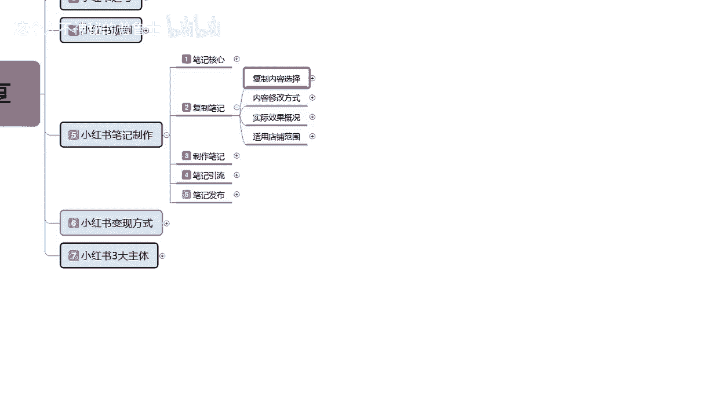