# 2024最新 亚马逊新手零基础入门实操课 共33节 ｜从零到精通！全网最细的亚马逊零基础开店注册全流程实操教程！ - P13：第9讲.如何创建产品 - GM脑壳青疼 - BV1ss2gY8EWs

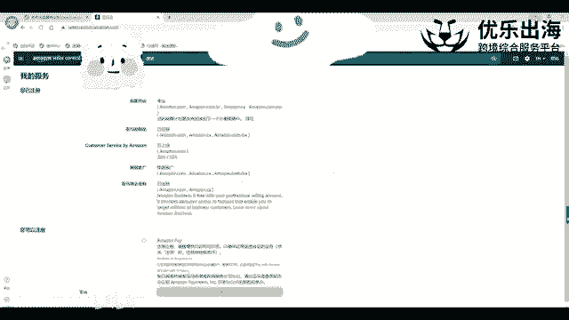

是这样，然后接着我们讲解关于第一个重点的一个部分。也就是说关于我们创建产品这一块的话啊，分为几哪几个点。首先第一个点就是我们的1个UPC码啊，UPC码和EA码，我们在这里直接跟大家去。

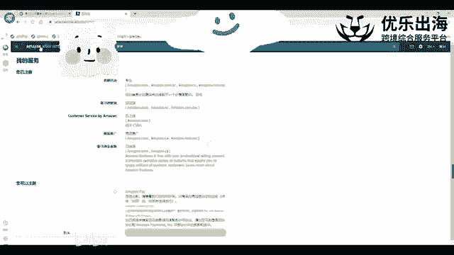

看一下哈，就是首先点击目录添加我们的商品啊，添加我们的一个商品。我们我要添加未在亚马逊上销售的产品。

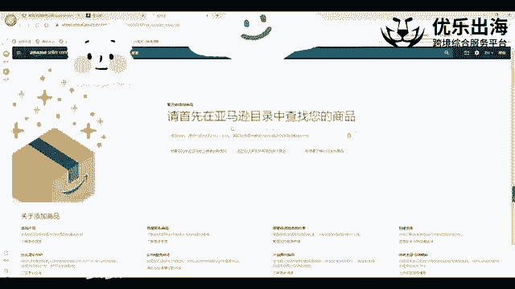

点击这里，然后选择。

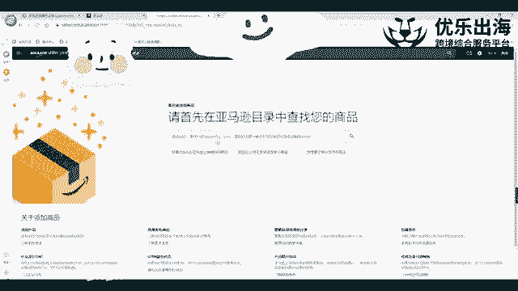

这个类目选择我们的一个类目，可能就是随便先去我们先随便去选选择一个。

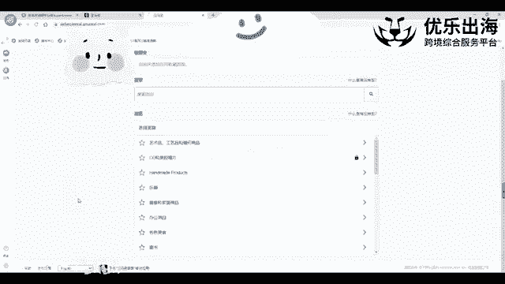

嗯。好，我们选择了这个类目之后，直接进入到了后台啊，后台这个板块。那么进入后台这个板块之后呢，我们可以看到这里有一个product ID啊。

product ID然后有1个UPC码或者说是EAN码啊UPC码和EN码。关于这个编码的话呃，关于这个UPC和EN编码的话，是我们上传产品的过程中，每一次上传产品都是需要的都是需要的。关于这个UBC码。

我可以跟大家去说一下，就是下载我们。

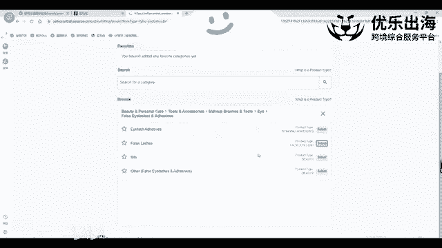

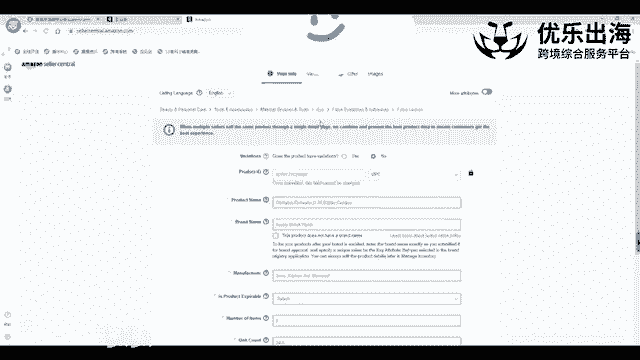

中国。

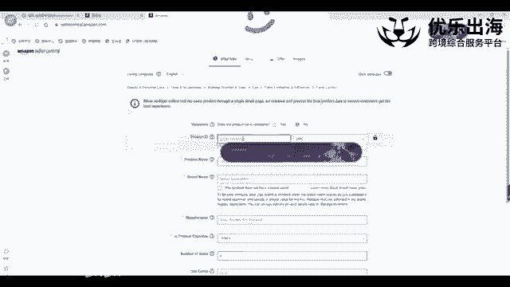

商品。编码。中心啊，这个APP。

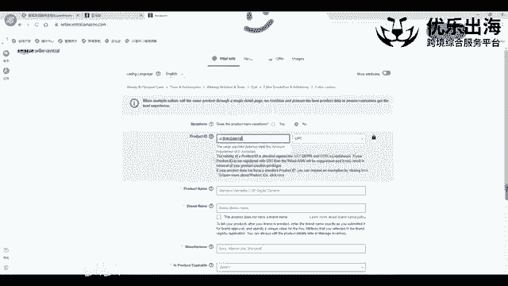

啊，这个APP然后提交我们的呃营业执照，还有我们的一个法人的一个信息，以及我们办公的一个信息。包括我们这个UPC码使用的一个平台是哪里？基本上在付费一两千左右。

一两千块钱左右就可以下来专属于我们公司的一个独有的UPC的一个编码。因为大家不是经常被就是可能会呃淘宝上面或者其他的一些路径上面就是UPC嘛。他们会呃可能是比较假的嘛，或者说是给了我们之后。

还会给其他人就是滥用UPC的这种情况出现。这样的话，我们可以通过这个下载这个APP提交我们的一个产品，然后去付一定的一个费用，得到我们专属的1个UPC码啊，是这种情况。另外一点的话。

因为这个费用是比较贵的嘛，需要一两千块钱啊，一两千0块钱。在我看来，我们注册品牌的话，也就是3000块钱。注册完品牌之后，我们可以申请UPC的一个豁免。

那到时候的话我们这个UPC基本上就是可以直接就不用了啊，直接不用UPC嘛，会比较方便。所以说与其花两2000块钱买UPC嘛，不如我们去花3000块钱注册品牌。

同时我们还可以获得很多品牌所享受的一个啊那那种那个优惠的一个待遇。另外一点哈就是我们回到这个UPC的一个问题啊，如果我们在前期的时候，我们还没有注册品牌。

另外我们也不想去啊去这种中国商品编码中心去买UPC的话，就这种正规的1个U商品中心GS one去买UPC的话，那么我们可以去选择去淘宝上面啊，去淘宝上面去购买UPC编码我们可以看一下。

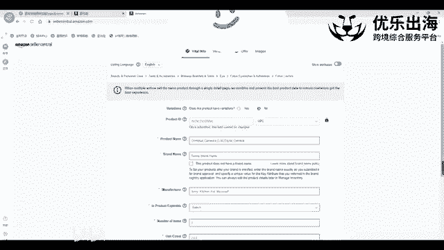

呃，淘宝。

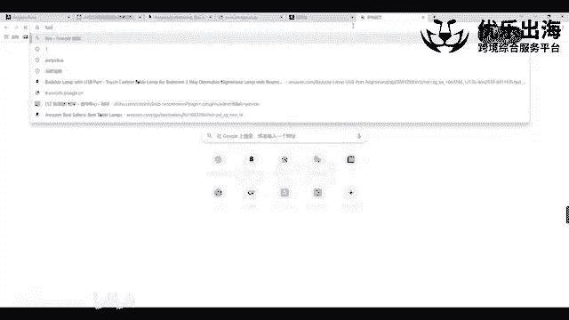

点com看一下哈，然后搜出来之后可以就是呃UPC。编码啊又直接就出来了UPC嘛亚马逊啊UPC嘛亚马逊啊，这这里有需要登录哈，我这边就不登录了，就是跟大家去演示一下，我们可以通过这种形式去购买一下UPC。

另外一点的话，就是我们这个呃店铺里面的UPC的一个编码。我这边的话一直是在老魏旗舰店里面去购买的。包括白名单，白名单的话，他这边也有一定的一个服务。所以呃如果说大家是想要去呃购买1个UPC的话。

我这边可以推荐给大家，就是老魏的一个UBC的一个淘宝店啊，至今我在淘宝这个淘宝店上面买了将近呃可能得有1000个UPC了吧，一两千0个UPC但是至今来说没有出现过问题啊，包括在今年年初的时候。

还上一年年底的时候出现过一次UPC的呃一次那个下链接的一个那个一波一波。😊，一个风波嘛。很多假的UPC啊，需用那种UPC编码生成器，那些假的UPC直接都被扫掉了。

所以说我们要么就是呃我可以推荐给大家这个去买，要么就是我们去注册自己的一个品牌啊，最终或者说的话我们可以去申请品牌白名单，但是现在申请品牌白名单的话也越来越难了。因为呃说实话，现在品牌白名单。

亚马逊卡控的是越来越严。现在是注册品牌的话，也可能会出现品牌滥用，以及让我们继续去提交视频认证的一个呃要求。所以说。关于品牌白名单的话，呃，我建议大家还是尽量去做正规的，自己去做一个产品的一个实拍图。

然后去拍照传上去也可以啊也可以。这个是关于UPC和EAN哈啊，就是包括刚才的一个解决的一个方案啊。嗯。这是第一点。第二点就是asson和SQ啊asyn和SQU我们再去创建这个产品的时候啊。

一定要去注意一个点，就是我们这个asson和SQ它两个是完全不同的一种形式。我们再可以看到哈在创建产品的时候，这里有一个SQU编码啊，这里有1个SQU编码。那么这个SQU编码的话。

我们可以看一下上面如果我们我们是可以不填的，不是必填项。如果我们不填的话。

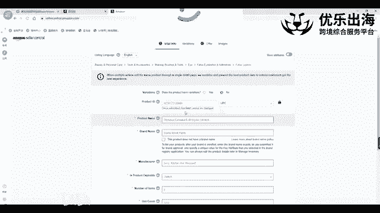

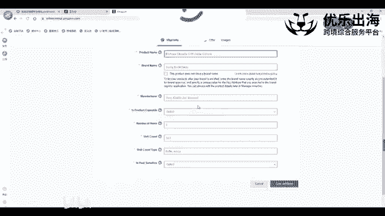

那么亚马逊会自动给我们生成1个SQU啊SQU。但是我建议大家是需要把这个SQU填上，尤其是针对于我们多变体的产品来说，更要把这个产品去呃SQU去填进去SQU命名的一个逻辑哈。

我这边分享一下我自身的命名的一个逻辑。比如说这个产品是什么产品是睫毛。好。然后杠我们那一个产品的长度可能是15毫米。

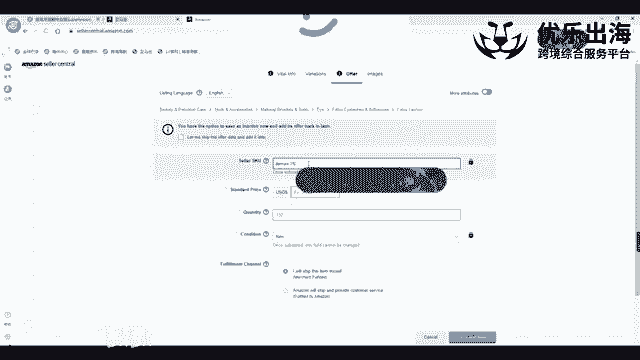

然后再往后那个这个产品的颜色可能是啊黑色。就这样啊，把我们的主要的产品信息，我们的一个呃包括长度信息、颜色信息。如果有的话，我们就添加上哈啊，如果说我们这个产品没有变体啊，没有变体。

并且整个店铺里面可能就一个睫毛这样的一个产品。那么我们就直接睫毛就可以了啊，或者说是allashes，就是英文。大家如果说英文比较好的话，也可以用英文来命名，都没有什么问题。

这个SQU是为了帮助我们卖家在后台去识别我们的产品是什么的一种啊情况啊，这是SQU这方面哈，另外一方面的话就是。接着我们的1个AC码，AC码是我们在创建完产品之后啊，会有一个B开头的一个编码。

这个的话等会我再直接就。保存完产品之后，跟大家去详细的去讲解一下啊，保存那个呃B开头的一个编码是方便亚马逊识别我们的商品而去进行的一个商品的一个编码的一个呃这个创建啊一个编辑。啊。

包括后面要讲到的FNSQ的话，我们都是没有办法去更改的啊。包括这个SQU一旦去那个注册下来之后，我们没有办法去更改。

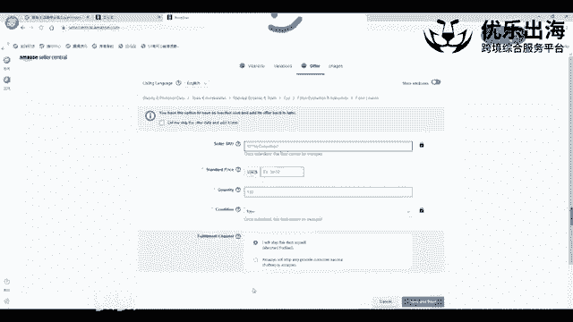

这是关于AC和SQ的一个编码哈。还有一个是FNSQUFNSQ的话，那么我们这一个这里的话等我们就是创建完这个商品之后，并且转化为亚马逊之后，我再给大家去讲解一下我们应该如何在哪里去观察。

