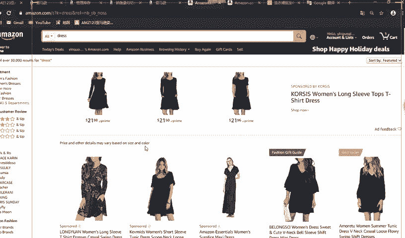

# 2024最新 亚马逊新手零基础入门实操课 共33节 ｜从零到精通！全网最细的亚马逊零基础开店注册全流程实操教程！ - P26：1.listing的介绍 - GM脑壳青疼 - BV1ss2gY8EWs

讲的东西呢是如何优化listing，我们能够可以看到大家已经大概都注册好了店铺，已经开始上架产品了，对吧？之后呢，那listing是什么？我们为什么要优化它？

listing我们今天分割分成7块部分来讲它。第一个是类目选择，第二点是标题，第三点是图片，第四点是五大卖点，就是详情描述关键词和分享。分享的话，最后大家就老师会把一些东西分享给你们。

我们的第四题主要是包括这么多个内容。我们。今天呢主要这堂课就想把老师的这些方法教给大家，就让大家能够完成那种高质量的listing。相信大家上传产品的目标都是为了做成爆款，对不对？

爆款的话我们就能够赚钱，做跨境。大家最后的目标都是赚钱。之后我们今天的话就开始上课了，大家都到了啊。

来，我们今天先看一下这个这个界面大家有没有看过，有没有了解过，这个是我们亚马逊前台的界面。我们今天就随便搜一个单词，就裙子嘛，因为老师是女生，所以对裙子比较感兴趣。

所以我们就搜裙子进来搜索进来就看到这个界面。我们以消费者。的习惯就是搜了这个产品，进来之后看到是这样子的。我们进来看到了什么呢？第一个这个是我们搜的东西，对不对？

就下来就能够看到这里有这么多这么多的裙子，款式都各不一样。有这些长袖的呀，带花的、短的长的，对不对？之后能看到这个是什么？这个就是我们的标题，就是我们写的标题呢，就是显示在这里。

大家都能够看到啊，这个的话这个是什么？这就是我们的review。通俗于通俗来讲呢，就是我们淘宝上面的评价。你看这里有什么五星、四星、三星、两星、一星一星是什么？就像差评。我们做卖家的，对不对？

最怕的就是别人留差评。但是你看现在他这个产品哦，你看这个五星的比例还挺高的，有64%的比例，就说明他这个产品已经做的不错了。他能够在这个第一页面进来就能够看到它。我们的目标就是能够成为他这样的产品。

也希望我们的产品能够做到这个第一页的第一个产品，那你就非常牛逼了，对不对？

中我们现在随便点进来看一看一个产品。

进来之后看到这个这是一个什么裙子，对不对？这个就是我们刚才看到的那个标题。前面这个是它的品牌名，就店铺名吧，之后面就能够看到这是女士的这个裙子，对不对？这里是它的评价。他这里留了15条之后。

还有4条QA。这这里显示的话就是它的价格。这个usive的话就是他给他做的活动做的一个折扣。就像以后啊我们上完产品之后，会发现哎我们的那个顾客有进来看。但是为什么转化率不高呢？就你可以开个广告。

你就可以做个广告。像这种折扣做了之后呢就会吸引别人过来买。这样的话，你的这个转换率就提高了，顾客下单下的多，那你的产品就做的好了。下面看到这里有两个颜色，这就是我们前面说过的变体。

它这里有两个什么颜色呢？一个是深黄，一个是蓝色。对不对？看到了啊，就还有变体，它这个是有两个变体，你看啊点它。

反应有点慢啊，同学不好意思，稍微等一下，看一下，它这里有选择小中等大就叉L叉叉L这个能看懂，对吧？淘宝我们经常买东西都能够看到的。我们可以选择它对吧？就是小的。就选择完之后。

就我们淘宝的购物习惯一样的嘛，选择完之后你就能够看到它的这个价格显现出来了，对不对？

那这里这个就是最后的价格了，就他买买买到是这个价格显现出来。我们自己在后台设置的时候，价格一定要考虑到哦，你那个配物流费呀、成本啊，利润都要算在内，最后的价格，这就是你算出来那个价格，买家买的价格。

再看下面这里这个是什么？你看这里有几点，1234567A，它这个有点多哦，因为它这个。正常来说，我们是这个是五大卖点，我们都是只能写五点的。你看一下之后再往下，这个是他的那些相关推荐。这里你看有好多种。

就这里也都是它的相关推荐，就是同类产品的推荐嘛。以后像你们要做了广告，你的产品要也能够在这里，因为做广告了嘛，亚马逊会帮助你会推你这个产品毕竟你出钱了，对不对？他就会让你在这个下面显现出来。

就是这一些都是他们都是做广告的相关产品。在下面往下看啊，这里就是你的那个详情描述，这些现在都是英文的对吧？大家看不懂没关系，我们这不是都有翻译器吗，翻译一下一键翻译中文都能看得见。再往下看啊。

这下面都是它的那些详情描述，就这里是它的那个尺寸，还有那个重量。之后的话，这个是他的那个review，就是评价，对吧？前面我们已经讲到了的。

以后的话我们产品因为外国人哦很不喜欢留评的，要是他给你留评啊，就有助于你这个产品就是提高他的排名就是很有帮助的。

好，我们现在就是A，还有这个这个是它的QAQA是什么？就相当于哎，你在淘宝买东西，肯定会有人提问你啊，这个是什么东西呀，这就有人回答，对不对？亚马逊这个就跟我们淘宝那个是一样的。

你就能看到他这边有人问啊，就有个人回答以后你的产品要做的好的话，也会有人这样子来的。

就这里就能够看到他那些带图的评价呀。你看这里还有两星的，就说明人家给他不太满意的评价。这里还有个五星的，就说明对他印象很好，特别好。

就这一块内容我们大概浏览完了，对吧？就回到这里，很多同仁还有很很很多学员哦，我们还有问FBA的FBA的话，就是他其实就是亚马逊发货嘛。像我们这里，他这里写的就是意思就是。

销售由这个。这个英文单词这个人他在卖，但是呢这个发货由亚马逊发货。那这个意思他这个东西的意思就相当于说他这个产品是由FBA发货的。如果说以后我们的学员想要FBA发货的话，他最后显示出来也是会是这个样子。

好，现在我们前面大概浏览完了，我们以买家的身份浏览完了这个产品之后，我们现在已经有点印象了，对不对？其实跟淘宝还是很相像的。就我们进来看。

