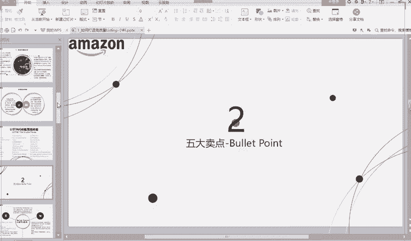
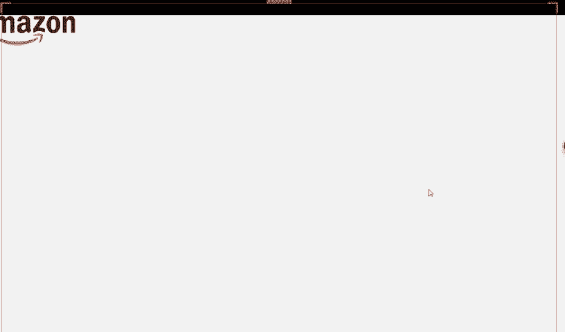
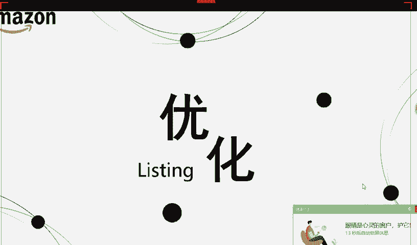
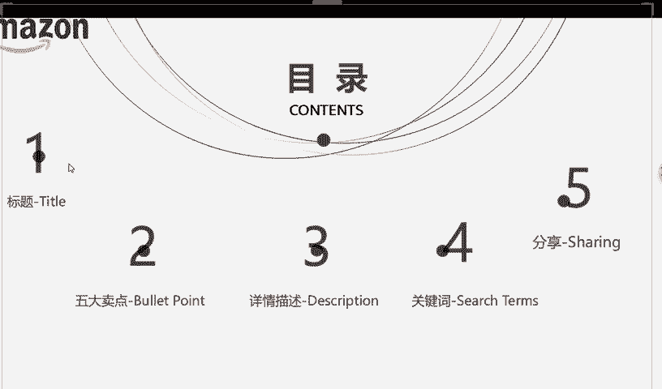
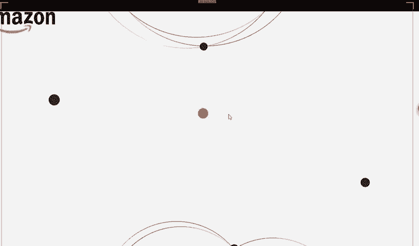
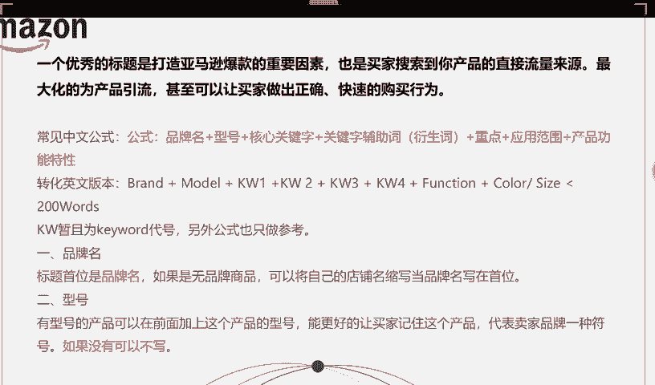

# 2024最新 亚马逊新手零基础入门实操课 共33节 ｜从零到精通！全网最细的亚马逊零基础开店注册全流程实操教程！ - P27：2.标题的论绪 - GM脑壳青疼 - BV1ss2gY8EWs

今天的具体讲解课程啊。

今天讲listing的优化，我希望今天讲完这堂课都能够让大家有那种就是嗯哎呀，突然知道自己的目标是什么了，要做什么样的产品了？就是这个listing我要怎么写它。就是有这个目标一定要做好，做成爆款。

做到最好赚钱这是最重要的。

不知道大家有没有听过这个东西啊，这个A9算法，这个算法呢简单来说其实就是亚马逊啊，它研究出来的一种计算方法。它这个算法为了什么呢？就是为了帮助商品排名，你这个产品上传之后，它是不是会有排名的呀。

你排名越高，买家就是看到它哦，排名这么高，就说明它很好，对不对？而亚马逊是怎么排这个名的呢？就根据这个算法，它这个有两个因素相关。第一个因素就是相关性，就是你这个产品啊和它的那个关键词。

关键词体现在哪里呢？体现在你的标题上面。他这个东西啊一定要是要跟你的产品是相关的。比如说你是一个锅，那你这个关键词一定要是锅的英文单词，对不对？如果说你明明是个锅，但是你单词，你那个名字给他说是锅产。

那这个还是有一点点差距，对不对？那这样的话，亚马逊就不会为你这个产品进行排名，就第二点就是转化率，有很多学员来问我说，哎，老师为什么我那个产品明明有买家点了，但是就没有人下单呢？这个就是转换率的原因了。

以后你的转换率提高了的话，那你的排名就会高。好，现在了解了这个基础的A9算法，大家记住了啊，A9算法，那我们就知道了，排名是跟它相关的。下今天我们就是主要啊主要是讲这五点内容。

第一点，从标题开始讲。

你看我们刚才以买家的身份进来看到，第一眼看到的是什么，是不是就那一个小小的标题。就能够看到最前面那几个单词，就能够说明那最前面那几个单词就一定要体现出来你那个是什么东西。

让买家一眼就能够看到你那个是什么产品。之后老师这里呢给大家提供了几个公式哦，你们可以先按照这个公式写，等以后自己写多了呢，你们就会发现哎我好像可以按照自己的这个规律啊，自己这个公式写多了嘛。

你就懂了该怎么写。但是现在大家都还是新手，所以老师呢就先把这个公式给大家告诉大家现在该怎么写比较好，那第一点品牌名，品牌名是什么，就是我们大家注册店铺的时候，是不是有一个名字呀？那个名字有长有短。

你短的话，那就不用变了，你就直接写短的那个如果是长的话，那你就给他缩写一下。比如说什么YNK呀，什么SWY呀，这样子代表一下你的品牌名，但是如果你不写呢也没关系。只是你写了的话，就能一眼就看到哎。

这个是你上传的产品，对不对？以后你要是想找在前台亚马逊前台找你自己这个产品，那是不是一下子就能找到。到了呢。来第二点，型号像有一些电子产品啊，它是有型号的，对不对？

就比如说那些什么呃手机呀、什么耳机呀这些或者说那种呃锅，它也是有型号的，什么电饭煲这些乱七八糟东西啊，他们都是有型号的。但像你有一些衣服啊，什么那种比较小的东西，可能没有型号，那你不写是没有关系的。

因为你不能够说为了凑字数呃，我什么东西都往上搬，这样对你的标题是没有好处的。

看后面之后你看前面品牌加上型号之后，再加上现在是关键词了。我们主要你看前面已经写了品牌了，短短的再写个小小的型号，那是不是已经快到了那个界限了，就最前面那几个单词，现在你就要把你最重要的单词写上去了。

如果说你卖的是一件长裙，那你现在就要马上把你的长裙这个单词写在这里，就是主要写你现在这个产品品名长裙，就后面你可以再加上一些什么呃圆领长裙，就什么V领长裙呀，就是短袖啊，短袖那种什么的都能够加上去。

就后面再加上什么呢？适用范围，试用范围的话，就其实还是对那种3C的那种消费的电子产品来说吧，就他要匹配哪种设备，就比如说他要适配那些什么呃一定要就是符合这个条件他才能用。就电子产品一定要写清楚。

不然人家到时候肯定会来问你，你要不写清楚，人家买了，说不定还会找你退货的。如果说有卖如果有如果有如果我们的学员啊是想经营这一类产品的话，像这里的标题上面就一定要写的特别清楚。

让卖让买家知道你这个适配什么样的设备才可以。就第五点产品特性。产品特性是指什么？就比如说你这是什么材质、尺码、颜色等等这些就这些哦，你别看它哎看着挺简单的，但是你一定要写上去。

这样子买家才能够看到你这个产品就一目了然，知道吗？大家就一目了然的看到你这个产品到底是哎呀一下就知道了。哎呀，你这是黑色的长裙之后S码的蓝色的或者说就是什么棉质的呀，涤纶的呀，这种就很清楚看到了。

对不对？就还有那种比如说那种呃厨房里面那种什么一次性的盖子，他们那种不是比较便宜嘛，就先讲到第六点了哦，他们不是比较便宜嘛，所以就是那种会比较多个放在一起一起卖，对不对？他们放在一起卖的话。

那你就要写清楚，你这个是6个一卖的，或者说七个一卖呀，8个一卖，那就要写清楚6 pieces就最前面一定要加上这个就在品牌名之后啊，加上这个。

