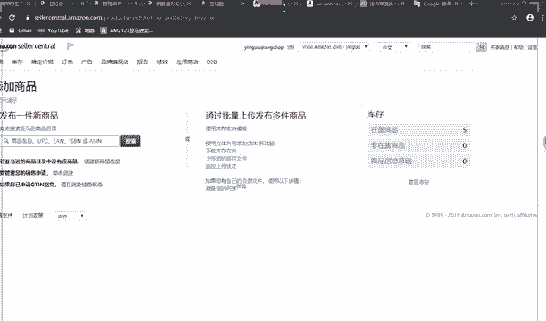
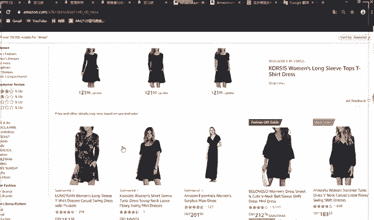
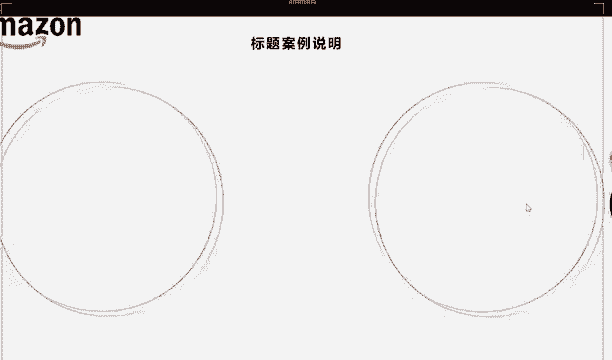

# 2024最新 亚马逊新手零基础入门实操课 共33节 ｜从零到精通！全网最细的亚马逊零基础开店注册全流程实操教程！ - P29：4.标题案例说明及禁用词组 - GM脑壳青疼 - BV1ss2gY8EWs

再看这里啊。大家现在都是新手卖家，我们都还是不是很知道我们到底该怎么写，对不对？这个时候大家都应该去看，我们先上架一个产品，选品选完，对不对？你经选完之后，你就可以去亚马逊上找。哎。

我这个产品有没有类似的产品呀，就在亚马逊上啊，有没有类似的产品呀，或者说有没有同款。你就看他你就看看他们他们的标题是怎么写的。这个参考。就是最大的一点，你你这种啊参考这个词，你别看就是说的不太好听。

你就像那种照搬，照搬是肯定不可以的。你只能说是参考，你可以说稍微哪些地方给他改改，但是你千万别把人家那种一模一样的全拿过来。你要是被被那边的卖家知道了，就是被你抄袭的这个知道了，你也是会被说的。

就是会人家会举报到那边亚马逊客服，人家客服就会过来找你，你又要在那解释哦，说我不会了，我马上下架，我马上改，这多麻烦，那还不如直接一开始就千万别抄，你可以参考，但是千万不能够抄。大家写标题的时候。

可以把很多类同类同款产品的标题一起列下来，写在一个word里面，大家这样子去对去看，去翻译出来之后看哎呀哪些单词哪些短的那些话就是那种。写的比较好的，你就用过来，你给他这样子放到你自己的标题里面。

但是千万不要照搬，好吧。大家也看到了啊，我们的标题在我们那个就是。给大家看一下啊，我们这个界面。是不是一进来看到的就是这个产品，等一下啊。

一进来就是看到的这里。

就能够一眼就看到这个字母了，这个就是我们的标题，对不对？所以标题很重要，它能够让图让除了这个图片是最大的，标题就是最大的，对吧？图片这么大，所以图片和标题是买家就还没点击进去的时候。第一眼就能看到了。

所以这两个东西你们一定要特别特别注意。就后大家再回来看一下我们的这个PPT啊。

这块特别特别多单词都是英文的，大家可以课后的时候呢，把它复制过去。到时候老师课件都是会放到网盘网网盘里的嘛，大家可以把这些复制过去，自己去翻译一下，看一下这些是什么意思啊。

千万不要放到自己的那个listing里面，就是标题里面，千万千万不要放。