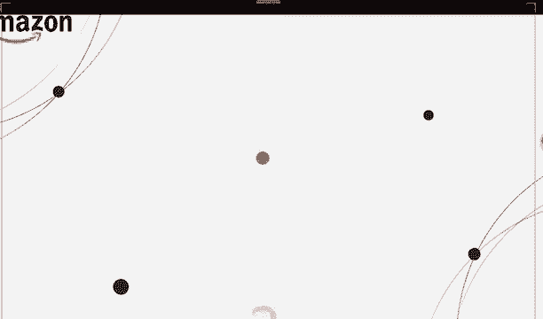
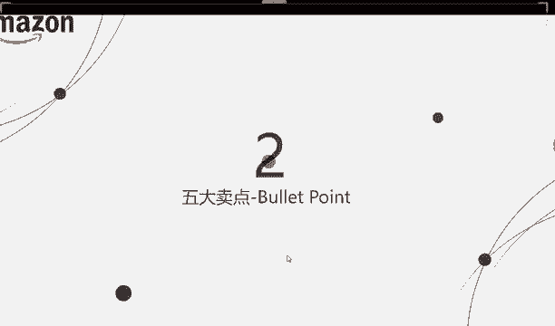
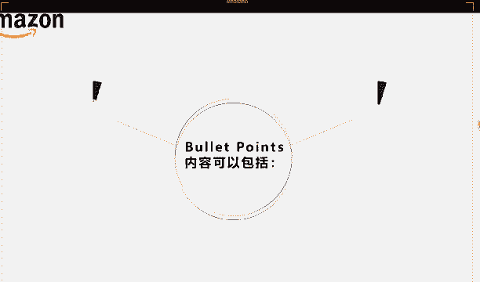
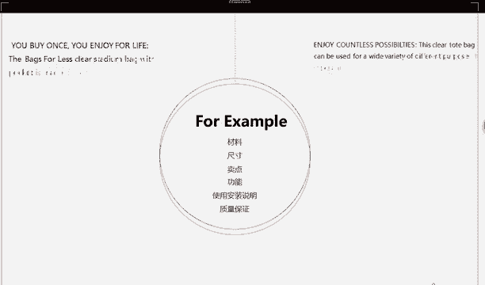

# 2024最新 亚马逊新手零基础入门实操课 共33节 ｜从零到精通！全网最细的亚马逊零基础开店注册全流程实操教程！ - P30：5.五大卖点的内容 - GM脑壳青疼 - BV1ss2gY8EWs

第二点，我们讲五大卖点，五大卖点五大卖点大家还有印象吗？是在哪个位置的？

我的卖点就在这个位置，大家看到了啊，是5点的。这个是他可能显示的问题吧，所以它才会显示这么多条。但是大家写的时候，就像你上传产品的时候，它也是只能让你写5条的。大家一定要记住啊。

这个五大卖点就是买家点进来之后，先是看到图片这么大，一眼就能看到了。之后再这按这个顺序看下来。哎呀，看到了你这个标题之后这里有个小图，接下来就会看到五大卖点，对不对？五点描述。

来看一下我们这里五大卖点里面需要包括什么东西。

你这个产品第一点一定要介绍清楚它是什么产品，对不对？比如说它是一个裙子，圆领黑色波点裙。第一点就要写清楚，对不对？之后它的尺寸就是这些啊，老师现在列在这里的这些6点是大家一定要写的。

就是最好一定要写上去的。他这边呢。第二点就是尺寸了，尺寸你像无论什么产品都会有尺寸的对吧？你要尽可能的把你的尺寸啊，就是很详细的写上去。这样子的话，人家一看就知道，这样子就可以不用过来问你了。

人家问你的话，还要发邮件来问你，你还要再回邮件给他。如果说你这里写清楚了的话，人家一看就知道就可以不用问你了。所以尺寸就比如说是那种裙子啊，size适合那种裙子这种东西就衣服这种东西。

你最好在图片那里啊，最后一张图你就可以把尺码图给它设计一下，放上去。这样子的话，这边就可以稍微可以少写一点。

你可以直接写SML叉L叉叉L这样子人家一看那张图片就知道你讲的那些具体的尺寸是多少是多少厘米呀，裙长多少啊，腰围多少啊，胸围多少，对不对？之后第三点功能，它是有什么功能的呢？裙子你看是没有什么功能了。

但是你说那些什么嗯。像一些比如说小朋友那种什么那种拼图，那种拼地上的那种地垫，你说是有什么功能呢？那种是就是防摔，对不对？小朋友用的吗？软软的那种地垫。要是它有功能，你也要写进去写上去。这第四点。

产品特点及优势，它是有什么特点呢？就是它的卖点。对，五大卖点最重要是什么？就是让你写它的卖点。它有什么卖点，就是它特别突出的地方，这就是你在选品的时候，第一点就要考虑到你为什么要选它。

你选它为什么这就是你要写的特点和优势。你说他这个特点特别好看啊，是不是有一点点的广泛，但是你也可以写，没有问题。但是你这里最主要要写的是你有区别于其他人的地方。像样这样讲，老老这样讲，你们可以懂吗？

就是你有区别于他们的是就是一些什么特点。只有第五点运输时间，这个其实可以说不讲，但也因为讲了的话，你有可能哦一定要在这个时间之内把这个东西送给人家卖家。但是你说这种肯定有那些风险，对不对？

你有可能突然路上发生什么送不到。所以这个第五点，大家可以考虑一下，到底要不要写。如果说能确保按时送达，那你可以写就第六点用途，你说这些用途很好写了呢？你说什么节日送给小朋友送给老师，送给女朋友。

送给老婆啊，送给爸妈呀，对不对？就像国外不过很多什么圣诞节呀，万圣节呀，就什么各种各样的节日很多，对不对？你都可以写。所以说我们的五大卖点是有很多东西可以写的。大家只要发挥你们的想象力。

就看看别人是怎么写的，就再加上你自己的想法，就会有很多东西可以写，你就要把最精准的，最就你觉得最好的东西给他写上去。最后。😔，再看这里啊，这边。我们考虑到了电脑上看到的买家。

那也要考虑一下亚马逊手机用户的买家，对不对？手机端用户还是很多的在国外，但是在手机端上呢，我们看到的五大卖减只有前三点。所以我们尽量要把自己觉得特别重要的，特别好的东西啊，给它放到前面一点点，往上方。

这样子的话，买家看到这个被吸引住了，他就会往下翻，看看你的其他东西呀，这样子对不对？这里又提到了，可以参考其他卖家描述，说明这个参考啊是特别重要的。大家现在都还是处在于一个不会不太会写的状态。

所以我们一定要去多看看其他人怎么写的。这样子我们才能够有经验。等你们写多了之后，你就能够像老师一样，现在这样子讲什么都能够讲得出来。就是你可以一下子就能哎想到这个东西哦，我就知道我要该写什么东西了。

比如说想到耳机，我就要想到哎呀，它是蓝牙的，可以支持支持那种各种各样的功能的，什么样的乱七八糟东西，对不对？你就一写多，你就知道该怎么写了。😊。

