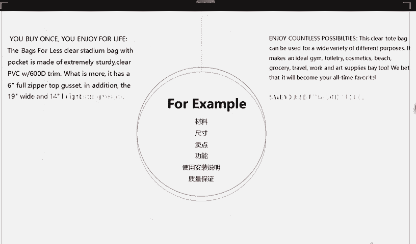
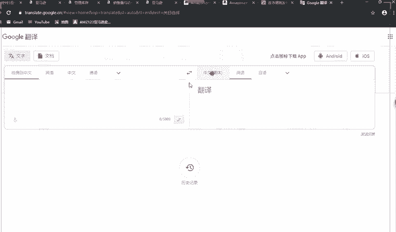
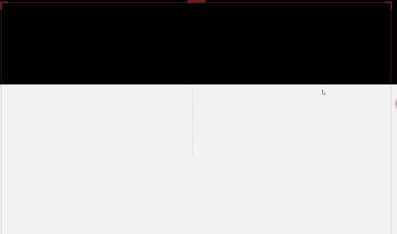
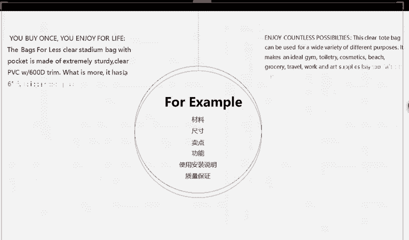

# 2024最新 亚马逊新手零基础入门实操课 共33节 ｜从零到精通！全网最细的亚马逊零基础开店注册全流程实操教程！ - P31：6.五大卖点的For Example - GM脑壳青疼 - BV1ss2gY8EWs

看一下啊，这个是老师在就是别的卖家那边，他们是这样写的，老师觉得他这个写的特别好。所以想跟大家分享一下这一大堆英文，我知道大家肯定看不太懂，老师也看不太懂。没关系，我们有谷歌翻译。翻译一下。

什么都知道了。

来，大家看啊，他你先不看旁边的，先不看这边，不看这些中文，你就看这边英文。你看他这边写的跟我们写的有什么区别，你们大家现在写的是不是就直接写的这一块的内容，就就这样长长的一大串说他怎么怎么样怎么怎么样。

你看他这里特别好的是什么？他这里开头全部是大写的哟，他这一句话。嗯，这个翻译可能不太好，我们看下面这一行吧，这个翻译可能有点点讲的不是特别清楚。你看它这里这一款。大家记住，全大写，这个是五大卖点。

开头全大写写的舒适醒目的现代设计。你看它这里就是把它后面这一大段话总结了一下。说他后面主要是讲的什么东西放在前面，这样子人家看见是不是就知道你这个最大的特点是什么了。

所以以后就大家啊可以一定要借鉴这种方法写。后面的内容有些人可能有些卖家啊可能看不下去，所以前面的这个东西一定要概括清楚，就你前面写一下，就概括的东西。比如说它嗯耐脏耐磨，非常好用，非常耐用。

那你就给它简短的用英文写一下，耐用坚固。对吧这单子就很短了，就你用大写大写的放在放在这放在最前面这一块，就后面再具体讲它怎么耐用，怎么耐磨，就什么材质的呀，多少尺寸呢，是不是就可以加进去了。

你看它这里翻译就这样子，它这个是很坚固的，是用PPC制成的，最重要是它具有这个6英寸的全拉链撑板。一看是不是哎呀，好像这个特别特别好，质量特别好，对不对？就看下面这一条，他写的是什么？

你看人家这种好的卖家哦，他就写的很长，像我们的五大卖点，他的字数是是没有太大限制，就很多很多字数很多很多都可以写。所以你们不要太有顾虑，能稍微写多一点的话，就稍微写多一点，这样子的话。

人家一看就感觉你你这个写的特别专业，你知道吗？人家一看你写的特别专业，就会觉得哎你这个产品是不是也挺好的。就看这里它这里说必备之选，你们就可以学习一下，有些单词啊就会特别吸引别人必备之选。你看必备了都。

人家看见说不定会考虑一下要不要买，就他这一解释，就是描述了一下它这个产品是什么样的。大家能看到它这是什么产品吗？透明PVC手提袋，他讲了一下他这个手提袋的样子是什么样的。

你们也可以讲一下这个裙子的样子是什么样的，对不对？之后他还说他这个包有很多种用途，这是不是就跟老师PPT里面讲的就很像了，他可以用在很多很多地方可以放化妆品啊，可以出去旅游的时候拿呀背呀。

之后他还说我们敢打赌。他将成为您有史以来的最爱。就说明他这个。他这个东西啊肯定很多人喜欢，受众很广。就再看这里节省时间和麻烦，说明他这个包很方便，对不对？他你看他这些就很概括性的。

把最好的这些单词放在了最前面，这些就是我们现在要学习的地方，大家一定要记住了。大家都有看到，对不对？然后看一下你们有没有看到，有看到吗？哎，这位同学说写这么多顾客会认真看吗？你这个写的好，顾客会看的。

所以说最重要的就是你要把前面的先写好。就你要去。即系。所以说老所以说老师所以老师说为什么你要先把前面那几个单词写好，你把前面那几个单词写好了，人家才会往后看呀，对不对？好，这里大家已经看到了。

人家是怎么写的，你要多学习，你看人家写的这么好，我们用一句话就讲完了，说他是什么嗯嗯很多人喜欢的，就什么适合什么样的节日。你看他这边写了这么多这么多这么多，你看看着是不是就很舒服了？

我们自己身为卖家都看的舒服，那身为买家是不是也看的很喜欢，虽然它长，但是你要把前面那几个东西全概括好。人家说你只看前面就能够被吸引住。走来看这里啊。看完那边是不是这边就已经已经概括出来了。

慢一点是什么之后。

它的材质是什么？就它的用途是什么？它的功能有什么功能？它的质量保证就是什么嗯包换哪，对不对？但这种大家慎重写。如果说像有一些嗯感觉那些买家不怎么会拿过来换的，你就放心写，反正你先写上去嘛，换不换。

到时候再说，对不对？质量保证这种就很吸引人家。你说人家那种，比如说我们淘宝买东西，他给你包换，你愿不愿意买，肯定很放心的就买了，对不对？你先不管它能不能包换，但是你看到就很吸引你，你肯定会买。

就这里有一个使用安装说明啊，像有一些是是是那种散装，散着的，买到之后是要那种呃搭起来的那你肯定要写一下使用说使用安装说明，对不对？

