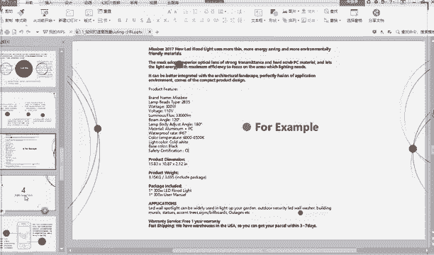

# 2024最新 亚马逊新手零基础入门实操课 共33节 ｜从零到精通！全网最细的亚马逊零基础开店注册全流程实操教程！ - P32：7.详情描述 - GM脑壳青疼 - BV1ss2gY8EWs

好，第三点，详情描述这个地方的话就字数就更多了嘛。你可以看一下老师这里是说要怎么写的。我看到很多很多学员啊，他们的详情描述感觉写的都挺短的。其实这个地方的话，你可以稍微写一下你的这个。

这个的话这个大家看着先，你可以稍微写句广告语啊什么的，也可以，对不对？它虽然说是品牌故事，我们可能不是品牌，那也没有关系，你就可以写写那些比较好的东西啊，那种quality质量比较好啊什么样。

说就是打个广告，你想一句广告语就什么质量好，使用放心什么样的，对不对？就可以写。你不要就是光秃秃的，就第二点可以写下详情描述，详情描述是什么？产品品名尺寸颜色重量。这些对不对？就它的参数你就可以写。

这已经好多点了，老师就说这么多，就第三点，它的品质保证和售后服务。他这里已经提写了啊，比如提供一年质保，随时提供及时的问题解答。这个你先看质保的话，你可能会犹豫一下，哎呀，我要不要这个。

但是你这里说随时随地提供及时的问题解答。这个完全没问题的，你可以写的，这就这个意思就是人家过来找你的时候，你可以马上你就回答他，一定会回答他。这个大家都是可以做到的。如果说有人来问你肯定会很开心的呀。

这说明人家有可能买你的东西，那你肯定会好好的回答他。所以这里可以写的啊，说包装信息，大家可以写一下，比如说一乘什么什么什么东西。比如说你这件裙子，一乘裙子。

就一套一件裙子EPC裙子这样子这样写就包装冒号一乘裙子，就你翻译成英文写上去，如果是套装，就刚刚说的什么6PC3，你要写清楚，这样子人家会说哎，你这明明上面写的说是6件，怎么只发过来一件呀。

就一定要按自己的就实际情况写，你是多少个，你就发多少个，就写多少个。😊，就是有赠品的话，你也要把赠品的内容一定要写清楚。就他这里说每一部分第一段要总括用粗体段落之间要突出一行，这个大家看情况吧。

这个其实都可以的。看就如果说你比较注重美观，你可以这样写，就前面加粗加一下，就段落之间空一行这样子看起来就会稍微好看一点点嘛。老师这张PPT上面都是字啊，大家一定要注意看。虽然老师现在可能点的比较快。

但是希望大家课后的时候呢，能够仔细的去看一下下。因为上面的很多东西都是老师总结出来的呀，就是写的，希望大家都能够去认真看。他这里面那你看老师说了广告语规格特点，使用场景是什么的？

就你这个可以放在哪里使用啊，放在厨房，放在客厅，放在卧室使用这种使用步骤的话，就相当就是那种嗯就是不是就是那种嗯。比较复杂的，一定要就像我们那种使用说明，买东西的时候，有些东西是不是有使用说明呢？

如果有的话，你给他写上去，使用步骤就第一步该怎么怎么做。第二步该怎么怎么做。注意事项的话，就是说嗯就你可以写下说哎我这个颜色可能有就是因为显示问题啊，可能会有那种色差呀什么。你如果有这种情况的话。

你也可以写质量保证老师前面已经讲过了，大家都知道包装也已经讲了，这些呢就是老师总结出来的，大家可以参考，可以这样写。之后至第二点。大家就是不能够把自己觉得去好的全放上去。

一定要考虑清楚你卖的这件东西的受众是谁，受众是谁，就是你卖给谁的，你卖给什么人？比如说你卖玩具，玩具就给小朋友的，一定要说它有多有趣，要说明出来，要说出来它是哪些地方就会很受小朋友的喜欢。

但如果说是买的，就玩具，如果是家长，如果说是买的人是家长啊，家长可能会考虑一些什么很多的安全问题呀，什么那种呃质量如何呀，对不对？大家也要可以写一下。这第三点，他家这里的话。

这个换行加粗这个大家应该都知道的吧，可视化编辑器这里。

这个东西大家的那个详情描述。

写的时候先英文写完，对吧？就比如说打一堆一堆了这样子就换行一。2这子。你看他会点完这个之后，它会弹出来这个。你要到时候如果说你是在后台上传的啊，你一定要把这一大段复制过来，复制到那个里面。我再看一下。

这这个使用场景的话，老师前面也讲的就是你可以就写的那种好看一点。比如说他那种有家的氛围啊，那种很有那种嗯。活就是那种开part开那种party啊，开那种各种各样的那种聚会的氛围啊。

这样子的话就会增加买方的购买欲。再看这里，这个是老师也是摘抄别人的啊这个详情。你看看他写了这么多这么多这么多，你看人家这样子就加粗空一行加粗空一行这种标题。就他就给他加粗写出来了，对不对？

这个的话大家课后去看去复复翻译一下，看一下人家是怎么写的，你可以借鉴一下。

