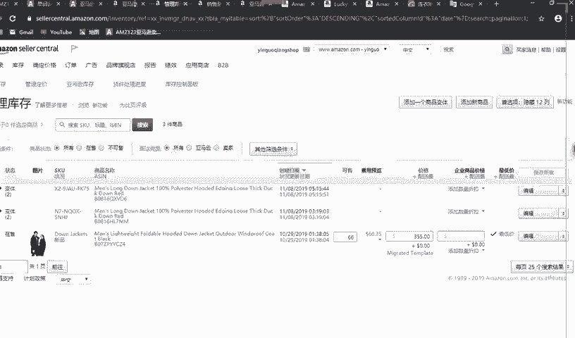
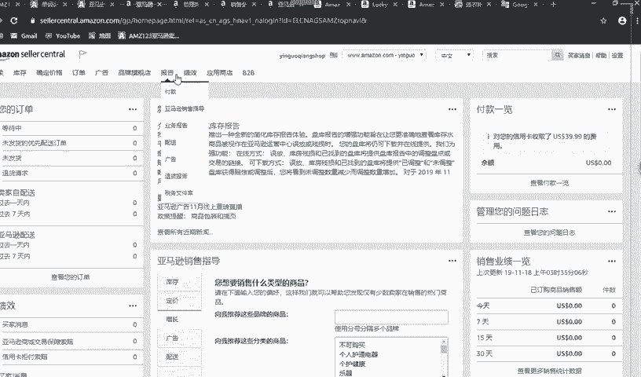
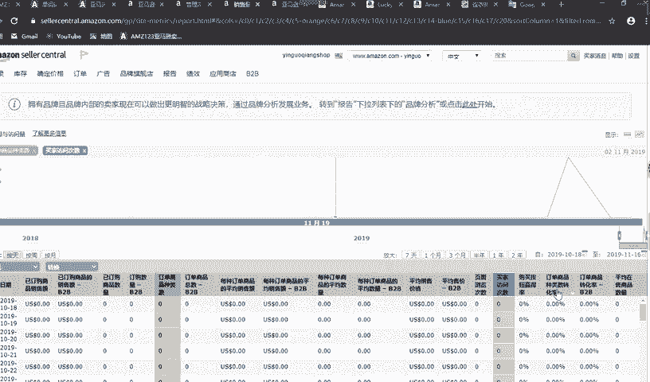
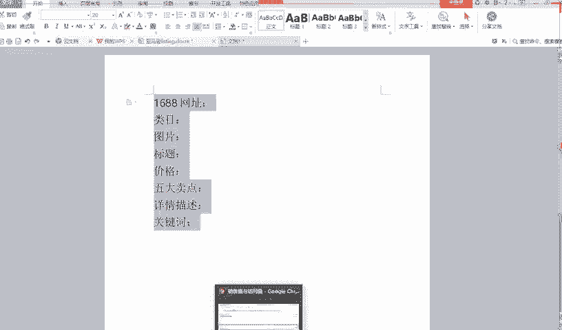
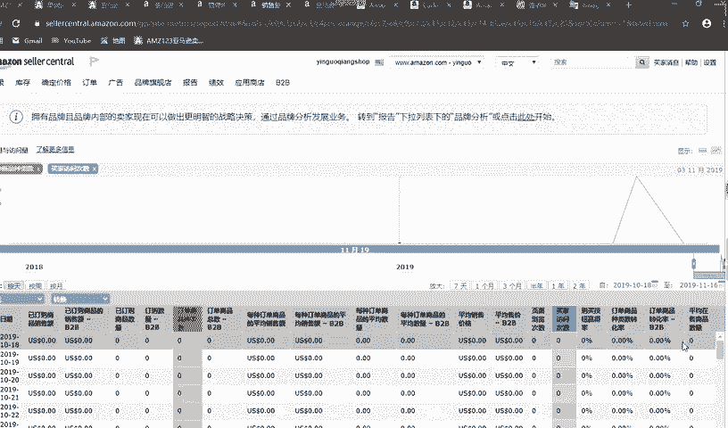
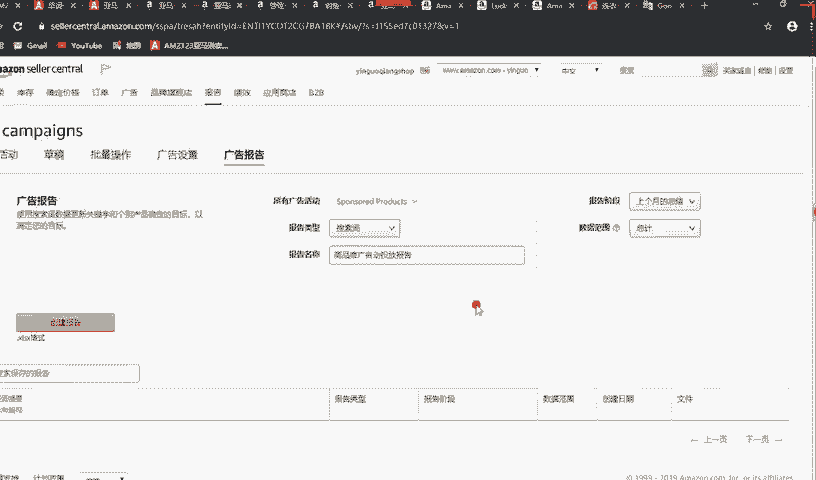

# 2024最新 亚马逊新手零基础入门实操课 共33节 ｜从零到精通！全网最细的亚马逊零基础开店注册全流程实操教程！ - P33：linting格式 - GM脑壳青疼 - BV1ss2gY8EWs

看一下这第一行，你们是不是基本上都是在1688上面找的产品啊？那你们像这样子的顺序写一下，这个是1688的网址之后类目。就能看到老师这里一行一行的这些分别都打了这些东西，对不对？

你们这样子把自己每一个产品的准备过程，准备的资料都给它写清楚，这样就有益于你们以后再回过头来，可以再改这个产品再优化一下，把它哪个地方再改一下，这样就不至于你把这个东西传上去，就只能在上面改了。

你这样可以在下面改完，再一起上传，对不对？好，类目下来我们看到的是什么图片？图片的话大家自己就可以想一下，要么自己会点PS的，你就可以自己去学PS自己来做。实在不会啊，你就可以去找那种美工淘宝上啊。

肯定会有很多的花些钱嘛，就请人家做，人家肯定做的好，按你的要求做好，就你放放到那个上面去。图片的要求，前面的课都已经讲过的啊，大家一定要回去回顾一下，老师发在网盘里的课程，大家一定要记得去看。

千万不要不去看，有可能你看一次，有可能是忘了，但是你一定要多去看，一定要看懂理解了，这样子才有助于你以后做，对不对？图片做是什么呢？标题。标题下面是什么价格？价格在后面是五大卖点。五大卖点之后是什么？

是那个详情描述。详细描述在下面是什么？好像没什么了哦，还有一个特别特别重要的那个关键词。这个是。你看一下前面这些嗯图片标题价格，我单白的描详情描述这这几点啊，嗯同学们都看得见吗了，我把字体放大一点。

现在能看得到吗？能看得清楚吗？大家能做得到吗？不是，什么能做到能看得到啊，能看清楚对吧？好的，看一下这个图片标题一个价格，我到卖点详细描述，这些是我们在就是前台前台是什么？

就是买家进买方买你东西的人进来一下就能看到东西，对不对？这些很重要，但是老师觉得吧都没有关键词重要，为什么呢？因为关键词是人家输入这东西就能够找到你这个产品，对不对？如果你这个关键词找的好。

就是因为这这些除了这个价格跟标题吧，这三这个啊不对图片和价格吧，标题我到卖点详细描述里面都有可能包含你这个关键词，如果你关键词找的好，你能够放在这个这三点，这三个地方，对不对？你找的好，人家就能够。😊。

一下子就能够找到你的这个产品。所以这就是关键词最重要的一个地方。大家一定要记住啊，自己一定要建一个word这样子来上传，就做你的listing。你这样子就能够不断的优化你的产品。

但是优化不是说你一定要就。优化优化，一定要看自己的数据，大家数据在哪里看，知道吗？

80。等一下啊，老师打开给你们看一下，这里点报告有个业务报告，这个是我们自己亚马逊的后台，大家都看得懂，对吧？报告点业务报告，这个等你们上传了产品之后，这个业务报告里面就会有信息显现出来。大家看一下。

就这里这个东西啊。

中文的大家都能看到，如果是英文的，大家点翻译翻译一下就能够看见的。买方访问数，这个只是老师一个就是展现给你们的平台，就是没怎么上传产品的，就都不怎么做的。所以大家就先勉强看一看。

大家有兴趣的多去看看自己的店铺，多去熟悉熟悉自己的店铺，这样子才有益于你自己做这个工作，对不对？现在这个跨境已经当成是你的工作了。你们做的好，肯定能赚钱的。相信老师。如果说这些东西啊，这些一类列的东西。

你要没有，你点这边有一个这个。列。点这里你给它勾选一下，勾选一下，你就能够看到。这里能看到什么呢？就如果说你出单了，这里就能看到你这个买家已订购数量多少个，他就一天一季，或者说几个月几天一季都有的。

你到时候都去看看自己的这些数据。也能够看到一些相关的东西，就会了了解到一些不同的东西，大家懂吗？再看这些种类数，这个其实差不多意思，就字面意思都能够理解的。销售额就多少钱嘛。

卖多少钱之后这里页面浏览次数就是买家点进去看你这个listing多少次了，就访问次数也是就购买按钮赢得率就是人家下单赢得率比例是多少，这个有一个公式的。就比如说你点进来买没买。

点进去就买没买就会是一个购买按钮赢得率，购买按钮是什么，就是你们的购物车。大家现在都是新手卖家，所以可能都还没有，但没有关系的。大家只要把自己的listing做好，保证自己账户的这种不违规啊。

那种符合他那种亚马逊平台规则都是有可能在后来慢慢获得购物车的。前期其实没有购物车，也有可能会卖出去的。大家放心，只要先好好做好自己现在手上的工作把这些能自己现在能做到的事情都做好。可以吗？同学们。

之后在后面这个转换率，就老前面提到很重要的那个。亚马逊就是根据这个转换率啊、相关性啊来给你的这个产品排名。这样大家应该都能够看到这里这个东西吧，等一下啊。

这里有个排行榜，这些排行榜，亚马逊都是根据那个A9算法给它排名排出来的。大家可以知道吗？就是未来如果你你的产品就是做的好的话，你有可能上这些排行榜，放心，大家都是有可能的。同样是零基础零基础做起来的人。

为什么别人可以，你不可以呢？只要大家就是好好学习嘛，就这方面大家就嗯多去学习，只能说这样子。因为这种你说做生意对不对？肯定也有运气的成分在。所以大家就是现在能做到的就多学多做。平均在售商品价是0。

因为老师都还没有怎么上传产品，所以是0。之后这些的话现在就是这个样子，大家能都能够看到这个数据。就还有一个地方是什么呢？就是这里有个广告，就未来以后啊，老师可能会教你们做广告。做完广告之后呢，大家就是。

能看到这里有一些。就点这个广告活动管理进来之后，大家就能看到自己的广告。报告广告报告是为了看什么呢？就是看人家买家是根据什么关键词来搜索到你的产品的。大家就可以看到那个报告里面关键词是什么。

你就给它拿出来。所以做广告也是有好处的。在你们前期做广告的话，人家亚马逊还会给你们一些。不说福利吧，就是就像你们这种新现在新手卖家啊，就亚马逊会给你们一个蜜月，就会有一个蜜月期。

就会特别推你们这种新手卖家的产品就会。所以说你们前期可能会这种更容易搜索的到。就是因为亚马逊鼓励新手卖家开店嘛，就做这种产品。所以他们就会有一个蜜月期，大概一个月左右。就会有这个时间会给你们。

所以大家争取开完店之后多上上产品，但是选品也很重要，千万不要随便上传。也千万不要看到。嗯，比如说谁做这个产品做的特别好，你要跟着买，你要看一下这个这个市场，如果说已经有看到很多人都在做这个了。

那就没有必要一定要挤进去说，我也要做这个这个是没有必要的。大家懂吗？大家可以多去开发一下嗯，比较那种现在可能没有卖的那么好，但是就是现在可能不是那么受欢迎，但是你觉得他未来有希望可能卖的好的。

你可以多去看一下，说不定他未来就卖的好了。就你把它卖成爆款，懂老师的意思吗？这里有个广告报告，未来以后你们开了广告之后啊，点这个广告报告，把它这个报告下载下来之后呢，你们就能够看到了。

就是这些嗯就创建报告嘛，里面报告下载下来。老金版想给你们看一下老师之前的那个报告，但是嗯没有给它存下来，所以很可惜。如果以后有时间的话，可能会给大家看一下，就里面会有买家搜索，用什么词搜索的。

你就能够看到这个也是站内就是搜索关键词的一个方法吧。

