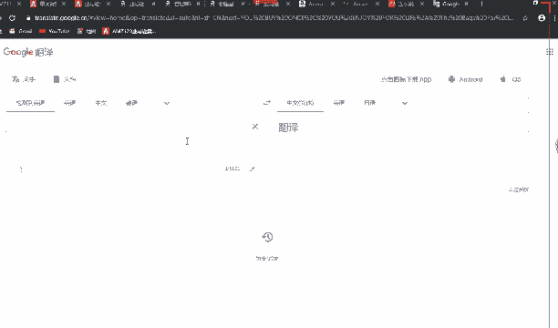
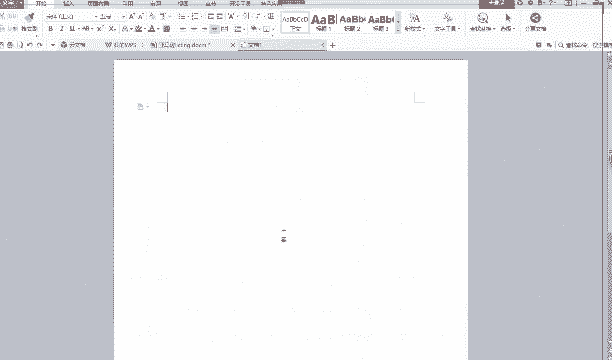
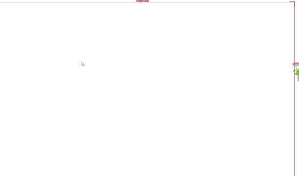
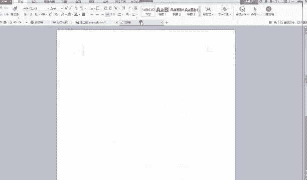

# 2024最新 亚马逊新手零基础入门实操课 共33节 ｜从零到精通！全网最细的亚马逊零基础开店注册全流程实操教程！ - P34：分享 - GM脑壳青疼 - BV1ss2gY8EWs

最后到第五点了分享啊，讲这一点之前老师想给你们看一下。因为今天我看到有学有学生过来问老师说，哎，老师，我这个类目不知道该怎么选择，这个该怎么办呢？来，同学们看一下这个类这个产品。

如果像如果说我想知道它的类目我们该怎么看，大家看一下啊，这个地方这个是什么东西，这个英文单词，大家知道吗？这个英文单词，这别算英文单词吧，这是英文加数字，大家看一下啊，这一串是什么？

老师告诉你们这个地方叫as森，你往下滑，看到这里。嗯，这个地方。大家能看到吗？A森。看得到啊，它这个不一样，是因为它这里有两个产品，所以你先不用管它，反正他这个地方这个英文单词英文加数字的东西。

它是ason是这个产品的asonaon是什么呢？就是就比如说你这个产品就是一个身份证的意思吧，就是相当于它有个代码有个编码，就说明指的是这个产品，就你把这一段后面这一堆。你给他删掉。走回车看一下。

这里是不是出现了一大串英文呢？这个就是它的类目，你们知道了吗？你们上传产品的时候，是不是第一步就是要选类目？然后现在教一个最简单的方法给你们，你们一定要记住哦，这个就是类目，大家知道怎么做了吧？

这一大串英文加数字的这个东西，后面那一大串删掉之后敲回车就会出来这个东西，看到了啊。大家有可能看不懂这是什么东西，我给你们翻译一下。但是你嗯不清楚没关系，你定要记住它就是类目，它就是类目。

你看福字、鞋装、鞋服装、鞋子，之后珠宝、女士妇女、服装、礼服、鸡尾酒。你看他这个翻译哦，它可能不太准确，你可能不好，觉得不好。他这个类目没关系，你可以多开几个。就比如说你要找这款这款衣服。

你可能找不太到。那你可以找类似的这种这种长度的呀，这种带花的这种那看一下哪一些比较符合这种可能差不多吧。你可以，如果说你觉得那个类目翻译出来，你觉得不觉得不合适，你觉得好像哎呀这个类目好像不太好哦。

你就多打开几个，你去看一下嗯，这种同类型的同款或者说同类型的，你把它的类目看一下，如果说都是同一个，那你就用它，你可以自己选择嘛，大家有判断力，对不对？你去复制翻译一下。你看一下这个类目，你觉得好不好。

觉得好的话，那你就给它弄下来，就变成就也是你自己的类目了，就类目就很好选择了，对不对？很简单。这个网速好像不太好，没事，这个方法老师已经教给你们了，大家都已经知道了，对不对？大家已经看到了，对吧？

看到了啊。好的，那老师讲最后一个内容，分享这个的话其实这种东西主要是积累，对不对？我们平时学跨境这种东西，自己学习就老师教是一部分，但是自己学习也很重要的，你肯定不可能等着老师一步步来教你们。

你们可以自己先去多学一下其他的东西。

这样子的话，等老师说不定你讲到你这个内容，你就会更容易理解了。老师一讲，哎，哎呦是这样子的，原来我前面看不懂，原来是因为这样，这样这就是因为你前面已经自己去学习学习过了才会懂。

看一下老师给你们分享的是什么啊，就是几个网站，还有一个公众号，是老师自己平时就是都有在看的，都有去学习的地方。因为虽然老师现在也是老师，但是我平时也在学习，就是希望自己更进一步嘛。

也希望自己也希望自己有更多的东西可以教给你们看一下，这是网站。这些。😔，网站大家课后都可以复制过去收藏一下，看一下。这关前面老师讲过的创栏论坛的话，就是很多像我们这种做跨境电商的人，他们也有很多问题。

他们会在上面问，你们有有什么问题，实在不知道，也可以在上面问，这也可以看一下人家问的问题啊。你懂不懂，不懂的话，你也可以学习一下这两个论坛都是一样的。就公众号的话，就是微信公众号嘛。

你们都可以他们会每天不定时啊，不一定每天可能有时候啊会发一些一些那种。文章哦，你就可以多去看一下，多去了解一下现在最新的那些消息啊什么的。个就是特别那个的希望能够告诉大家的一个东西。

这个的话是老师之前就是刚开始做跨境的时候，老师自己做的一些listing，就还是就刚开始做的时候嘛就比较浅显。但是。

能看到老师这里有特别特别多，对不对？很多很多很多，但是我能够一目了然的知道自己做的这个是什么产品。所以大家一定要记住哦，这就比如说。

