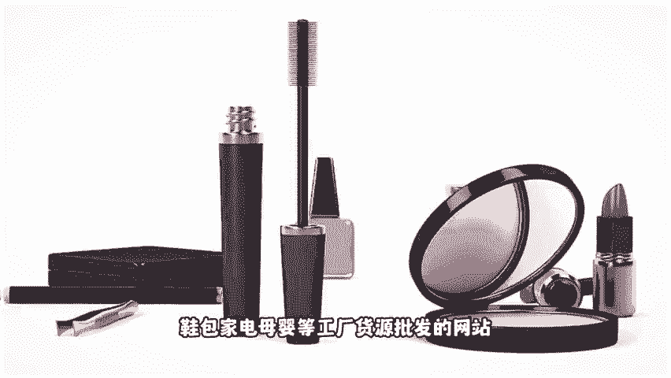
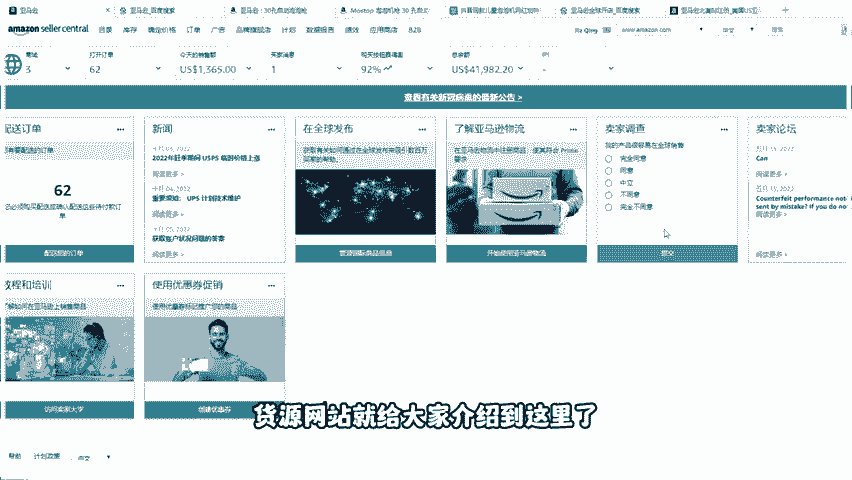

# 2024最新 亚马逊新手零基础入门实操课 共33节 ｜从零到精通！全网最细的亚马逊零基础开店注册全流程实操教程！ - P4：亚马逊运营拿货网站 - GM脑壳青疼 - BV1ss2gY8EWs

。🎼如果在开网店之前就知道这些该多好。今天就把我这么多年整合的76个拿货资源全部分享给大家。我已经把各类资源进行了归类，方便检索。与综合型批发网。

一、阿里巴巴作为全国最大的B批发网站货源可以说是最广的货源，价格也低廉，尤其是阿里系的背景可靠。2汇聪网国内第二大货源网站支持网点代理和网络代理3、多商网一款超好用超方便的货源代理平台。

是珠三角云供应链平台为淘宝天猫网店线下实体店提供男女装美妆鞋包家电母婴等工厂货源批发的网站。在此之前，对于亚马逊跨境电商感兴趣，但是没有一个明确的运营思路的小伙伴。

也可以给我一个免费的三连可以在评论区留下学习。我可以提供店铺指导和我的学习路线，帮助你在跨境电商少走一点弯路世界工厂是全球领先的大型电子商务互动平台。生物网一个汇总的各行各业需求的批发网站。

义乌购全球小商品批发平台，小商品批发，可以去这个网站，相当于一个虚拟。😊。

🎼义乌商城每个店铺都有实体店7点53分货源网，一个综合型的批发网站，还有大量的莆田鞋工厂自己筛选货比3家8买购网以名牌导购精华推荐为核心。

以top实时大驱文榜装修榜、网购榜、招商榜投票榜人物榜、产品榜、美食榜、汽车榜、旅游浙江民营企业网、浙江中小企业、网上贸易中心领先的浙江产业集群b电子商务平台服务于浙江杭州、宁波、温州、绍兴、台州嘉兴金华等地的民营企业2五金工业机械电子批发网1中国制造网国内排名靠前的综合bb电子商务平台。

更侧重于工业电子等方面，一对一询盘垃圾询盘较少。这个网站都是企业的在做，相对来说没有1688那么乱。11、中国供应商网主营也片工业机械五金方向，它在国内的知名度还没有完全打开。

但是无论是外贸还是国内贸易方面，它都具有绝对的优势，毕竟相关部门政策的大力支持，都能为企业带来巨大的利益。12、汇聪网南阿里北汇聪阿里巴巴有诚信通汇聪网有买卖通，曾经比阿里还。😊，🎼现在有点没落。

主攻类目方向偏机械工业了。13、工品会做电器五金一站式工业用品采购平台，所销售的产品种类丰富，品质优良，性价比高，并且价格实惠。专门做工业品的交易平台上面有很多工业材料。

14、工帮邦专门做工业品的交易平台上面有很多工业材料。15、西域专业MRO自营电商提供36条产线。百万SKU任你选一站购齐工业品备件正品行货超短交期全网低价全国首单免邮16、网商网主要做一些五金产品含盖原材料工业品消费品商务服务等国内领先的精确采购搜索引擎是中小企业实现精确采购搜索和精确广告投放的首选B B电子商务平台网商网满足中小企业用户低投入高回报。

17、八方资源网倡导自由的网商贸易，为全球220个和地区的商人提供在线贸易服务融供应商机求购信息企业目录于一体，正在成为全球商人销售产品。1、易百应网更多偏向原材料的批发。1、环球贸易网。

目前环球贸易网。😊，🎼以覆盖五金建材、安防劳保、照明电子机械等，同时也是连接商务资讯与网络贸易的桥梁。20马可波罗网马可波罗网是全球精准采购搜索引擎。

中国采购商聚集平台21汽配人国内很有活力的汽车及配件专业网站涵盖东风解放、重汽、陕汽、北汽等品牌汽车及配件信息，为汽车汽配行业人士提供及时供求资源。

22、产品网机械五金一站式工业用品采购平台所销售的产品种类丰富，品质优良，性价比高，并且价格实惠。会源网站就给大家介绍到这里了。除了会源网站之后，良好的运营技巧也是决定成败的关键。

那我也给大家准备了一份亚马逊的运营实操教程，评论区扣6就可以领取了。😊。

记得关注再走哦。😊。