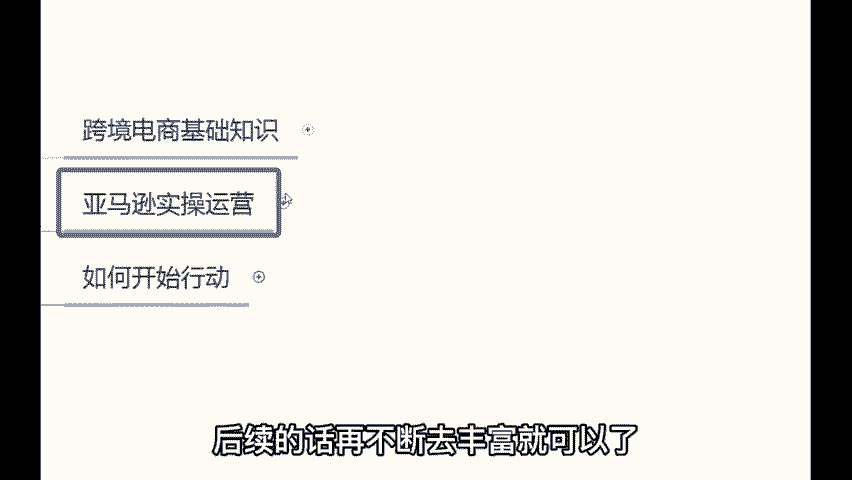

# 2024最新 亚马逊新手零基础入门实操课 共61节 ｜ 亚马逊跨境电商开店新手小白入门教程 运营广告投放思路打法技巧实操 选品爆款教学数据分析 新品产品上架调研 - P16：16、物流运输 - 牛郎爱侄女 - BV1bK24Y2EJ4

。

那么在运营的时候呢，还有一个问题需要解决的都是发货的问题了。发货的话怎么发呢？新手啊建议你们通过速卖通去采集ERP系统可以采集速卖通的产品，建议你们新手去采集速卖通的产品。

因为速卖通有很多产品是包邮的啊，在你熟练之后如何发货呢。熟练之后的话，发货方式可以走海运和空运两种形式。海运的话就叫做专线物流。像高翔云图第四方燕文澳洲宝，这些都属于专线物流公司，你们需要的各位同学。

哎，今天来听我课的各位同学，如果有需要的课后可以加上我的微信，到时候我可以给你们分享一下这些国际物流公司的联系方式啊，到时候可以帮你们对接一下啊。然后。😊，那么呃第二种走空运的话，就走国际快递了。

像联邦快递、天T这些啊，走空运价格稍微贵一点，但是速度也快啊。那那这就是这就是关于发货的一些问题啊。所以说做亚马逊的话呢，其实啊你们要掌握的知识点啊，就这些东西大概先有一个了解哈。

后续的话再不断的去丰富就可以了。😊。

