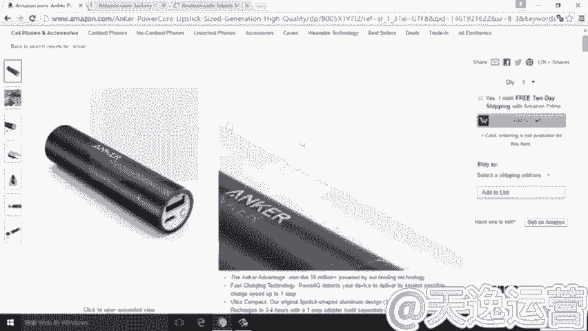
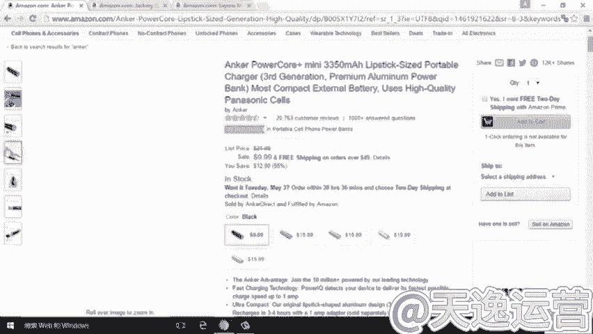
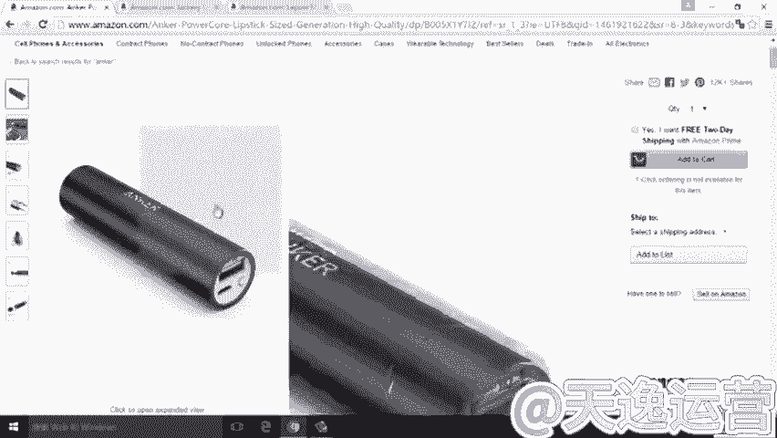
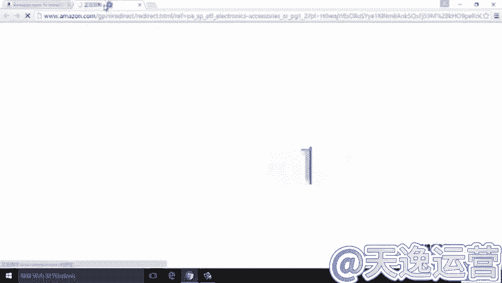
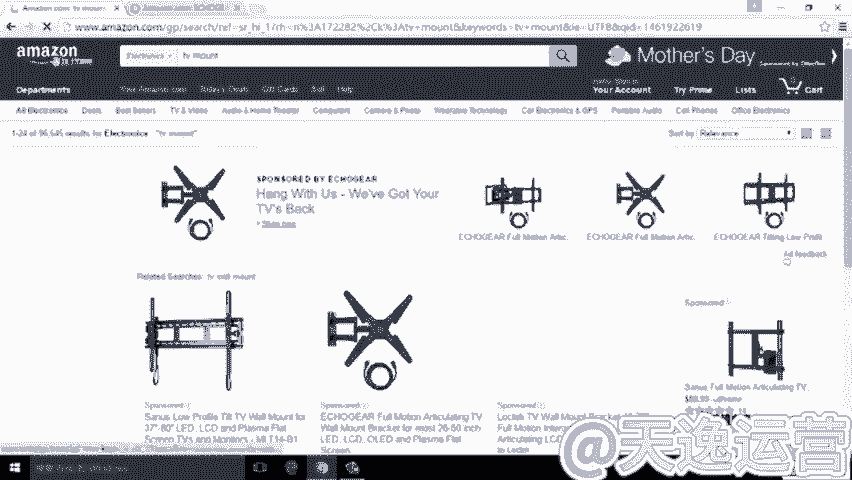

# 2024最新 亚马逊新手零基础入门实操课 共61节 ｜ 亚马逊跨境电商开店新手小白入门教程 运营广告投放思路打法技巧实操 选品爆款教学数据分析 新品产品上架调研 - P22：24.差异化的选品 - 牛郎爱侄女 - BV1bK24Y2EJ4

嗯，当然选错产品呢失效失败后的这种果断的舍气的行为呢，也同时是为了培养我们哎一在亚马逊的整个运营中的一种比较有效的好的做势的缝合。那就是我们做大事的时候呢不糊涂。小事的时候呢，我们可以不计较。

就这样呢才是我们一个明智的决策。OK关于这个产品趋势这一块的内容呢，我们就讲到这里。OK我们接着来讲关于选品呢，我们在前面有讲到选品的过程中，并不意味着我们选品的时候选择出来都能够取得成功。

或者说我们选品的过程中，都要和别人的卖家是一模一样的。那么在选品的过程中呢，我们可以做到哪些方面呢？第一点就是我们可以去做一个差异化的选品，或者说进行在同样的产品的时候，我们做一个差异化的销售。

那么具体来说，怎么去做差异化的选品呢？我们还同样的以pa bank移动电源这个产品为例，来举几个例子给大家一个有益的启发。现在呢？为了检便期间呢，我已经把搜术结果打开来了，我们来看一下。

安ker买移动电源做亚马逊的第一品牌，然后他的最。

最主打的这个产品就是这样一个搜索结果。那同时呢我还打开了另外一个搜索，另外两个搜索结果。一个是jackary。那么我们可以看jackary里边。产品同样是一个移动电源。接着。还有第三个产品。要跑。

我们这里。我们对于这三个产品做一个详细的去对比，来看一下能发现一些什么呢？对安克的产品我们已经非常熟悉非常熟悉了。那么在安克的产品的过程中，我们可以看到安克的产品以黑色为主调为主色调。那么。

同时呢安克产整个产品的展示相对来说比较简单大方，简洁大方。

然后在它最热卖的产品那边是以3350毫安一个非常小的一个产品，非常密令的一个移动电源。那么它的售价同样是从9。99，我们可以看到，从9。99到15。99这样一个售价，对吧？那么通常情况下。

对我们很多的中国买家往往会产生一种什么样的情况呢？就是说你卖什么，我就卖什么，我看到我身边的某个人卖什么卖成功了，我就去卖同样的产品。但这样的时这样的结果呢，往往就会造成一个同质化的竞争。

那么在我们看完安克，以及说如果有兴趣的话，你可以进入到安科的店铺里边去看安克整个店铺的所有产品系列，基本上来说是以黑色、白色为主打的颜色为主导的色料。整个产品呢也同样是。以剪辑大方的方式，要么是方的。

基本上说乙方的为一个主打的形状。所以说这是我们对安科的一个初步的了解。那如果说按照我们这个通常的思维，我也卖讲一个小的min你的移动电源，打上我自己的牌子去卖，是不是也能卖好呢？这种情况下呢，我觉得。

还是值得慎重思考的。因为这种结果往往是我们并不能销售的很好，或者说我们在销售很好的过程。技使我们在销售的过程中也会有更多的压力。因为什么呢？安克已经卖的很好。在我们前边排着。好，我们再看完安克的产品。

对安克的产品有一个初步的了解之后，我们接着来看一看jaary的产品。这客人的产品第一眼给我们的第一眼的印象是什么呢？也就是说。他选择了和安克的产品容量方面有明显区割的。

安克的3350毫安是一个很小容量的产品。那么jackary呢选择了12000毫安一个超大容量的产品。同时呢jackary并不是说因为。安克的那条产品卖的好，他就照着去做。

他是在产品的这个设计上也做了一些变更。他选择了双USB接口的。也就是说我同时可以给两个机器进行充电。那么。整个的价位也随着jaary的整个这个。它的产品的容量增大，然后它销售的价格也是比较高的。22。

99美金。那么22。99美金对于这个产品来说呃，价格是高于安克的。但同时呢。它的这个因为容量的不同。和安克的错开了一个竞争的层次。也就是说，如果你仅仅是想要一个小容量的移动电源，okK你可以买安克的。

但是你觉得安克的移动电源太小，解决不了你的需求的情况下，那么你可以看一看我jaary的这个产品。同时呢。除了产品的容量大小方面之外呢，我们需要去注意jackary在颜色上和an克做了一个明显的区割。

那么an可以。黑色白色为主打颜色ja果断的去选择了一个什么颜色呀？非常亮眼的橙色。那么从这个层面上，我们可以考量一点啊。橙色面对的一个受众群体会是怎样的呢？那么橙色一定说。

如果说安科的黑色、白色是对于适用的群体更多的更大的一个受众群体是。40岁左右的比较成功的或者比较稳重的这种商务人士的话，那么jaary的成色很明显的是面对一个。刚刚工作一两年两三年。

或者说刚刚进入工作的这样一个年轻的商务群体。当然也包括可能说年轻的大学生这一组了。所以说那么这样的话，最直接的对这个年轻的群体，我不需要这个。黑白的我觉得黑色白色太冷，太枯燥无味。

OK我去选择一个橙色的移动电源。那么这时候自然而然的就选择了jaque这样一个品牌。对吧。当然如果你详细看的话，那么jaary的下边是有在整个产品下面是有一个视频的播放。

它的你可以在视频的广告中也会发现jaary整个销售的这个整个整队的受众群体，就恰恰是针对于这种刚刚工作的年轻群体。我们接着来看一下这个leport。看到这个产品的时候，不知道大姐有一个什么样的感觉呢。

我的感觉是很明显的。那么。同意。我的感觉是，同样的每一顿电源呢，leop的群体会是谁呢？如果说安克面对的是。成熟的商务人士，杰克瑞面对的是新锐的商务商务人士。那么勒魄的面对的，我们可以一目了然的知道。

这是典型的一种小清新的。他选择了一个浅绿色的鹅卵石形状的一个移动电员，他面对的就是典型的十几岁二十来岁的一个小清新的群体。这些孩群体呢说不定还正在上学的过程中。那么。至于它具体的这个容量、电池的容量。

其他的功能性的东西呢，我们在此就不再讲解了。在这里紧接是给大家做一个分析，分析的是什么呢？就是说在这个选择的过程中。他们同样是移动电源，但是在们卖移动电源的过程中呢，进行了一个选品的时候。

做了一个差异化的选品，最终形成了彼此之间的一个明显的区割，对吧？那么这也告诉我们，当我们在进行选品的过程中，即便是我们在销售同样的产品的时候，也不要把我们的产品局限于你卖什么，我就也卖什么。

这样的情况呢可能会导致我们最后竞争非常白激化的。那么从这anorjaary和lopo这三个。选品的例子可以告诉我们，我们即使在即便在买同一类产品的时候，我们也可以达到一个共同的生存。

相互的互补这样一个作用。那么我们在前面讲解了anor jackarylepo这三个品牌的选品，是属于差异化的选品。那么同样的对于我们很多的卖家来说，可能有些卖家说，我并不能做到差异化的选品。

okK我们回到这个。以kitchen timer这样一个产品来为例。那么当你不能做到差异化卷品的时候。那我们可以考虑另外一个问题，我们能否做到差异化的销售呢？同步化的选品，差异化的销售。

那么这有可能也是给我们带来一个新的思路。我们以catch他们这样一个产品为例来大家看一下。在这个搜索结果中，我们可以看到。这样一条产品是卖的比较好的，因为有3000多个review，对吧？

OK我们把这一条产品先记录下来。同时呢我们再往下看，在我们整个页面里面，我们其实可以发现什么。这款产品这么多的买家其实买的是同样的产品，但是同样的产品的同时，不同样的销售方式，我们点开。这条产品ok。

那么在这条产品里边，我们可以看到。9。97美金的销售金额，单个的一个产品卖9。97美金。那么。在这条listing里边，我们可以看到两个产品满12。99美金。在这里我想问大家一下，那么这两条产品你会。

觉得哪一条产品的利润更大一些呢？OK我给大家做一个简单的微信。这个产品的拿货价格呢大概是在7块钱，7到8块钱人民币。然后呢，单个产品的重量大概是在50到60克这样一个重量。

那么这样一个重量和这样一个成这个采购的成本对比的情况下，129。97美金在扣除了在扣除了这个亚马逊的各项费用之后呢，它的利润。并没有。12。99美金2P4的利润高。详细的价格呢。

我在这里就不想不去讲解了。有兴趣的学生这个有兴趣的同学呢可以去做一个。自我的搜索来看来这个根据各方面的价格核算来做一个对比。那么12。99美金的。价格会利润12。99美金的利润空间呢会大于9。

99的利润空间。这是作为listing来说。OK那我们再回到搜索结果的页面来看，当你输入kitch timer这样一个搜索结果的情况下，你的listing是这样排序的。你准备买这样一款产品。

你稍微往下一拉会看些什么呢？你一个展品满9点多买亲。也就说给我的印象可能是10美金我买了这样一个产品。而我同时可以看到，我只需要花12。99美金买了两个产品。这时候在用户的心里会形成一个直观的感觉。

直观的感觉是什么呢？我仅仅多花了两美金，我就可以多得到一个产品。这时候你觉得。这个消费者他会选择怎样的一个产品？很明显的，有相当一部分的消费者会选择。两个产品进行购买。那么这样的购买。

也就是给我们一个其葩意影是什么呢？对于我们在销售同质化的产品的情况下，如果我们的产品特性决定了这个产品是属于易耗品，或者是属于日常必需用品，在这种情况下，我们在销售的时候可以对价格做一个。

对这个销售的方式做一个变更。也就是说同质化的选品的情况下，我进行一个差异化的产品销售，同样可以给我们在整个销售的过程中带来。一个新的销售武径，然后能让我们抢占更多的一些消费群体。那么在选品的过程中呢。

我们还会面对另外一种情况是什么呢？同质化的选品，同质化的销售。因为这个产品可能产品的属性决定了它没有办法去做一些差异化的销售。像我前面刚刚讲到的关于可他们这个产品。因为产品的单价非常低。

所以说我可以两个产品在捆绑的在一起的做一个pack克来进行销售。那么对于像我现在我们可以在桌面上看到的TVmo这样一个产品。那么电视价电视架这个产品，我们怎么去做一个你说你单个销售，我去两个销售。

这样的话可能并不能得到一个有效的效果。因为这个产品的属性决定了。一家一户可能进京用一个就够了。在这种情况下，我们该怎样去销售呢？那么对于这种大件的产品，我们如果做一个选品方向的话。

我们可以同样方式就是说我可以进行的是同质化的选品，优质化的销售。怎么叫同质化的产品，优质化的销售呢？这就是。我们选择和你相同的基本相同的产品，然后我进行更优质化的一些这个销售。也就是说在这种过程中。

就要求我们对产品的品质各方面。listing的整体打造做一些比较。更优的处理。比如说。我们在搜索TVmount这样一个搜索结果的时候，会出现9万个搜索结果。那产品我们可能会觉得竞争是非常激烈的对吧？

但实际上来说，这个产品我们详细去看整个review的情况的时候，我们会知道这个产品的销量是非常大的。在美国市场销量是非常大的。因为。

这个产品重量比较重，所以往往并不能进入到我们一些买家的一并不能进入到我们一些卖家的这种。销售的事野。但是这个产品一旦你作为一个选品方向的时候呢，我们就可以去做个简单的处理。

就是说OK我既然因为我们可以看一下这产品一般情况下是属于通用型的，26寸到50寸37寸到70寸。那么意味着什么呢？意味着这类的产品覆盖面是非常广的，那么可以看到。在37寸到550寸之间的交叉。

这两个电视架我都可以进都可以使用的对吧？所以说它的交叉比较大，意味着你想选择的产品品类就较少，你不能去在产品上明显的去和你的竞争对手做一个区割，那OK那我就在产品品质方面。

listing的优化方面去做一个明显的区割。具体来说呢，因为我们讲课的时间有限。在这里我不能详细的学一个参数。那么我只想说明一点，同质化产品，同类化的产品，优质化的销售是要求我们在产品品质方面的把握。

也就是说我可能要求我们在选品中需要介入到这样一个产品。的采购。我举个简单的例子，也就是说有这么一个卖家呢，他在选择这个产品的时候，他把。TVmount做一个选品方向之后。

他把我们现在可以看到的这些搜索结果里边。卖的比较好的买家逐个产品进行了选择，进行了这个购买。购买回去之后把所有的产品摆在一起，逐个的去做一个对比。对比完之后。

结合我们前边讲到的每个产品的review的评价情况，里边提到的问题点做一个整理处理之后综合下来之后，再结合自己对产品的感受，把产品的优劣点逐条的罗列出来，然后把产品的优点体现的更明显，把产品的缺点。

总结出来，然后联系这个供应商这边，联系他登厂这边，要求工厂针对现有市场上现有的这些产品的纹体检做了一些改善。改善完之后。他对产品做了一个等于是产品已经做了进行了一个很好的升级。升级的过程中。

