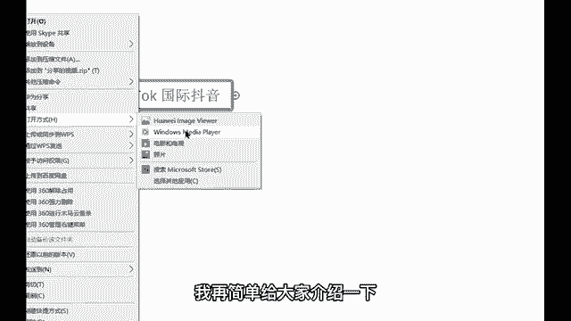
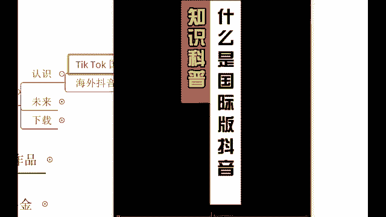
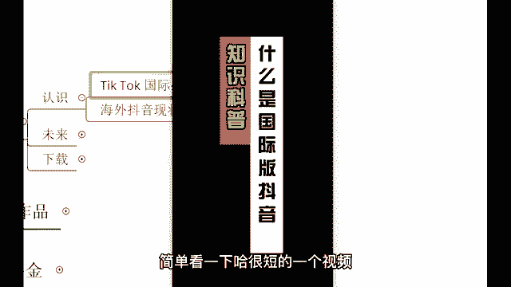
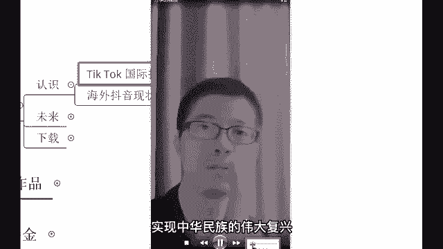
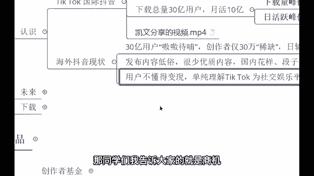

# 2024最新TikTok新手零基础入门实操课 共30节 ｜ TikTok跨境电商开店新手小白入门教程 运营广告投放思路打法技巧实操 选品爆款教学数据分析 - P19：认识tiktok - 亚马逊运营姑娘 - BV1c21yYJEeJ

首先咱们这么多零接础的同学，那我们就先来认识一下国际抖音。😊，国际抖音，你读一遍，你就会发现这个和我们国内的抖音啊，它很多相似之处也是抖音。

那其实国际抖音它呢老板他这家公司的老板叫做张一鸣和我们国内抖音的老板是同一个。而且的话呢人家公司也是同一个叫做字节跳动。那这个国际抖音，他面对的是咱们中国这一个国家。但是国际抖音，他面对的是海外的用户。

他不对咱们中国用户开放哈。而且呢这个国际抖音啊，人家的发展会非常非常的好。来，我们先看一个视频哈。😊，我们看一个视频，这样的话呢应该会对国际抖音有一个简单的一个了解啊。看完之后呢。

我再简单给大家介绍一下这个知识点就过了啊。因为国际抖音没有什么很多要分享的。😊。

来科普什么是国际抖音？简单看一下哈，很短的一个视频。😊。

🎼一版抖音国际版抖音就是tktok说人话就是国内版抖音的海外版，所以也成为海外版抖音或国外版抖音视频有点长，先点赞保存。它前身是美国一家音乐公司music类。2017年被直接跳动收购。

2018年正式命名为tktok。中国唯一一款走出国门受到外国人追捧的手机应用，目前，全球应用安装量30亿，月活用户10亿，已覆盖全球多达150个国家，涵盖轻重中语言。

目前已长期占据全球免费应用网榜首的位置。🎼所以不懂英文的你也照样可以运营好ttok。如此强大的应用，让我们普通人也可以通过视频带货、直播带货，将产品销往全球任何国家。

还可以将你的粉丝导流到你的whatsappline list。🎼facebookyoutube，建立起强大的全球资讯网络，甚至还可以向全球传播中华文化，讲好中国故事，展示中国制造。

实现中华民族的伟大复兴。

🎼我发现好多小伙伴还不了解国际版抖音、国际版。嗯好，行，那像这个国际抖音的话呢，我们就通过这么一个简短的视频啊来认识一下，好吧，再者我就讲三个点啊，三个点。😊，第一，国际抖音它目前的话呢是世界第一啊。

刚刚也有同学说到了哈这个什么世界啊，世界了啊，它是什么世界呢？它是世界第一的一个。😊，下载量同学们，国际抖音目前的话呢是全世界下载量最高的APP。全世界哈，而且的话呢经过美国媒体调查。

国际抖音的年访年度访问量是全球第一啊，有同学说不知道怎么下载啊，这个不用着急，待会儿的话呢，我会讲到啊，我们的话呢得要先了解一下这个平台，好吧，那现在的时代啊不一样了。现在的时代是Z时代。

时代呢它在不断的发生的这个变化。同学们，如果说让你现在去看以前的报纸去了解一则新闻，你愿意吗？你会觉得非常繁琐，你会觉得这个东西，我通过一个视频是吧？就能够说了解的一清二楚。😊。

这也是为什么在我们国内像短视频平台，它能够说发展这么迅速的原因，现在的时代变了。所以说外国人也是一样的哈。他们的话呢了解一则新闻也是通过这样的一个短视频来做了个了解的。

所以说这个国际抖音他一经出海就受到了很多外国人的一个关注，也非常喜欢去玩这样的一个平台，目前的话呢下载量是全球第一的哈。因为海外还没有一款短视频平台，这是唯一一款那种唯一一款啊，各位非常棒的哈。

那再者的话呢，国际抖音，人家发展会更加好一些。目前的话呢已经是在全球150多个国家来进行了一个推广。😊，对，进行了一个推广。150多个国家哈。这个东西的话呢都是这个有真凭实据的啊。

金融界抖音、海外版已覆盖150多个国家和地区关注相呃关注相关概念股啊，这个后面的话呢就不用看了啊，看这句话是吧？已经覆盖了150多个国家。同学们这个流量这个市场它是非常非常的大的哈。目前的话呢。

人家这个平台下载总量已经是超过了30亿，月活10个亿。啊，它的一个预计啊它的一个峰值预估峰值下载量能够高达45亿。咱们全球总人口也就才70多个亿是吧？它就占了一半多。

是不是日活的峰值的话呢预估能够达到20亿。现在的话呢还是在不断的去做了一个推广平台推广这样的一个平台啊，发展值特别特别的快的哈，非常迅猛。那像这个国际抖音啊，我就不花太多时间的话呢去介绍。😊。

话呢他数据都是真实的，你在哪都是能够看得到的啊，之前被打压过。对的，反而没有打压住。哎，现在的话呢反而成为了他的一个助力啊，助拦剂。很多在以前没有打压之前哈，很多人连这个国际抖音，他是什么都不知道。

结果一打压哎引起了很多人的一个注意，知道吧？结果的话呢这个嗯特朗普政府把这个是吧啊诉讼撤销了之后，后续的话呢越来越多的人关注到了这个国际抖音，反而成为了平台的助栏剂，现在的话呢特别火啊，好。

那我们来讲一下他现在的情况，目前的话呢，这个平台30亿的用户在这里嗷嗷待哺啊，嗷嗷待哺。各位因为他的创作者他只有30万，他每天呢只能够说输出50万的作品。你想一下，这50万的作品。

他怎么能够满足这30亿的用户呢？是不是？所以说在后续的话呢，这里。😊，变现渠道有一个叫做创作者基金。哎，这个的话呢是和这个创作者联系到一块的哈，这个数据我们就先简简单的认识一下。

后面会给大家讲到创作者基金。目前的话呢，这50万的作品，人家发布的内容很低俗。😊，你看不到任何的一些亮点。而且的话呢很少优质内容。你会发现等到你们下载好了，你们去玩。

你就会发现曾经我们在国内玩的很好的一些段子啊，呃，这个很火的段子梗或者说一些花样，哎，我们已经玩了快一两年了，已经玩烂了，现在才在海外才火起来，这就是信息差呀。各位啊，他们觉得很有趣。

殊不知我们早就玩腻了啊，而且的话呢，现如今的一个国际抖音用户啊，国际抖音的创作者，他不知道如何通过这个平台来进行一个变现，单纯理解为这个平台是社交娱乐平台，这就和我们18年的时候是一模一样的。

18年的我们也是一样的。那么18年的时候我们的话呢玩这个国内抖音不也是很单纯吗？没有想到任何一个变现的一个玩法，是吧？哎，国内抖音赚钱。😊，啊什么的都很少很少的人去做，是不是？那同学们。

我告诉大家的就是商机它就在这样的一句话里面。😡。

