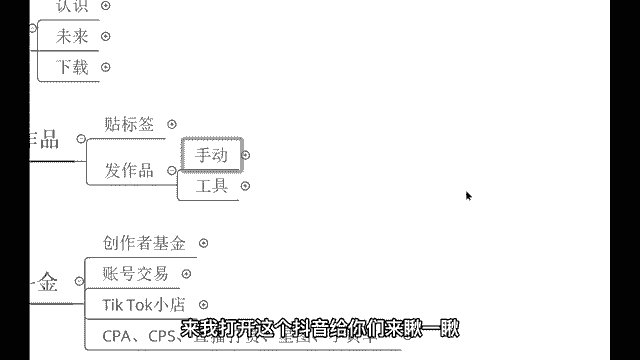
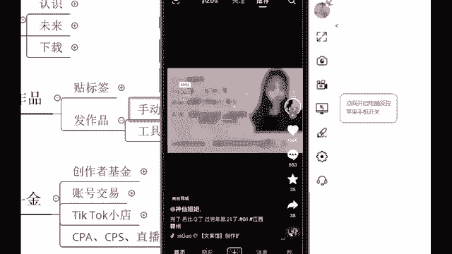
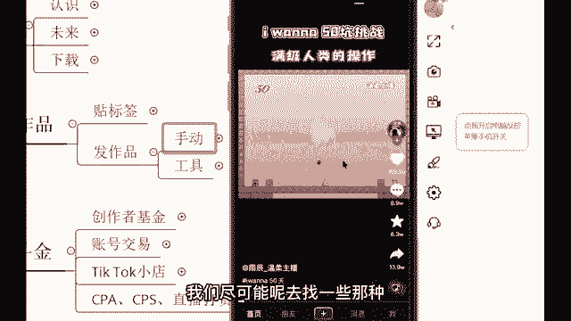
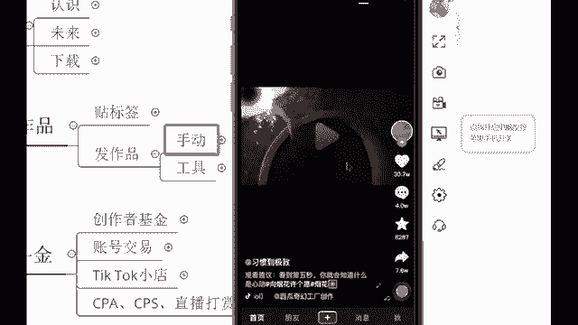
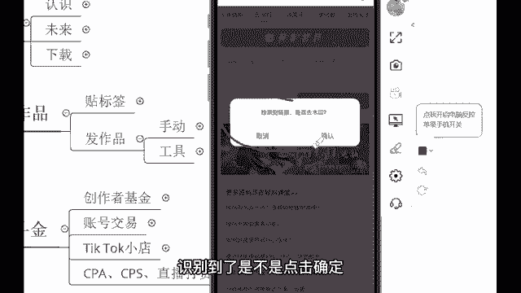
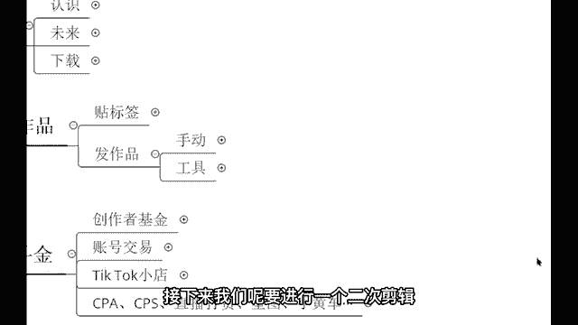

# 2024最新TikTok新手零基础入门实操课 共30节 ｜ TikTok跨境电商开店新手小白入门教程 运营广告投放思路打法技巧实操 选品爆款教学数据分析 - P27：手动搬运作品教程1 - 亚马逊运营姑娘 - BV1c21yYJEeJ

接下来就呃讲一下搬运吧。呃原创的话呢这个知识点呃一时半会儿也可能会讲不完。我讲一下这个搬运，好吧，搬运的话呢有手动，也有用工具，工具的话呢就是批量会更快。手动呢就是一部手机啊，一个一个来啊。

我先问大家一个东西哈，你们会不会去水印。😊，声音很小吗？你们会不会去去水印来会的，你打个会。😡，不会你打个不会。😡，啊，你不会的话呢，打个不会。😡，嗯。啊，也有不会的同学啊，但是的话呢被屏蔽了啊。😊。

会啥都会啥都会是吧，就光赚钱不会啊，会一点啊。😊，不会不会。嗯，那不会的同学蛮多的，这样啊呃我花一两分钟给你们讲一下这个去水印，好吧。😊，因为我们的话呢要这个进行一个发作品，那素材怎么来呢？

素材的话呢就是我们需要去做搬运。😡，啊，我们就是要去做一个搬运来，我给大家来去讲一下这个搬运。好吧，我们先来去找这个素材。打开抖音、快手、火山、微视都可以，短视频平台都OK的啊。都OK用什么剪辑剪映。

😡，剪映就够了啊，我们用剪印就行了。😡，来，我打开这个抖音给你们来瞅一瞅。

完了。

🎼大地去我，不是未觉的艰难追缩。

昨天看到小计了。😊，🎼那个声音大是吧，我放小一点啊。😡，🎼，所呼叫的顺风车司机。🎼那你呢？给成一波气。😊，来，我们随便找一个视频素材啊，我们随便找一个视频素材来进行一个去水印。

并且的话呢来进行一个二次剪辑。然后呢发布到海外抖音啊，我这个教你们怎么玩，好吧。😊。

帮你弟弟过年有个产品，你看。🎼哦，这个要和大家来说一下哈，咱们的话呢去找这样的一个素材，不要去找那种有对白的。😊，记得哈不要去找那种有对白的，因为外国人他听不懂，我们尽可能呢去找一些那种是没有对白的啊。

你放假第一天回家。😡。

🎼海个啥子用吃。😊，我中な。🎼嗯，这个我来搜索一下吧啊。😊。

我来搜索一下这个搜索。😊。

嗯，茶杯犬背后的真相。这个视频的话呢，这个账号啊是我之前的话呢去做搬运的那个茶杯犬的一个账号。你们还记得吗？刚刚的话呢给你们看到了哈，我再往下滑的话呢，就能划得到我搬运的那个视频。

我蛮喜欢搬运它的这个视频的哈，因为这个视频。😊，是吧那个外国人很喜欢，就不拿外国人来讲，我们自己国内的人也非常喜欢这样的一个宠物，是不是很可爱是吧？好，那我们来看一下啊。😊。

我们比如啊我们想要去搬运这个，我们先来看一下视频。😡，🎼风遇见的象起了下课铃，已经约好在操场等你，夏天真的是闷的去吃草莓冰淇淋。😊，好，那我们的话呢就拿这个视频来动手哈，教大家怎么玩。

首先呃不会去水印的同学看到哈，这就是我们抖音的一个页面。我们的话呢点击这个分享按钮，看到没有？😊，分享按钮哎，这里点了这个分享按钮之后，来这里人家不让我们搬运是吧？人家不让我们去保存的那个相册。

我们这个视频是保存不下来的那接下来怎么办？把这个页面往右滑，这里呢有一个复制链接，看到了吧？点击复制链接。😊，复制链接内容复制成功。内容复制成功之后，那接下来我们打开自己的微信。打开自己的微信。啊。

微信你们都有啊，打开微信之后的话呢，搜索一个小程序，这个小程序叫做青抖。😡。

边度。巨嘴硬。直接在微信上面去搜啊。😡，微信上面去搜，然后的话呢把这些广告关掉，这里有一个去水印，点进去点进去之后的话呢，人家会自动识别。😡，识别到了是不是点击确定。😡。

点击确定之后，这个视频啊，它就解析好了，左上角右下角都没有这样的一个都没有水印的哈。😊，啊，声音还是很大吗？我已经放的很小了哈。😊，我自己都听不到这个声音了。好，那咱们的话呢来看一下这个视频。😊。

🎼风雨灯的天气越来下河里，已经约好在操场等，夏天真的是。😊，现在听这个视频的声音会大吗？你看没有水印，是不是左上角右下角都没有水印啊，而且的话呢是非常非常的高清，这个不需要收费的哈。

这个是免费的啊免费的嗯。😊，有点大，其他同学呢？啊，我这个已经是调调不了了哈。好，那像这个视频，我们已经是把这个视呃水印去了，去了之后来，我们的话呢再保存到相册，看到没有？保存到相册。😊，保存好了之后。

它就会出现到我们那个相册里面。接下来我们呢要进行一个二次剪辑。

