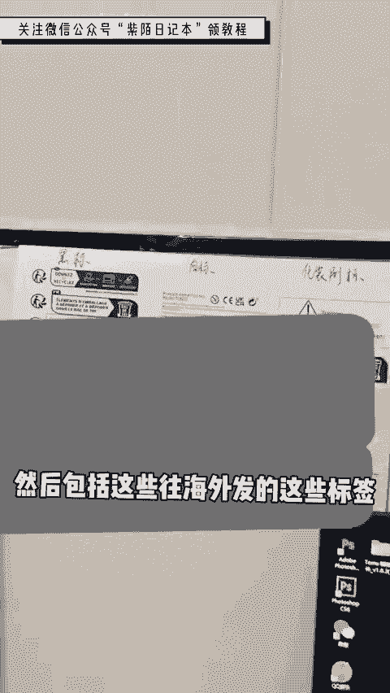
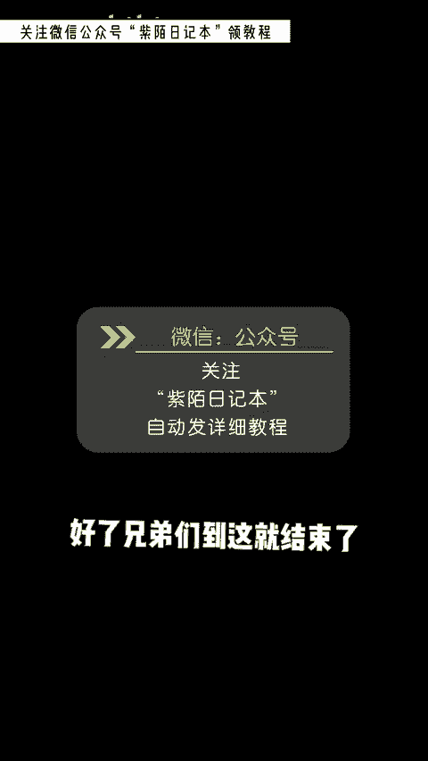
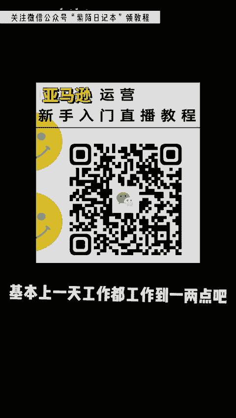

# 2024最新TikTok新手零基础入门实操课 共30节 ｜ TikTok跨境电商开店新手小白入门教程 运营广告投放思路打法技巧实操 选品爆款教学数据分析 - P2：跨境电商 - 亚马逊运营姑娘 - BV1c21yYJEeJ

🎼在家里做电商，一天都在干什么？一般我都是中午起床嘛，中午起床来之后，第一件就是发货。它这个平台跟国内的还不一样。它是9点跟中午的12点，只有这两个时间可以加入发货台，你加入了你才可以发货。

那你要是加入不了的话，就只能等到明天发了，勤快一点的，你就今天把货准备好，加入发货台之后，第二件事我就把门口的快递给取进来。因为我在义乌嘛，所以说基本上货到的很快，我看哪个品牌卖完了，或者说是比较好卖。

我就立马上架。然后把这个品质全部都买到家里边去，在家里边打包发货。你像我最近啊我这个店铺也是刚做了一个月，也是刚刚有起色。然后家里边的这个打印纸啊，都不够用了。我又搁那个什么淘宝上呀。

买了好几卷加起来差不多有五六千卷了，五六千卷，也就是嗯五六千单嘛，这些纸啊，我都是嗯备的很多的。因为也不是很贵嘛，所以多备一点，主要是备货这方。🎼我个人的习惯就是比如说平台让我备十单。

那么我自己就卖1一单就好了，留一单在家里边当样品。我卖的这些品都是比较小的小玩意，然后装这种小袋子，就刚刚好，在打包之前要做好这些准备工作的，要塞这个说明书，这个说明书是给老外看的，有美国的呀。

英国的法国的什么都有。然后我们都是现在自己打印，现在基本上都是给自己出租屋打包嘛，然后呢，房间也是比较小，每天都是弯着腰打包，整个人打时间久了也会累的。然后我就没事干，会喜欢逗逗猫玩，给小猫玩一下。

包裹整完之后啊，咱们要装个大箱子给它封起来，你要往广东发，广东那边再发给老外，还是这样的一个流程，今天不多一共差不多有小200单吧。这每天如果说你都有小200单，那其实还挺厉害的。

我也就这两天比较单子多一点，打完包之后基本上就去吃饭。🎼回来之后就看看电脑的数据，因为这是海外平台嘛，它有些东西比较多的，我基本上就写这个墙壁上用纸记一下，这些就是店铺从零到一的运营逻辑。

然后包括这些往海外发的这些标签，成本利润啊，对吧？你没有这些标签，它是不让你发货的。休息完之后啊，我就开始做资质了。这些资质就是你上了新品的，他才需要去做这些东西啊，你不做的话，呃。

比如说你没做之前这个平台，它只它是只让你买一个国家的，你做了之后你就可以买100个国家是这么一个道理。这样的话，它整体的流量会比较大一点，对不对？像资质做完之后啊，我就开始选品了，选品的话。

你就看哪个花哪个绿，哎，你就选哪个就行了。它就这样的品牌好卖。老外就喜欢红红绿绿的嘛。你像这个品啊，咱们进去之后就看一看它的主图，第二张第三张具体长什么样，看完之后我们就可以去一68上找一下。

能不能做有没有利润，看一下之后啊，就这个玩意儿，他在一6。

🎼发进货1块钱一根，在老外这儿呃卖18根。12块钱。🎼现在老外的钱值钱嘛，我们主要赚的是汇率差，他的一块等于中国人民币7块嘛。就他这个在平台上卖十几块，对于老外来说是什么概念啊？

就跟我们自己在自己国内一样买两瓶水的一个价钱啊。好了，兄弟们到这就结束了，基本上一天工作都工作到一两点吧，晚上一两点，感谢大伙们的观看啊，拜拜。

记得关注再走哦。😊。