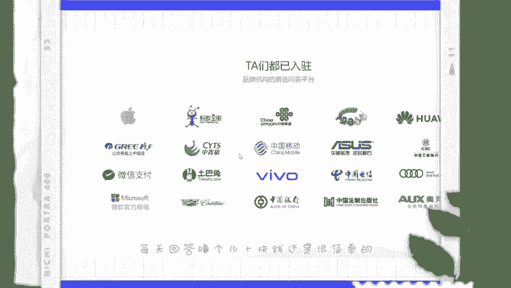
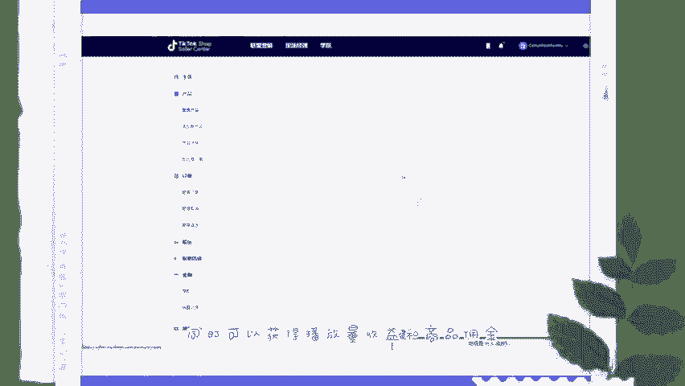

# 2024最新TikTok新手零基础入门实操课 共30节 ｜ TikTok跨境电商开店新手小白入门教程 运营广告投放思路打法技巧实操 选品爆款教学数据分析 - P3：TK副业 - 亚马逊运营姑娘 - BV1c21yYJEeJ

🎼。大家好，今天呢又来给大家分享副业赚钱的方法。有很多人呢都是在网上找副业，但是呢又总担心被骗踩坑。今天呢就给大家整理了7个不用交押金就可以挣钱的平台。最后一个呢是最推荐的，感兴趣的话就一起往下看吧。

第一个时间财富网。国内的任务网站代表之一，门槛呢比较低，只要有一技之长，就可以在上面找到让你赚钱的任务，比如说海报设计、修图写软文软件编程等等。类似的呢还有猪八戒网。第二个拆书稿可以编读书边赚钱。

大概的任务呢就是把一本书按照主题分为几个板块，然后呢提炼出精华的部分，一般一本书呢可以分为10个文章左右。一般的稿费是在100到1万之间。不过这个的话呢花的时间肯定要多一些。

因为你要花时间和精力去构思书稿件，投稿的平台呢有懂行读书十点读书樊登读书等等。第三个问卷调查类，这一类呢无门槛，任务轻松，只需要点点鼠标就可以完成网站上面的调查问卷或者是调查任务。

就可以获得相对应的报酬。平台呢有第一调查网。第四个百度之道合伙人，相对一些没有后期保证的平台做副业百度。😊。

到合伙人呢不仅可以答题赚钱，而且非常的安全，按照回答来赚钱，每次回答审核通过都是当场结算的。一个回答的收入大概是1点8元到3元不等。熟练以后呢，每天回答赚个几10块钱还是很简单的。第五个自由人写作平台。

网页呢页面清晰，任务比较多，几乎各个技能都可以在这个平台上面派上用场，例如说设计修图拍照文案策划域名等等。第六个云客服，一个是阿里巴八的云客服，一个是蚂蚁云客服，这两个呢都是阿里旗下提供的副业岗位。

每个月呢都会招几百个人，一个小时10到15块钱不等，根据自己的时间来选择工作的时间段，申请的方法呢也很简单，只需要关注他们的微博账号在线申请就可以了。第七个字第七个就是海外版的抖音。

用户是国内抖音的好几倍，市场是真的大。而且现在正在扶持期发视频有播放量就有收益，主要要剪辑一些好物分享的视频，到精选联盟里面找商品，重点选择一些高佣金的爆款产品。这样由老外下单了。

商家可以帮我们一件代发。同时可以获得播放量收益和商品佣金。像这种类型的兼职呢我也是非。😊。

推荐你们去做的，可以给大家看一下tktok的一个后台，一个月也好好几万收益了，每天都是在稳定1000以上的一个收益。但是需要一些学习的教程。那这个我也准备好了，想要开始，但是不知道怎么做的。

不要慌三连并在下方扣个感谢，我会给你们分享一份tktok的实操直播。最后呢总结一下有人在哪里花钱就有人在哪里挣钱。这就是我们找兼职的王道之路啊。😊，Yeah。

