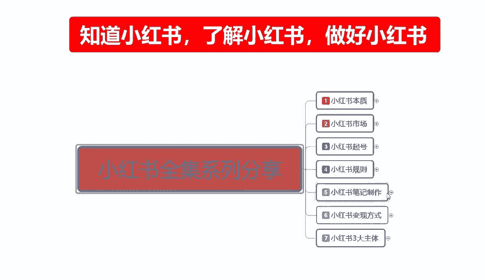
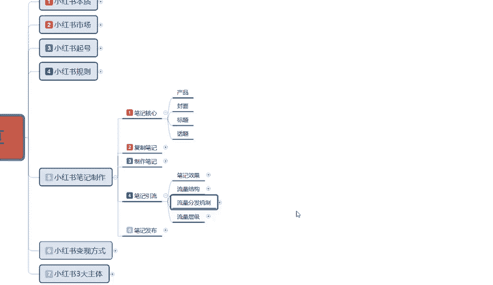

# 2024版小红书体运营教程  全B站最良心的小红书开店运营高阶教程合集！小红书体开店 起号真的快，赶快点赞收藏起来 - P32：29、小红书笔记引流：平台流量分发机制 - 惠格姆 - BV1cSppeEETv

大家好，这一期呢给大家分享的是小红书全集系列，第五大课时的一个笔记流量。

这节课的话主要是给大家讲解一下啊，小红书它的一个整体的流量激发，流量分发机制里面的一个算法啊，让大家了解一下，小红书他通过什么样的一个形式，来对我们的笔记进行流量分流，它是通过什么方式来计算评分。

获得排名来进行排序啊，提高我们整体的一个笔记的展示量，来我们了解一下啊，流量分发机制，我们在这里的话，其实可以把它简称S1CCES啊，也就是说是点赞收藏转发评论加关注，他们都是有单独的评分计算系统。

这套评分分析计算系统的话，你们去网上搜索一下，基本上都知道啊，也就在这个里面的话，这个是基础评分啊，下面是点击率，互动率，完播率和互动值，它们又是不一样的，我们先首先了解一下什么是基础评分。

就是小红书页面显示的话，它是20个的笔记进行一次更新，刷新它和抖音不一样，抖音的话是一下一条一下一条，你看就看不看就不看对吧，小红书是一下显示四个产品，四个产品往下面拉是显示20个产品。

20个产品里面的话，大概有两件左右的一个笔记推广，这个是人家付费的啊，就相当于淘宝的一个直通车，类似这种付费的一个机制，那么在这个里面的话，它有一个排名就是第一名到第20名，你再往下面拉。

它就是第二页进行更新，也就是后20名，20名到40名，再往下一直到100名，你再往下也是100名往后啊，但是他又是额外进行了一个翻篇，也就是说我们要想要做的就是1~20名之间，你排在哪一个页面。

你排在第一名，第二名，第三名，第四名还是第五名，他他的一个计算分数呢，就是通过这个cs综合评分进行定位，单篇笔记点赞一分，收藏一分，转发四分，评论十分关注八分，一套程序下来的话是多少分呢，是18分。

就是一个账号对你的产品非常满意，又点赞，又收藏，又转发，又评论，又关注是18分，他通过这种呃综合的一个分数，来对我们产品进行的一个技术排名，整体来说啊就是小红书额，这里给大家打个比方，就是小红书。

我们发布一篇笔记以后啊，他会被系统拆分为多个标签，然后再推送给最近有同样内容喜好的一个用户，一篇笔记的话，就是说他不管是图片也好，还是文案也好，都会被系统按照标签，就是我们前期账号设定的一个标签啊。

去进行区别和应该说是进行区分啊，把你的账号内容根据你所发布的内容进行结合，结合以后，然后根据你所发的一个，我们前期可能你选择的是美妆，美食啊，体育运动等等里面选择的三个区分进行划分。

然后你笔记发送的数据的话，有基础展示1000，他就会给你1000的一个技术曝光量，1000的技术曝光量里面的话，它就会涉及到点击，点进去以后观看了你的作品，然后就会出现这个CES评分系统。

这个评分系统就会达到点赞一分，收藏一分，转发四分，评论四分，关注八分，按照这个机制，然后再给你显示下一阶段，也就是下一次推广，因为它的推广流程的话，他不是一次性直接给你，比方说一篇笔记给你发出去。

你有基础的1000展示，第一次发放是400，第二次发放是300，第三次发放是500或200，第四次发光是100，他会给你进行几波推流，懂我意思吧，这几波推流的话，他就是根据你前面这些CES点赞评分。

关注数量来进行的，但是前提要有点击率，点击率从什么地方来，就是从我们的一个产品封面来，产品标题来对吧，看了产品封面的一个标题，看了封面，看了标题，对这个内容感兴趣，点击进去，点击进去以后，对内容感兴趣。

点赞收藏转发评论，关注，这几步全部做下来，他才有18分，当你累积到的一个平均分数，超过你同时推广的这20篇笔记的时候，那那么他就会给你分流，什么叫声牛呢，就是你现在可能话是400的一个展示量。

你的点击率达到了15%以上，13%以上，20%以上，他会给你增加流量扶持，你之前展示是400，第一次展示400，没有达到10%几的一个点击率，他就会给你换一个渠道，因为刚开始我们推广的话。

它是三个渠道啊，我也就是我们所选的三个页面呃，应该是三个兴趣，服装美食啊啊家具啊，运动这三个兴趣里面进行轮番推广，第一波推广结束以后的话，你的展示点击率没有达到标，第二波推广流量减少，但是点击率达标。

他就会给你进行第三波推广，而且第三波推广的数据的话，它会翻倍，就是额外给你增加染色率，因为你在同类目的同，应该说是同类型的一个前提下，得到了系统的认可，系统就会给你强制性推流准备，第二波推流。

如果说你做不到这个点击率，那么他就没有第二波推流，那点进都做不到，那你的评分肯定也就不够了，评分不够的前提下，那么你这个笔记最多也就给你推广三天，这个就是流量的整体分发机制。

这个里面的话首先注意点击率啊，因为你没有点击的话，你就没有CES这个点赞评分之类的东西，后面的话就是互动率，完播率和互动值，整体来说就说我们无论是数据指标怎么变化，就是说它整体的一个内容的核心算法啊。

还是考察笔记带来的一个粉丝交互行为，这个就是最核心的啊，小红书笔记的一个流量分发机子，然后在这个里面的话，他因为粉丝啊在互动率方面啊，就是我们账号本人就是相当于我，我和你们互动啊。

行为直接反映了笔记的一个内容质量，就是我你和我互动越多，我和你互动越多，互动率做起来以后，即便是粉丝不多的达人，或者说我们粉丝不多的一个账号，在得到优质分的情况下，就上面这些评分啊。

这一篇笔记也会被平台的系统，推荐给更多的用户，形成阶梯式的一个算法啊，逐步推荐，就比方说你现在是我们刚上来是100，那跟我互动的人越多，点击先首先是点击进来，点击进来以后跟我互动的人越多。

观看完我笔记内容的人越多，我和互用户的一个互动值越高，最后通过这一综合评分，然后计算我们的一个CES点赞收藏，转发评论时，关注这几个步骤，再算我们综合的一个计分，相当于它背后的话就是系统运算。

背后有一套计分系统啊，通过这几点综合性的一个评价提升，我们的排名排名，你的排名提升完以后，你如果说能够达到前五，那么你就有机会进入下一个展示阶段，当然了，同时发送的一些笔记内容也好啊。

你的一个产品内容也好，他都是同样的一个道理，都是按照这种方式去进行给你分发，展示的小红书还是比较公平的，它基础展示量的话，你的数据展示量起码可以达到50个，眼睛往上走，你是自己自主创作的一个产品的话。

基本上展示量的话在150到200之间，这是零层级，也就是一层级的一个数据量，我们只需要把这些东西了解清楚啊，就说我们不管再怎么去变他的这个算法，核心算法是不变的，我只是说让大家了解一下啊。

小红书整体的一个流量分发机制，你想把排名提升，那么你就必须要把这些东西做好，这个意思大家应该懂啊，我就不多说好吧，那这一节的内容呢就到这里，主要呢就是给大家讲解了，让大家了解一下啊。

小红书它是通过系统的一个流量分发机制啊，点击互动，完播互动值加CES整体综合评分，来进行排名的，你能排到多少，就跟你的内容息息相关了，好吧，那这一节分享呢就给大家讲到这。

下一节的话主要是给大家讲解一下啊。

