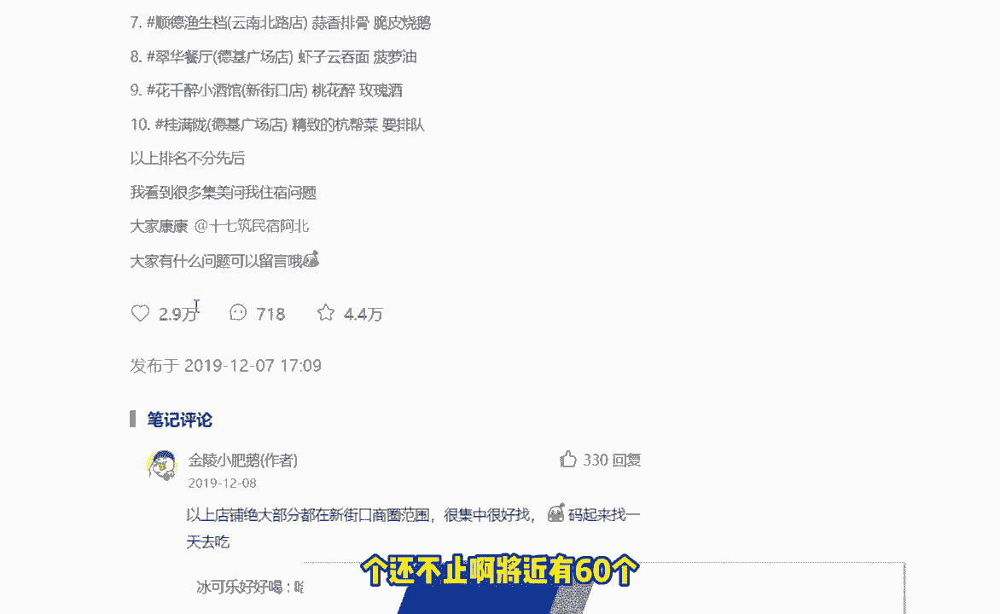
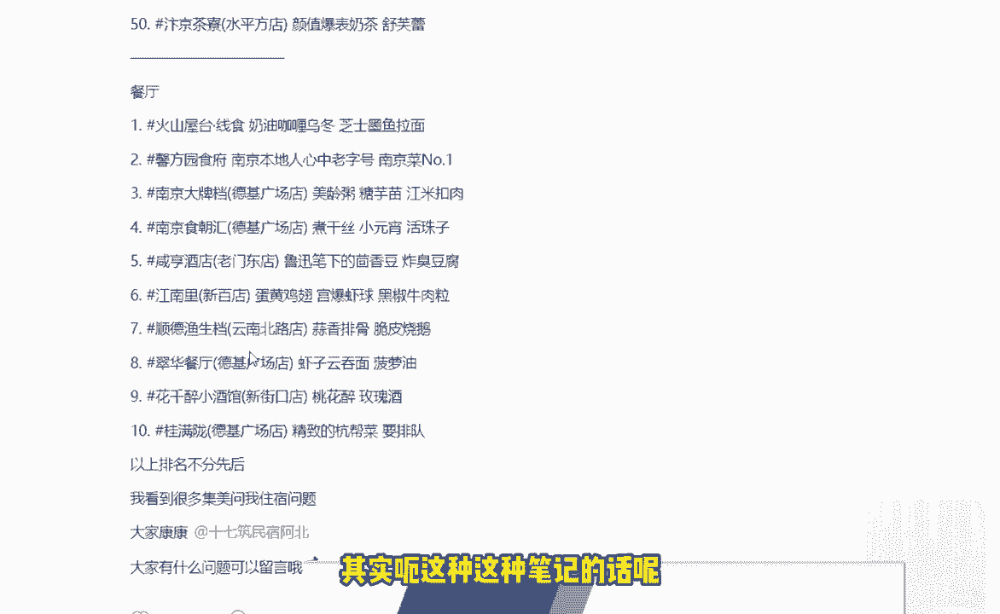
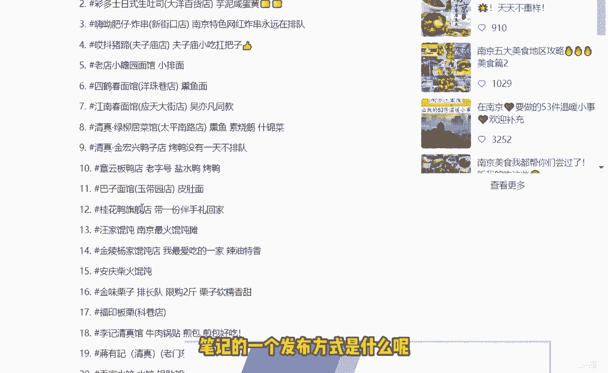
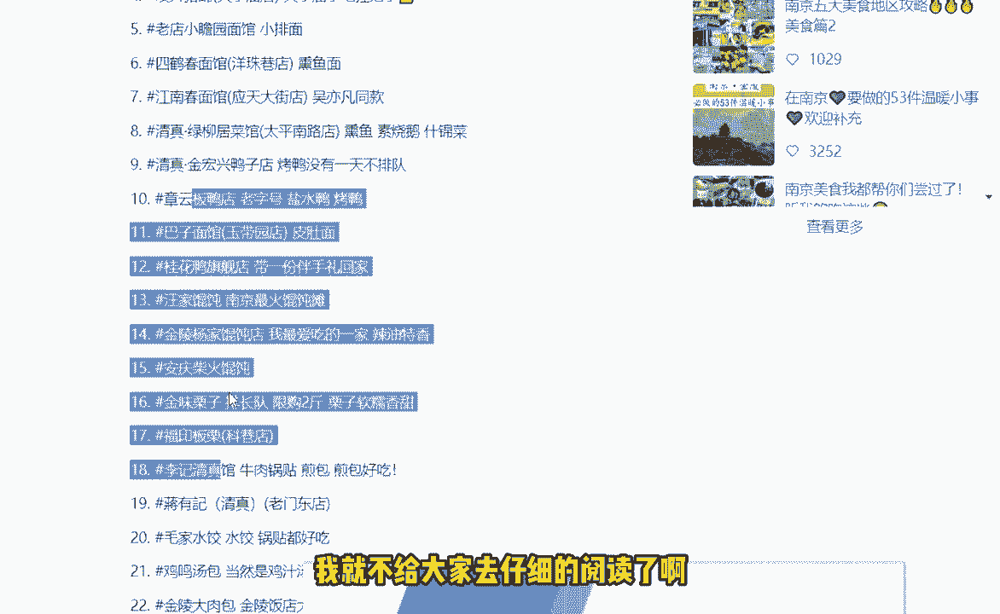
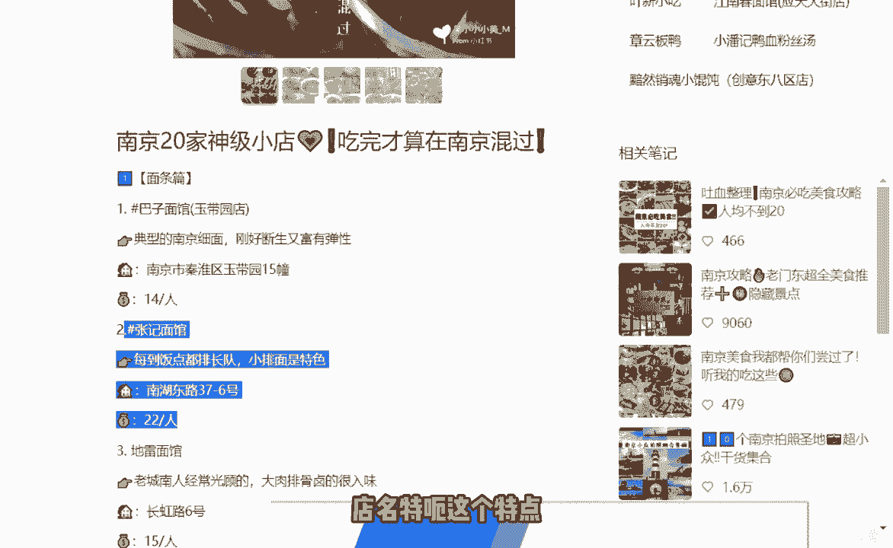
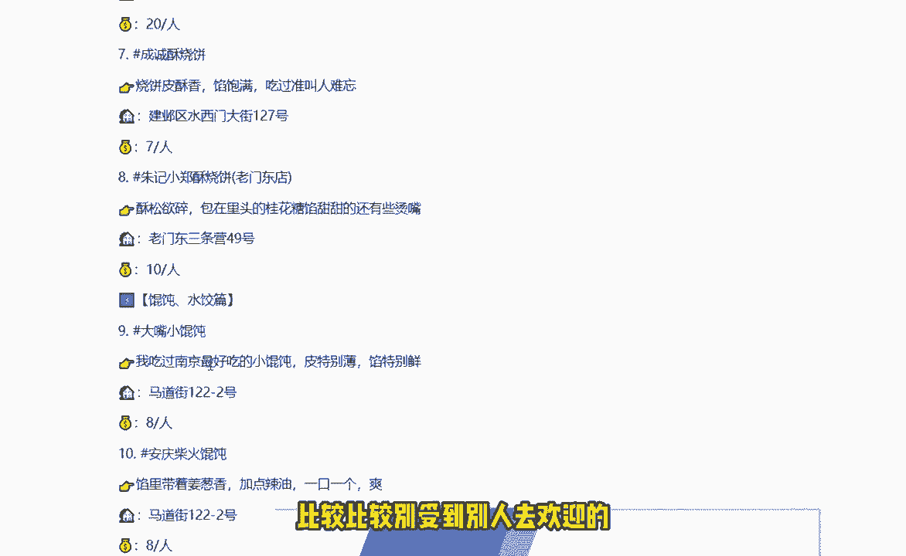

# 2024版小红书体运营教程】全B站最良心的小红书开店运营高阶教程合集！小红书体开店 起号真的快，赶快点赞收藏起来 - P22：第22节：小红书本地引流技巧，关键词引爆本地精准粉实战经验分析！ - 发v公iki - BV1aT421q7wp

大家好，我们今天这节课呢和大家讲解的是，这个本地引流本地的一些关键词的这个霸屏呢，到底是有哪些需要值得注意的地方，那么我们还是根据这三个呃，大家比较关心的方向，我们来讲解一下今天的课程啊。

首先第一个呢就是很多人会误解，就是一篇文，一篇文章，或者说一篇笔记，最好呢只讲一件事情，有的人讲的太多了，比如说他又想讲本地的美食，又想讲本地的旅游，又想讲本地的这个好玩的一些景点对吧。

这样子就不太行了，如果说你想做一个本地的，或者说单纯的想啊，想做本地的某一个垂直类目的话呢，一篇笔记不要讲的很杂，因为讲的很杂的话呢，首先你这个标题不知道该怎么起对吧，另外一个呢就是砸了之后呢。

它的内容就比较多，然后呢呃别人看了之后呢，就没有太多的耐心去看下去，比如说你讲美食的话，就单就单独讲一个美食，对不对，比如说你的美食，专门就讲这个哪片区域的一个美食，那你就讲单独的一片区域的一个美食。

你讲的是这个特产，那你就讲特产对吧，关于这点呢，我们可以给大家看一个案例啊，大家可以看一下这这两个案例，这两个案例呢就是比较符合于我们第二个特点，就是你如果说发这个本地的一些呃，小红书的这个笔记呢。

最好是多打一些标签，那什么样子叫多打一些标签呢，给大家看一下这个人打写的这个笔记的，他标签一共有看到没，一共有50个还不止啊。

将近有60个，那这篇笔记的话呢，其实呃这种这种笔记的话呢。

是一个现在比较流行的一种小红书笔记的，一个发布方式是什么呢。

就是宁愿你去一下子把这篇文章写全了，也不要去多拆分，多拆成几篇去写，他这一篇的话呢，相当于去写了很多很多的一些东西，大家可以看到，那基本上每张图片呢都会有几个宫格啊。

比如说这个南京大排上他有哪些这个吃的，那针对于每个宫格里面的一个两个啊，这是九九宫格的图啊，上面一个底下底下八个对吧，呃一共九个的话呢，他就我这个也没仔细看，我就不给大家去仔细的阅读了。

就比如说这九个专门是贴在每个图片里面的，这个标签，这样子的话呢就能够比较精准的去写出来，每个图片对应的一个标签啊，小红书呢现在是比较推荐这个标签去写的，另外呢我们可以看一下。

你像比如说这个这种标签呢也是可以的，你看一个标签对于一个特点，再对应一个地址，再对应一个，这个就是预算，他的这个格式呢看到没，它都有一个统一的一个格式的对吧，然后第二个啊是这种格式。

店名特额这个特点地址人均价格。

那这按照这种方法去写出来的笔记呢，就是比较受到别人去别比较比的，比较受到别人去欢迎的啊。

这个呢就是我们一定要多去打这个标签，然后第三个呢就是关于我们这个刷这个数据，刷数据的话呢，有些人啊，在刚开始一开始发布，我们这个小红书的笔记的时候呢，可能就一开始就想着要去呃刷一些数据。

比如说有的人光想去刷这个赞，或者说光想刷这个评论，那其实这个呢都是做的不对的，这里要给大家大家提出来的一点是什么呢，就是说如果你单纯的这篇笔记，你只刷了100个赞，但是没有一个评论。

或者说你刷了100个赞，没有一个刷了100个评论，没有一个赞，这样子的话呢，对于小红书那边大数据来看的话呢，这个是有异常的，因为正常人呢他那个这个点赞和这个评论呢，他都是有一定的数值的啊。

这个数值呢每个行业，每个地区的小红书账号是不一样的，所以说大家在刷之前呢，最好去看一下这个比值，比如说有的账号呢是一个呃是十个赞，一个评论对吧，那咱们刷的时候呢，就要结合于这样的一个配比去刷。

要不然的话呢你刷出来的这个数据啊是不对的，就会很容易被小红书察觉出来，如果说小红书发明发现了你这个笔记有100个，有100个点赞，但是没有一个评论，那这种东西呢是属于不正常的一个现象，不正常的现象呢。

就会对我们账号呢账造成了一个降权，然后呢会有一定的影响，所以说大家一定要注意一下，呃然后呢下面和大家说的呢，就是我们这个笔记发布的一个，啊笔记发布的本地内容，那我推荐大家一般去写什么样的一些东西呢。

首先我刚才跟大家说过了，就是我们要要要有一些这个店铺的一些，推荐理由，就比如说你包括为什么要去这家店，或者说为什么要做，你这个为什么要做你的这个特色服务对吧，粉丝为什么要去这里，为什么要享受这个。

你你的这个东西的特色是什么，为什么只有你家有别人家没有对吧，然后呢大家还可以去思考一下，你的本地服务，到底是有有哪些优秀于别人的地方，比如说你的环境好，还是你说你的价格便宜，还是说你的地段好。

还是说你的东西比其他同行都要新奇，那针对于这些新奇呢，到底是有哪些新奇的地方，大家可以根据这整个的一个大纲呢，去罗列一下自己所在的这个本地，行业里面的一些情况，这样子的话呢就能够更加清楚地掌握自己。

想要去写什么东西，而不是说你拿到一篇本地的这个内容笔记呢，不知道该怎么去写啊，好的。