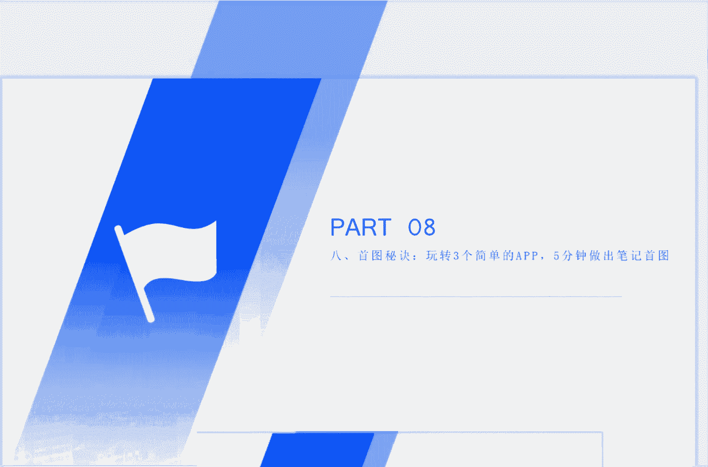
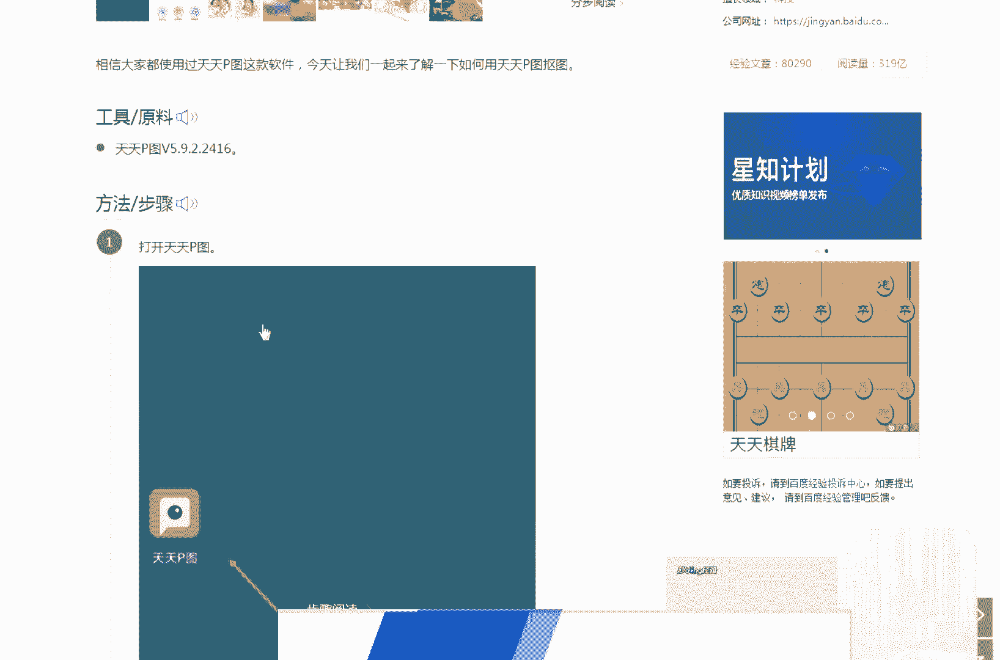
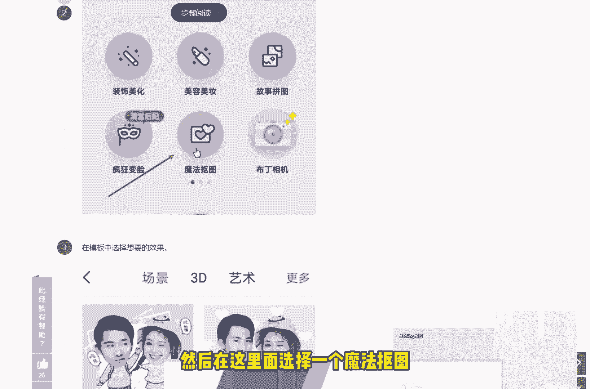
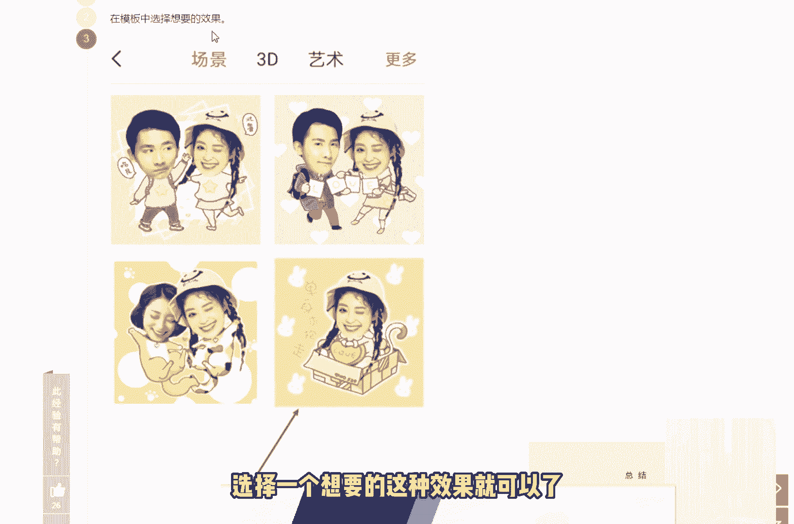
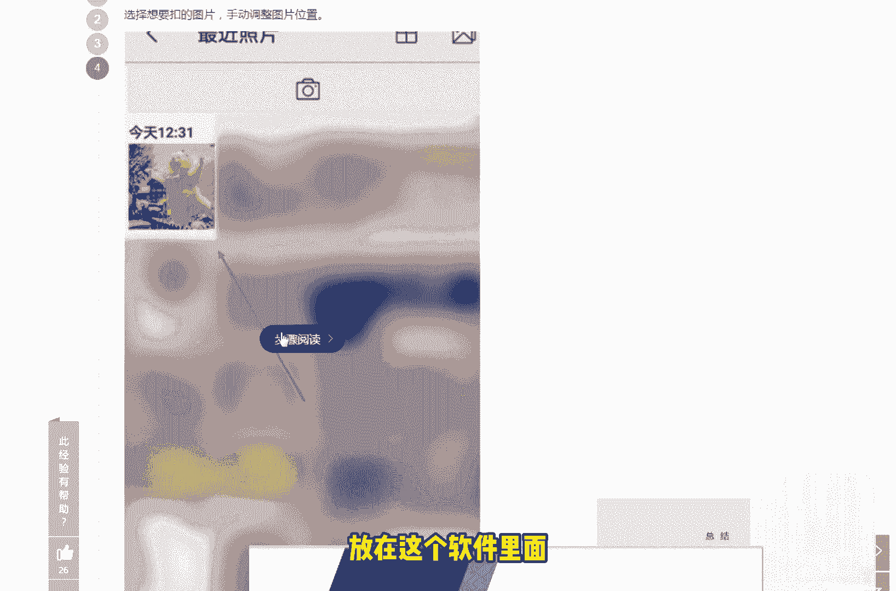
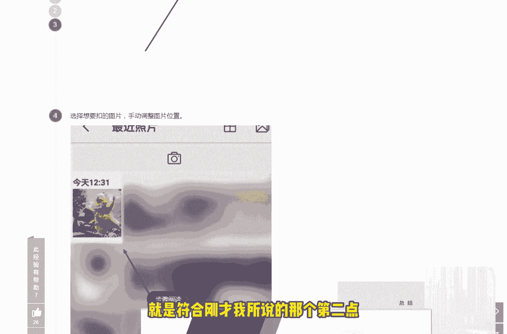
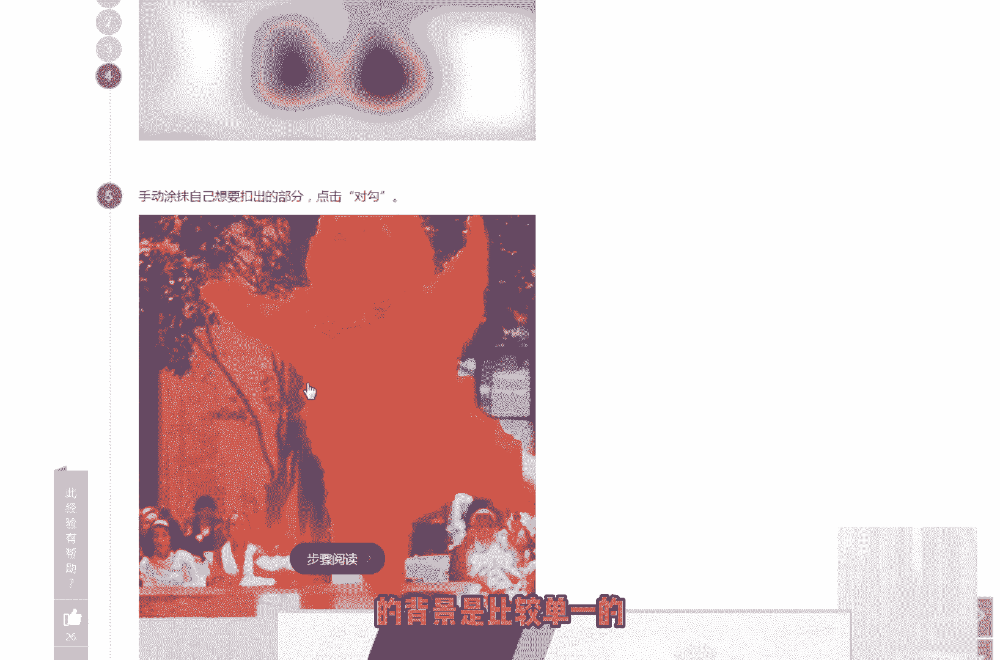
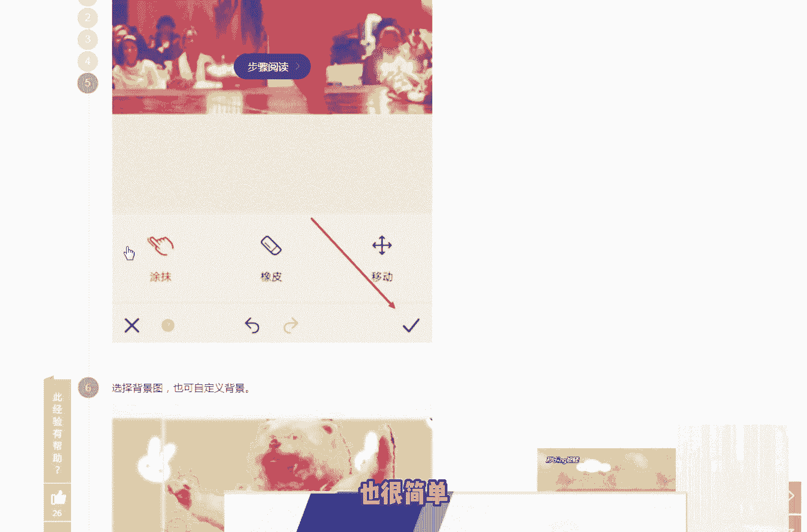
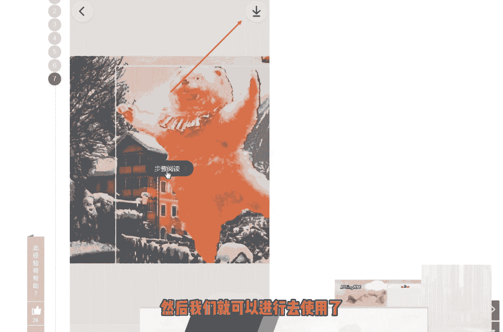
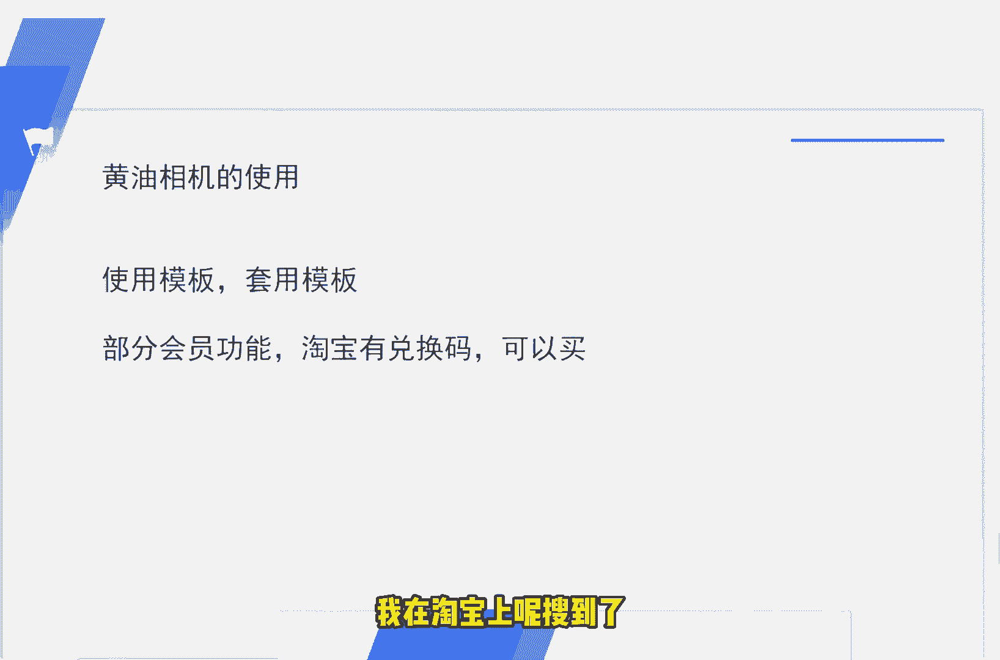

# 2024版小红书体运营教程】全B站最良心的小红书开店运营高阶教程合集，小红书体开店 起号真的快 - P12：11.第11节：小红书运营-只需玩转3个简单的app，5分钟做出爆款笔记首图！ - 体温计爆炸 - BV1ym421K7XQ

我们今天这节课呢来和大家讲一下如何用三个简单的APP花最少的时间，也就是大概5分钟左右能够制作出小红书的首页啊笔记的这个首页的图片。

做过小红书的朋友呢，都大概都知道小红书的一个封面图呢，对于我们这篇笔记的重要性。因为大家在搜这些相关关键词的时候呢，首先映入眼帘的也就是我们的这个封面的首图。封面的首图是有哪些花样是有哪些技巧在里面呢？

是有哪些技巧在里面呢？为什么别人看了你的首图就会点击进去产生一个阅读阅读阅读的一个欲望？如何才能够结合不同自身的这个产品情况呢，做出各种各样呃适合本本产品这相关粉丝的这种手图呢。

那么我们今天这节课呢就和大家简单的说一下。我们今天在这节课里面给大家介绍的这3个APP呢，也是大家常见的。第一个呢就是我们手机手机端的美图秀秀的APP。第二端呃第二个呢就是我们的这个黄油相机。

第三个呢就是天天P图。天天P图的话呢主要是用来抠图用的。呃，在在说这节课之前呢，其实有1。0版本的这个课程的学员找到我，他说呃很多人都说我们不太适合做这个小红书的手图，或者说不知道怎么做。呃。

痛点呢主要有以下两点，第一个呢就是咱们大部咱们大多数人呢，可能不是专业的去学过美工，可能或者说上大学的时候，或者说工作的过程中也不也不懂得什么是P图，什么是美工，对吧？还有一种呢是呃不太方便。

带着电脑去做这种图。有的人呢可能就是大部分时间还是用手机比较多，所以说我们今天呢讲讲的这个方法呢，就主要是针对于这两点的。一个是没有专业的软件。第二个呢是不太方便携带电脑。

所以说我们今天介绍的这三款软件呢，主要是针对于呃以上两个痛点来解决的。呃，我们今天讲的这个这节课呢，主要是来和大家讲一下拼图，包括图片加文字，还有抠图的一些这个简单的一些步骤，简单的一些调整。

那我们首先来说一下拼图。拼图的话呢，它是用美图秀秀手机端的这个美图秀秀这个软件来做成么呢？呃，这里呢我就给大家看一下这个手机端美图秀友的一个截图。啊，在这里呢大家可以看到手机端的这个美图秀秀呢。

大概是这么一个界面，对吧？呃，利用这个拼图的这个场呃这个功能呢，我们可以适用于哪些场景的这个使用的笔记呢？就比如说如果我们的笔记是用来做电影电视剧推荐的，或者说旅游民宿分享的，或者说穿搭好物类的。

或者说直接是做这种美食推荐的，我们都可以用这种拼图的模式来做。那么给大家建议的是什么呢？就是说如果我们发现。我们的这个呃拼图里面不太适合于用这个。不太适合于用小红书的封面图是哪几种形式呢？啊。

这里也跟大家说一下，首先呢美图秀我们打开是这么一个界面，点开这个拼图之后呢，选择了几张照片之后呢，你像这里我选择了是呃随便的4张照片。但是大家注意一下。美图秀秀的这个拼图呢，我们不要用海报。

也不要用这种自由，也不要用拼接，仅仅就使用这个模板就可以了。依靠着这里面模板的自由的这个组合，包括一些特效呢，就可以做出我们我们适合发布在这个小红书笔记的手头。啊，这里给大家注意一下。另外呢。

什么样的图片适合做拼图呢？我这里呢也给大家列举了四类。就比如说呃同类产品，不同款式的。就比如说呃我们买了一顶帽子，对吧？是同样一同样一顶帽子，但是呢有遮阳帽，对吧？有专门是这个呃防水的，可能是对吧？

还有种还有一种呢是效果图，效果图的话呢，为什么要适用于这种拼图呢？可能比如说我们我们使用了一款美白产品，对吧？啊，有4个或者三个不同的阶段，每个阶段到底是什么样子的对吧？啊，或者说第三种情况呢。

就是产品图，直接加上这个效果图，就是我们买了一款产品，用了几个阶段之后不同的一个对比，对吧？最后一种呢就是电影和电视剧电视剧的一个推荐。因为很多的很多这个情节啊，包括一些对话。

我们都可以用这种拼图的方式去把它做出来。下面一种方式呢就是图片加文字的一个方法。图片加文字的方法呢，大家可以看到我这边截了一张图啊。这是举例的一张图啊，首先呢我们的这个图片一般呢就放图片里面的话呢。

一般就放标题就可以了。然后呢，我们在图片里面放的这个文字呢，尽量的比较大一些啊，这样大一些呢，首先就会啊大家就是别人在读你这篇笔记的时候呢，看你这个图的时候就知道你大概这篇笔记说的是什么东西了，对吧？

然后呢，文字和图片呢去产生一定的区分。就比如说如果我们的这个图片的背景呢是淡色的，我们就可以用鲜明一些的色鲜明一些的字，对吧？如果说我们的这个呃比如说背景呢是蓝色的，我们可以看到对吧？

我们可以用一些红色或者黑色的来和这个图片背景的这个图片呢产生一些反差。这样子的话呢，也是比较有利于去吸引别人的一个眼光的。呃，然后呢，下面一个要点呢就是尽量的做到深浅分明，然后避免文字的一个倾斜。

因为文字如果出现了很多特效，或者说做一些倾斜的话呢，比较不太容易能够引起别人的一个阅读。那对于啊对于文字比较多的那种图片呢，我们可以我们可以用什么呢？我们就可以采用这种方法。

就比如说啊很很简单的一款产品放在图片的中间，对吧？旁边呢我们打上这个这个产品的一些主要功效，或者说一些简单的一些特点。然后呢。主呃主要是通过这个手图呢就能就能大概的去阐述出这个产品的一些主要特点。

别人也很容易去被我们吸引过来。但是做这种图的话呢，我这边给大家提一个意见是什么呢？就是说我们在做这个图片的时候呢，背景一定要去干净。然后呢，产品呢是居中的字体的大小呢，最好不要不要超过3个。

就比如说我这里面截图给大家看到的，就是呢字体呢啊或者字体的或者字号呢都最好不要超过3个。然后最好以黑白为主。背景的话呢，为什么要干净呢？因为。背景干净干净了以后呢，我们就可以适当的去加一些这种文字上去。

我们大家可以看到这种文字加在加在这种纯色的这种背景里面，是非常有非常有利于去阅读的，也非常有利于去吸引大家的这个啊吸引大家的这个注意力。最后一个我和大家说到的呢是我们的文字加气泡加色块的这么一个用法。

主要用到这种方法去做这个手图的话呢，呃可能是适合一些偏年轻化的这种账号去使用。就比如说我们如果面向的这种群体，可能是在校大学生，或者说刚刚毕业的这种小白领，对吧？

我们就可以采用采用这种配色来去直接优化我们的这个呃封面的这种手图。呃，以上呢我给大家讲到的这些要点的这些要点这些功能呢都可以用这个美图秀秀，我们来完成相关的制作。呃。

下面呢来和大家简单的说一下这个抠图的场景的使用。我们有有什么样的这一些地方可以用到这个抠图的？或者说我们用的抠图的这些地方啊，到底是为什么，对吧？我给大家简单的也总结了三类的这种抠图使用使用的这种场景。

第一种场景呢就是穿搭的一个测评，就比如说像我截出来的这张图，对吧？它的呃左边呢是这个穿搭，从上衣到裤子，然后到到背的这个包呃，在右边呢列出它所穿搭的一些这个抠图，对吧？然后这个干货笔记呢也是的。

就比如说呃美容仪的这种大科普到底是有哪几类，每一类它的名字，它的这个产品的样子都可以放在这个图片里面啊，然后呢还有一种是测评笔记，直接呢就是呃对吧？把所有的这个。所有相关的这一类的产品。

比如说我们啊这个封面图提到是美容仪，我们就可以把所有的美容仪的大概的呃市面上能找得到的这种美容仪的图片往这个图片上去贴啊，这个呢这个呢就是需要用到我们的这个天天P图了。那在这里呢也和大家介绍一下。

我们天天P图呢这天天P图的这个用法呢也很简单。我已经在在这里呢给大家列出来了这个方法。😊，那我们一起来看一下这个天天P图是如何抠图的。啊，的但是在看这个如何抠图之前呢，还是和大家讲一下这个注意事项吧。

其实并不是我们所有的这个素材呢都是适合抠图的啊，这个大家一定要注意一下。就比如说我们抠图的这些东西呢，可能都是一些比较小的一些物件，对吧？你不可能说抠一个房子，或者说抠一台这个汽车什么的。

这种东西呢就不太适合去做这种抠图。然后的话呢比较在于细节性的小的东西啊，比如说化妆品啊，简单的化妆品啊，对吧？这种东西呢它是适合于这种抠图的。然后另外一点呢，就是我们抠图的这个原理呢。

它实际上是采用了这个这个呃产品的这个。图片呢和背景的图是有一定差异的。比如说背景图是一个纯色的、白色或者绿色或者蓝色或者红色。总之呢，它的颜色是是单一的，是单一的。然后呢。

这个东西这个东西比如说我们要抠的一个这个美容仪，打个比方，对吧？它放在这图里面就是非常显眼的，这样是会有利于这个软件呢是帮助我们判断哪个东西到底是我们要的，哪个东西到底不是我们要的。

对吧然后第三点第三点的这个相关注意事项呢，就是我当我们在使用的过程中呢，如果我们发现。这个软件的次数用完了之后呢，我们直接卸载重装就可以了。因为它的这个抠图的次数呢，每天它都是有一定次数限制的。好了。

我们一起来看一下这个天天P图，它抠图的一个步骤吧。啊，这里呢给大家。

稍微过一下，当我们安装好了这个P天天P图之后呢，然后在这里面选择一个魔法抠图。魔法抠图呢，然后里面呢选择一个想要的这种效果就可以了。直接把我们想要抠的这个图片呢放在这个软件里面。大家可以看到像这张图片。

它选择的一个特点呢，就是符合刚才我所说的那个第二点。

啊，所呃所说的这个第一点啊，也就是图片背景比较干净，大家可以看一下。对吧或者说你的这个你所要抠的这个东西，它是比较明显的，或者说你的背景是比较单一的。总之呢一定要形成一个反差。

这样子呢才能去把它抠出来啊，也很简单，通过这个涂抹的方式呢，然后就可以把它抠图抠出来了。抠出来之后呢，然后我们就可以进行去使用了啊，是很简单的。这个方法呢也不难在百度上面呢也可以找到相应的这个玩法。

好了，最后一点呢也最后一点呢来和大家说一下我们呃功能非常强大的这个黄油相机的一个使用。黄油相机呢我这里建议大家呢去使用它的一个模板。

套用套用黄油相机上面的些啊一些模板就可以去实现我们这个图片的一个高大上的一种感觉了。就比如说一些边框啊，一些模板，这个这个到时候大家自己去看一下。然后呢。有一些这个会员的功能呢。

它的这个模板呢可能是需要付费的那需要付费的话呢，呃这里呢呃如果大家直接有这个经济能力的话呢，那建议大家直接是在官方上面充值就可以了。如果说你是想试用啊，或者说想长期用的话呢，想节省一点钱的话。

可以去淘宝上看一下。我在淘宝上呢搜到了很多的这种官方的黄油相机的一个兑换码。这里呢也给大家看一下。

这个在我这个在淘宝里面呢，直接搜的是黄油相机。大家可以看一下，里面有很多的这个年卡，365天，也就是一年的话是105块钱。呃，季卡的话是30块钱。然后月卡的话好像是5块钱吧，我记得。啊。

这里面有个月卡是5块钱的啊，总之呢这个店铺是很多的，大家如果。😊，想开通这个黄油相机会员的话呢，用到里面的一些呃一些特效啊，或者说一些模板的话呢，可以在这个里面进行购买。好了。

那关于本节课用使用这个简单的APP来做这个首图呢，我们这节课呢也就和大家分享到这里了。