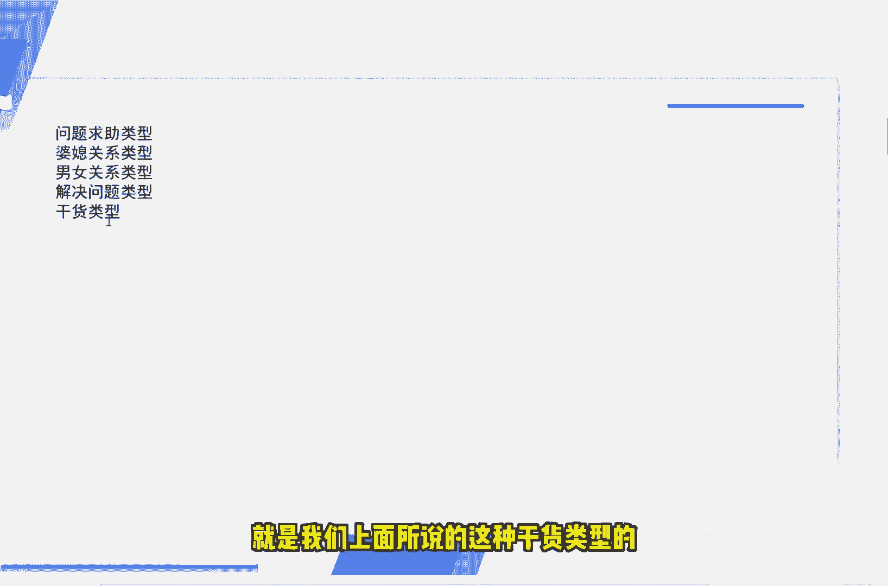
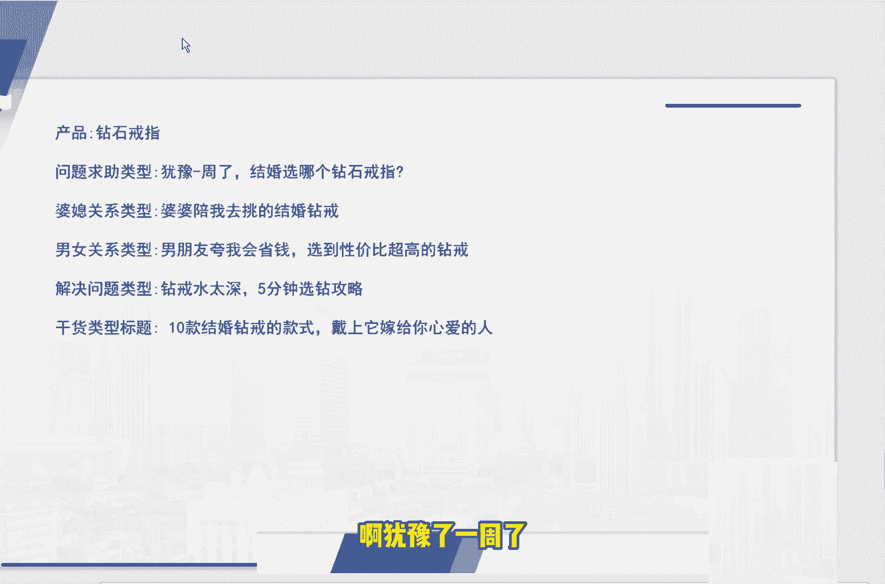

# 2024版小红书体运营教程】全B站最良心的小红书开店运营高阶教程合集，小红书体开店 起号真的快 - P13：12.第12节：小红书的5种爆款标题模板分享，教你1秒吸睛！ - 体温计爆炸 - BV1ym421K7XQ

我们今天这节课呢来和大家说一下爆款标题的一个技巧。今天的这个爆款标题的技巧呢，一共提供了5种技效给大家，让你的这个笔记呢更加去吸引用户的眼球。

首先我们自己在使用小红书的过程当中呢，大家应该都知道，包括说我们平时在看微博也好啊，或者说公众号也好，或者说你在别的这个呃平台。看到了这种信息流的文章也好，嗯，那个短视频咱们除外啊。

主要就是文字和图片的这种这种呃信息信息的这种。情况下，我们一般都是看的是标题吧，对吧？可能一可能一个标题的这个作用占比呢占到了这篇文章的70%。为什么我说小视频除外呢？因为小视频的话，你打开之后。

你首先看的不是标题，而是看的这个画面。所以说小视频的话呢，那是除外的。如果说我们现在还在做的是图文类的这种创作的话，那一般大概率的大概率都是比较注重这种标题的一个写法的。就比如说呃我之前可能也说到过。

说我们必须要做一个标题党了，对吧？如果你的标题不吸引别人的话，那别人就在茫茫当茫茫的这个信息流程中就会把你给刷掉。没有办法注意到你，首先通过标题去把别人吸引进来。才是我们正确的正确的一个呃写作方式。

那回到我们小红书具体的这个平台，小红书这个平台平台上来说，小红书这个平台呢之前也给大家分析了这个平台上面呢聚集了大量的优质的高素质的这种啊中国的很多的年轻女性，对吧？那对于这种年轻女性的话呢。

他们一般的。一般的问题有哪些？比如说她和呃自己男朋友的关系，闺蜜的关系，上班的一些烦恼，可能大部分都是这种职场的女性，对吧？还有一些比如说呃对于生活的一种憧憬啊，穿搭啊，对于旅游的一些攻略啊呃等等等等。

可能会在这些问题上去产生一些问题，对吧？它不像我们它不像我们在那个别的平台上遇到的，可能有一些是男性粉丝，或者说有一些是混合性的一些粉丝。那小红书就很就很直截了当了。90%，可能都是这种女性粉丝。

所以说我们针对于这种小红书的女性粉丝来说的话呢，就可以去写出很多的这种标题。这里呢我就给大家列出了5种类型的这种标题。首先第一种呢就是问题求助型啊，第二种呢就是婆媳关系型。

第三种呢第三种呢就是男女关系的啊，然后呢是解决问题，解决问题的这种类型的。最后呢是输出干货的。好了，我们一个一个的给大家看一下。首先第一个呢就是选啊就是求助类型的，比如说我们同时可以抛出多个选项。

让大家去帮你做选择。你在写这种笔记的时候，对吧？我们最常用的写法呢，就比如说啊求助大家先买这个二线在二线城市先买车还是先买房，对不对？求助求助，帮我看一下哪件婚纱更好看，或者说求助。呃。

帮我看一下选哪支口红比较好，对吧？那对于这种这种来说的话呢，求助求助的求助的类型呢是一种比较常见的一个写法。我们第二第二种常见的这种写法呢就是婆媳关系型的。大家都知道啊。

我们这个小红书里面呢大部分都是这种女性，对吧？那婆媳关系呢作为中国的一个比较比较盛行，也比较流行，更比较敏感的一个话题来说呢，是会引起很多女性的一个共鸣的。所以说我们有的时候去写文章标题的话呢。

可以从这个方面去入手。就比如说呃我们通过找产品的这种写呃这种使用场景，对吧？比如说我们想使用一个儿童推车。那呃这种使用场景呢是出门遛娃的时候去使用的对吧？就比如说我们可以这样去写，对吧？

你明明明明我们这篇文章就是为了推荐这个儿童推车的，我们可以啊写你和婆婆一起出门吗？对吧？或者说和婆婆一起出门遛娃吗？对吧？通过这种方式的呃标题呢去吸引别人的点击，吸引别人的关注。

实际上我们呃这篇笔记呢或者这篇文章呢，它的主要主要的主题呢是出门遛娃，对吧？😊，好，我们看一下。第三种呢就是男女朋友的这种。比如说呃我们可以写男朋友也喜欢这样的产品，对吧？我们可以看一下。

在这上面遇到的一些最普通的一些标题啊，比如说我们可以看到送男朋友的礼物啊，男朋友送送给自己的口红啊，或者说给男朋友做的这种早餐啊，我们可以通过这种简单的简单的标题进行优化之后呢。

你就会发现哎这个标题呢会给人一种焕然一新，耳目一新的感觉。就比如说让男朋让男朋友爱不释手的礼物，这次送对了，对吧？关于送礼物的，我们可以这样说啊，关于送口红的呢，我们可以这样说，男朋友妈妈也喜欢的口红。

小心机直男。宅对吧？就这样子的这样子的感觉就会给别人别人一种。很强烈的很强烈的种一种冲击。对吧呃，比如说第三种呢可能是给男朋友做的这种早餐，我们可以怎么写呢？换一种角度来写。

就是说啊男男朋友超爱吃的5分钟啊，快手早餐或者说抖音早餐，对吧？我在这个短视频上面就学到的对吧？通过这种呢也是比较不错的一个方法。🤧嗯。啊，那么还有一种呢，就是可能小红书上面的这些这些女性呢。

他们比较爱美嘛，对吧？比较爱美，比较去喜欢去谈论一些瘦身啊，减肥啊，或者是保养一些的妙招，可能会在对于这些吃的问题上面也会有一些问题。就比如说我们经常看到的对吧？呃，怕喝怕喝胖这个奶茶到底该怎么办。

对吧？教你做低脂奶茶，或者说没有时间做早餐怎么办？5分钟叫你快速的去做这个早餐，对吧？啊，那最后一种呢就是合集类的，就是我们上面所说的这种干货类型的呃消息的回答。这种合集类的呢，我们刚才可以看一下。

就比如说我们呃可以在一个同一个这个商品里面去推荐很多东西，对吧？或者说。

我们一般来说呢，合机类的这种产品呢，它的这个方法呢是越多越好。呃，下面我给出的这个案例呢，大家也可以去看一下，对吧？比如说呃。我可以看到的对吧？简约气质穿搭针织衫合集来了，对不对啊？

108件衬衫大合集9格色系承包你的衣柜，我们可以通过这样的方法去写这样子的感觉呢就会就会让人家觉得是什么？人家看了你这篇笔记就不用去看别的了。因为你这个笔记写的非常全面，非常到位，对吧？呃。

另外呢给大家提示一下呢，就是当我们在想这个小红书标题的时候呢，应该注意注意哪些的这个地方啊。首先第一个呢就是标题的这个字数应该最好控制在20个字以内，不能太长，也不能太短。16到18个字是最佳的。

因为标题太长的话呢，是会被隐藏的。然后你标题如果太短的话呢，也是很难表达我们文章内容的一个亮点，对吧？第二个呢就是我们可以适当的呢去。在这个文章里面加一些符号表情，因为符号表情和这个形式越多呢。

可以帮助你的笔记脱颖而出一些，有一些个性的特色。第三种呢，比如说我们可以在这个标题上面适当的加上一些数字来表呃比较受欢迎。就比如说7天香港攻略三天痘痘肌修复攻略。32款热门抗老精华合集，对不对？

通过这种数字的这种呃写法呢来给别人带来一种希望，就是就是别人感觉啊三天就可以修复这样的一个痘痘肌，对吧？32天就可以去抗老去修复我们老化的这个皮肤，是不是就会给别人一种代入感，一种希望。

第四个注意事项呢就是标题一定要去贴合文章的内容啊，不能说标题和文章的内容是没有关联的。如果没有关联的话呢，那是这篇笔记呢，大概率是没有办法得到我们小红书自然流量的一个推荐的。最后呢给大家看一下我们。呃。

选了一款这个简最简单产品。比如说我们要推一款这个钻石钻石的戒指，打个比方，我们可以通过这五种方法，从不同的角度，从不同的角度我们来阐示这个产品的一个特点。就比如说从问呃问题呃问题的这种求助类型的对吧？

啊，犹豫了一周了。

有哪个东西比较不错，请大家给我推荐一下，对吧？还有从这个婆媳关系类的对吧？😊，呃，其实这里面我觉得如果说让我来去挑选这个挑选这个戒指的这个标题呢，我从哪个从哪个这个角度写比较不错呢？

我觉得应该是从这个男女关系类型去写的话呢，是比较不错的。啊，男朋友夸我会省钱选到性价比超超高的一个钻戒。因为因为大部分的这个小红书的呃上面的女性，我说了都是一些职场的女性，可能每个月的收入啊。

或者说家庭的富裕程度啊不会那么宽松。他们会比较喜欢这种又有代入感的，又有和这种呃占了便宜的这种感觉，啊有关系的这种笔记，他们是比较喜欢去阅读的。好了，那本节课呢关于这5种标题的一个写法呢。

包括举的这个例子呢，也给大家说完了。