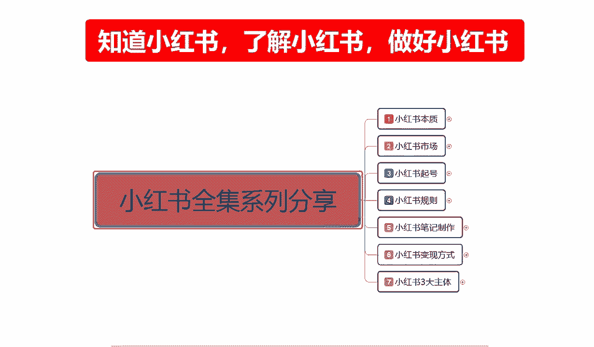
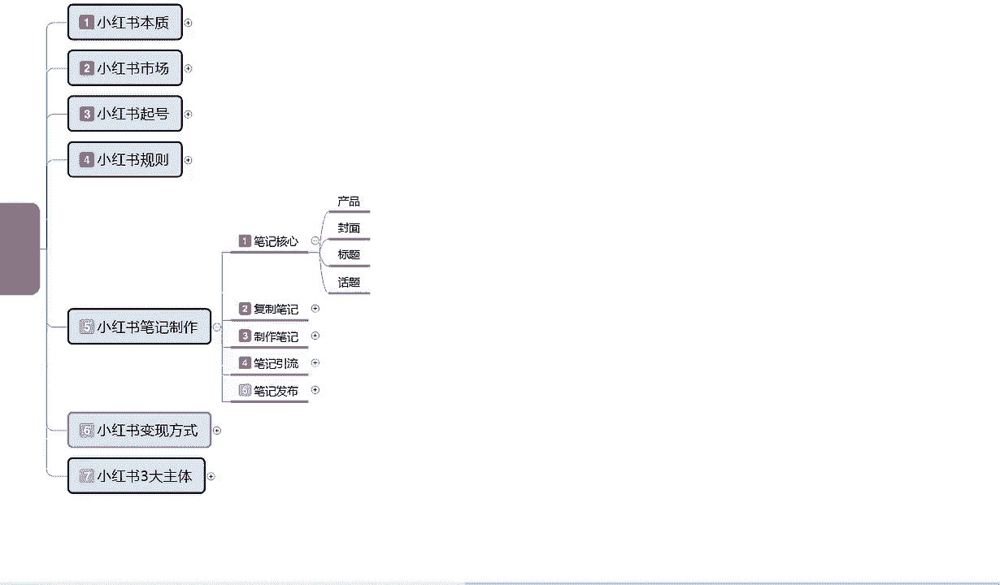
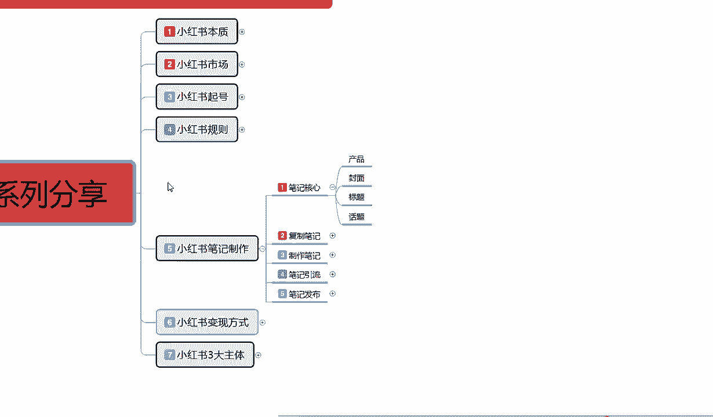
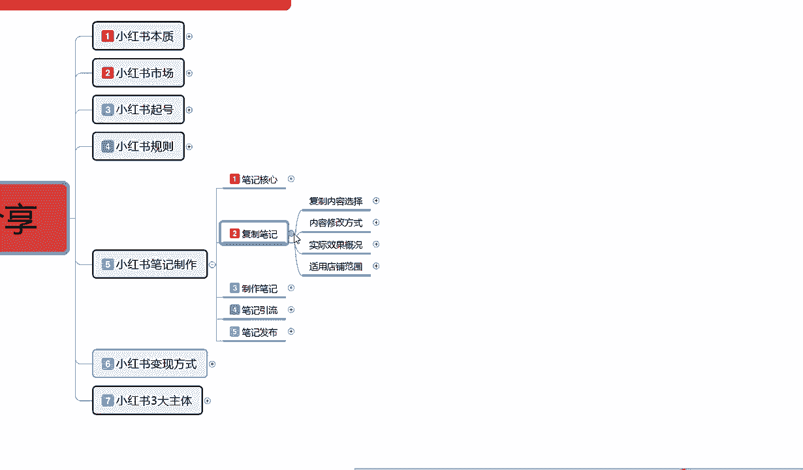
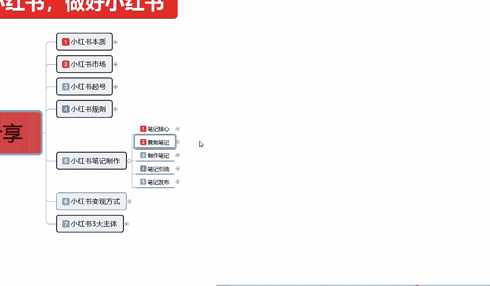

# 2024版小红书体运营教程】全B站最良心的小红书开店运营高阶教程合集，小红书体开店 起号真的快 - P14：14、新手小红书运营-小红书笔记制作核心 - 阿强项目指导 - BV18y411B7Qy

大家好，今天给大家分享的是小红书全集系列的一个，第五大课时，小红书笔记的一个制作啊，从这节课时开始，包括我们第六节，第七节三大主体课程嗯，这三节课程的话是我们小红书正式入门的，一个课程内容。

学习上面四个，说实话额上面四节整体的一个课程的话，我们不管是本子也好，市场也好，起泡也好，规则也好，只是说我们了解了整个小红书他是做什么的，他的市场有哪些啊，我们应该在小红书上怎么起账号。

最后呢就是我们小红书它里面有一些规则，我们可以去利用和规避，从第五节课小红书的一个笔记制作，包括小红书怎么去通过什么样的方式去变现，最后包括小红书的一个三大主体，第三节课才说。

我们正式步入小红书整体操作的一个实操步骤，好吧，废话不多说，然后开始我们今天的一个课程，第五大课时小红书笔记的一个制作。

小红书笔记在这里啊，我给大家强调一点啊，笔记它分为很多种的类型，但是它万变不离其宗的话，说实话也就是四个点，笔记核心，产品封面标题和话题，这个产品是什么意思呢，小红书如果说你想把小红书店铺整体把它做好。

我们在小红书上面光起号是没有用的，正常你就算说是都做网络博主也好，做引流也好，你必须要有一个商品账号挂上去，也就是你必须在小红书上面去开一颗商品店，这个商品店里面的产品你卖或者是不卖，你卖资料也好。

你卖商品真正真正的卖商品也好，或者说你随便挂个链接也好，但是你一定要有这个店，为什么小红书账号你开店以后，他有额外的加权，就是给你提升我们基础账号的一个权重，而不是说我们普通的网红店也好，引流店也好啊。

它不像商品店一样，商品店，你本来你在小红书上面，我就是准备去卖商品的，所以说小红书的核心，你要真想把在小红书上面去赚钱，不管你有没有产品，你在小红书上面啊，不管你有没有产品，一定要去开一个店。

只是说这个店运营或者是不运营，就靠我们自己啊，怎么说呢，啧自己怎么打算嘛对吧，你是想在上面小红书上面边宣传边做，还是说在小红书引流到外面去，或者说我准备做直播带货之类的，但是你做直播带货，说实话啊。

你去帮主家推广产品也好，你去帮主家打广告也好，你最好也是要开一个店，在你的店铺里面去对别人进行一个宣传，同时的话你自己的话术话题，也是要通过这种店铺的一个形式，去传达给用户的，所以说小红书开店必不可少。

你要真想在小红书里面转圈，或者说想把小红书玩好，你做网红做博主，这个店你必须要开，你就算是开完以后放在那个地方啊，一件产品不上一个笔记，不发不发笔记，不可能不发商品笔记就可以了啊，个人正常笔记要发的。

就说你这个产品放上去，你不用去管它了啊，其他的就跟你没有关系了，你就是开个店，只说给自己增加一点技术权重，如果后期我们店铺遇到瓶颈，或者遇到其他东西的话，我们再通过这个店铺。

我再把这个店铺运营起来再去操作也是可以的，但是小红书你真想去赚钱的话，你不得不开店，你觉得他是做引流的，你都不得不得不开店啊，你如果说小红书在小红书上面，你的一个整体的话，你不去开店，你的核心笔记。

他的一个就是我们推广笔记的时候，小红书我们做笔记的时候，你的正常笔记发放数据，要比普通的用户权重少接近1/5，接近1/5或者说是2/10啊，就是平白无故减少十百%分之20的流量，你愿意吗，对不对。

而且小红书上开个店的话，说实话就1000块钱保证金，这个保证金的话，你到时候还可以退出去，花个十来块钱啊，他有一个税收，但这个的话我们就可以不用去在意他了对吧，1000块钱的事情。

你增加10%到20%的一个流量，对于我们来说的话，其实是差别很大的，你本来正常展现曝光1000的话，给你1200，1200，那么你在技术属性上面，你根据我们之前讲的课给大家起的那些数据量。

我们再去分析你的一个点击啊，数据啊，你再把这个账号做起来的权重就会又会高很多，而且这个钱你又不是不能取出来，所以说我们在小红书上面做笔记的时候，一定要有产品好吧，这是给大家讲课之前让大家先了解一下啊。

就说我们小红书你是发笔记也好，你是嗯做网红也好，你做引流也好，你做商品也好，你必须要有一个店好吧，然后笔记的核心是什么，就是我们小红书我们去发布笔记也好，其实在这个里面的话。

小红书的一个整体笔记的一个核心是什么，我们打开手机，在小红书上面会显示很多不同的内容，但是一个画面的话，就说我们手机打开小红书以后，它正常显示画面是四个，就是四片笔记，往下面拉，这个是推荐的。

有推荐的一个笔记啊，往下面拉大概有20个左右，然后会进行一次刷新，20个刷新里面的话，他有一件事是嗯小红书自带的推荐笔记，这个笔记的话他会挂一个店铺上去，这个是什么，这个是产品笔记，就是这个店。

我正在开卖产品，这样吧我给大家这么讲的话，大家可能没有什么太大的一个印象，嗯你们如果说真的感兴趣的话，那我给大家边说啊，我因为我这边手机的话投屏它不是很方便，所以我在这里呢就直接给大家讲。

我们小红书笔记的一个核心啊，产品封面标题话题。

这个里面就说我们小红书笔记的话做核心，我们打开手机在小红书上面的话，它会显示很多的内容，不管我们怎么去搜索啊，我们或者是不用搜索，我们直接在发现里面，小红书发现里面他直接给我们推荐的，推荐的笔记也好。

视频也好，直播也好，艺术也好，穿搭也好，摄影也好等等，这些东西都是一样的，知道吧，我们打开的话，打开小红书以后，进来以后的话，它都是四个四个笔记页面，这个笔记页面当我们往下面拉的时候。

我们偶尔会在右下角啊，就是小红书笔记右下角看到看见赞助两个字，这个是小红书商品通过投流啊，进行了一个封面抢抢占，也就是说大概有8~10个，正常笔记里面会附带一个商品推送，以前的话还没这么多。

以前的话可能20个左右才会出现一个，那个赞助的一个商品，现在的话基本上就是十个左右，七八个，也有可能他是随机投放的，看他的现在的一个推广力度，就是往后的话，他这种额商品的类型的话可能会越来越多。

因为以前的话我们想找商品都找不到，但是现在小红书他在这个里面发现商机了以后，他把这个小红书商品的一个数据量放大了啊，由以前的百二十分之一，现在提升到接近1/10，提升了一倍的一个展示量，所以说产品笔记。

你如果说要把产品笔记做好的话，这个里面的话他有一个产品笔记推流，但是不适用于新手，因为你们点进这些赞助里面有，我们大家可以发现啊，嗯我这边随便点了一个笔记，我们去看他的一个基础粉丝数量。

和一个获赞与收藏，基本上都是粉丝，起码是在3000加到5000加往上走，获赞与收藏的话是1万8到2万，2万5万10万这种形式，因为别人是已经把店做起来了，账号已经做起来了，然后就开始通推广的产品。

然后再提升它整体的一个价值，卖它的一个产品属性，通过这种方式来获利的，就说我们前期的话不需要去投这个，但是我们要知道小红书核心笔记里面，他是有这个成分的，就是说他的推广力度是越来越大了。

以前我们看笔记的话，可能很少有人会注意，他的右下角这个地方有一个赞助，这种的话是现阶段小红书刚推出的啊，商品头牛就和我们做淘宝也好，做其他的也好，它都有一个付费付费的一个直通车推广啊，转展等等之类的。

他都是类似的，这个是花钱弄的好吧，然后小红书整体的一个核心笔记，如果是抖音，我们每回刷的时候，它只会显示一个产品，但是小红书的话它是四个笔记，所以说从这个里面我们要去抢流，我们现在要了解的是。

小红书核心笔记在产品封面，标题和话题四个当中什么是最重要的啊，在这里的话其实也是非常简单的，封面最重要标题，第二产品和话题其实跟我们其产品的核心啊，影响不是太大，但是它也是一个步入点。

如果说我们没有这个没有这个封面和标题，不有封面和标题，没有产品和话题的话，我们它是没有后续力量的，它和抖音不一样啊，抖音的话，每次我们去刷抖音，他都只会给你显示一个文章，一个视频，一个内容，你不愿意看。

就两秒钟就两秒钟，第一次眼的两秒钟，你看见那个抖音不舒服，啪就下一个，下一个又不是我啪，就又下一个抖音，只有两秒的展示时间，但是小红书不一样，小红书每次显示的是四个，大概的展示时间是在五秒钟左右。

也就是说你的小红书要在五秒之中吸引到用户，那么你的封面就是最重要的标题，排其次你这个笔记里面的内容，我们现在不说产品内容啊，我们说笔记里面的内容和你的内容话题，别人是看不见的，也就是说你在五秒之内。

你的这个封面能不能写封面和标题，能不能吸引到用户进行点击，然后进行你的一个笔记观看，或者说是话题的一个欣赏讨论啊，就在于封面和标题，封面整体占比的话达到了70%到80，标题的话说实话只有20%到30。

他们两个整体结合起来就是笔记的一个核心，当然这只是表面核心，我们还有后续的一个核心，后续核心是什么，我们做产品也好，做笔记内容介绍也好，做网红也好，做引流也好，做话题也好啊，这两个才是后续核心。

也就是说封面和标题是表面核心，内容的话是产品和话题，这个才是最真实的一个核心，我们只有把这四个点结合了，你的一个小红书笔记核心就找到了，围绕这四个点先去走封面，前期70%的投入要放到这个上面。

因为你的封面吸引不了用户，别人不会点进来，四个展示画面，或者说20个你从20个里面去挑啊，20分笔记里面，你能不能达到你的一个点击率达到11%，接近13%以上进入下一个成绩，就靠你的封面和标题。

这个就是整个小红书笔记制作的一个整体核心，如果说我们把这个核心把握住了，你后续操作再怎么去操作都简单，如果说你把这个核心把握不住，我们笔记核心，你把它把握不住，你不管做复制笔记也好，做制作笔记也好。

笔记引流也好，笔记发布也好，你后面你做的任何东西都没有用，因为你没有把握到用户的一个心理层面啊，你的话题不够吸引人，你的封面做的不够漂亮，不够好啊，内容不是我感兴趣的。

那你觉得你的整体数据流量会爆发起来吗，不可能的，对不对，所以说封面是第一要义，70%，接近80%，应该说是75往上标题是占25%，因为你封面再好，你的标题不吸引人，标题内容做的不好也是掰扯。

那后面产品话题你就更更不用谈了对吧，我们把起号起完以后的话，就是说笔记核心一定要了解掉，呃用课程的一个原因，那这一节呢就给大家讲到，这主要是给大家介绍了一下啊，我们小红书笔记制作里面，在制作笔记之前。

我们应该把重点放在什么地方好吧，下一节课给大家讲解一下啊，父子笔记，什么叫父子笔记呢，就是说把别人的笔记啊内容复制过来，用到我们的一个账号上面进行一个宣传推广，我们前期操作嗯，对于很多新手来说的话。

我不知道自自己怎么去做笔记也好，我不知道自己怎么去排版也好，我没有材料，我没有素材啊，我不知道等等这些内容，我们其实可以用复制笔记这种方式去操作，那我们先熟悉整个小红书的一个体系。

再接着进行下一步一个操作好吧。

下节课呢给大家讲解一下，我们父子笔记的一个整体实操模式。

