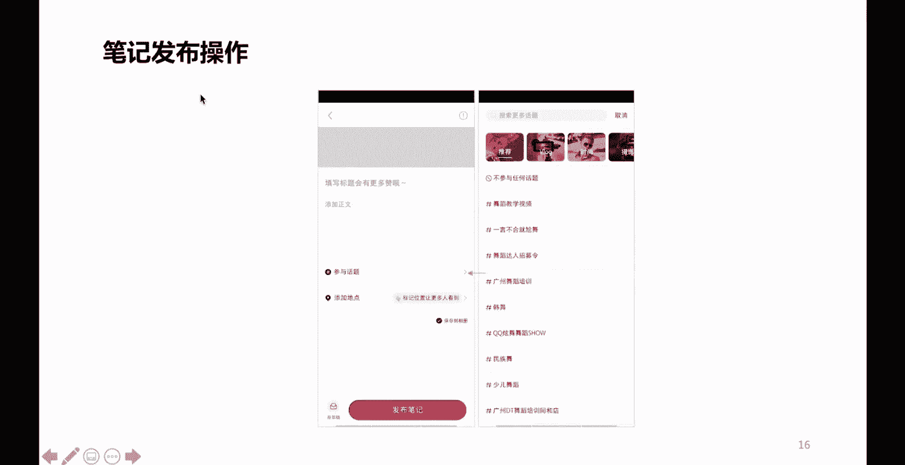
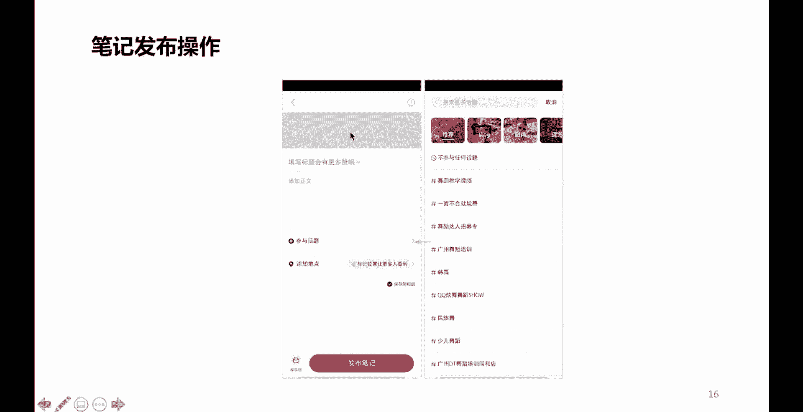
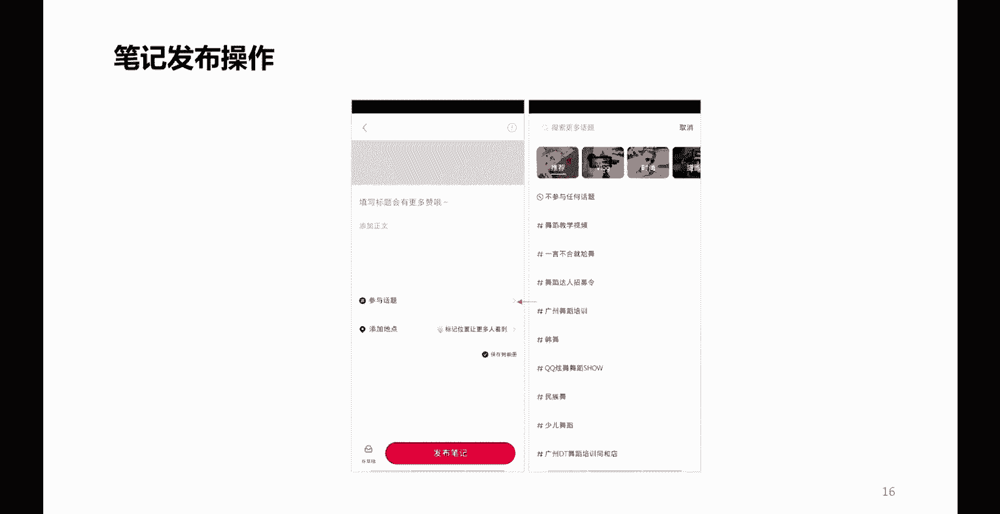
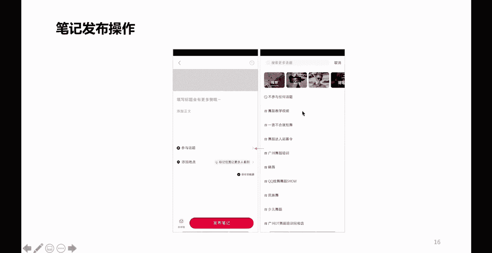
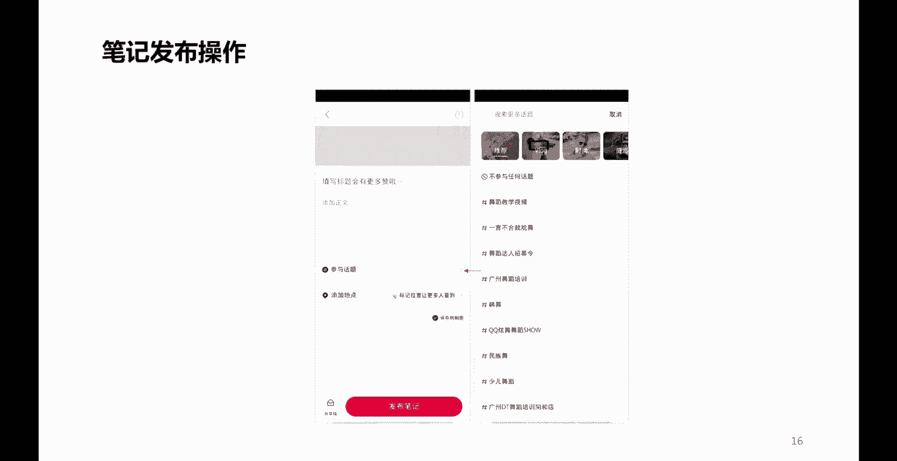
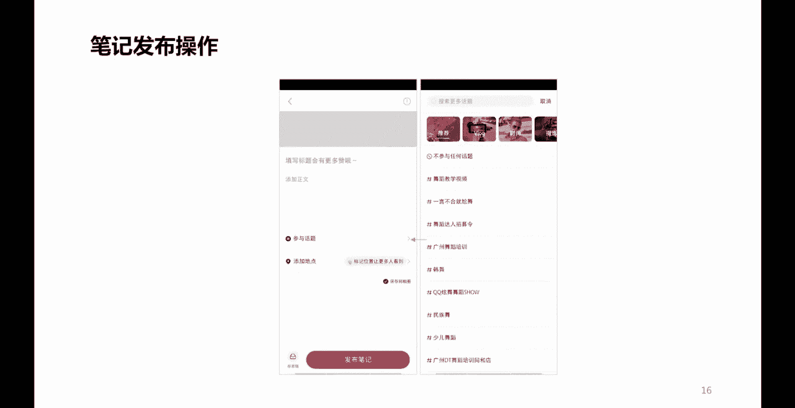
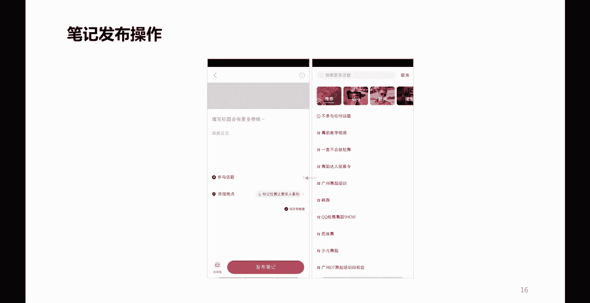
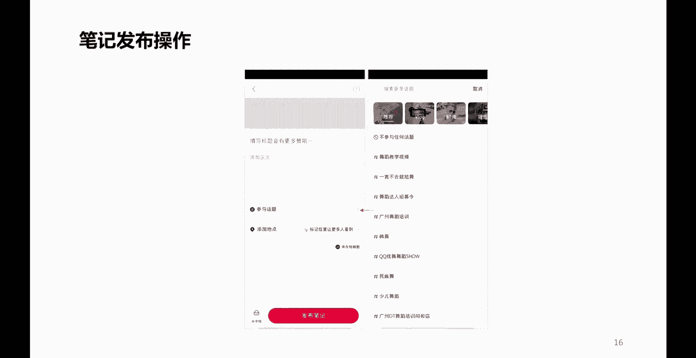
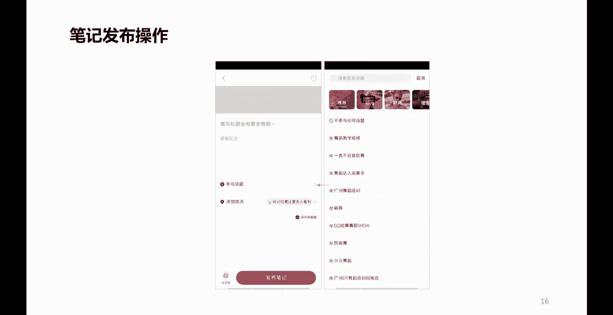

# 2024版小红书体运营教程】全B站最良心的小红书开店运营高阶教程合集，小红书体开店 起号真的快 - P15：P12小红书内容发布流程 - bil钻石种子 - BV1sD421g7q3

好那么再往下看呢，我们在发布小红书的时候，我们不是创作内容了吗。

创作内容在发布小红书的时候呢，往往呢在这个地方呢有一个叫做参加话题是吧。

你看上面这个灰色的部分呢。

它是要么就是上传你的视频，要么就是上传你的这什么呢。

图片哎，多张图片哪一张做封面是吧，图片上面是不是还要做一些图片当中的一些，我们叫做画中标题，来在图片当中做一些标注啊是吧，做一些标签儿啊，唉写一句话啦是吧。

要通过一些软件把它设计得特别漂亮，特别好看，色彩搭配要很唯美，是不是啊，这是在视觉部分好。

那么下面这儿呢是写标题啊，这儿呢是写我们的正文，那么这个地方呢就很关键了，参与话题我们在创作小红书笔记的时候，我们要去思考一个点，如果我们能借上一些话题的力度。

一定程度上是很容易把我们的小红书的流量呢。

往上推一推的，那么这个话题呢虽然说借上它有利有好处，但是呢不能乱借是吧。

你比如说你明明做的是口红。

我非要用一下这个话题舞蹈教学视频。

那这肯定就有问题是吧，所以说你在参与话题的时候，你可以去搜索一下。

或者通过这些板块去查一下，看看有没有匹配自己这个内容的一个话题。

如果有，那你就可以用过了。

如果没有，那宁可不用啊，宁可不用好，再往下是什么呢，添加地点，这个地点要不要添加呢，我告诉各位。

当然要啊，当然要添加这个地点，那么地点呢必须是你小红书登录的这部手机，真真正正所处的一个地理位置，这是最好的啊，比如说你现在在北京啊，在北京哪呢。

在北京的这样一个朝阳区是吧，那么你的地理位置呢，就可以添加北京市朝阳区啊，相关的一个位置啊。

你不能说你在北京市朝阳区，你非要把自己的位置定位在什么呢。

定位在这个其他的省份啊，或者是其他城市省份的一些城市。

那么这个呢也是会影响你最终的一个效果的啊，为什么呢，因为小红书内容的推流呢有一个叫做什么呢。

同城推流同城啊。

他会将你的内容呢进行同城用户的一个展现，那么我们知道同一个城市啊，同一个城市呢对于我们内容的效果呢。

肯定是有帮助的，因为每个人城市都有每个城市的一个什么呢。

一些什么呢，文化啦，习俗啦啊或者是一些什么呢，呃城市的一些精神啊等等之类的哈，所以说呢我们尽量呢要考虑同城。

而且同城的这样一些分享呢，也有利于比如说有一些做线下实体店的。

也有利于你线下的一些导流啊，线下的一些道访。

所以呢我们在发布的时候呢，一定要注意这样一个技巧啊，要注意这样一个技巧。

当然呢有的人说我可不可以通过电脑去发布呢。

当然也可以，电脑发布有什么好处呢，啊，这个呢就要说一说我们在做小红书笔记的时候，如果说你做的是一个视频啊。

你做的是一个视频，那么这个视频呢，我们知道往往通过手机进行上传发布的话呢，有的时候呢会丢失一些什么呢，丢失一些像素或者是影响视频的一些高清质量。

所以这个时候呢有些时候啊就是做视频的时候。

我们就需要通过PC端来确保我们视频的一个。

高清的这样一个质量，那么PC端在哪里登录呢，大家可以呢去通过小红书平台啊，有一个创作者服务啊，在那里头呃，扫码就可以登录了啊，登录进去之后呢，你就能看到有一个笔记发布的这样一个菜单。

点进去之后啊，就可以进行发布了啊。

在我们的PC就是电脑端啊。

