# 2024版小红书体运营教程】全B站最良心的小红书开店运营高阶教程合集，小红书体开店 起号真的快 - P21：20.第20节：小红书笔记排名优化的步骤有哪些？如何写出排名靠前的笔记内容 - 旺仔没奶味 - BV1ab421z7sv

我们今天这节课呢能和大家讲解的是小红书笔记的第十七课笔记优化的一个问题。如何写出能够排名靠前的笔记内容。呃，其实如果在讲这节课之前呢，很多人还是不知道怎么去科学的，或者说规范的去写我们的一些笔记。

除了我们之前课程讲到的，比如说配图啊，或者说这个呃比如说标题啊一些一些比较重要的逻辑之外呢，我建议大家呢再写这个小红书的时候呢，内容里面其实也是有一些些呃相关注意的一些地方。在结合了我们上一节课。

就是教大家去挖掘这个关键词的一个工作之后呢，我们就可以去对等的去写出这个相应的关键词的一个笔记。😊。

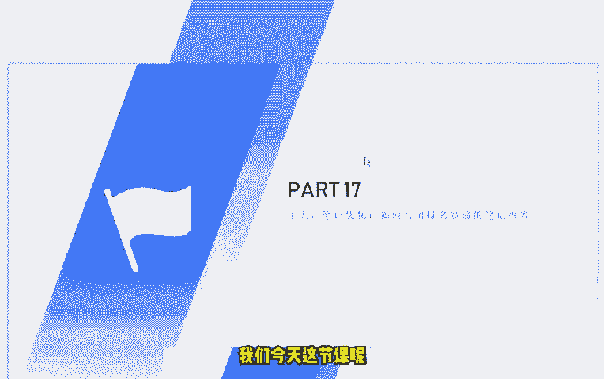

呃，这里呢我给大家去提出来的这个建议呢，是我们采用这个关键词的一个布局方法。题目中呢就带有相应的这个关键词。好，我先这个直接给大家演示一下吧。😊，啊，首先呢我们的这个小红书的标题要怎么去写呢？

比如说我们刚才上一节课讲到的这个祛斑，对吧？我们来和大家看一下这个祛斑的一些关键词。😊。

啊，大家可以看到我现在搜索的呢是这个祛斑，对吧？祛斑的话呢，我们就选一个比较呃常见的一个标题吧。比如说。怎样祛斑简最简单最有效，对吧？比如说我们要写的是这个标题。

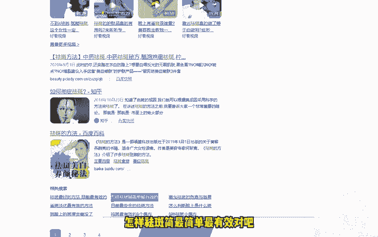

好，那怎样去判最简单更有效？这个时候呢，我们可以在后面加上一个否定，对吧？这些知识。😊，你知道吗？对吧？好，我们比如说做的就是祛斑这个这个词，那我们现在去发掘出来怎样怎样祛斑最简单最有效。

这个词呢在百度里面搜索的人是比较多的。那同样的在小红书里面搜索量呢也是肯定是很多的。因为人嘛总要是有一些这个相应的这些搜索需求的，对不对？好，我们写出来这篇文章之后，标题首先是定了。

肯定是要包含这个关键词的，怎样祛斑，或者说祛斑，对吧？最起码是包含这个关键词的，对不对？😊。

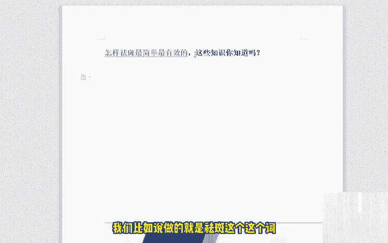

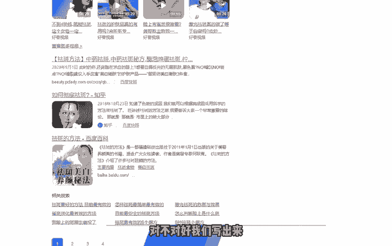

好，那我们这个标题定下来之后呢。😊，好，我们这个标题定下来之后呢，我们开始写写正文的内容啊。😊，好，这个正文的内容我们到底是怎么去写的呢？文章呢我给大家建议的是什么呢？

文章呢我们这个主题内容呢主要就围绕着这个关键词去写了，包括文章的正文开头啊，中间结尾都要带一下这个关键词。比如说我们现在写的是怎样去拍最简单最有效，对吧？我们再看一下这个搜索引擎里面的。😊。

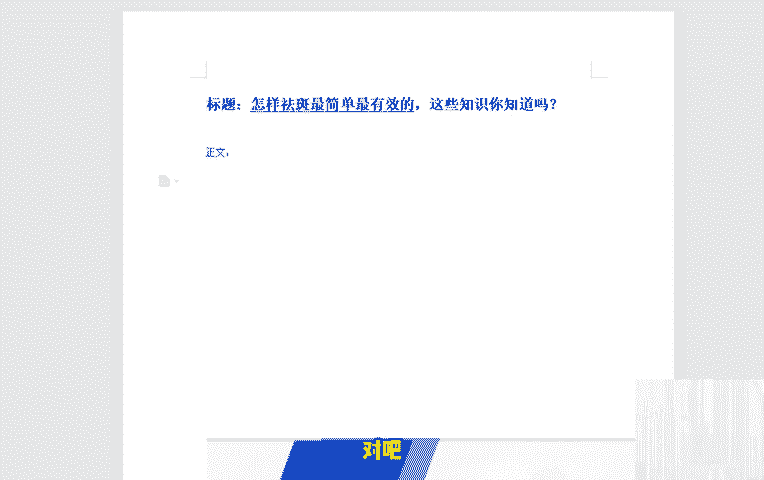

百度里面搜索出来的这个这个词。那前面呢教大家一个方法，前面这几个呢都是广告，我们就不要看了。这这些都是医院里面或者说一些机构里面的这个广告。你看这是医院的广告，医院的广告，医院的广告美容中心的广告。

这几个前面这几个呢我们都不要看了啊，开进去的话呢都是那个医院的广告对我们来说没有什么太大用处的。我们可以看一下这个百度经验，或者说像这个优势广告我们可以不看啊，比如说这个网站里面啊，这个B站里面。😊。

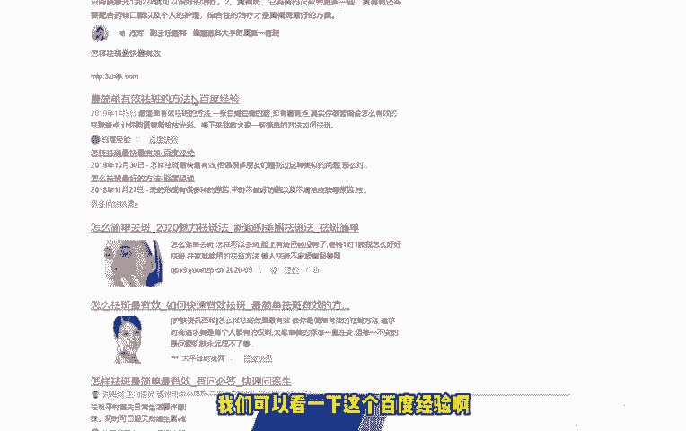

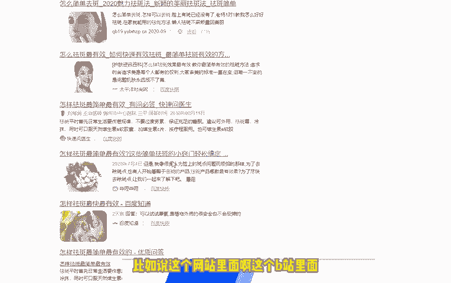

这个指道里面对吧？我们去搜索一下这里面到底是有哪些东西。对吧怎样去呃去办最最有效最简单，对不对？好，我们这样子去做了之后呢，下面一步该怎么做呢？下面一步的话就是开始布局我们的关键词。那我们正文的话呢。

我刚才说了，主要是分为开头。😊，中间。结尾对吧？这个开头中间和结尾呢，不管你怎么去写，不管你怎么去写，怎么去优化，或者说怎么去呃写的很浮夸也好，或者说很很很好也好，或者说很平稳也好，这个都无所谓。

这个真的是无所谓。但是开头中间和结尾一定要带上这个关键词。😊，一定要带上这个关键词啊，一定要带上带上带上。然后你的整篇文章呢。不要写一些其他的一些这个内容相关的一些那个内容了。

只只能围绕着怎样祛斑最有效这个点去写。啊，然后在开头里面呢，记得一定要带上这句话，开头中间或者结尾一定要带上这句话，不要很生硬的去带上啊，不要去刻意的去带上，就稍微提一下，对吧？😊。

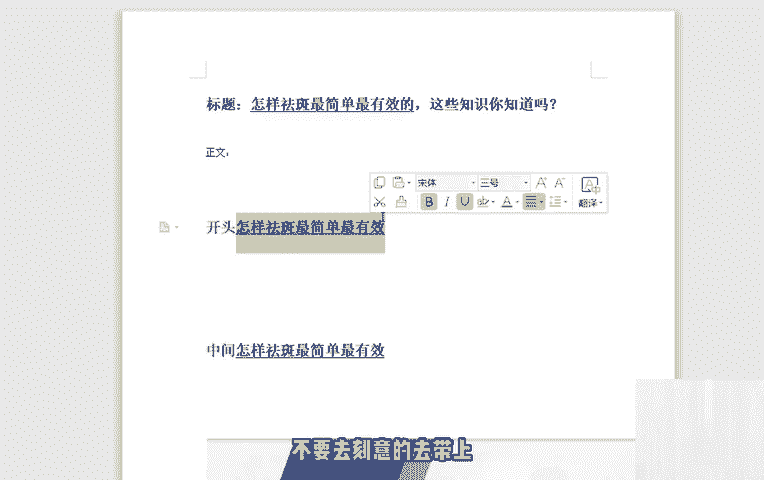

为什么要这样做呢？因为这样做的话呢，这样做的话呢，就会非常符合我们这个搜索引擎的抓取的一个算法。那么可能可肯定很多人在写这个小红书文章的时候，就写的比较随心所欲，对吧？我想怎么写就怎么写，对吧？

我甚至说一句话或者说两段话都可以去写完。那么其实小红书文章，它写作的一个写作的一个规律呢，或者说写作的一个方法呢，它都是有一定的科学科学依据去做的。我们大家可以看看一下这个百度里面的文章，大家都知道了。

第一页里面的这个百度文章，为什么它会排在第一页。😊，啊，你看人家标题是喊的这个，我们去搜一下。😊，最简单吗。区8这个时我们来看一下。它出现了多少个。啊。祛斑。祛斑祛斑祛斑看到吗？

你看它特别是这个尾巴的话，你看有效的祛斑。啊，他的这篇文章呢，它的布局呢你可以看到这个黄颜色的这个字啊，对吧？😊，他在开头标题开头中间结尾都有带上这些词，所以说它才能够被搜索引擎去爬取到第一页。

比如说我们可以看到哔哩哔哩刚才那个篇文章。

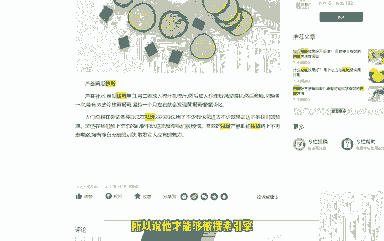

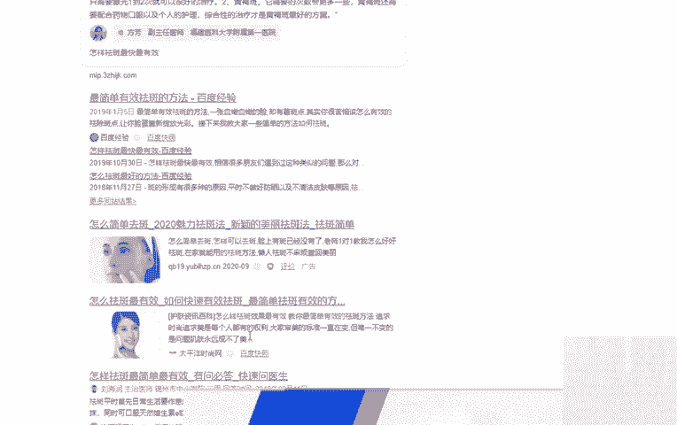

啊，应该是。

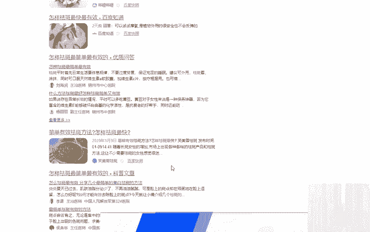

啊，应该是这个应该是这篇文章，它还是他还是排名比较靠前的对吧？我们同样写小红书文章的话呢，如果说你每篇文章结构都很松散，没有这么科学的去写这个去写这个词，或者说没有结合这个词去写这篇文章。

那它的排名是十分糟糕的，甚至说不是十分理想的啊，所以说我们在在写文章的时候呢，一定要注意一下这个问题。另外呢图片中加上这个关键词的一些标签，包括结尾处呢加上一些这个关键词的相关的一些话题。这样子的话呢。

更有助于说我们这篇文章呃，比较精准，或者说比较直接，对吧？😊，呃，那么还有一个需要给大家注意的是什给大家说的注意的是什么呢？就是不能出现太多的这个相关的一些关键词。因为太多的话。

搜索引擎就觉得你十分太刻意了，对不对？你不能说说两句话，说一句话，非要带上这个词也不行，对吧？但我们再把这个文章这篇笔记发布完了之后呢，我们可以做一些什么呢？就比如说可以做一些这个基础的提高啊。

比如说用自己小号去搜索，给这个笔记啊，去点赞即可。但是这里呢给用自己小号去搜索给笔记去点赞了，又有很多人做不会，有很多人做的是错的啊，直接直接他拿起手机打开小红书搜这个关键词搜之后，打开自己文章。

点个赞好了，手机关掉下一个号其实不是这样做的，真的不是这样做的。我们要模拟正常人的一个用户去读取到我们小红书文章的一个感觉一个步骤，对吧？就是说第一个要慢慢的去阅读。

第二个呢不要一下子去拉到最底下面就去点赞，或者说就去评论啊，一定要是看完慢慢慢慢的阅读完之后，图片点开来看一下文字慢慢的看完之后，然后你再去点赞，如果说你刚点开这个文章，一秒钟或者5秒钟，你就去点赞了。

或者说。😊，干嘛了？那小红书就会判断你这个人肯定是个机器号，或者说你肯定是个小号。😊，对吧那么对于一些这个小红书文章的一些关键词的排名呢，大家也可以看一下。

比如说我们的关键我们的笔记排名上不上上不上去啊，有一些什么样的优化的方法呢？这里呢给大家建议的呢是我给大家建议的是重新选择相关的关键词。包括我们重新去写一些笔记。直到你把这个关键词优化优化好为准。

如果说你不太知道自己怎么去选择这个相关的关键词呢，你可以去看一下这个上面一课，也就是第十六课，好好的看一下这个第十六课里面的一些内容。😊，好，还有一些这个嗯朋友会问问这个排名老师会掉怎么办啊？

其实这个是很正常的，我们只要继续创作优质的笔记就可以了。甚至说我们可以去多个账号共同去创作，这个也是可以的。因为大家可以看到那么多个相关的这个词呢，几百个几万个都有，对吧？

你每个行业都有一些这个相关的词都可以去做。😊，呃，还有一个问题就是说大家非常关心的就是人工排名的这个到底靠谱不靠谱啊。其实人工排名呢它的风险是比较高的，而且呢排名的时间是比较短的。

大家可以根据你们自身的需要来进行去选择。比如说你只要能够去排名排到前面，或者说只要维持这一段时间就可以了，那也可以，这个也可以。😊，但是呢我不建议大家去做这个人工排名啊。如果说你是个人的话。

我不建议你这样去做这样子呢，第一个成本比较高，第二个是没有什么太大的一个效果。😊，好的，那我们今天关于这个小红书的笔记发布的内容呢，就和大家讲解到这里。😊。

