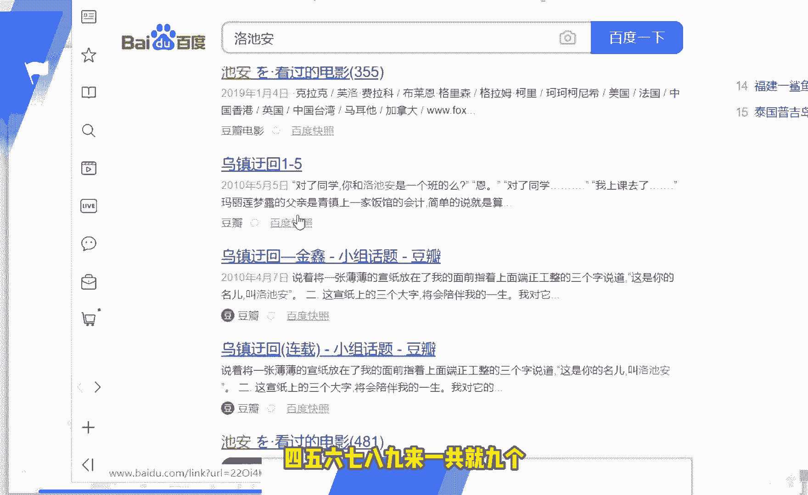

# 2024版小红书体运营教程】全B站最良心的小红书开店运营高阶教程合集，小红书体开店 起号真的快 - P22：21.第21节：小红书引流最新方案，再也不怕号被封了！ - 体温计爆炸 - BV1ym421K7XQ

今天呢我们给大家讲解的是这个小红书的第十八课快速引流。呃，最新的教程呢教你从这个私信上留微信，不被去屏蔽。那实际上呢今天这节课呢主要是和大家讲解这三个小点。

呃，我们真正的意义上来说的话呢，是为什么会留微信啊能够被这个小红书给屏蔽掉呢？因为很简单，因为我们留的就是微信的联系方式，对吧？不管你怎么样去打错别字也好。

或者说不管你怎么去研究这个微信的一些呃变相的图片啊，或者说变相的数字啊，这个最终还是会被这个小红书的一些呃这个预警机制呢给发现。那么我们今天这节课给大家介绍的这个三个方法呢，就能够有效的避免这个问题。

从根本上呢解决到这个问题。因为我们在小红书的私信里面呢，就根本不是发的这个微信。这样子的话呢，那小红书就检测不到了。😊，首先呢我给大家呃讲一下，我们第一个步骤呢是要构筑自己所所属的这个品牌词。

我给大家打个图片看一下啊，比如说我们大家打开这个图片。😊。

打开这个百度的一个搜索，刚才搜错了，百度的一个搜索。这百度的搜索我们打开了之后呢，你就会发现我随便打了一个三个字，比如说这个东西叫洛之安，对吧？这个洛之安呢，你可以看到它的这个在百度里面搜索呢。

就有一页，而且呢是没有没有一个完整的一个东西叫洛驰安的。你看123456789啊，一共就9个。😊。

那9个这个关于洛洛驰山的这个呃就是这个搜索结果呢，说明它是非常少的。我们就可以根据这个关键词呢去打造成我们自己的这个品牌词。😊，那当然了，大家自己呢还可以去随便的测去测试一下。

这里呢我就不给大家去多测试了。总之呢就三个杂乱无章的这些词呢去排布一下，排布一下呢就能形成一个特殊的一个关键词。那这种关键词的话呢，你看百度的搜索结果不超过10个这样子的这个关键词呢。

我们就可以拿过来去使用啊，这个是非常非常可以去呃我们去用这个SU去布局的。那么第二个呢就是私信用户的这个品牌词就可以了。比如说我们在跟用户私信的时候呢，经常发的这两句话是什么呢？啊。

比如说亲我们洛驰安这个品牌正在做全网活动，您可以百度查看哦。😊。

啊，或者说百度搜索洛之安有你想不到的惊喜，这样子的话呢都是可以的。那还有一种是什么呢？啊，百度洛成庵。😊。

啊，这样子都可以，大家可以看一下，为什么能够让别人引导去搜索这个词呢？因为他在百度上去搜索了这些词之后呢，我们就有一些对应的属于我们的页面出来啊，等一下呢会给大家去详细的讲解到。

就比如说他搜索这个洛之山这个词呢，那这个词呢品品牌呢全正在全网做活动，对吧？您可以去百度查看一下，或者说呢啊洛之山这个呢有你想不到的一些惊喜啊，或者说有你呃有你想要的这个全网最低价。那这个这样子的话呢。

别人就会去百度里面去搜索这个词。那一旦去搜索这个词呢，就会提前来到我们刚才布局的那个页面。为什么我跟大家说的是要私信用户这个品牌词，能够诱导这个用户呢去搜索我们的品牌词呢。😊，啊，因为这样子的话呢。

别人才能够有动力。比如说你你告诉他，通过特殊的这个通过这个关键词渠道，就能够找到全网最低的一个优惠券，对吧？或者说通过这个渠道就能找到全网最低的一个价格。这样子的话呢，别人就会有动力。

就会有一些这个相应的一些动机去搜索，去百度里面去搜索咱们的这个词啊，这样子的话呢，就能够来到我们的这个第三步。第三步呢也就是我们去布局这个百度的SEU。😊，比如说我们可以去提前布局呃这3块的内容。

这3块的内容呢几乎都是秒收录的。我给大家推荐的这个三个内容呢，几乎都是秒收录的。大家可以用手机呢注册一些百度贴吧、知乎和简述的这些账号，然后用这些账号呢去发布相应的内容就可以了。😊，那发布的时候呢。

大家一定要记得我们的这个标题内容一定要带上我们的这个品牌关键词。如果说你你是不带上的话呢，它百度是没有办法去搜去把它收录的。就像咱们这个里面，它是没有办法去收录的啊。

所以说呢咱们一定要是提前呢在这个里面去提前的把它对应的去做好。😊。

那如果说我们提前做好了这些百度贴吧知乎和简书的这个工作呢，其实时间也不要长啊，最多也就是不是超过一个星期，5天的时间我觉得就应该足够了。这个百度贴吧和知乎还有简书的收入概率呢是非常大的。

那么我们在发布这些内容，发布这些呃帖子的时候，除了标题要带这个内容之外呢，还要注意什么呢？就是我们发布的这个内容呢，我建议大家可以分成两种情况去发布啊。第一种情况呢，就是我们可以去做活动，然后呢。

让别人去加微信。就比如说呃你想买的这个口红。😊，呃，通过搜索了我们的这个微信，然后呢给微信客服发发送洛驰安这三个字，对吧？我们就会给你一个官方最低价。这样子的话呢。

别人就会去通过这个方法呢加到我们的微信，然后呢去看一下到底有没有这个优惠，对吧？那我想大家呢应该是每个人都有自己的一些这个品牌渠道了。这个渠道呢的话呢我想大家都是应该不用愁的。

就像我之前发的那个朋友圈一样，现在的这个网络网络营销的这个年代呢啊，应该没有人缺自己的一个产品，对吧？真正缺的是一个流量和一个变现的一个思路。😊，那所以说这种低价的呀，或者说大量的一些呃优质的一些东西。

大家应该都是有非常有竞争力的。😊，那么第二个呢就是咱们可以做一些正向的引导。比如说在他去加到咱们微信之前呢，我们就已经给他说出来了我们的这个聊天的一些话术，包括一些软文的故事。

就比如说别人加到我们的时候，我们正常会跟他聊一些什么。这个东西多少钱？这个东西从哪里来的？这个东西为什么在我这有这么便宜？那这个东西为什么在我这值得购买。大家尽量就围绕着这几个话题呢去做一些分享。

去做一些这个内容。做一些这种正向内容的引导之后呢，啊，别人呢就会能够提前了解我们的一些东西，提前了解我们的东西之后呢，我们再通过一些比如说其他一些软文故事啊等等等等，对吧？

最后再留下我们的这个微信的联系方式。这样子的话呢，整个的这个。😊，啊，整个整个的这个就是说呃宣传的一个过程呢，就不会显得那么突兀。所以说这个方法呢也是非常不错的一个方法。大家可以去测试一下。😊。

