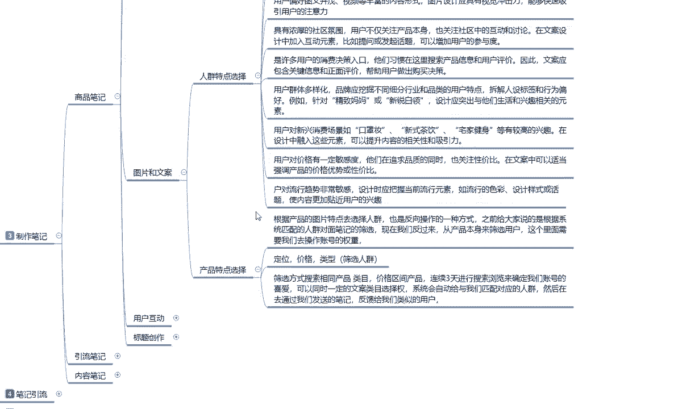

# 2024版小红书体运营教程】全B站最良心的小红书开店运营高阶教程合集，小红书体开店 起号真的快 - P22：22、小红书【商品笔记】制作：图片文案设计-人群特点选择 - 幼稚园拾荒者1 - BV1WRHseoEdh

大家好，今天给大家分享的是小红书全集系列，分享的第五大课时，小红书笔记制作，第三小节笔记制作的一个内容。

结合我们上节课给大家讲的啊，上节课给大家讲到哪了，封面设计啊，我们所封面了解的一些设计方式。

和比较适合的一个类型，这节课呢给大家讲解一下图片和文案。

图片格和文案，这里面的话说实话啊，它整体内容是非常大的，但是我给大家把它优化掉了，就说只给大家讲重点，同时呢也要让大家理解一下什么叫图片和文案，首先我们从人群的一个特点来进行，进行分析和选择啊。

他只是说进一步的了解，我们目标的一个定位群体，让我们好确认到底怎么去做好吧，首先是人情特点的一个选择啊，嗯小红书用户的话，他是以年轻人为主的，特别是九零后，他们的话就说目标性人群的话，你我们所选择的。

只要是你在做小红书的购买商品的选择性的话，他基本上都是在一线二线城市，三线四线五往后五线城市也好啊，其他城市也好啊，都比较少，他主要的消费能力集中的话就是一线城市啊，二线城市北上广深啊。

一线城市包括二线城市，各大武汉这种大型的一个聚会场所，他们女性对于自身的要求的话是非常高的，同时他们也具有较高的一个消费能力，因此设计的时候就需要考虑，这一群体的审美偏好和消费习惯，什么意思呢。

小红书上面它有一个搜索区域搜索啊，我们展示的时候他有一个啊推荐一个搜索，一个同城，知道吧，一个通城，这是三个点，还有第四个点嗯，关注收藏更新的这个，我后续会给大家详细的解释。

就说大家现在只要了解这四个点，我们在这个里面的话，其实每个城市它都有每个城市的特点，同时在小红书上面，每个城市所展示的特点面它又不一样，那我们选的时候基本上都是选一二线城市，但是我们所居住的话。

可能是三线城市，四线城市或者是其他的一个偏远地区，只说我这边我有我好多东西，我想推荐到医药城市，但是我没有这个能力，通过小红书这个方式啊，把我的商品卖给一线城市，二线城市喜欢漂亮。

喜欢时尚的女性用户或者是男性用户，所以我们在选择的时候，小红数字的话，它整体都是以年轻女性为主，那么我们在制作笔记的时候，每一个城市它每一个的风格不一样啊，大家要搞清楚一点。

城市与城市之间的风格都是不一样的，而且城市与城市之间，人的一个习惯穿搭它都是不一样的，我们选的时候，一定要把它的整体的位置范围弄准确，通过一个城市辐射到另外一个城市，比方说上海吃的喜欢甜的啊。

他们吃饭也好啊，花砖也好甜的，然后穿着清凉的保守对吧，虽然说每个城市都有，但是他们有一部分的区别范围，你做甜品，做食品的，你往上海那边推，绝对没有错对吧，你在北京要庄重一点，优雅一点，对不对。

你在广州深圳要活泼一点，开朗一点，这个都是产品人群特点选择的一个方式和方法，我们要往这个方面去靠，就是说我们在选择的时候，制作商品的一个笔记也好，你制作引流笔记也好，制作内容笔记也好。

都要往这个方面去靠，吸引他的一个人群，通过这一部分人群反复的进行发酵，懂意思吧，用人群扩散人群，你就是时尚的引导者，你就是时尚时尚的引流者，或者说是美食的宣传者，你要给自己定位的时候。

要给自己明确自己的定位目标，第二个点就是用户注重的内容，它是真实性的一个质量，他们倾向于宣传专业和真实的一个评价，因此文案和图片应体现出商品的实质性内容，和真实的一个用户体验。

意思就是说我们在做小红书的时候，不要弄虚作假，因为这帮人非常挑剔啊，我说句实在话，小说小红书女性用户，你可以说他们笨，你可以说他们傻，但是你不得不承认他们非常挑剔，所以说一定要满足这个点啊。

真实性和质量产品不过关，在小红书上面卖可以卖，但是你只能做一次性过场，这个号卖两个月，废了换一个号，但是你有多少时间多少精力，这种收割韭菜这个行为的话，在小红书上面你做不长久的啊。

你包括在其他地方你都做不上去，所以说我们在注重点的时候，一定要注重内容的真实性和质量，同时呢用户偏好的话就是说啊图文并茂，什么意思呢，图片要有文字，要有内容，要有文案，也要有缺一不可。

根据产品我们自己去划分啊，因为我不知道各位的话，就说看我视频的朋友也好啊，兄弟姐妹也好，我们在了解这个一部分内容的同时啊，你们是根据自己的产品去设计自己的logo也好，自己的产品外观也好。

自己的产品美图也好，都是要根据自己去做的，而不是说我只是给大家了一个方式，方法和方向，让大家进行了一个了解，第四点呢就是说什么呢，具有浓厚的社区氛围，像我刚跟大家说的，一个人可以传染十个。

十个人可以传染100个，他觉得这个好看，这个庄重，这个装哑对吧，这个饰品大家不说，这个指甲油颜色非常好看对吧，这个口红涂的非常漂亮，从这种一传一一传十，一传百分这种方式去累加的，所以说我们要把氛围做好。

对不对，我们做图片的时候，可能你可能宣传的话是一个人，但是你想把它做大，你就要宣传群体潮流潮流时尚新导向啊，口味独特等等风格，你要把它凸显出来，包括后续的这些，大家可以看一下，当然了。

我在这里呢只是说啊，通过我所查找的资料和我个人的一个分析，给大家的一个建议，小红书呢它是许多用户消费的一个决策入口，他们习惯呢在这里搜索产品信息，和用户的一个评价。

因此文案应该包含关键信息和正面的一个评价，帮助用户做出购买的一个决策，就是他喜不喜欢你，在这个地方需要我们去引导的啊，不不要靠用户来引导，这个里面的话，就涉及到人与人之间的一个思想沟通。

你要想办法去引导用户，搜索你们的一个产品信息，这个的话说实话，它主要的话就是说针对内容笔记进行宣传，懂我意思吧，通过内容笔记引流到引流笔记，引流笔记的话，它的一个扩散面积比较大。

内容笔记的话他是精美的一个笔记，内容故事也好，图片也好，文案也好，情节也好，通过这种内容的一个笔记，让顾客吸引到了对你的产品，对你的账号，对你这个人或者对你其他的东西感兴趣，然后观看你其他的一个产品。

其他产品是什么呢，引流产品和商品笔记，应该说是引流笔记和商品笔记，然后他们会去观察引流笔记偏多，为什么他是我们流量的主要来源，观察流量笔记，然后在不经意间发现你店铺的商品笔记，然后去你店铺里面成交。

因为小红书它本来就是一个，本身就是一个种草平台，而不是收割平台，你不是割草机啊，你想在小红书上免费去拿割草机，一茬一茬的割，不可能，所以说你要先种草，等它长大了啊，他自己慢慢的脱落也好。

慢慢的接受你也好，你再去割，H拔对吧，这就是你丰收的一个果实，下面呢就是说用户群体多样化啊，品牌说实话，品牌应该品牌的话应该挖掘不同的一个行业，细分和品类的用户特点，说实话你们如果是真的是团队去做的话。

前期的话尽量也不要投入太多啊，因为小红书你前期投入太多，说实话他对于这个消费能力这边的话有点坑啊，就是他的平均税收的一个税点有点高，你前期如果说直接大规模的投入的话，你的收入和投入不成正比啊。

这个大家要注意点啊，他整体方法就是解析人士的一个标签，行为标签，例如针对金子妈妈或者新锐白领啊，或者说是就是我们做团队的时候，你们在设计这一方面的突出，他们的一个生活和兴趣相关的一个元素也好。

或者是其他的一个方面也好，你想去做引流也好，做产品也好，做商品也好，做博主也好，突出重点的去介绍，把自己包抄了，你就算是一个人，你也要想办法把自己包装成行业大佬，你才有吸引力，懂意思吧。

就是我们在操作小红书的时候，你没有团队，别人问你，你都要告诉他，我这边的话有很多同类的一个兴趣分组啊，群也好，内容也好等等，宣传你自己，你只有宣传多了以后加了一个人，加了十个人，加了百个人。

他们结合到一起，你把他们拉一个群，他们也不知道你到底是什么样的实力，这就是信息差，好吧，最后三个点呢，呃在这里呢就给大家大概的讲一下啊，因为时间的话也比较紧，用户对新的一个消费场景，比如说口罩装也好。

新式茶品饮也好，宅家的一个健身器材也好，等有兴趣较高的一个形象，说实话啊，在小红书里面，女性她是很注重自身的，是不是又胖了啊，我要减肥等等，他就看你们自己怎么选啊，这小红书市场是非常大的。

只要你针对的目标是对的，人群是对的，商品没有问题，非常好做，价格方面啊，说实话，小红书用户对价格有一定的敏感度，他们在追求品质的同时也关注性价比，在文案中可以适当的强调产品的一个价格优势，或者性价比。

说实话啊，这一部分资料里面，大家在小红书上面做价格的时候，价格可以稍微高个0。5到0。7左右，懂意思吧，把自己的产品价值拉起来，不要做低端消费者，你要做的是高端和中高端的一个用户前群，他们是什么呀。

一二线城市的女性对自身要求很高的，他们所选择的内容的话，虽然说他们很挑，但是他们舍得花钱，所以说我们尽量的话，就不要搞那种一般的和差的，一般和差的话，说实话你做那种小众的，做3000层四线城市才行。

小红书上面说，一二线城市的话，你必须选得选高端和中高端好吧，嗯因为时间的一个原因，那这节课呢就给大家到这。

我们还有一点点内容没给大家进行讲解啊，最后呢就给大家讲解一下。

就是用户啊，小红书对用户对流行的趋势他是非常敏感的，设计的时候应该把握当前的一个，简单说当前那个流行元素，你们去找找那种美妆博主啊，或者说是那种抖音上面跳舞啊，啊那种穿搭的一个视频，截个图。

做产品图片都是非常不错的，第二个大点就是产品的一个特点，选择这个的话说实话是比较容易的，大家看一下就可以了啊，根据产品图片的特点去选人群，也是反向操作的一种方式，之前给大家说的是根据系统匹配的。

上面这些是根据系统匹配的，下面的话就是说有一部分，它是根据我们这个反向操作啊，大家要理解反向操作这个词，你就会做，你不理解的话，说实话你先走正路啊，再去考虑反向操作吧，今天给大家说的话。

就是说嗯冲产品本身去找客户群体好吧，然后客户群体里面的话，一个定价，一个定位，一个类型筛选人群，把它用反的一个思维去操作就可以了，就是我的用户，我的产品适合什么样的用户，适合什么样的人群。

就是我之前给大家讲的时候啊，这个里面反着来通过产品去找人群，之前我们是通过人群来找产品。

好吧，那这节课呢就到这里，下节课呢给大家讲解一下。

