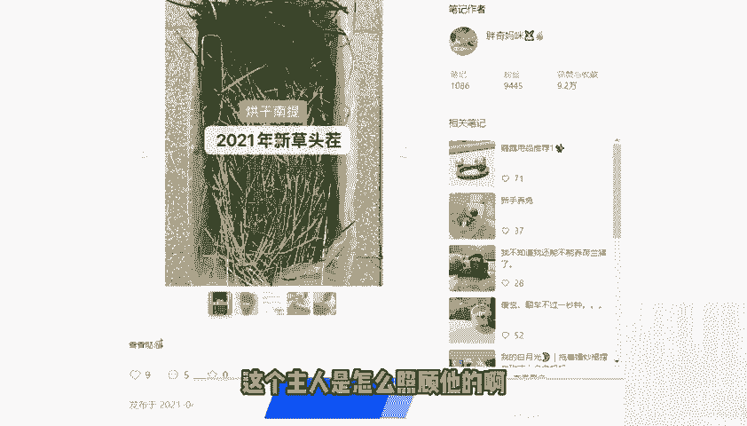
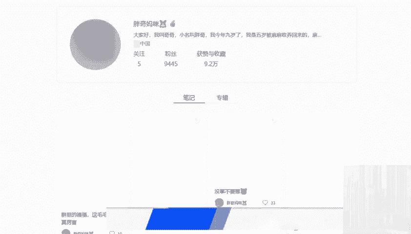
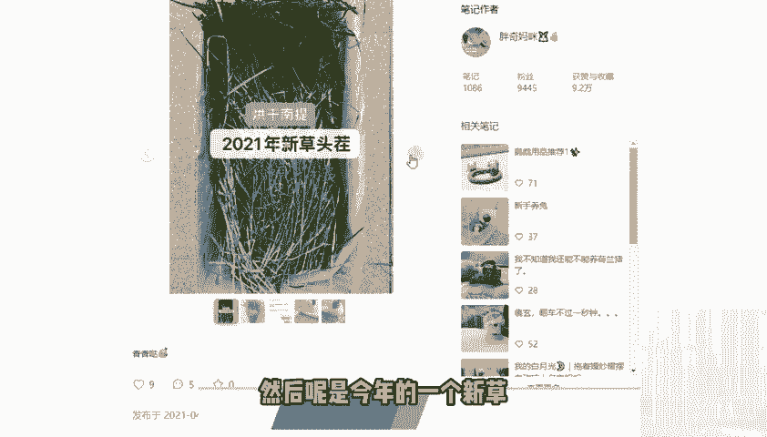
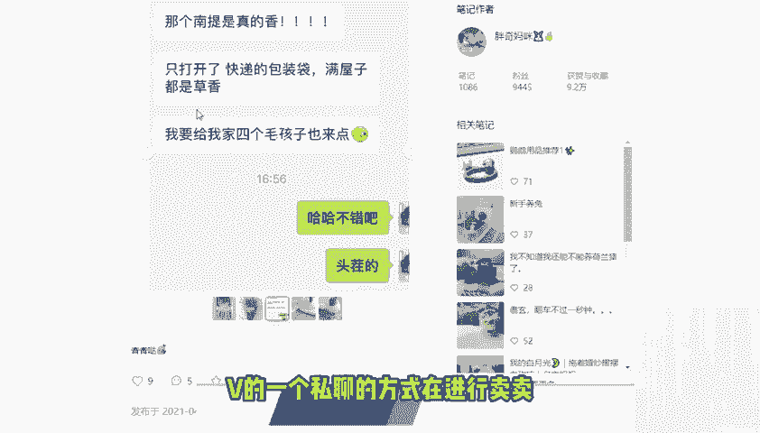
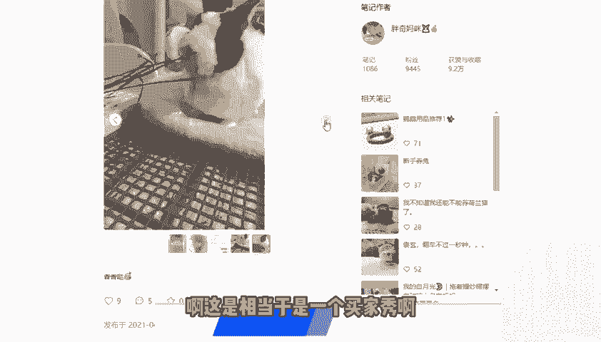
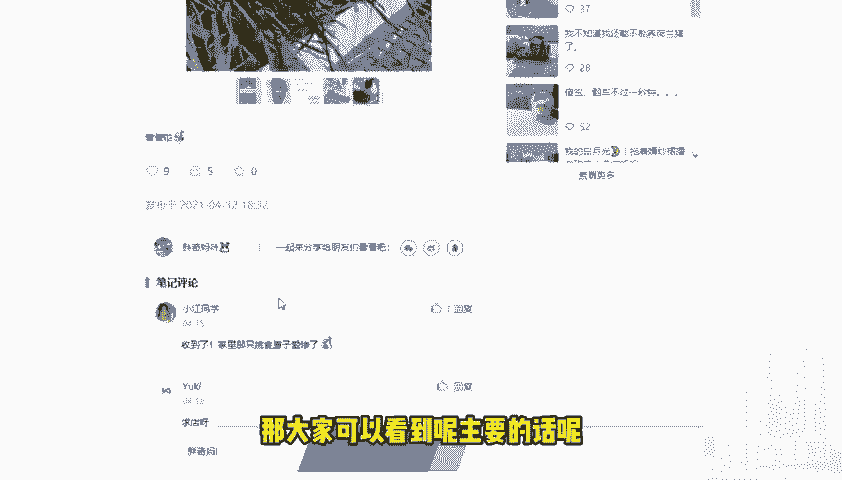
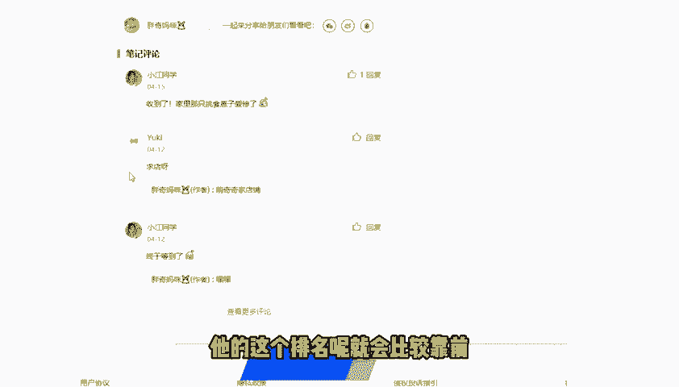
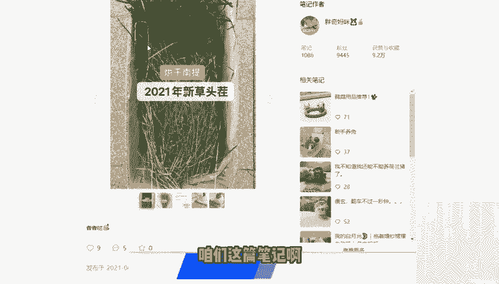

# 2024版小红书体运营教程】全B站最良心的小红书开店运营高阶教程合集，小红书体开店 起号真的快 - P29：29.第29节：小红书最全导流技巧，运营小红书再也不会被封号！ - 咖啡好苦诶 - BV1xZ421s7Eh

今天我们这节课呢给大家带来的是小红书的第二6节课，也是我们小红书。大家比较在意的一节课，就是这个站外导流安全不封号的一些玩法。那么我们大家都知道，不管是我们在这个小红书里面如何进行更新。

或者说如何进行这个操作啊，我们花了那么多时间，那么多心血。在小红书里面。最后我们想要得到的一个是什么呢？就是把小红书里面的这个流量呢去导流到我们的个人微信号里面。然后呢，在微信号里面达成一个变现。

或者说达成一个这个裂变的这么一个作用。那其实不管是导流到我们的这个微信啊，或者说导流到一些其他的站外平台。这这个的话呢我们统称为站外导流。因为有的有的一些这个朋友呢。

可能他们开的是一些这个比如说是淘宝店，可能是自有的一些品牌，可能是APP啊，所以说大部分的一些情况呢，可能就不是这个简简单单的一个微信的一个导流。

所以说今天这节课呢就给大家去统一讲一下是吧这个所有的这个导流呢叫站外导流。呃，那么首先今天这一节课呢主要是和大家讲的是这个评论区的一个引流。那说到这个评论区的引流呢，给大给大家说到的呢。

还是最多的还是这个控屏的一个引流。因为控屏的这个引流呢还是能够增加我们相应的一些用户的一些信任的，促进下一步的下一步的这这个行动。那最常见的这个控瓶的一个引流呢。

比如说我们在发布了一个呃某种某种东西的一个种草的一个笔记之后呢，那底下呢会有两种人两种人设进行这个评论的引流。那第一种的人设呢就是我们的这个达呃达人屏控屏。那第二种呢就是我们素人素人的一个控屏。

那这两种控屏的话呢，我希望大家在做的时候呢，一定要区分开来，不要把所有的这个控屏呢去混为一谈啊。因为每个这个角色去带动底下的这个气氛呢是完全不一样的那就拿我们这个达人控屏来说的话呢啊达人控屏的话呢。

在这节课里面，我所要讲到的意思是什么呢？就是说这个啊这个人设呢他本身具有一定的这个粉丝的一些影响力啊，是一个这个博主类型的那可以是你自己的这个大号，也可以是你别的一些矩阵号。

或者说是你朋友的一些这个达人号。那这种达人号的话呢，基本上在底下空明的话呢。啊，我建议大家可以以什么样的一个口径，或者说以什么样的一个方式去进行这个评论的引流呢？比如说这个面膜啊。

某某月份才有的这个活动，现在呢居然这么便宜。然后也可以说呢啊这个面膜呢到现在的话，第二盒就不要钱啊，相当于是买二送一，对吧？第二盒是不要钱的。那这样子的话呢，就能够起到我们达人控屏的这么样一个效果。

达人控屏的话呢，主要还是从呃你正你是已经使用过的这个场景来进行一个控屏的。那么第二种呢就是我们大家经常用到的一个素人控屏。那说到这个素人控屏的话呢，呃这个素人的话呢，我这里给大家解释一下。

就是说你的这个账号呢没有什么一些影响力，简简单单单呢只是一个普通的一个账号，那这种普通的一个账号呢，甚至说是你的这个小号，没有相关的人设打造，只是有一个简单头像，有一个简单的性别，对吧？

可能是你这样的一个小号，那这种小号的话呢，基本上该怎么样去引流了。那主要的话呢是说一些这个使用的一些感觉从这种个人的感受出发。比如说第一点对吧？集美们我找到了这个店的店名呢是某某某某某，对吧？

第二个呢可以这样说啊，我知道这个是某某某的品牌，之前呢也送给买过送给闺蜜，超级好用。😊，啊，我身边的我身边的这个女生呢都给我种草了，你可以往这个方向去戴。如果说你是这个素人空瓶的话呢。

就基本上可以往这个方向去带。😊，那不管我们这个评论区引流啊，它到底是怎么样去做的呢？其实呢我们大家都注意到应该有一些这个注意事项啊，这里呢给大家总结的有三点的这个注意事项。第一点的话呢。

就是我们如果说你是商家进行这个评论的话呢，一定要去避免评论的这个商家的评论评论区的一个回复啊，为什么呢？因为很容易起到一别人一个很反感的一个感觉，就是说你既然是自己卖这个东西的。

然后你自己还说这这个东西非常好，对吧？本身就没有太多的一个幸福力，就有点像这个王婆卖瓜的这种感觉啊，而且呢很容易被别人判定是这个广告的一个嫌疑。

另外一点呢就是我们评论区呢一定不要留下你的任何的联系方式啊，联系方式的话呢，不管在任何时候任何地点在小红书里面呢？😊，如果你是直接留这个联系方式的话呢，还是非常危险的。啊，弄不好的话呢。

会直接导致你的这个评论删掉，或者说你的账号异常。因为我们大家都知道小红书对于这个评论对于这个联系方式的一个这个处罚呢还是非常严重的。😊，那么第三个呢，也尽量避免清一色的一个好评。

就不然呢会显得一些会显得太假了，让别人以为呢那我们这些账号呢都是托。你可以去写一些这个中性的一些评判啊，比如说呃这个牌子我经常看到，对吧？你就可以简简单单说这么一句话，也不说它好，也不说它坏，对吧？

可以啊，多说一些稍微多说一些中性的一些评论啊，比如说呃这个牌子。😊，我只用过一次啊，下次呢我还要继续使用，继续观察，对吧？你可以这样去说，实际上这种偏中性的这种评论的话呢。

已经来说起到了一个带节奏的一个作用了，已经来说比这种呃完全的那种差评啊，或者说完全去喷的那种状态呢，是要好很多的。所以说大家呢也可以去加一些这个其他的一些好评啊，其他的一些这个中评。

不要老是去写这个好评。这样子的话呢，避免别人的一个误会。😊，那么最后一点呢，我给大家去看一个案例啊，就是我在小红书上面找到的一个案例，大家可以一起看一下。呃，给大家看的这个账号的案例呢。

就是我们在这个小红书里面找到的一个叫胖奇妈咪的这个账号。那胖奇妈咪的这个账号呢非常有意思啊，就是说她起的这个他的这个小红书笔记的话呢，大家可以看到她的笔记发了1000多篇，粉丝的话呢是9400多个。

然后获赞与收藏呢是达到了9。2万个。目前来看的这个数据。那为什么要以他作为案例去进行讲解呢？非常简单，就是大家可以看一下我找到的这个笔记啊。😊，呃，他是目他是非常有意义的一个非常有意思的一个笔记。啊。

包括他这这个包括他的这个账号打造呢也非常有意思啊，他主要的这个账号呢是以一个兔子的一个角度去写的这个怎么啊去写的这个主人是怎么照顾他的啊，比如说大家可以看到有什么洗澡呀，有什么去吃东西啊等等等等啊。

在这里面。😊。

啊，我们可以来看一下。

啊，有一些梳毛整理的，然后呢有一些这个啊吃草的等等等等。啊，因为我这里呢是这个电脑演示的，所以说我们看的呢是不是太多的那大家可以看到它这个里面简介呢写的非常有意思啊，是大家好，我叫琪琪。小名叫胖奇。

今年9岁了，我是5岁的时候被妈妈收回来的啊，妈妈是什么样的一个情况。那大家可以看到他是一个兔子的这个第一的第一的一个人称呢去去运营的这个账号。😊，那么这个这篇笔记的话呢。

就比较有就比较有利于作为一个这个典型的案例和大家进行讲解。那大家可以看到它卖的呢是兔子吃的比较多的一个甘草。那这个干草的话呢，大家可以看到是烘干的一个难题。然后呢是今年的一个新草新草的一个头茬。

啊，这里面呢会写的非常清楚。那看大家可以看到第三个截图啊就明白了。它是通过微信的一个呃微信的一个私聊的方式在进行卖卖这个就是兔子吃的这个草。😊。

啊，这是相当于是一个买家秀啊，就是他兔子吃草的这个东西。那大家可以看到呢，主要的话呢，它会在呃这个笔记里面呢去说它的这个兔子草草的一个情况。然后最后是怎么引流到他自己的这个淘宝店铺的呢？啊，也非常简单。

是用一个小号就写球店啊。然后这个时候呢他可以去写啊蒙奇奇家的店铺。那这个店铺的话呢，一般来说都是这个淘宝店铺。😊。

呃，所以说呢别人就能够比较快速的去通过搜索呢来到他的这个店铺。不过我还是不太推荐用自己的大号去回复这个天啊店铺的一个情况。可以怎么样呢？就是说用这个小号。用小号的方式去进行提问。

然后用另外一个小号呢作为回答。然后如何将这个回答提问和回答，让他排名更靠前呢？啊，我们可以找一些朋友的话呢给这个回答进行点赞啊进行点赞。这样点赞的话呢，他的这个排名呢就会比较靠前。

相当于起到了一个置顶的一个作用。这样子的话呢，就算有任何问题的话呢，咱们这篇笔记啊也是不会受到太大的一些影响的啊。所以说呢这个这个案例呢，大家可以去仔细的观察一下。😊。

那我们今天的这个课程呢就和大家讲解到这里了。😊。