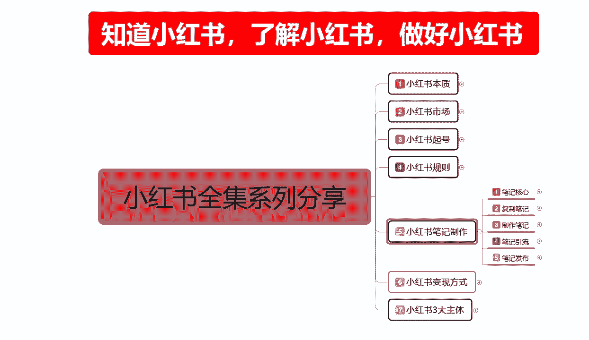
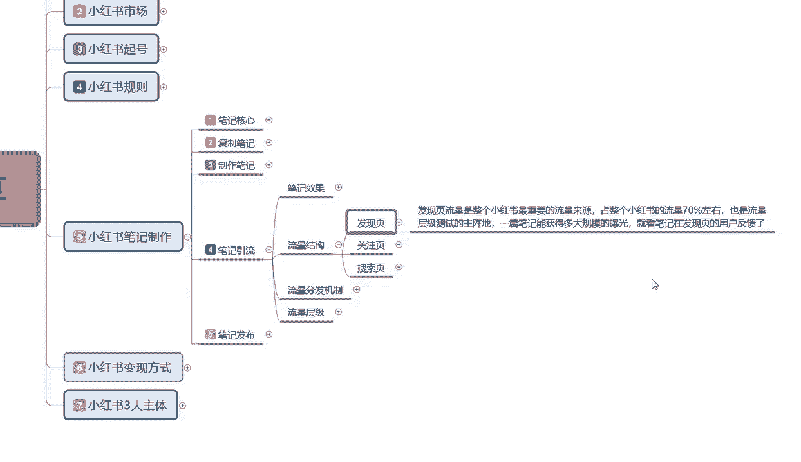
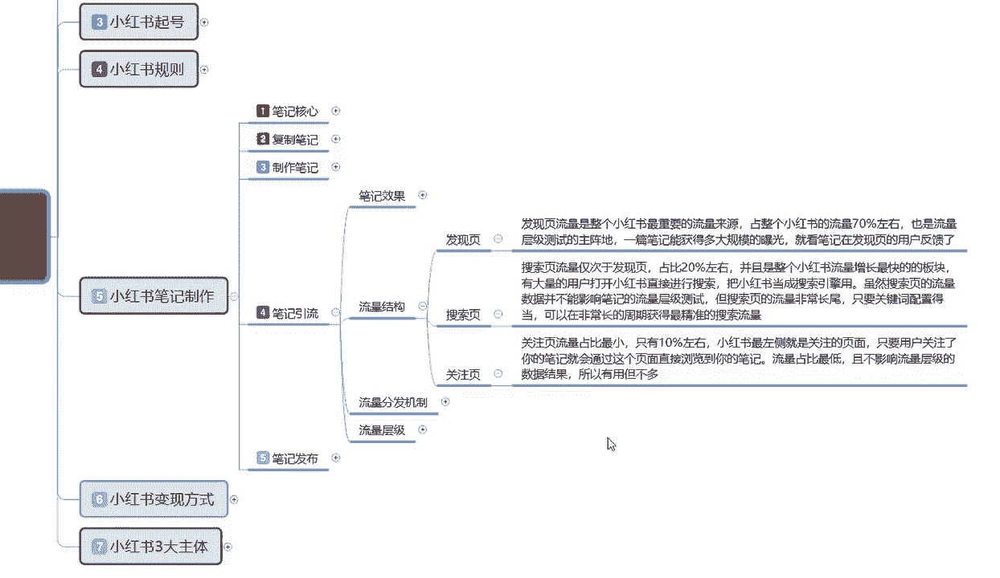
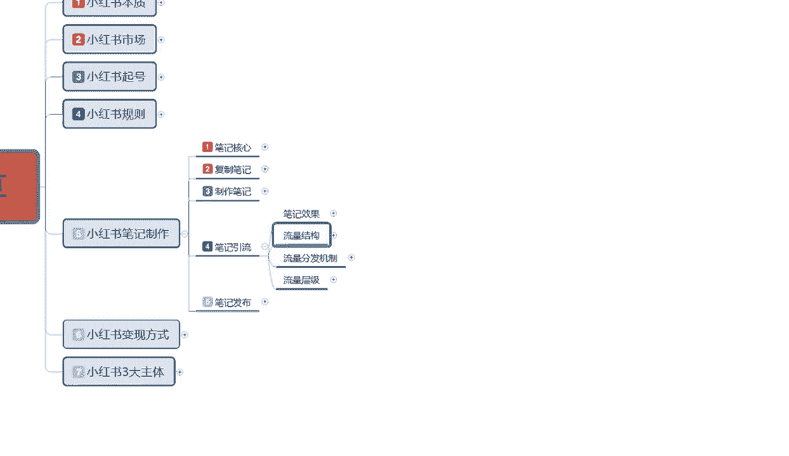

# 2024版小红书体运营教程】全B站最良心的小红书开店运营高阶教程合集，小红书体开店 起号真的快 - P29：29、小红书笔记引流：平台流量结构 - 幼稚园拾荒者1 - BV1WRHseoEdh

大家好，这一节给大家分享的是小红书全集系列，第五大课时以及制作的内容分享，这节课呢主要是给大家分享一下。

我们笔记引流的一个整体流量结构，呃，废话不多说，直接开始我们的一个正题，什么是流量结构啊，这个流量结构的话呃，因为之前呢给大家说过流量的话，它是有一个呃笔记的一个整体引流效果。

这节课给大家讲的流量结构呢是小红书，整体流量分布和流量来源，主要就是说让我们大家了解我们什么样的笔记，投入到什么样的地方，他们能获得什么样的效果，小葫芦笔记里面整体的一个流量结构的话，其实是分为三个点。

第一个是发现页，第二个是关注页，第三个是搜索页，我们大家只需要把手机打开，就可以在手机上面啊，第一个页面发现一个关注，一个一个发现，还有一个本地城市的一个页面，显示这个城本地城市页面显示呢。

我在这上面呢是没有给大家进行标注的，因为他的话是额外给大家进行讲解分析的，他这个的话我们现在看到的是两个，一个发现，一个关注，还有旁边一个放大镜，那个是搜索，这是三个主页面啊，那个本地的页面的话。

现在对我们来说它不是太适用，他比较适用的话是做分析用的啊，我们在这个里面的话，你去发布产品，发布啊等等一些东西的话，它都是地域性的，它的一个搜索结构的话都是非常明显的，你比方说你在北京也好，桑德海也好。

广州也好，深圳也好，它都是地域性的，显示的是我们要做素材，我们做店铺也好，做属性也好，去找素材的话，去本地里面去找啊，他们喜欢什么样的一个类型，本地人喜欢什么样的一个特色。

本地人宣传的都有一些什么样的东西去找素材，去这个里面找可以，但是有一点啊，你们大家要弄清楚了，尽量少的去宣传地域内容，如除非你说你是做户外的一个博主，做美食的一个介绍啊，北京拿拿拿什么东西好吃。

上海什么地方东西好吃对吧，浙江杭州等其他省份的东西好吃，有什么评价，哪里吃花费少等等，你做这种博主类的啊，你可以用这个，如果说我们要做商品，要做引流，要做推广，尽量不要去用这个地域的一个引流。

因为他的一个笔记发布出去以后的话，通过这种地域形式的一个搜索的话，它会打乱你整个账号的标签，懂我意思吧，就是因为它这个里面的话，它是显示离就近，隔你位置越近，发布时间越短。

效果比较好的内容展示点击比较多的，他的展示就越多，所以说我们尽量的话就不要去做那个，本地的一个呃，就是你当前所处区域的这一种搜索B效果，他的话只能说做引导用的，你要去做这个方面的一个流量搜索的话，呃。

只有特定的人，特定的是物品能做特定的人，特定的物品，特定的人群能做其他的，你做这个的话，你说实话不好做啊，除非说是我是卖首饰的，我想在抖音上面开个小的一个首饰店，把我的产品宣传一下，有谁要的话。

我可以送货上门等等，你做这种啊，做本地的可以，你要是想把它做大，卖到全国各地，那你就千万不能碰这个，因为这这这个的话是两种选项，你做了本地，你又不能做全国，你做了全国，你本地的市场你就尽量要避免它。

因为本地市场的话，它的一个整体属性是非常混乱的，它里面什么内容都有，懂意思吧，就是他不是你所需要的人群，你本来你卖吃的的，人家是专门来看美女的，那跟你有啥关系啊，对不对啊，看美女有可能不带点吃的啊。

你要这么想，我也没办法对吧，只是说他的整体结构是不一样的，笔记引流这个整体流量结构的话，其实就是三个点，发现页，关注页和搜索页这三个重点啊，首先我们了解一下什么是发现页，发现页啊，他是他的一个流量。

是整个小红书最要最重要的一个流量来源，占整个小红书流量的70%左右，也是流量层级测试的主阵地啊，一篇笔记能获得多大规模的一个曝光，就看笔记在发现页面的一个用户反馈，什么意思呢，之前也给大家讲过啊。

账号权重影响你店铺流量的一个基础属性点，也就是说你每发一篇笔记，根据你账号权重，可能会给你一千两千的一个基础曝光量，这基础曝光量70%左右的一个数据量，基本上都在8100，但实际上是百分之百都在发现页。

他不可能去关注页和搜索页，关注页和搜索页是长期在小红书上面进行呃，浏览观察沟通购物所使用的，我们正常刚开始小红书，你账号也好，其他的属性也好，你的小红书笔记发现已发送以后，基本上全部都在发现页。

他整个流量占比的话是70%，剩下30%的话，基本上都在关注页和搜索页里面啊，他们的目标是很明确的，人家不是来看你的，不是来看你这个这种新手小白的，人家是来看成品的，那么他们有自己的一个群体目标。

这个就是发现页，关注页是什么呢，搜索页，这个顺序好像错了啊，这个是搜索页，这一刻呢应该是这这一点呢应该是搜索页，搜索页的流量的话，它是仅次于发现页的占比是20%左右，就说那个放大镜旁边。

我们搜索商品的一个搜索概率的话，大概是有20%，并且是整个小红书流量增长，最增长最快的一个板块，为什么小红书固定的领取进来的流量，已经达到了3亿，他后续再进来的话，他的访客也不会那么多。

目前的话就是已经达到他一个啊，不能说承受上限是容量上限，为什么中国就这么多人，已经有接接近1/5的人，超过1/5的人进入小红书了，剩下的基本上抖音买东西的就是淘宝，拼多多，京东啊。

唯品会等等这些大型的一些额交易市场，但是小红书他竟然有3亿的一个流量，涌到这边来了，它后续的增长的话他会放慢，因为了解过的知道的，对小红书有兴趣的，他基本上陆陆续续已经参加的差不多了。

所以说他现在的流量是基本上是固定的，那么固定了以后，因为小红书他也有好多年了啊，只是最近这几年开始推广的一个商品，他的商品慢慢显现出来以后的话，他3亿的一个用户量里面。

但是搜索商品的用户量它正在慢慢的增加，它不像淘宝拼多多，他们是主推商品，不像抖音，他是主推内容，小红书它是一个综合体，它推广这些东西的话，他也是需要有资金来源的，为什么说收现页，搜索页仅次于发现页。

占比20%左右，就是因为小红书的固定用户越来越多，就是它的前景是越来越好，而淘宝和拼多多在走下坡路，抖音它只是综合发展，他们也想往商品方面去发展，但是它不好发展，为什么它只能适合去做带货啊。

做网红做博主，你要是真想在抖音上面去开个店铺，去卖产品的话，我说实话卖不出去，那都是人家网红跟厂家联合好了以后，直接由厂，由厂家让网红帮忙宣传广告，给佣金赚钱的啊，他和小红书不一样。

小红书我们是可以自己做的对吧，我自己就是网红，我自己就是商家，这种模式是不一样的，所以说搜索页的流量20%占比，其实他整个消费观念的话是占百，小红书70%的一个量，什么意思呢。

就是小红书里面直接成交的一个概概率的话，搜索页面占了70%，剩下30%，就是在发现页和关注页里面进行成交的，他们会在这个里面看观看笔记，观看视频，观看图片，观看内容，然后感觉对这个物品感兴趣。

然后去做成交，他们才会在发现页和关注页里面去成交，正常的搜索页的话，它的成交比例可能会超过70~80，甚至更多，不会低于这个概念，那么搜索页的整体流量占比20%，我们前期账号创建以后的话。

我们可以去抢他的市场吗，不可以啊，因为我们抢不到，我们现在能做的，只有发现搜索页的市场的话是需要靠商品，就是你小红书账号起来以后，靠你的商品笔记去做推广的，它的转化率高，那你的商品比一。

你前期没有权重的情况下，你没有关键词，没有搜索，没有成交，没有转化，没有评价，没有评论，你都做不了啊，这后期我会给教大家呃，了解一下小红书的整体，三大主体里面的一个商品，就是我在小红书上面。

我不光要创建账号，账号里面我还要有店铺，店铺里面我还卖商品，商品的话，他还要有权重，要综合这些数据才可以啊，这个就是搜索页，它整个业内流量占比的话是接近20%，最后一个是关注页，关注月虽然说他的量最小。

但是他的人是最精准的啊，而且这部分人的兴趣爱好，你把它适应了以后，你投其所好的话，你想把他去引做引流也好，做成交也好，其实都是非常容易的，关注的数量也多，你做额外的引流啊，去推去其他的一些呃。

什么微信群啊，QQ群啊啊微博呀等等，去推广自己的产品，推广自己的东西的话就比较好用一点啊，这帮人怎么说呢，就是说关注页的话，你去做流量推广可以啊，关注页的流量占比的话是最小的，只有10%，而且还不到。

说实话它的整体的话是在7%左右，我只是说给大家列了一个大概的数据，让大家进行一个了解啊，小红书最左侧的就是关注主页页面啊，只要用户关注了你的笔记，就会通过这一个页面直接浏览到你的笔记，流量占比最低。

且不影响流量的乘积数据啊，所以有用，但是不多，不对象，不影响流量的一个成绩是什么意思呢，就是在关注页里面去观看你的产品，所发布的一个流量笔记的话，他是不计入基础权重的，就比方说我有1万个关注。

我一个笔记发出去以后，这1万个人就都都来观看我这篇笔记，我这篇笔记能报吗，答案是不能，因为你发现页的基础展示量只有2000，点击率可能不到5%，你怎么报对吧，就算是你关注，也给你把他的一个点进去。

小眼睛控制到1万以上，他也报不了啊，大家一定要明白这个点啊，当然你真要有1万的话，其实也已经算爆了，但是我们前期的话是没有那么多关注啊，也能有个十几二十三十五十，100，两百三百五百就已经不错了。

你要真要用，量变引起质变，你起码要5000个关注，以上就是你的笔发出去最少要有五块钱，5000个人在一天或两天，三天之内给你把关注数量点上去，他才有用，不然的话做发现页八线也做好，做搜索。

搜索做好做关注啊，这是顺序，也是我们流量密码的一个钥匙，这个呢就是小红书整个平台的一个流量结构，来源啊，主要是让大家了解一下我们笔记做好以后，我们先做什么再做什么，最后往什么地方去投去放好吧。

那这节的分享呢就给大家讲到这。

下一节呢给大家讲解一下，我们的一个流量分发机制，刚刚讲的是流量的一个结构啊。

