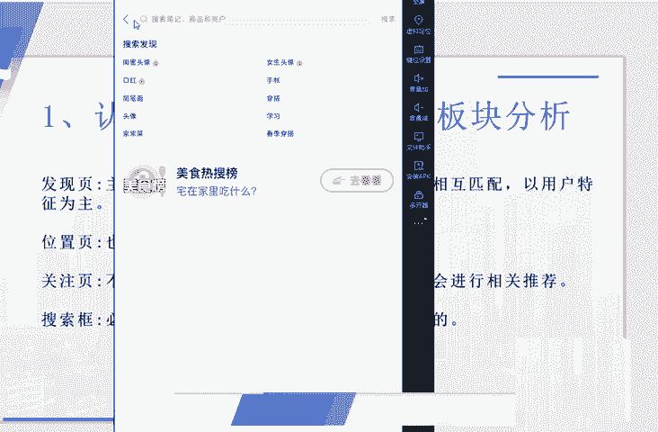

# 2024版小红书体运营教程】全B站最良心的小红书开店运营高阶教程合集，小红书体开店 起号真的快 - P2：1.第1节：搞懂小红书流量分发机制和流量层级逻辑！ - 咖啡好苦诶 - BV1xZ421s7Eh

我们这节公开课呢给大家带来的是小红书这个APP相关的一些运营技巧，还有一些引流的一些小技巧。

那在这个第一下第一大节课里面呢，给大家讲的是一个小红书的基础知识相关的一些注意事项，包括小红书的一些最新规则。呃，熟悉我的人也应该知道了。我做一个项目之前，或者说做一个平台之前呢。

首先是要和大家讲清楚这个平台的一些规则的。我比较喜欢一句话，知己知彼，方能百战不殆。所以说我在每次讲到相关的这个项目的时候呢，都会和大家提前说到这个平台的相关规则和这个注意事项。好的。

那我们先来看一下第一小节课。首先呢我们来带带大家去认识一下这个小红书APP小红书APP到底是什么样子的？然后呢，它的这个流量板块呢到底是哪些地方啊，哪些地方呢？它的这个流量板块流量呢是比较多的。

这里面呢我用的是这个手机模拟器给大家看一下。啊，首先我们来看到的这个发现页，我们打开小红猪APP这个界面呢，它有一个发现页。这个发现页呢是主要的流量的一个来源，基本上呢是会做到一个特征匹配的。

就是说平台会根据你的相关的用户资料来给你去匹配一些这个相对应的一些栏目里面的一些这个。啊，笔记视频也好，可以看到这个上面呢是根据我的这个账号信息所匹配出匹配出来的一些这个视频。啊。

会根据我的这个用户的一个画像。因为我这个号呢是一个女号，然后在注册这个账号之前呢，选择了一些这个上面的一些，就比如说宠物啊、美食啊vlog啊，我是选的这些标签，所以说他会根据这些标签。

根据这些算法呢来给跟我推荐一些其他的一些笔记。那第二个这个流量板块呢，就是我们的这个呃位置也。也就是说比如说我这个手机定位的是上海，那他给我推荐的呢是上海的一些这啊一些个这些小红书的一些笔记。

大家可以看一下，有这个景点啊。啊，那这里有景点景点、拍照地、餐厅、玩乐、逛街、周边游展馆，基本上是和这个当地的一个地点有相关的。啊，也有一些这个相关的一些笔记。第三个位置呢是我们的这个关注页。

也就是说我关注了一些谁，像我这个是新号的话，就是没有去关注别人。他这里面呢会和啊会根据我的一些算法呢去推荐一些这个关注。我们以后做号的时候呢，如果说我们这个账号做的还不错的话呢。

也会被系统推荐到这个关注页里面啊，关注页里面，通过信息流的这种方式呢，展现在别人的这个账号面前。啊，说完了这三个流量比较大的这一块呢，那剩下来的剩下来的比较大的这块呢，就其实就其实就是这个搜索框了。

这个搜索框呢通常呢有一些这个热门的一些搜索词啊，这里面有一些热门的搜索词。通过这些热门搜索词呢，我们也可以去蹭到这些一部分的流量，然后呢让更多的这个人呢去关注到我们的这个小红书的账号。

留呃这个搜索框的话呢也是大家的一个必争之地。因为搜索而来的用户呢，它的质量往往是非常高的。

整个小红书的话呢，流量的这个板块比较大的呢，也就是这四个板块啊，一个是关注发现，还有这个位置也，包括这个搜索框都是比较大的。

