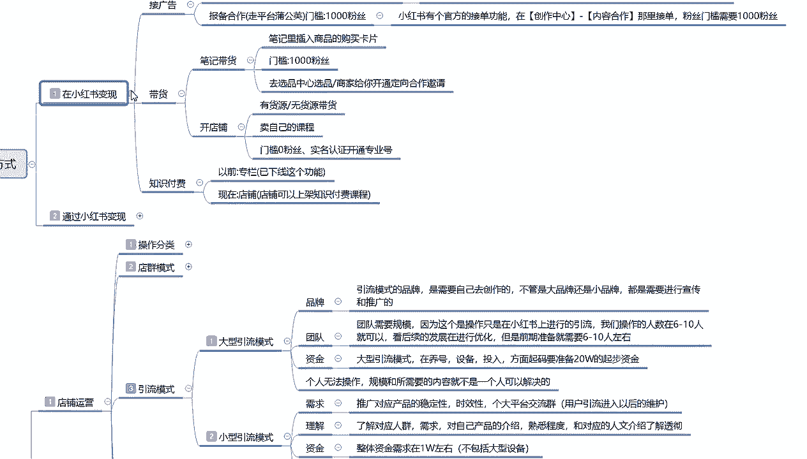
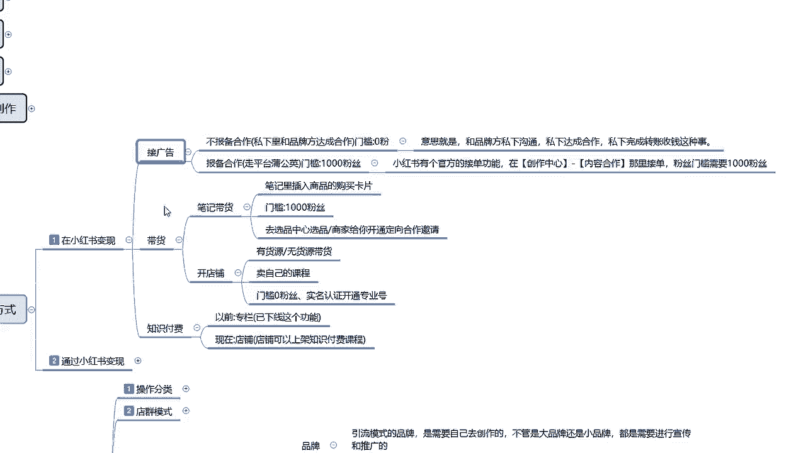

# 2024版小红书体运营教程】全B站最良心的小红书开店运营高阶教程合集，小红书体开店 起号真的快 - P37：37、新手小红书运营-小红书引流模式 - 阿强项目指导 - BV18y411B7Qy

大家好，今天给大家分享的是小红书全集系列第七大课，十小红书三大主体的一个店铺运营内容啊，这节课主要给大家讲解一下。

引流模式的一个内容，上节课给大家讲解的是电群，电群的话说实话他们因为有内容。

但是我不愿意去讲，因为现在的话他已经快差不多快过时了，你现在要去操作的话，嗯只能说保证自己不亏本，但是赚不了多少钱啊，引流模式在这个地方的话，我是给大家做了两个的两个点来进行介绍的。

第一个是大型引流模式。

第二个是小型引流模式，这两个模式的话，说实话他整体来看的话其实没有太大区别，他只是说对我们个人有一定的嗯，怎么说呢，就是对个人的资质和你个人的一个思路，有一定的限制啊，大型引流模式啊，什么意思呢。

品牌团队资金你们大家看这三个点就知道了啊，他整个内容的话是个人无法操作，规模和所需要的内容就不是一个人可以解决的，就是说你要做大型的引流模式的话，你没有品牌，没有团队，没有资金，你这个你考都不用考虑。

个人的话，你就只能考虑小型小型的一个引流模式啊，小型的引流模式的话，你你了解一下需求理解和资金，这个里面的话个人是可以操作的，投入不高，而且后期维护的话是比较简单的。

那首先了解一下大型牛模式品牌是什么意思呢，引流模式的一个品牌是需要自己去创作的，不管是大品牌还是小品牌，都需要进行宣传，什么意思呢，就是说你自己本来在自己家的小地方，然后的话这个产品还算可以啊。

有一定的市场，但是他没有人帮你去做宣传，我想在小红书上面去进行宣传，那么你就是有品牌的这个品牌，不管它是大的也好，小的也好，大的李宁啊，按你天猫的这种都算大品牌，那小的是什么，你听都没听过的。

只在某一特定区域进行划分的一个小品牌，这个叫品牌，只要说你有商品注册的一个标签，他都算品牌，如果你这个品牌出名和不出名而已，在某一地区出名，你也只能辐射到这一个范围，这就是品牌，品牌的话。

说实话你能把这一个品牌做起来，你投入个十来个不成问题对吧，但是做大型引流的基础模式，你在小红书上面的话，投入十来个也差不多了啊，团队团队什么意思呢，就是说你没有品牌，你本来就是一帮人，一帮朋友。

或者说我以前是做什么的啊，然后现在想转战小红书，我有自己的团队，我有自己的网红，比方说我以前在抖音上面做的，但是抖音我做不起来对吧，我以前在拼多多上面做的，但是那个我有商品，但是不好做对吧。

我以前在淘宝上面做的，我也不好做，在京东之类的都一样，知道吧，就是有团队，你有自己的规模，你有自己的部署，团队的话，他就是需要被模，因为这个的话操作只是说在小红书上进行引流，我们操作的团队的人数的话。

基本上都是在6~10个人左右，可以基本称之为团队了，你两三个人那叫小团体啊，不叫团队啊，那那叫兴趣同流的一个呃，朋友之间啊，共同来了解小红书，你真要是讲团队的话，他的分工是非常明确的啊。

操作人数的话基本上都是要在6~10个人，为什么6~10个人，他主要是看后续的一个发展在进行优化，但是正常的话前期准备就需要6~10个人，什么意思呢，主账号，副账号，网流网红号，引流号，推广号，小号啊。

评论号，你光算号，你都得十几个，就是你没有这种团队的话，你把它做不起来，知道吧，专业专业的摄影拍摄，专业的一个网络运营，专业的一个文案文案笔记撰写对吧，你店铺运营什么时候发，发什么内容，几点发。

它都是需要人去策划，就是你需要有一个整个的策划团队，把你的产品或者是把个人包装起来，你才能称之为团队，你两三个人在一起，那不叫团队啊，那叫小团体，然后是资金大型引流模式的话，他在养号设备投入方面的话。

起码要准备啊，我刚刚给大家说的那个品牌，就是你最少在抖音上面，你起码要投入十几20来个啊，比如说你想把它做成大型的一个引流模式，就是我准备大规模推广，我推广我这个产品，你最少准备得准备20个W起步。

所以说这个的这个大型牛模式，为什么说是个人无法操作啊，它规模和所需要的内容，就不是一个人可以解决的，就算你有钱，你说你觉得你有我有50个对吧，我就是个弄得好玩，我想一个人去试试，你都不好做。

你没有专业的团队，你刚组建的，你去招人，一个月花个七八千块钱，花五六千块钱请运营一群美工对吧，做不起来，到时候亏得血本无归，你要先了解清楚小红书整个运营的一个体系，你再来做这个东西就好做了。

然后是小型引流模式，小型引流模式的话，他的需求就没那么高了啊，嗯怎么说呢，他的或需求的话就是推广对应产品的一个，稳定性，时效性，各大平台的一个交流群，用户引入以后的话进行维护就行了，嗯怎么说呢。

就是你要想办法融入到小红书，整个账号的一个群体里，有自己的产品，你的产品还要稳定它的时效性的话，你还要在应季的时候去操作，你不能说我是卖水果的，我卖3月份，4月份，5月份的水果，卖苹果。

在10月份去把小红书做起来去推苹果，你推明年的苹果谁来买啊，对不对，所以说你要有时效性啊，一样的道理，最后的一个方式就是把用户引入到你的，微信也好，QQ也好，交流群也行，都是可以的。

他的后期维护的话还是比较简单的，就是说你你需求的话，这是对我们个人的一个需求，你有自己的产品就可以做，你自己没有产品，那你就只能做网红，做网红的话，你就去找文案，找内容啊，同样的道理，你做小应。

你用模式的话还是比较好方便，然后理解是什么呢，对应产品的一个人群，对应产品人群的需求，对自己产品的一个介绍，熟悉程度和对应的一个人文介绍，你要了解透彻了，你才能去做啊，你不了解的话，就是半吊子。

我边弄边学，可不可以也可以，但是节奏太慢，我怕你自己撑不住，自己就放弃了，然后就是资金，整体资金的话，就说你做小型引流模式的话，个人你在小红书上面投入的话，大概大概的话就是1万左右啊。

当然这个不包不包含大型的一个设备啊，安全设备什么，你不能说是你买个新新款的手机，我拿着做小红书也把这个钱算进去啊，那不行的，你买个相机，那个相机动不动几千块钱，上万块钱，好一点的，几万块钱都有，对不对。

你不能把这种设备算进去，那不是一个级别的好吧，就说小红书的话，嗯这种小型引流模式的话，个人是可以操作的，他整体投入不高，后期的维护的话也是比较简单的，就是你只需要认识到自己有什么优点，你在小红书吧放大。

你就可以去做啊，他的一个变现方式也是比较简单的，之前给大家上嗯。

讲解的时候，小红书变现这个里面的一个引流模式啊，小红书的一个引流模式。

你其实能理解为接广告就行，知道吧。

有一定的粉丝数量以后，你有自己的技能去接广告也行啊，练习视角。

这个就是小红书的一个引流模式，他只是变相的叫做引流模式啊，你不往外面引，你往自己的这边进引也行啊。

那这一节分享呢就给大家讲解到这。

