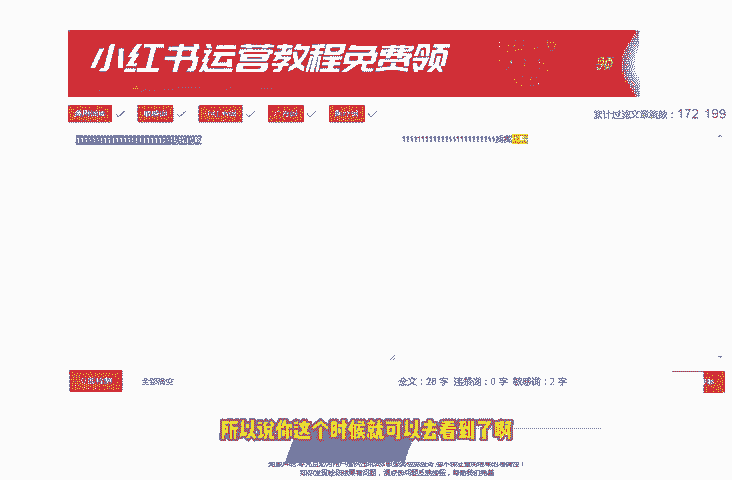
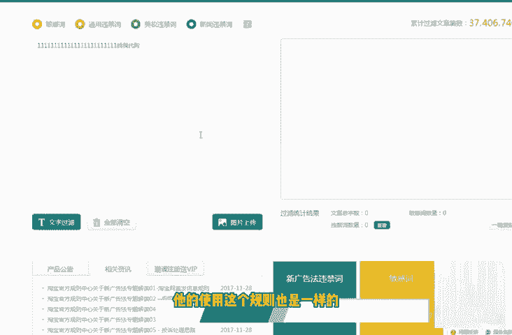
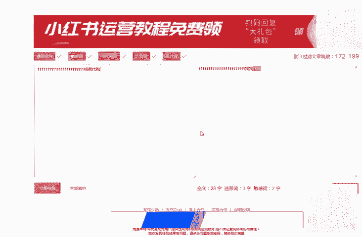

# 2024版小红书体运营教程】全B站最良心的小红书开店运营高阶教程合集，小红书体开店 起号真的快 - P3：2.第2节：小红书的检测规则是什么？分析小红书最新规则和运营注意事项！ - 咖啡好苦诶 - BV1xZ421s7Eh

那我们这节课呢和大家聊一下这个小红书的相关检测的一个规则。关于这个小红书检测的规则呢，我从这以下四点来和大家详细的讲一下。第一点呢就是小红书。

它会检测我们的检测我们的这个个人资料、笔记内容、私信以及评论这几个地方在这几个地方呢，它就不得含有一些微信号码啊，微信号、微信二维码、代购啊、水印啊，包括这个推广淘宝店铺的一些营销词汇。呃。

但是小红书管的比较松一点的是什么地方呢？它官方啊个人资料官方是允许邮箱存在的，也可以呢用这个微博去替代这个谐音啊去进行引流。然后呢再用话术引导到我们的微信上面啊，当然了这个课程的话呢。

是在后面会和大家详细的去说到。第二个检测的内容呢是小红书会检测我们的这个手机设备，最好呢同一同一台这个设备呢呃最多只能登录三个账号。这这边呢大家一定要注意一下。然后呢。关于笔记内容的话呢。

大家要注意的就是不得去诱导用户。比如说去关注领奖啊，点赞、抽奖啊，这些呢都是小红书明令禁止的。这个呢就是诱导用户的一个行为。那第四个呢就是内容的原创度，原创度保护程度呢。

在小红书的这个平台上它是比较高的。在推广的时候呢，我们也不要说呃，你写了一篇文章，然后呢去多个账号在小红书上面去发布。这样子呢这样子的话呢是不可以的。一篇文章一个账号去发也就可以了，不要去多发。

还有一个关于这个小红书检测的一个规则呢，实际上是一个敏感词的一个检测啊，敏感词的一个检测就是我们在呃接下来也会大家会遇到的。关于敏感词关于敏感词的一个检测呢，这里面我给大家介绍了两个网啊两个网址。

两个网站。一般的话呢就比如说我们小红书上这个。违禁词是有哪些的呢？就比如说呃手机卡呀、金融啊。电子烟啊。啊，电子烟、代购、医疗用品等等。这些东西呢，大家尽量不要去碰。那有的人可能会说了。

我在写这个小红书文章的时候，万一我不小心把这些词呢，还有一些没遇到的一些词呢给加进去了，那怎么办呢？对吧？那就会用到我们这个敏感词的一个检测的这么一个啊网站。这里面呢我来我来用电脑给大家演示一下。

我们首先打开这么一个第一个网站。就比如说我们现在写了一句话对吧？啊，写了一句话很长很长，但是呢里面有代购这个词。这里面呢我已经去我已经刚才。啊，我们现在刷新一下。我们把这篇文章假设去粘贴进去。

然后呢点击立即检测。他这个时候就会就会给你显示出来啊，代购这两个字是敏感词。大家可以看到了吗？是敏感词，是小红书相关的一个敏感词。所以说你这个时候就可以去看到了啊，包括我们用这个。

啊，这个是需要注册的。这个注册的话呢，大家到时候注册一下也就行了。然后我这边就不跟大家去演示了，是它的使用这个规则也是一样的。然后呢，这里面会跳出来一个过滤的一个结果。实际上呢我们基本上用这个网站呢。

它去检测的话呢，也就基本上够用了。也就是说我们平时在写文章，有一些相关违禁词的时候呢，通过我们把这个文章。

啊，发到这个网站里面去。让这个网站呢去检测，它就会检测出来我们我们的这篇文章里面到底是有哪些这个违禁词的。啊，好了，关于更多的这个违定词呢，这里面呢我还正在给大家整理当中。呃。

不过呢也很快在这节课录完之后呢，这些词就会整理出来。