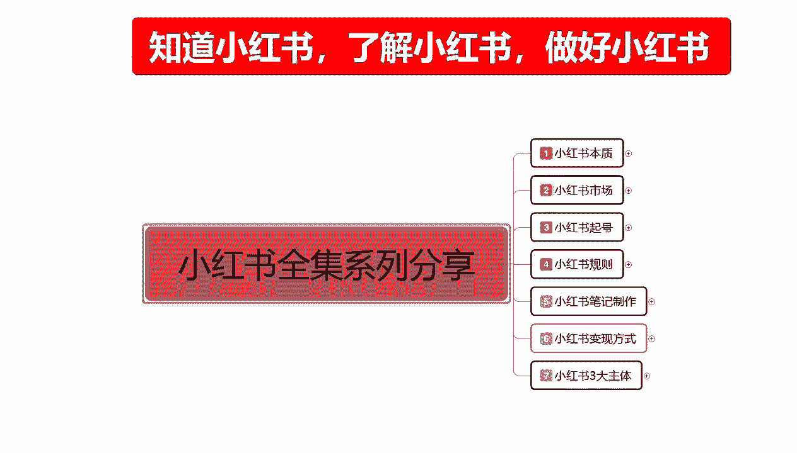
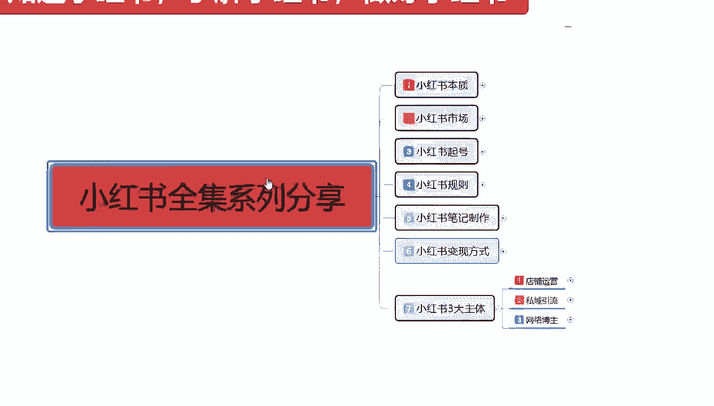
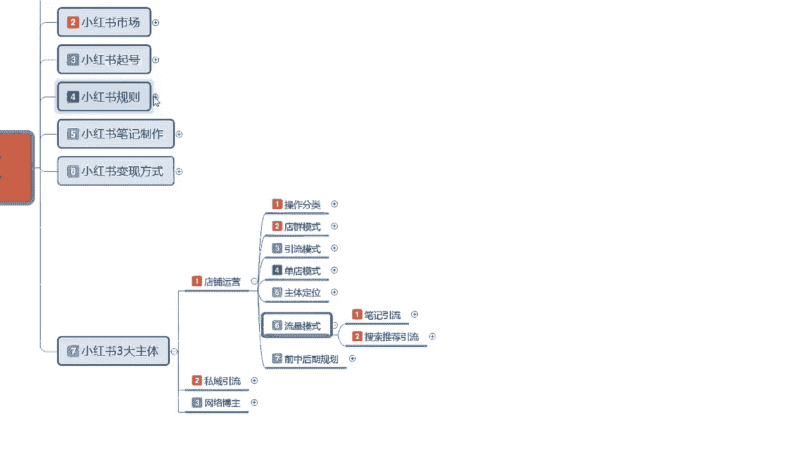
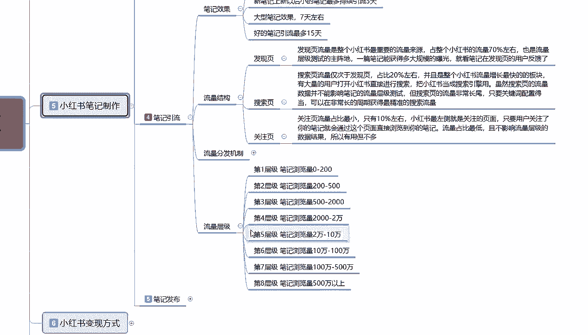
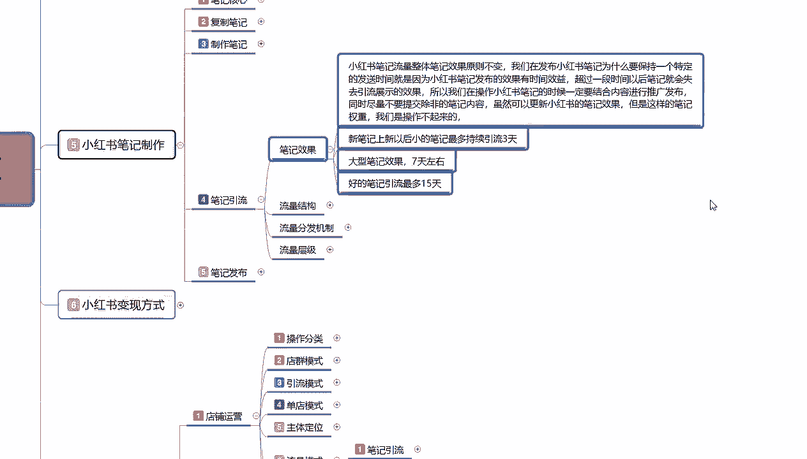
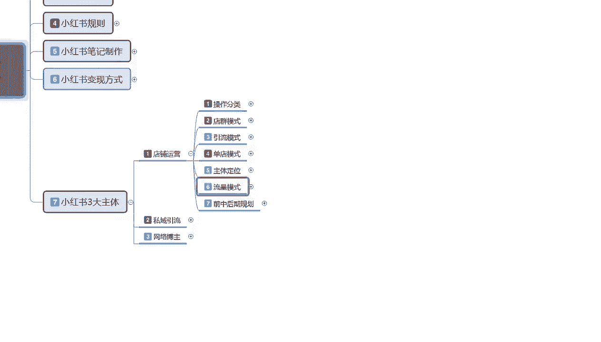

# 2024版小红书体运营教程】全B站最良心的小红书开店运营高阶教程合集，小红书体开店 起号真的快 - P42：42、新手小红书运营-店铺流量模式 - 阿强项目指导 - BV18y411B7Qy

大家好，今天给大家分享，这节是小红书全集系列第七大课时的一个内容。

这节课的话主要是给大家讲解一下，我们店铺运营里面的一个流量模式。

店铺运营的流量模式的话，其实和我之前给大家讲课的一个，小红书笔记里面的啊，我看一下是规则还是啊笔记制作里面。

因为内容确实是比较多，它的一个流量模式是差不多的。

只是它里面有一些细则不同啊，之前的话给大家讲流量模式的话，在笔记引流里面，他也给大家讲过基础的一个引流模式。

包括它的一个流量结构，但是在这个里面的话啊，今天再给大家讲，你们大家可能会又会有另另外一种不同的理解，因为这个是做电的一个流量模式啊，之前给大家讲的是整个小红书的一个流量模式，虽然说他们两个是相同的。

但是你的一个重点投放力度是不一样的啊，首先我们来看一下啊，笔记引流的一个模式，还有搜索推荐的一个引流模式，他们两个的内容是差不多的，只是说解释的一个方式和方词的方法的一个，名词的用法不一样啊。

笔记引流整体的笔记引流，包括搜索页面也好，包不包括搜索页面啊，包括推荐页面和关注页面，他们两个整整体占比的话是流量的80%，之前也给大家说过，搜索流量的话占比他是在20%左右，其他的流量占比的话。

基本上都在比基流的80%左右，都在这笔记上新以后的话，小笔记最多维持三天的更新引流，大笔记七天，好的笔记15天，对不对，但是我们做商品的时候，也是按照这个数据去划分，它只是多了一条流量不稳定，正常的0。

5%到1%的转化率，什么意思，就说我们在做店铺运营，做商品的时候，你正常发布的笔记的话，它的转化率的话，正常转化率只有0。5到一，我在小红书上面通过店铺的话宣传，店铺的一个商品。

它整体的转化率就只有这么点，如果说我们前期的话，你前期如果说做的一般人体展示的话，可能是3000~5000，或者说是5000到1万这一个范围，第三层级的一个范围，那他给了1万的展示。

1万的展示你的点击数据，如果说只能保持在13%以下，那么就是三天也就是5000到1万之间，可能的话就是5000~5000左右的一个展示量，5000左右的一个展示量。

那你的整体小眼睛数量的话也就300~400，300~400里面，它流量是不稳定的，他综合转化率只有0。5到一，意思就是说这三四百人里面，你可能只成交两到三单，懂意思吧，就是你这一篇笔记发送出去的话。

你综合的一个成交比例的话就是两到三单，而且要你的产品跟其他产品问题不大的情况下，你才能做到两到三单的一个数据量，那你一天两两篇笔记发数据，那么你一天也就六单左右，六单你一单能赚多少钱，你是第一个产品。

你的一个整体的话数据量它是赚不到什么钱的，这个就是整体流量比记，而且这个里面的话说实话是应该按4000来算的，因为剩下20%的流量在这啊，剩下20%的流量在这搜索，推荐引流流量占比的话是20%。

它里面的话就是包含的一个属性量就比较多，这里面有关键词引流排名引流，付费引流，正常成交的话，他的一个成交转化率比例是比较高的，5%到7%的一个成交转化比例，就看我们这三个重点在什么地方，关键词排名。

关键词的一个排名，商品属性的一个排名，然后看我们付不付费付，说实话这个付费引流的话，前期不建议大家去做啊，我们后期碰到第五乘积到第六成绩，这种的话大型的一个模式以后，你再考虑去做付费引流。

前期的话我们做排名引流和关键词引流就可以，因为它整体流量占比的话就20%，可能会给你推1000个，但是1000个里面，你如果说没有关键词引流的权重，没有排名引流的权重的话。

这20%你能保证1%就不错了啊，你没有去，就是没有权重的前提下，你能保证1%就不错了，你前期刚做的时候，你基本上没有搜索推荐流量的，基本上没有的，你要先把排名和关键词做起来，你才有这20%的流量。

才有这1000展示，如果说你不做起来的话，你这个没有了啊，但是有一点啊，别看它流量少，但是他的正桥成交百分比，在5%到7%，什么意思呢，不管你做任何的一个产品，你只要是做推荐搜索的，搜索的关键词引流。

它的转化率都是非常高的，基本上都有5%到7%左右，你店铺数据做得好，图片做得好，你的关键词排名，关键词引流的一个排名比较高，你产品的一个排名引流比较高，那么你的转化率可能会做到10%以上。

当然有一个前提是它的一个流量比例比较少啊，他只有20%一个流量比例，正常的话就相当于是你在第三层，就5000的一个推广量，4000的话就在比基尼流里面，剩下1000的话在搜搜索推广里面。

搜索推广里面这1000的1000的流量，5%到7%，也就相当于是100个就要成交5~7个，懂我意思吧，那1000个就是5~70单，但是你这5~70单你需要自己去争，自己去抢。

因为它里面有关键词引流的一个排名啊，还有产品的一个排名，这两个排名你不去抢，包括还有其他的一些数据，你不去抢的话，就20%的流量，你能得到1%就不错了，也就是1000个展示里面十个访客。

十个访客里面的话呢，可能有一单就是这么现实啊，你不要觉得小红书的话，其实对比其他平台好做是好做，但是你要根据我们自身实际的情况去做，做好了你才有数据，做不好的话，你就和其他的那些刚入门的新手。

其实没什么太大区别的，这个就是小红书店铺运营的一个整体流量模式，我们只有把这几个东西弄清楚啊，就是小红书你不光笔记做好了以后，你觉得你自己店铺没有转化是什么原因，都在这个地方啊，都在这个地方了啊。

你笔记引流流量引进来了，他流量是不稳定的，正常转化比例只有0。5%，到一四千个访客差多少的一个转化单数啊，对不对，你搜索引流你做不好，转化率是高，你没人进搜索，进来进你店铺，你怎么做呢，对不对。

所以说你把搜索做好了，你的转化率就起来了，你把引流做好了，看到的人就多了，看到的人多了以后的话，他去搜索同类的一个产品，才有可能收到你的产品，那么才能同时提升你产品的一个数据，知道吧，先做笔记再做搜索。

而且这个里面有一个点啊，我之前上课的时候，我给大家分享的时候，我也给大家说过流量模式里面啊，不能说流量模式啊，应该说是小红书整个平台系统里面，他的笔记发放的内容是不一样的啊。

这个搜索推荐的他的笔记是一个流量端口，这个笔记引流他又是一个流量端口，懂我意思吧，这两个流量端口是不一样的啊，你们不要弄混了啊，他们不可能一起做的，你两个发同样的一个内容的话，说实话没有太大作用。

你先发一篇引流笔记，然后再发一篇内容笔记，对不对哦，一篇引流笔记再发一篇商品笔记，你去做，说实话，那你就浪费了，你每天两个笔记里面的一个你的流量，自砍一刀就已经展示，就已经减少了一半，你就别说流量了。

我说大家一定要把这个东西弄清楚啊，不要把它给弄混了，引流的一个笔记就是引流笔记，你商品笔记就是商品笔记啊，两个东西如果说你弄混了以后，你后期的话，你是真的不好做，这个呢，就是小红书店铺运营的一个。

整体的一个流量模式，我们把这些东西了解透彻以后，你就知道自己后续该怎么做了好吧，那这一节分享呢就给大家讲解到这，下一节呢给大家讲解一下，我们这个店铺运营，前期中期和后期的一个整体规划啊，大致的一个方向。

你要有就是让大家了解一下，我们做小红书，你大致方向都没有的话，你做垫底是真的不好做啊。

