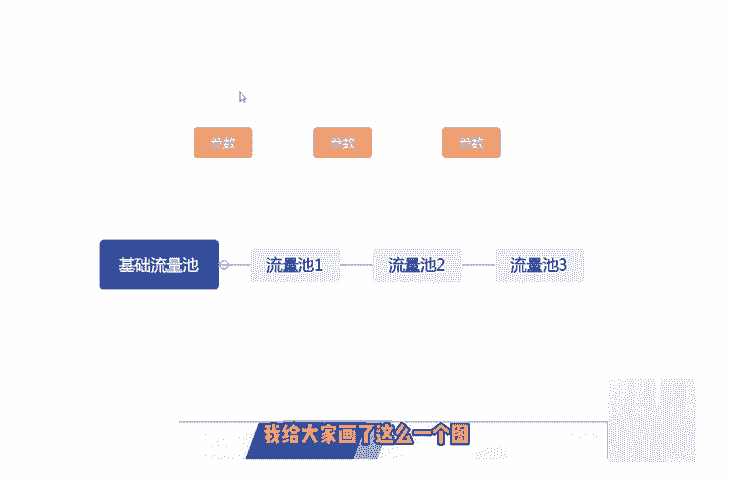
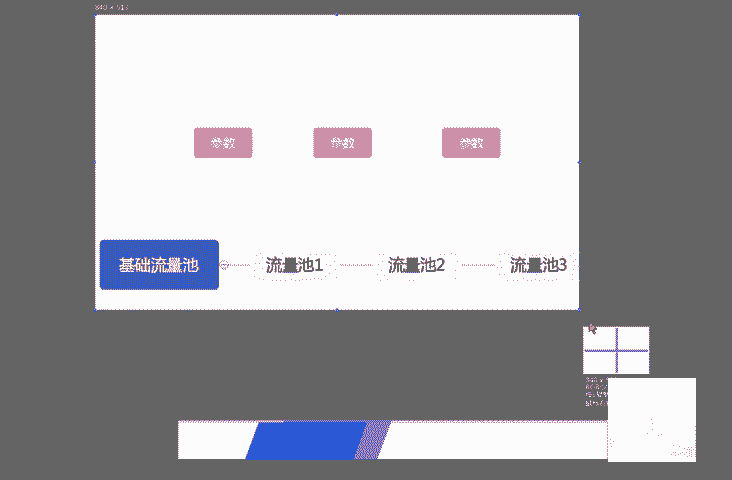
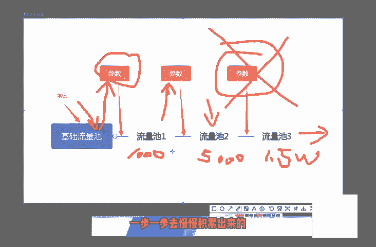

# 2024版小红书体运营教程】全B站最良心的小红书开店运营高阶教程合集，小红书体开店 起号真的快 - P4：3.第3节：小红书流量推荐机制讲解！ - 旺仔没奶味 - BV1ab421z7sv

我们这一小节课呢来和大家简单的讲一下小红书的推荐的一些机制和规则。其实小红书的推荐机制和规则呢和这个抖音，包括头条这些平台的逻辑都是差不多的。用户呢以及内容都会被打上相应的标签。

就比如说我们在发送这个笔记的时候呢，都会被系统打上这个标签。然后呢，每篇笔记都进都会进行机器审核呃，看一下这个检测出来的这个内容是否有违规。如果没有的话呢，就会进行一个大数据的一个算法匹配分发。

就像我上一节课和大家说到的检测的一些词汇，包括检测的一些词语，都是会在这个里面进行进行到一个呃一个作用。如果如果这时候系统检测到检测到你是有相关违规的话呢，如果这个机器啊也就是这个程序。

这个算法它不能确定。他会进行相应的一个调整，就是说会把这个有疑问的东西过给这个人工去审核。如果人工再去审核的话呢，确定是没有问题的话啊，然后才是进才是能进行分发匹配的。如果你的这篇文章啊。

这篇笔记又被机器判定为这个违规。然后又被人工判定为违规的话，那基本上就会去被关到一个小黑屋里面啊，就会被限制账号发言啊等等这些操这些操作。另外的话呢。我们这个在推荐的时候呢。

系统会提取这个笔记中相关的一些关键词、图片的标签啊、话题啊等等来分到对应的这些类目里面啊。其实大家在一开始注册这个小红书的时候，也就发也就会发现了呃小红书呢会要求每个用户去选择自己的这个地理位置。

包括喜欢的一些领域。他为什么要选择这些领域呢？也就是为了让大家去呃给自己的这个兴趣打上一个标签，然后呢，他就会根据这些兴趣，然后匹配我们相关的一些笔记，然后呢进行内容的一个分发。

下面呢最后呢要和大家说的呢是推荐后呢不代表用户就可以搜到这个笔记。因为这个笔记呢必须要被小红书去收录才可以。这里面呢给大家提一个醒啊，就是我现在在外面也也看到很多的这个一些机构啊。

或者说一些这个呃做项目的人啊，他会说百分百分百包这个小红书去收录。这里面大家一定要注意一下，就是目前来说的话。几乎是不可能有百分之百包收入的包这个小红书收入的。这里面大家一定要注意一下，如果说有的话呢。

那基本上95%吧，可能是骗子啊，这个大家一定要注意一下。如果对方说有包收录的方法的话，最好呢是去验证一下，而不要说直接就去给对方转账，或者说要对方帮忙去收录，最好是去验证一下。

如果对方确实有这个实力的话，再进行转账，再进行合作也不迟。因为根据我们现在这个操作小红书的这个难度来看的话呢，这一块去要小红书去收入的话，还是比较难的。啊。

然后呢我这里再给大家说一下这个小红书的一个推荐机制吧。很多人都会说这个小红书的推荐机制呃会很奇怪。它的一篇笔记呢。呃，比如说20分钟之前看可能是1万个阅读，对吧？啊，可能是个是这么一回数。然后呢。

过了一会儿又变多了，然后又过了半个小时呢，又变多了。那为什么会产生这样的一个情况呢？这里面呢也很简单，我给大家画了这么一个图。

啊，我给大家画了这么一个图。用这个图呢来去理解的话，就比较很容易比较去理解了。那我们最开始的时候发了一篇笔记呢。啊，发了一篇笔记呢。发了一篇笔记之后呢，系统会对应的分配到一个基础的一个流量池里面。

基础的一个流量池里面。啊，这个基础的流量值呢可能不会太高。然后呢，因为只是一个基础量，可能只有两三百或者说一两百的人去啊会被系统推荐到这个推荐到去看你的这个笔记。但是为什么会有更多的这个流量池呢？

就是因为在你的这个笔记在被别人看的过程中呢，如果说你的笔记被别人点赞。转发以及收藏，也就是我上面所写出来的参数啊，这个参数就是说点赞点赞转发收藏。呃，我们的笔记发给这个一些基础流量的时候呢。

然后通过这个参数来判断出来。我这边画给大家画一下。啊，当我们的笔记。当我们的笔记发到这个流量值里面之后呢啊如果这个流量池里面的这些用户他的反他的反馈都是比较好的话呢。

他进行了一些转发、收收藏以及点赞以及点赞，对吧？那对应的这个参数呢就会产生一些变化，产生变化。如果这个参参数产生变化之后呢，达到了一呃达到了往下一级推荐的这么一个机制之后呢。

这个笔这篇笔记呢就会推荐到下一个流量值。那下一个流量值呢可能是1000起步，1000个人。如果说这1000个人看了你的这个笔记之后呢，点赞、转发以及收收藏啊这些指数呢。依然是比较高。

依然是达到了某一个阀值，对吧？那它就会推荐给下一个流量池，下一个流量值呢可能是5000。可能是5000。啊，可能是5000。然后这5000个流量值之后呢，再根据这些这这些参数的这些占比。

如果还是比较不错的那就可能推到15万或者是15000。啊，这个大家要注意一下。啊，这个后面呢我就不去画了。然后呢，它就是这么一个推荐机制。如果说你的这个笔记它的反响是比较好的话呢。

它是逐步逐步去被炒热的。不是说不存在说你一个笔记发下去，立马就会有1万个人看到，或者说有5000个人看到，这个是不可能的。它都是逐步的去推荐的推荐的这个流量池呢是也是越来越大了。

直到你不能满足于这个参数为止啊，直到你不能满足于这个参数的话，那就只只能是停止在这个参数前面的一个流量池里面。所以说这个是相关小红书的一个推荐机制，希望大家了解一下。小红书的推荐机制呢。

并不是说一蹴而就的，而是我这边这张图呢和大家讲的这么多。啊，它是一步一步一步一步去慢慢积累出来的。

好了，那关于小红书的这个推荐机制呢，就和大家说到这里了。

