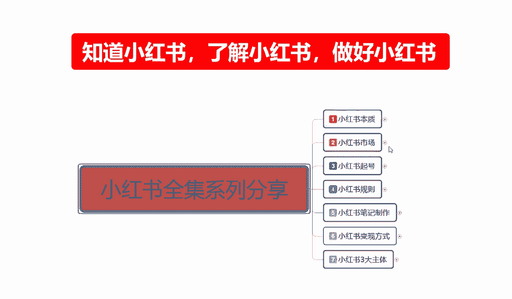
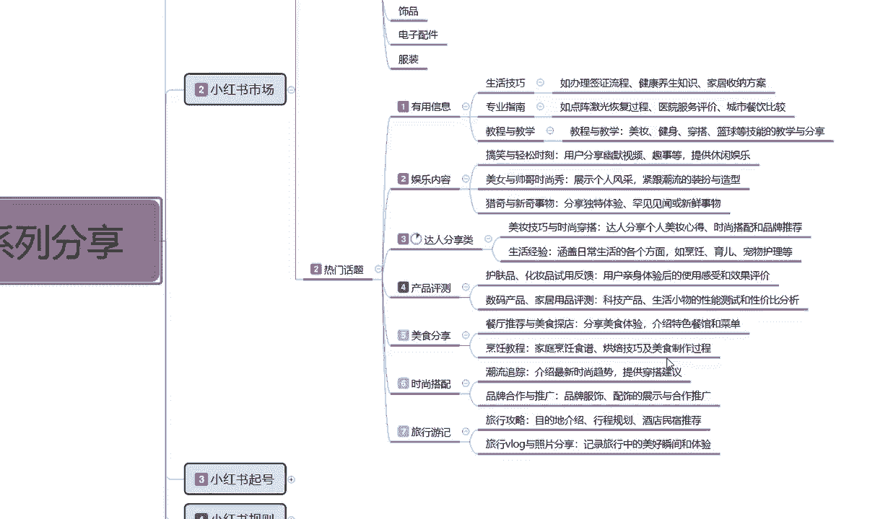
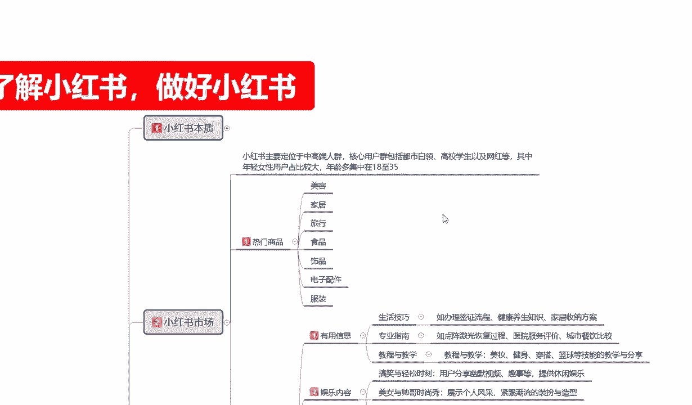
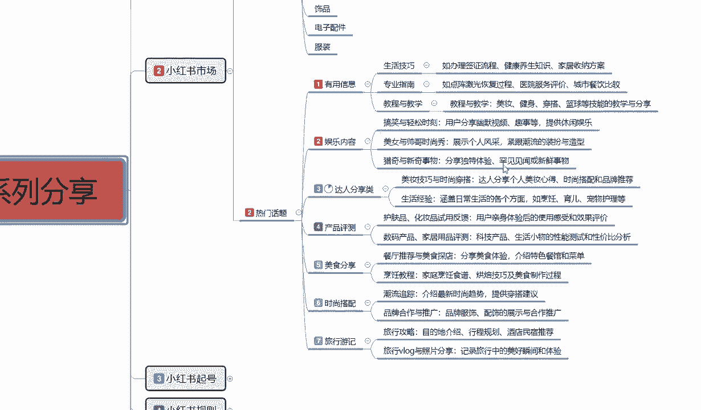
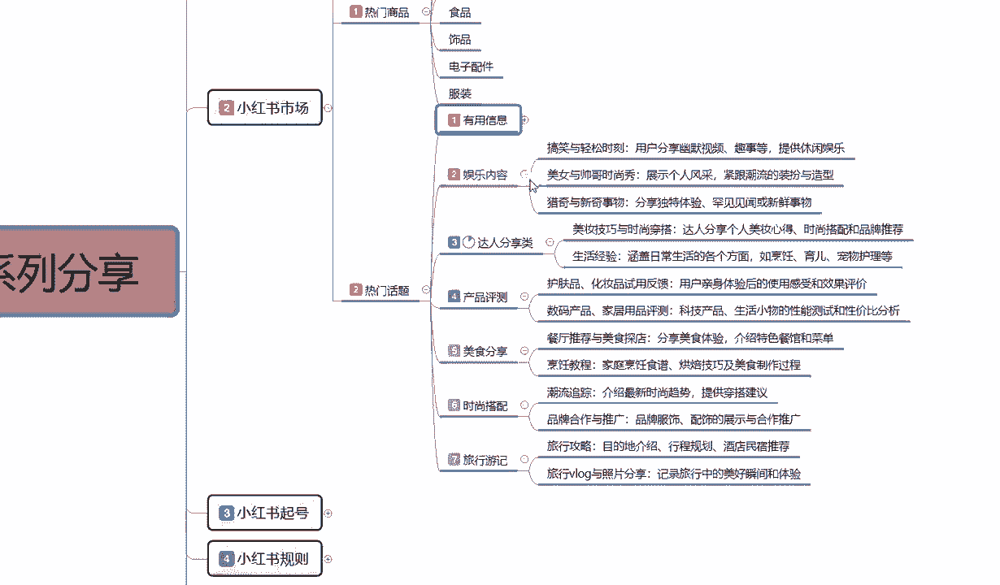
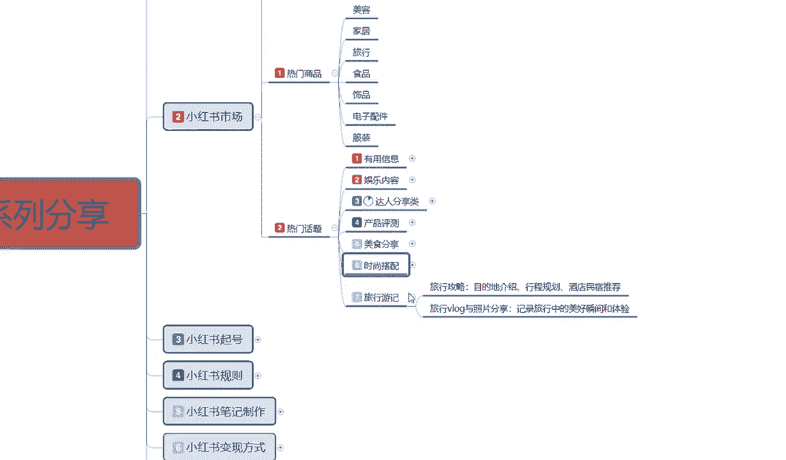
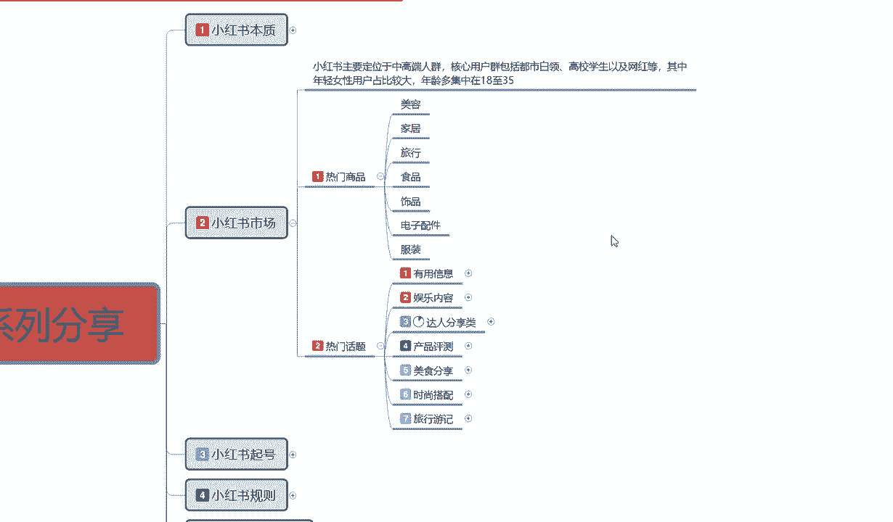
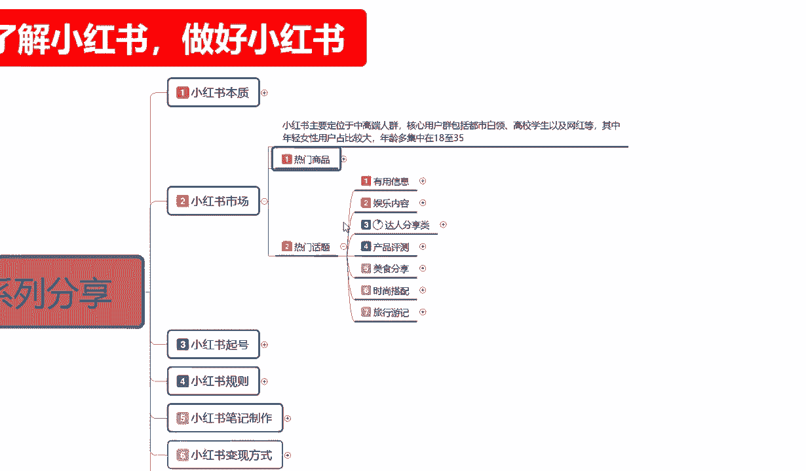
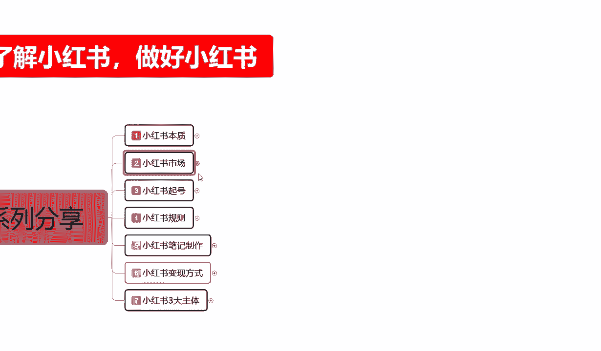
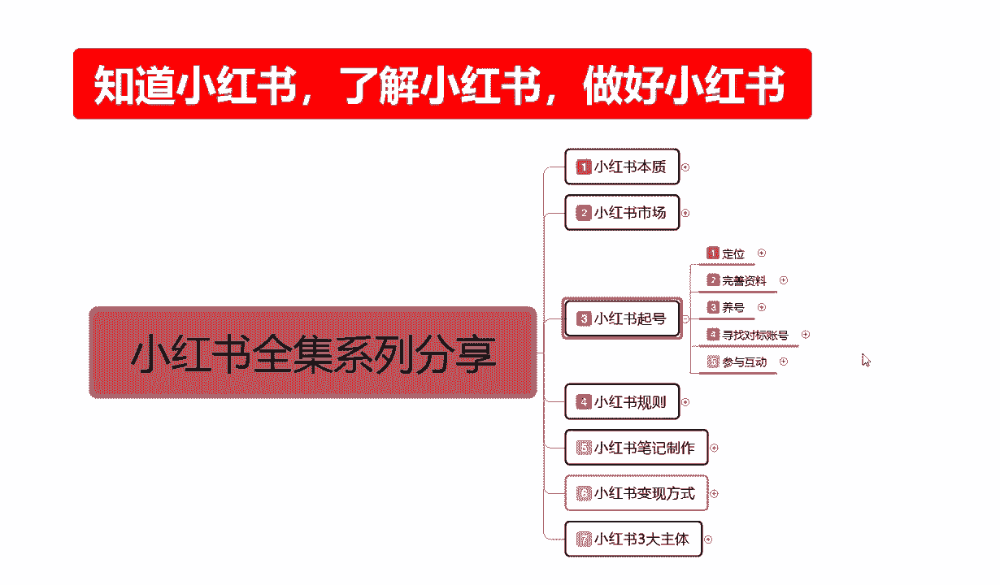

# 2024版小红书体运营教程】全B站最良心的小红书开店运营高阶教程合集，小红书体开店 起号真的快 - P6：6、新手小红书运营-小红书市场分析 - 幼稚园拾荒者1 - BV1WRHseoEdh

大家好，今天给大家分享的是小红书全集系列啊，第二大课时小红书市场的第二节课啊，我们直接连着上一节课程。

往下面给大家进行一个分享，上一节课呢我们是讲到了达人分享类，这节课呢我们接着往后面讲，小红书热门话题里面啊，第四个内容产品测评，什么叫产品测评啊，护肤品化妆品试用的一个反馈，食品的试用反馈啊。

就是我们用户亲身体验后，使用这个感受的一个效果和评价，类似于这种就是抖音上面的探店对吧，我们只是说把它扩小，探店的话，他需要出去，我们我们呢只是说把它扩小了以后，把产品买过来，我们自己试，这种的话。

也相当于是一种反向的宣传和正向宣传的，一种对比啊，通过这种产品的一个测评，来提高我们个人的一个知名度，而且这种产品测评的话比较好做，为什么，因为他不是视频，是图案啊，是我们通过图片的对比。

我们直接在家里面就能操作的，对化妆品适用的一个反应测试就可以，然后数码产品家居用品测试的话，科技产品，生活小物的性能测试和性价分析比，也是一样的道理，比如说我们在小红书上面去做产品测评的话。

他有一定的私藏潜力，只要你把类目选定了，你比方说我想做嗯，拿个什么例子呢，就拿化妆品来说吧，口红口红它有一个色号，有一个啊，掉不掉色对吧，他都分很多种类型，我对这块虽然说不是很了解啊。

但是所有的大致类目的话基本上都是差不多的，那么他对于一个产品测试，你比方说网络上面比较熟悉的，什么样的一个口红，你买一两支回来做一个成本投入也不用太贵的，差不多啊，在中层阶段用的那种几十块钱。

几百块钱一支的都可以，然后你自己这边的话，如果说我们是本来就是卖口红的，那么你就可以拿这两种产品做对比，把你的优点凸显出来，用两张图片去解决，别人需要拍视频讲解的一些东西，而且他的特定用户的话。

人群是非常精准的，你也可以拍视频，只是说拍视频的话，他流量没那么大，整体的话我们的一个小红书笔记里面的话，图案笔记和视频笔记的比例，最好是三比一或者五比一，也就是翻篇笔记一个视频效果是最好的啊。

你要是效果是距离想拉长一点，五篇笔记一个视频也可以啊，这个是做产品测评，就看我们自己本身适不适合去做产品测评啊，有没有这方面的一个经验，对别人的一个分享，当然了，你如果说本身没有产品，你也可以去做。

知道吧，提升自己的一个认知，这方面的认知做好以后，你大概有个2000粉丝到3000粉丝以后的话，你你再去找产品，让别人帮你做推广的话是非常容易的，知道吧，你去收他广告费，我帮你代言。

你产品卖出去后一天给多少钱啊，在这个里面的话，也是额产品测评里面的一个变现方式啊，只是说给大家大概的介绍一下，然后是美食分享，什么叫美食分享呢，餐厅推荐的一个美食，这个就是抖音上面的美食探店。

美食探店的话，说实话，因为你可能对自己的颜值不怎么信任，那么我们在做图片处理的时候，不拍人，只拍食品，然后对这个视频进行的一些分析，进行的一些话题宣传啊，就可以，这个就是美食分享。

然后的话烹饪的一个教程，烹饪教程的话，说实话这个的话做引流比较适合啊，家庭烹饪食谱这个菜怎么做，做完以后，这个菜对我们身体有什么好处等等之类的，都是可以的啊，这几个那就是美食分享，第六个啊。

热门话题是什么，时尚搭配啊，潮流追踪介绍最新时尚的一个趋势，提供穿搭的一个建议，品牌合作与推广，品牌服饰配饰的一个展示与合作推广啊，时尚搭配的话，说实话我之前啊前面也给大家讲过，小红书。

上面说实话他不适合做那个品牌的一个内容，他比较适合做非标品的一个内容，但是如果说你要讲穿搭的话，有品牌商跟你合作是最好的，没有品牌商的话也能做啊，而且效果不差，做这个类型的一个时尚分享。

或者说这个类型的一个笔记分享，你不管说是我卖产品也好，卖服装也好，卖装饰品也好啊，卖耳环首饰吊坠戒指项链也行对吧，我再不行，我卖嗯，指甲油，指甲刀之类的都行，知道吧，就说你看他的一个时尚搭配的一个创。

怎么去搭配啊，胖的有有胖的，有瘦的人，有胖有瘦啊，有体重高的，有体重轻的，你通过这种方式圈定你的人群以后。

就说我们先要了解整个他一个18~35岁。

一个人群，你有没有他们喜欢类型的一个产品啊，你通过他们喜欢类型的产品，你把这些次品给他，就直接码明面上面进行产品的一个拍照重组，或者说是你去抖音上面也好，去淘宝也好，去拼多多也好。

你把别人的图片弄过来啊，然后搭配一下怎么穿怎么弄都是可以的，当然这个只是说小红书市场里面，他的热门讨论的话题啊，因为他的人群的话就是18~35岁，18~35岁的女性的话，她喜欢的就是这些主要的这几个点。

最后一个就是女性旅行的话，说实话没有上面六个点吃香，但是相对于旅行的话，他可以做一些情侣之类的一些攻略，目的地的一些介绍行程的一些规划，酒店民宿这种话是比较适合情侣的啊，你如果说往旅行这个方面靠的话。

说实话你就是奔着那种户外的，配置配件实用工具去操作了，你去做店也好啊，做网红也好，做博主也好，宣传你的产品，做引流也好啊，都是往这个方面去靠的。

这个呢就是热门话题的整体的一个内容。

嗯之前呢我也给大家说过了啊，我把这个几个重点给大家讲解以后的话。

我就会结合整个小红书市场，给大家详细讲解一下啊，热门商品和热门话题它们相结合是怎么做的，因为小红书整个市场的话，我们只有把这两个点结合起来以后，他才叫小红书的一个市场啊，他单独把它划分以后的话。

你要不了解热门商品，你说实话你这小红书上面做定的啊，不好做，你也做不起来，难度系数非常大啊，你要是专门讲这门话题，你后面变现很难，所以说我们要把它结合起来，我们才能做电影号啊，做博主也好，做引流也好。

你变现才容易知道吧，我们要去了解小红书整个市场的话，你无非就是说你想做网红也好，做博主也好，做引流也好，做商品也好，做其他等等，你也好，你不管怎么去操作，最后无非一个就是想赚钱，那在这个里面的话。

你单独做热门商品，比如小红书上面，我就想开个店，想去把这个店做起来赚钱行不行，100个人里面有两到三个人可以成功，你觉得你是那两到三个人吗，你有做电的一个技术数据量吗，没有，所以说你需要进行了解。

那你如果说我觉得我做商品不行的话，我做热门话题的一些内容分享行不行也行，但是十个人里面的话，可能只有一到两个人，或者说20个人，30个人他才能成功一到两个，那你觉得你是幸运之子吗，对吧。

我从来不抱有这样的幻想，我所有的一些努力和成果，和我研究分析的一些数据量，都是通过我个人分析了解过后啊，了解他整个平台的一些数据以后，我们再去做，你才能把自己做的包装起来好吧，那小红书市场。

这里面一个热门商品和热一个热门话题，我们怎么把它结合起来，选商品之前一定要选话题，话题一选完以后再选商品，比方说额这里面我随便给大家做个比方吧，时尚穿搭吧好吧，时尚穿搭里面。

他这个里面我们适合做的商品是什么，美容家具不适合服装，就这两个点，你把时尚穿搭这两个点，你做美容也好，做服装也好，你比方说你做时尚穿搭里面做服装，你自己有产品，你想把这个店做起来。

那么你的所有内容不能以日商品来去做笔记，一定要以时尚穿搭，也就是说你的产品适合在什么地方，一定不要去发商品笔记，商品笔记少发啊，发正常的人文交流笔记去，你才有推广流量，你不发人文交流笔记的话。

它是没有流量的，你商品笔记流量的话不到20%，那么点那么一点流量的话，你你想去抢那个关键词排名难度是非常大的，所以说要先把账号做起来，我们先做热门话题，把这个话题就是通过时尚穿搭的一些方式方案。

把他了解透了以后，再把我们的产品挂到我们这个时尚穿搭里，内容里面去，就可以一定要了解啊，先做话题后做商品，这就是小红书的一个市场，你要是想直接做商品，不做话题，那你还不如去做淘宝或者做拼多多。

因为你的商品卖不出去啊，这个大家一定要了解清楚啊，整个小红书市场的话，你把他相结合起来，你从下面选时尚穿搭的话，这对应的就是服装旅行游记的话，你说实话对应的就是旅行类的一个产品，帐篷夜灯。

手电筒配饰都可以在这个里面找到对吧，美食分享就是食品分享里面的，你也想把食品，自己的食品是通过什么方式制作宣传啊，都都可以通过图片优化去进行宣传，然后给他编一个背景故事去做。

这个就是整个小红书的一个市场，你小红书万变不离其宗，你再怎么去操作，它都在这个里面啊，热门的一个商品局限都在这个里面，热门的一个话题局限都在这个里面，就说我们了解小红书的本质，了解小红书的市场以后。

我们再从这个里面去选择我们想要做的产品，就可以懂吧，当然我这只是说选择了一部分，比较好做的内容啊，分享给大家了，其他的也能做，只是说难度的话会比这些啊，我所给大家分享的内容会大一点好吧，包括家具类。

家具类的话，你也家具啊，不是家居啊，家具的话，大型的那种床啊，那些东西在小红书上面做是能做，但是基本上做不起来很难的啊，家驹的话，你无非就是衣架，鞋帽之类的这种居家比较便利的东西。

好做一点啊，这个呢就是整体小红书的一个市场好吧。

那么这一节课呢也就到这里啊，同时呢我们的学系列全集的第二个啊，小红书的一个整体市场呢也给大家讲完了，下一节课呢给大家讲解一下小红书起号啊。

我们了解它的本质，了解他的思想以后，我们要下一步要创建账号，创建账号里面它其实有很多的一个点，需要我们去对自身的一个完善好吧，下节课呢就给大家讲解小红红旗号。

