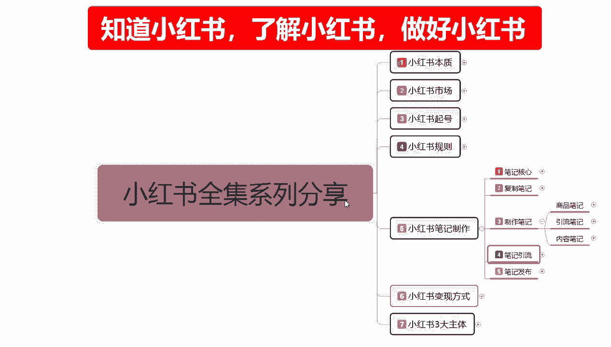
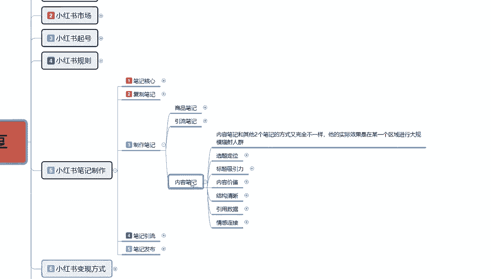
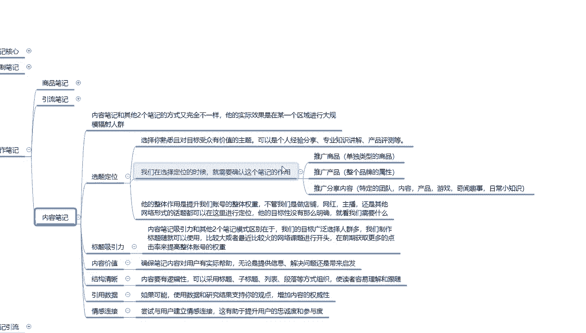
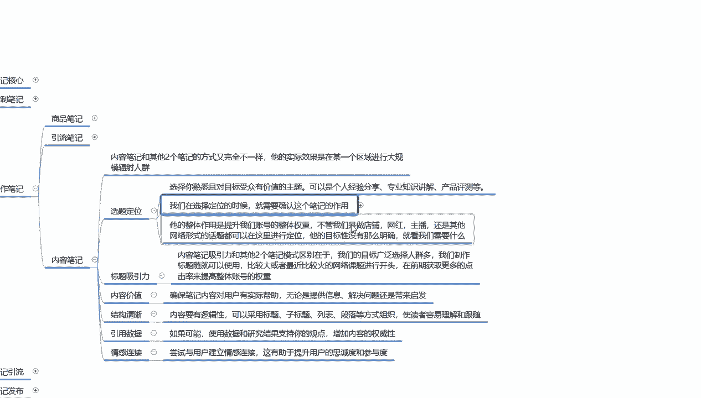
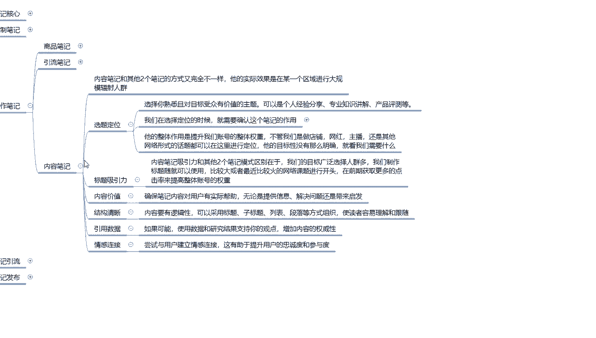
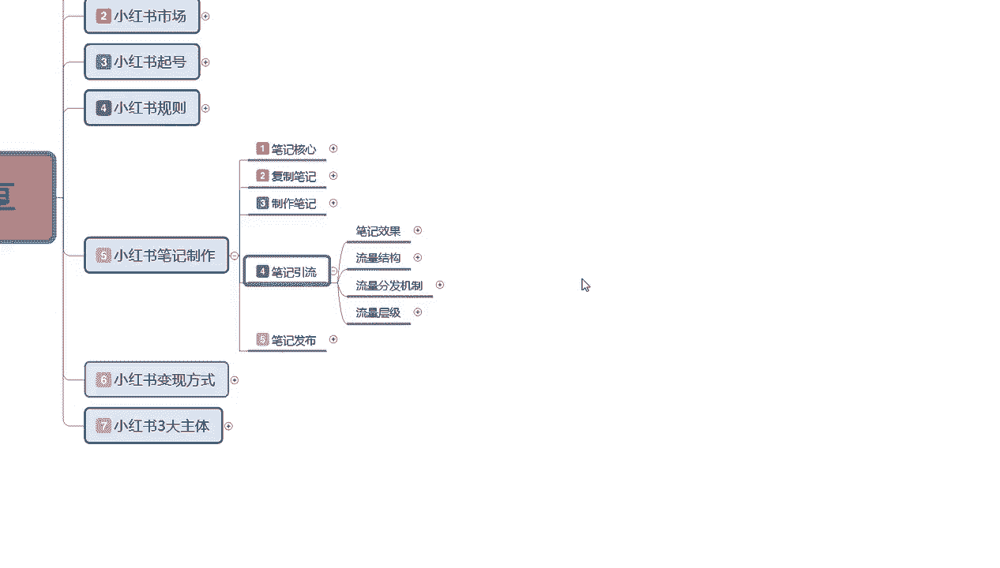

# 2024版小红书体运营教程】吊打一切付费课！最良心的小红书开店运营教程！小红书体开店 起号真的快，涨粉／就业 直播运营从入门到实战全干货！赶快点赞收藏起来 - P27：27、小红书【内容笔记】制作：选题定位及爆款笔记制作 - 西蓝花干货 - BV1KmxPemEUP

大家好，这一节给大家分享的是，小红书全集系列的第五大课时笔记制作，制作笔记的第三大课，第三个大内容内容笔记的一个分享。

内容笔记啊，他对于商品笔记和引流笔记来说的话，嗯方式它又完全不一样了啊，它的实际效果是在某一区域进行，大规模的一个人群，肤色之前做的一个商品笔记和引流笔记的话，他们都是针对嗯，商品笔记。

它是指根据商品的一个人群设定的一个思路啊，来设计我们的一个笔记形式，因为它是固定的一个模式，我们的商品在这个地方的话，它的模式就是固定的，包括引流笔记也是一样啊。

引流笔记只是说把商品的一个属性给它放大啊，然后把它的细节放出来，把他的一个属性放出来，同样的我们拿这些笔记去做引流也好，做内容营销也好，基本上道理都是一样的，但是这个内容笔记。

它和其他的就有一定的差距了啊，因为它内容笔记本来它就是一个辐射区域，辐射区域的话，它一般都在推荐的一个流量里面，如果说我们把内容做好了以后的话，他就是吸引固定粉丝群体的。

所以说他选择的人群数额是比较大的，它不像商品笔记和引流笔记需要定位引流，我们只能做一到两个人群或者三个人群，内容笔记的人群的话，就是能给多少人看，就给多少人看，它能给我们带来的一个流量群体是非常大的。

在论证据笔记方面呢。

我们首先要确定的呢就是，选题定位，第一个点，选择你熟悉且目标受众与价值的一个主题，这个里面的话就是说，可以是个人的一个经验分享，专业的一个知识讲解和产品测评价等等，这个产品的话。

它的一个测评就要靠我们大家自己，对这个产品是否熟悉，和以往用过的一些东西做对比比较，来去做他的一个内容笔记的一个评价才可以，其他的话其实经验分享也好，专业知识也好，道理是差不多的。

只是说他的一个方式运用的不一样，内容笔记和商品，笔记和引流笔记，他们的最大区别就是说受众群体不一样啊，你是要让更多的人来了解这一个类型的产品，对自身有什么好处，或者说是让更多的人啊。

理解你是一个什么样的一个呃信息发布者，第二个呢就是我们在选择的时候，就需要确认这个笔记的一个整体作用，推广商品，推广产品啊，推广分享一个内容，推广商品的话就是单独的一个商品类型。

用商品笔记概括在这个里面去去操作就行，你要是如果说你的内容笔记是堆呃，推的是单品的一个数据量的话，说实话它还还是一样的啊，跟之前一样，不要用那个商品笔记去发送商品笔记，发送它只在商品里面去展示。

你用内容笔记做单品的一个商品笔记去做的话，是作用不大的，基本上是没有作用啊，零作用，别人本来就是搜索了以后的话，就是去买东西去的啊，你要是在里面做内容的话，说实话对吸引力和你的人群定位的话都不行。

所以说他的话就是按照我们正常的一个，推荐流量的一个笔记形式进行发送，只是说我们这个笔记的一个内容的话，它推广的是单独的某个商品或者是某一套商品，你推自己的产品，推书也好，推食品也好，推其他的文案也好。

都是这个样子，第二个就是推广产品，单品和产品不一样啊，产品的话它是一个整个品牌链，懂我意思吧，就是品牌在前，商品在后，相信我的品牌购买我的产品，就相当于新型产业的那种小小型的，我自己做了个品牌。

我觉得这个我这个牌子能做起来，而且还有一定的市场，没有什么竞争压力，在小红书上面去做这种推广，做内容推广，对产品进行一个完美的介绍，你就像315打假，他们的一些很多的东西，其实都是在小范围内进行的。

一个大规模的一个宣传，其实效果怎么样呢，也就这个样啊，只是说他有一个额外的一个市场，进行自我管控的一个宣传而已，也就是说你要把你的包装做精美啊，你的产品做详细，你的产品有什么好处，稍微夸大一点。

往这个方式去靠，第三呢就是推广分享的内容的话，这个的话需要特定的团队啊来组建内容产品，游戏气温趋势，日常的一个小资质，为什么这么说呢，就是说我们在分享这些东西的时候，你有团队去操作的话，你会很简单。

没有团队的话，你只能选一个有团队，你就可以把它做成产业链啊，从出场到收尾，所以说我们在做内容分享的时候，你一定要把思路整清楚啊，意思是什么呢，推广单品就是单品单品推广的一个内容的话，它是比较简单好做的。

我们直接去按照他的一个属性模板啊，把他的整体属性放大啊，对属性的某一些设置，某一些部位的特点啊，进行一个详细的分解，分解以后，然后用图文并茂的一个形式，给用户进行推广介绍，让别人了解啊，对这一个部位。

对某个产品，某一个部位感觉到比较新奇，然后它会继续扩大啊，直到整件完自称的一个产品，他才会去进行购买，也就是说内容笔记的话，它就是宣传你宣传做得越好，那么你的内容笔记效果也越好，你宣传做的不好。

内容笔记效果也就越差啊，明白这个点的话，你的一个选题定位的话就是比较好做的。

这个是选题定位里面的，第二点，就说它整体的作用的话，是提升我们账号整体权重的啊，不管我们是做电影也好，做网红也好，做主播也好，还是做其他的网络形式的话题，都可以在这里进行定位。

他的目标性的话就是说没有那么明确啊，就看我们需要什么样的一个额，操作模式和操作形式，来了解整个店铺的一个数据输出，这个应该就是选题定位，你把选题定位做好了，你后面的一个属性的话。

其实就和商品笔记和引流笔记差不多了，只是说我们一个选题定位，你把它做不好的话，后续的一个选题的话偏题了以后的话，你就不好做啊，也能做，但是不好做。

下面几个内容的话，基本上都是差不多的标题的一个吸引力，内容笔记的吸引力的话，和其他两个模式的区别在于我们的目标广泛，选择人群多，我们制作标题就可以随便使用，什么意思呢，正面词。

反面词或者说是那种网红词都可以用啊，它的标题就比较随意了啊，但是有一个前提，不要找小众标题，要找大众标题，就是标题的题目越大越好，搜索的人群越多越广，它的效果就越好啊，他可以给我们在前期的话。

就是获得更多的一个数据点击，也就是小红书笔记的一个数据点击量，笔记点击量整体点击提升以后的话，我们小红书里面它有一个那个展示的流量，小眼睛的那个有个成绩，后续我会给大家讲，你通过内容笔记的方式的话。

它会提升你整个流量笔记，就是说你的点击率超过了15%，20%，30%，35%以后的话，它整体的一个点击播放量就会越来越大，它是一个良性循环的，第二个点呢就是说嗯内容的一个价值，确保笔记内容的话对。

说实话，这个的话其实和商品和领牛笔记是一样的啊，他的一个内容价值，一个清晰的结构，一个引用的数据和情感链接，其实在上面的我也上面的课程，我也给大家进行了一个详细的讲解，这里呢我就不过多重复了。

它整体的话就是说他和商品笔记，引流笔记唯一最大的区别就是受众目标不一样，商品的受众目标的话，他是固定的，他就是搜索的人，引流笔记你就是做固定人群，就是把店铺的人群给他做好，但是内容笔记它会打乱你的人群。

那就要看我们前期的一个引流笔记，内容人群做的扎不扎实，人群做扎实以后，通过内容笔记的话，引入大量的一个流量来稀释我们的，怎么说呢，就是店铺综合数据不突出，就是你的受众群体太小了，我想把它扩大一点啊。

在我这个引流内容也好，笔记内容也好，不满足我线需线下需要的一个需求以后，就可以开始制作内容笔记，扩大我们的一个生产力了，好吧，这个呢就是内容笔记整体的一个内容。

其实大家如果说对笔记制作不了解的话，还是看一下那个商品笔记的一个完美制作，整个商品笔记的话，它贯穿的流量笔记内容也好，内容笔记内容也好，其实都是按照商品笔记进行划分的，只是我把商品笔记讲的比较详细。

然后引流笔记和内容笔记的话，你共同的部分去商品笔记里面找就行了，好吧，这个呢就是这一节给大家分享的一个笔记，制作内容，下一节的话给大家讲解一下我们BG引流笔记，引流的话怎么说呢，它和上面的不一样。

他是指讲解的是我们整个笔记制作完成发布，我们不管是复制笔记也好，制作笔记也发布出去，获得的整体的一个效果，包括我们的一个小红书的流量结构，还有流量分发的一个机制，同时给大家讲解一下小红书流量层级。

