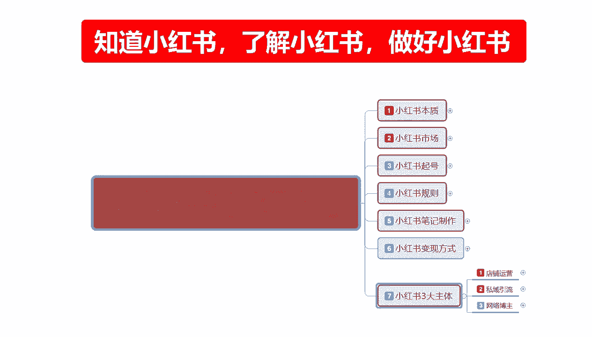
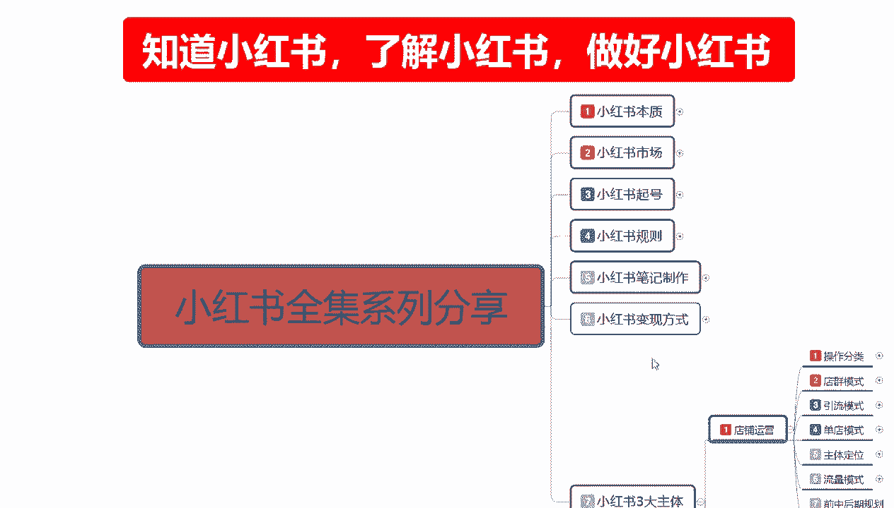
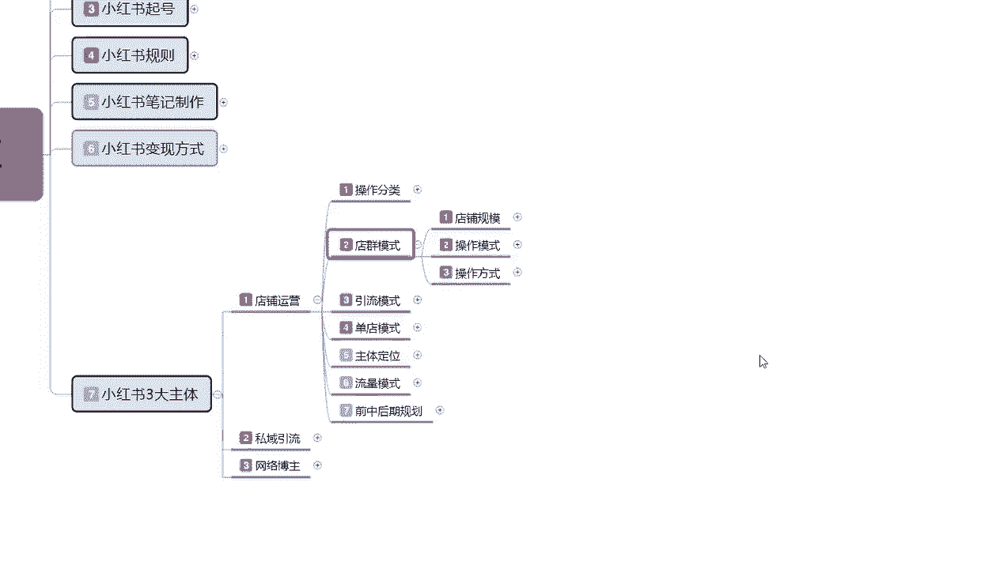
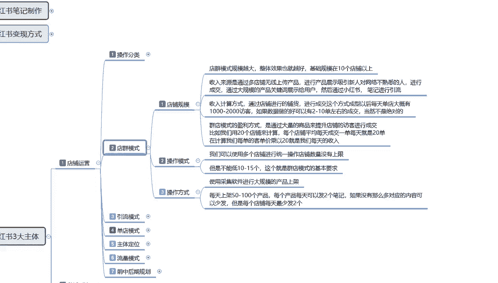

# 2024版小红书体运营教程】吊打一切付费课！最良心的小红书开店运营教程！小红书体开店 起号真的快，涨粉／就业 直播运营从入门到实战全干货！赶快点赞收藏起来 - P36：36、新手小红书运营-小红书店群模式 - 西蓝花干货 - BV1KmxPemEUP

大家好，今天给大家分享的是小红书全集系列的啊，第七大课时啊。

店铺运营的一个内容，废话不多说，直接开始进入我们的一个正题。

上节课呢是给大家讲解了一下啊，让大家了解了一下，我们整个小红书店铺运营里面的一个操作，分类啊，电群引流和单电的一个模式，这节课的话给大家讲解一下电群模式，它整体的一个操作步骤。

电驱模式，说实话，它的一个整体操作步骤还是相对比较简单的，我们首先来了解一下啊，电池模式，我可给大家分为了三个步骤点啊。

第一个是店铺规模，第二个是操作模式，第三个是操作方法，店群模式的话，它的是规模越大，整体效果也越好，基础规模的话就是说你真的是想做店群的话，你最少得要有十个以上的一个店铺啊，他的一个整体收入来源的话。

就是说通过多电无限上传产品进行产品展示，吸引信任，对网络不熟悉的人，就是吸引那些刚步入社会啊，然后也想了解一下，或者是在比较感觉小红书比较新奇啊，啊上面有卖东西的，我就进来看看这种啊。

不熟悉的人来进来成交，通过大规模的一个产品关键词展示给用户，然后通过小红书笔记进行引流，它是通过这种模式，就是我一个店铺的话，里面可能有五百一千件产品，然后这些产品的话他也不分类，其全什么都有对吧。

然后有通过关键词，因为小红书他每一个过搜索关键词的话，他都会在后台给你展示，后台展示，只要是搜索它就有概率显示你这个产品，就算你的牌产品排到1万名啊，但是你的本身基础规模就在这个地方，就会给你引流。

引流的话，你再从这个引来的，引来流量的这一部分人群里面去进行成交，当然了，你不能说是所有的东西，全部全部按照复制类类的，还是稍微优化，那么一两个好一点的可能会好一点啊，他的整个收入计算方式的话，说实话。

怎么说呢，在这个地方打了以后，我就不想给大家那个具体的一步一步去讲，因为它其实还是比较简单的，它只是一个换算公式啊，就是说通过店铺进行铺货进行成交，这个方式的话成型以后，每天大概的话就是一个店铺的话。

大概一到2000的访客，如果数据好的话，可以两有两到十单左右，如果说数据做的不好的话，当然这不是绝对的啊，就说数据做的不好的话，他可能就没有单，那一个店铺有两到十单左右的话，那么你十个店，20个店。

50个店，他就是通过这种方式来促进成交的啊，这个就是店群模式，店群民模式的一个盈利方式，就是通过大量的商品来提升店铺的一个访客，经营成交，比如我们用20个店铺来计算，每个店铺的话，平均每天成交一单。

就是每天就是20单，当然了他这个数据的话也不准啊，20个店铺可能只有五个，或者三个店铺有成交单数，这个就是你当天的一个收入，但是你的话整体投入，你除了前期开店交的一个保证金以外。

后续的话你是除了一些配置的软件以外，是没有什么投入的，这就是店群模式的一个规模，店铺的一个规模去看，要不怎么说，之前给大家说的时候，就说你操作店群，你就看你自己启动资金有多大，你的资金量越大的话。

你在里面就是说效果会越好，但是它整体的一个收入的话，确实确实是不高的啊，操作模式啊，我们可以使用多店铺进行统一操作，店铺数量的话是没有上限的啊，最少保证十个以上就行，但是呢不能低于10~15个。

这个就是电竞模式的一个基本要求，操作方式也比较简单啊，使用采集软件进行大规模的一个产品上架，就说你自己没有产品啊，像这种你做店群的基本上都是没有产品的，你要么就到1688，要么就到拼拼多多上面去。

把别人做一件代发的或者其他平台到五一啊，五英网啊，这种只要是能上传的产品都给上传上去就行，每天上架的话就是50~100个产品，每个产品每天可以发两个笔记哦，我们是没有那么多笔记也可以应对的啊。

那你就控制按照每个店来算，每个店每天最少发两个，他没有上限，你就是把他每天给你的一个额外流量上限，用光就行，每天的话就是最少五一个店，最少五天比一发哪个商品，那就随意了，你就是做大规模的广泛撒网。

广泛网鱼，网鱼里面的网有多大，就看你的产品布的细不细，产品布的细字以后的话，你后面能网到多少鱼啊，那就不好说了，因为他的过他的网大，他的网眼也大，漏掉的概率也会很大啊。

这个就是整个一个电池模式的一个操作方式，电锯模式我在这边的话没给大家多讲的原因呢，就是说现在的话嗯，怎么说这都2024了啊，这都都中旬了，你再去做电学模式的话，说实话效果他不会太好，但是你现在做的话。

你起码不会亏本，如果说你往越往后越往后你再过个一，过个几个月，过个半年，过个一年，你再去做这种模式的话，你就是一毛钱都捞不到了，因为小红书的后台数据快满了啊，这个说的是实话。

这个呢就是整个店群模式的一个方法，你要做店群可以好好了解一下，那这一节分享呢就给大家讲到这。

