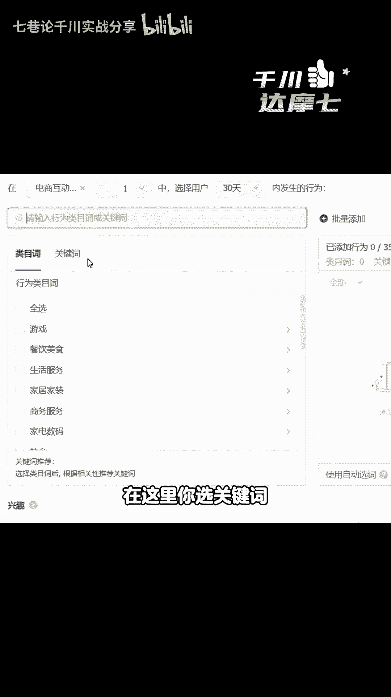

# 24年直播带货起号正确的方法 - P1 - 七巷论千川实战分享 - BV1Rx421D7NS

2024年直播带货起号正确的方法啊，都24年了，是不是现在起号最快的方法就是付费起号，现在哪个不投付费起号，你像之前的什么低价起号，直播间引入的都是低价人群，转正价又转不动它有什么用呢。

下面给大家分享一个干货，怎么用天窗正价起号又快，流量又精准的操作对吧，哪怕你是个新手，你不会起号的，只要你按照我的操作步骤来，你起号七天左右就能够成功，记得视频点赞收藏好，以防你之后要用的时候找不到了。

来兄弟们打开天窗后台，按照我的操作就可以了，第一个点付费起号，选择天窗，为什么不投小店随心推呢，因为小店随心推。

起号难带自然流，而且它容易会耗水，银推的流量从去年下半年开始到现在。

西瓜头条的流量占比比较大，所以它的流量太慢了，这个大家记住，第二个点，千川到底怎么去投，怎么容易起号投放方式来选择控成本，饭店投放没人投的，有很多人跟你说啊，新手前期投放量跑不动，是不是。

那我告诉你都扯淡，前期啊记住只要控成本就够了，哪里你投到后面，哪怕你一个月消耗100个对吧，控成本都能解决优化目标呢，大家记住，只要成交和支付RY，其他的入口都不投，我们只投这两个入口，前期投成交。

后期如果流量放了对吧，你可以投支付RY去稳定投产。

第三个点，千川起号投什么计划，它是根据你的起号方式来决定的。

有两种起号方式，你自己选择是微付费起号带动自然流的方式呢。

还是以纯付费的方式，那么在这里如果你投直播间画面，也就是我们讲的直投，直投呢，就是微付费能够带动自然流的起号方式，第二个呢如果你投视频，那就属于纯付费，对不对，那我们先一个个讲啊。

我们先讲直投微付费带动自然流量的起号方式。

首先你是个新号。

新号的话适合新手就比较容易做的计划来，在这里大家选择徕卡计划啊。

这个是新手容易做的，我们讲的旗号最好的前期直投是人群包嘛。

但是呢人群包计划很多人搭建比较难，所以徕卡计划的比较简单。

但是呢也可以投啊，也能起，所以在这里大家记住怎么搭建点击视频互动，直播互动和商品互动，关注的人群不点。

因为关注的人群很多是那个东西，大家都知道啊，时间范围来选择近15天。

最近的在这里啊，选择达人分类有很多人选达人分类不能选啊。

也不要去选，为什么呢，因为这个流量太泛，你这个时候起号。

你要给你直播间打上精准的标签，所以在这里你要添加你的同行，你找30个对吧，对标的同行我相信应该是找得到啊，你找到对标同行了之后，把它全部都加上你的达人计划就建好了。

明白了吧，这是第一步，那么第二步呢，我们前期起号的时候，新号它到1~7天起号自然流才会来。

所以你七天要做一个数据递增。

比如说我今天第一天我投了十单，我第二天就12单，第三天就15单，就是你每一天要比前天要卖的多，数据做一个递增啊。

系统就容易青睐，这是第二个步骤，第三个步骤大家注意，前期投放它肯定会有亏损的，为什么呢，因为你一个新号，你没有标签，也没有模型，所以你也不可能说哎我10万，我第一次投付费我就能挣吧，这个不太现实吧。

所以呢前期他会有适当的亏损，比如说你第一次去投，他建立模型的时候，他会亏一些，这个大家要能够接受，这是一种啊直投的小号方式。

教给大家，基本上很简单的一种方法，第二个，你今天是投素材的起号方式呢。

就是存付费，那么怎么投呢，第一个步骤存付费啊。

我们讲的现在千川它有一个主力计划，就是说你要培养存付费。

一般是这样投，当你的素材测好了之后，你可以选择行为兴趣，在这里来选择电商互动行为。

选择30天，在这里你选关键词啊，选大行为。

小兴趣，大家记住这六个字，大行为小兴趣，如果不懂大行为小兴趣的话。

你可以看一下我之前的一些视频里面有讲的。

大型为小兴趣，你就投大型微小兴趣，然后怎么样呢，给你这个视频对吧，新素材的话，你先给他成交20单到50单以上的成交标签，有一个基础的成交标签，50单之后，然后这个时候你把原计划关掉。

然后再复制出来，跑托管，你的RY就很容易提上去了。

所以大家记住，跑素材一般基本上就两三天的事情，投直投的起号一般就是七天左右，自然流就来了，当然咯我们讲的是投的少的情况下。

如果你投的多，那一下子就更多好了，别问我是何方人。

