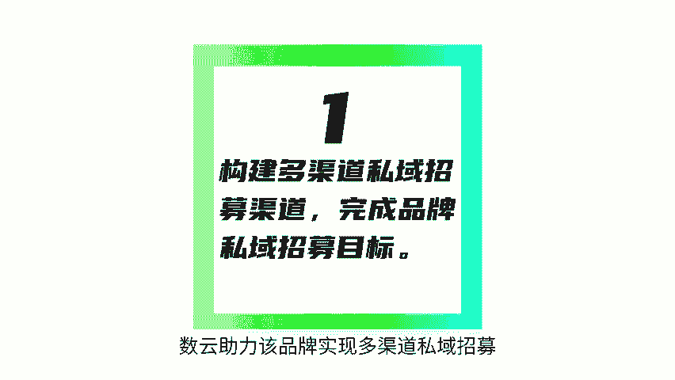
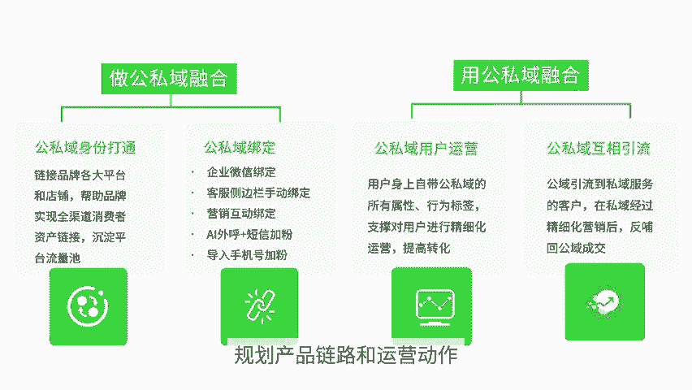
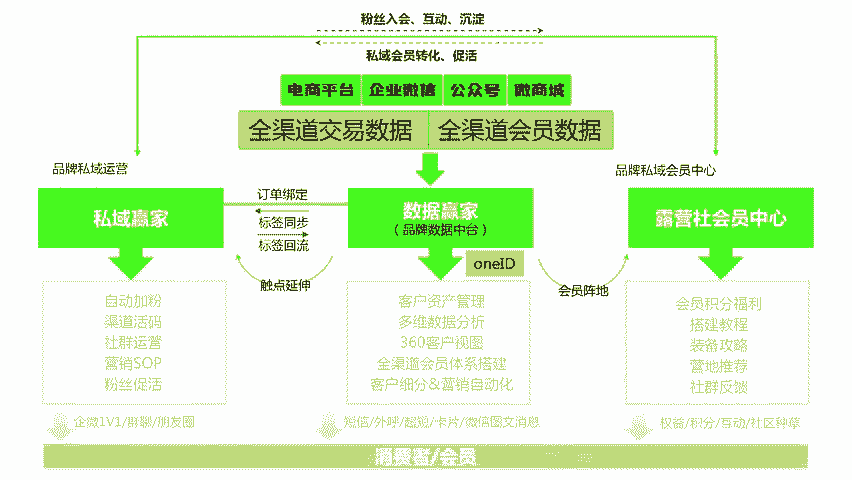
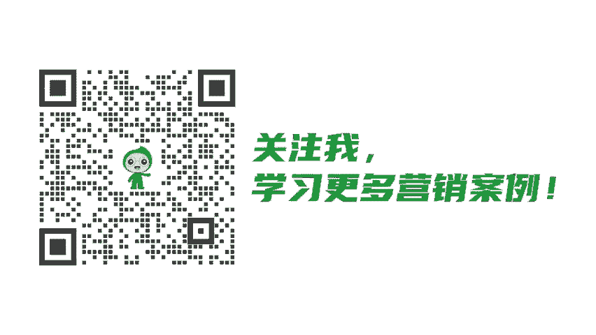

# 3步走、9点运营策略，某知名露营装备品牌这么做公私域融合运营！ - P1 - 数云营销学院 - BV1AJaoeuEYf

🎼人们心底深处的精神向往和需求，造就了户外行业的火热。近两年许多超级品牌都来自户外行业，运动户外品牌正在迎来全盛时期，某知名露营装备品牌产品遍布中国北美、日本、西欧、非洲和中东等国家和地区。

随着全渠道经营布局落地，品牌面临着私域过客，公司与人群运营等一系列难题。数云助力该品牌实现多渠道私域招募，完成公司与客户身份打通和识别，并通过全渠道数据沉淀和分析，挖掘客户需求，实现客户转化。

截止2023年6月，品牌私域招募量达到10万以上。其中50%以上客户完成公司与融合互通。2023年618会员复购率，提升了20%以上。那么他们是如何实现公司与融合运营等。第一步，确定公司与融合目标。

该品牌以提升公司与整体GMV为目标，围绕公司与融合运营规划产品链路和运。

🎼营动作，公司与相互引流，提升经营质量。第二步，制定公司与融合链路，通过搭建全渠道会员运营体系，实现全平台会员数据接入，基于全渠道问ID识别，实现全渠道会员身份统一。

以会员中心和企业微信作为品牌消费者运营阵地。第三步，制定私域客户运营策略。基于获客运营转化复购的链路，制定私域客户运营策略，实现消费者全旅程的服务与管理。具体怎么做呢？

一、私域客户运营私域招募数云提供八代入会渠道，丰富客户入会场景，完善客户会员招募。比如通过小程序进行加本引导，并通过欢迎与形式引导招募入会。比如通过好评返现、平台会员加好友群聊加好友等方式实现私域招募。

2、私域客户运营互动活动，基于数云产品能力，该品牌提供了丰富的互动活动，即提高客户的活跃度，实现销售提升。

🎼也通过线下活动完成品宣，提升客户对品牌的粘性和认可度。3、私域客户运营私域标签管理。品牌结合数营公司与融合方案制定了完善的标签体系，私域标签属性标签、公寓标签，更全面的了解客户，实现精准的人群圈选。

4、私域客户运营群发触达。该品牌基于品宣需求，每日在企微群进行快速触达，完成每日产品的重草提醒，并且可以通过后台查看每条任务的发送详情，提醒未发员工进行发送的。5、私域客户运营朋友圈触达。

该品牌结合私域标签能力，根据客户属性情况，进行精准的朋友圈触达，促进成交转化，提升客户满意度。6、私域客户运营私域SOP关怀。该品牌对添加到思域的新客进行周期性的触达。通过SOP流程简化关怀链路。

提高运营效率。🎼7、公司与客户运营精细化运营。该品牌针对特定人群进行定向营销，通过几微消息、短信等进行跨渠道触达。比如该品牌针对节日活动筛选符合积分条件的客户进行活动，定向群发。

8、公司与客户运营公司与转化。该品牌通过小程序导流公寓店铺，拉动多渠道成交，以双十一为例，品牌在社群里引导用户了解天猫、京东抖音等平台店铺优惠力度和营销节奏，拉动多渠道成交。

9、公司与客户运营线上线下打通。品牌在小程序中设置录营组队板块，作为线上线下交互的通道，引导用户线上发起活动或报名他人发布的活动，再到线下参与活动，实现线上线下互动联通。

