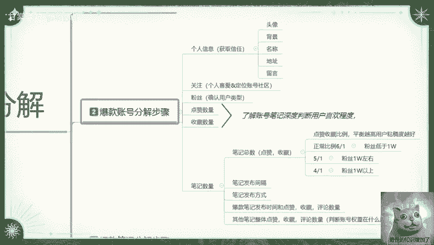
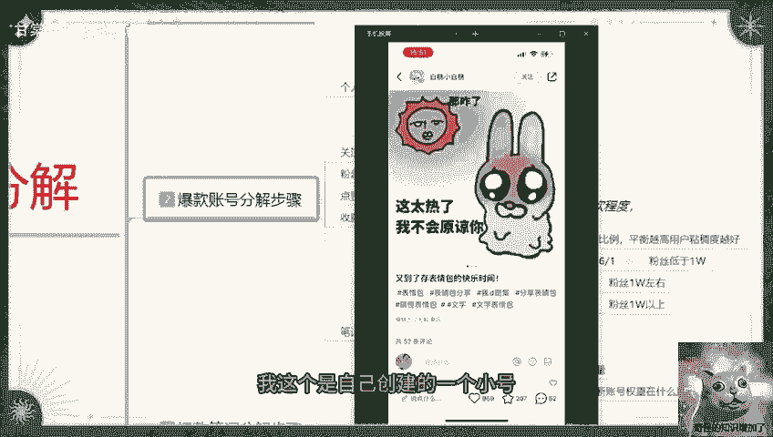
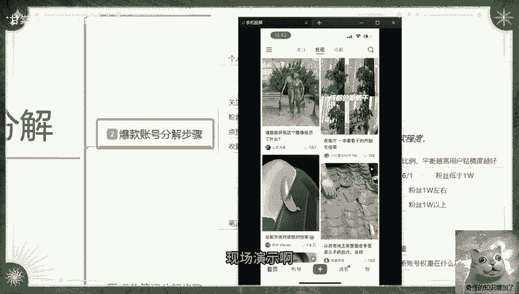
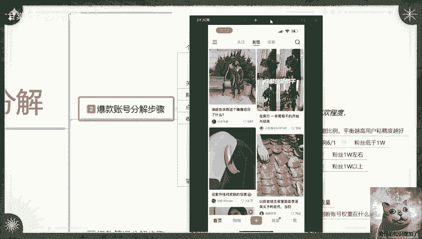
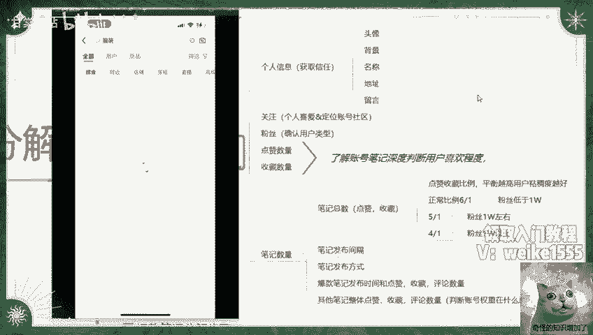
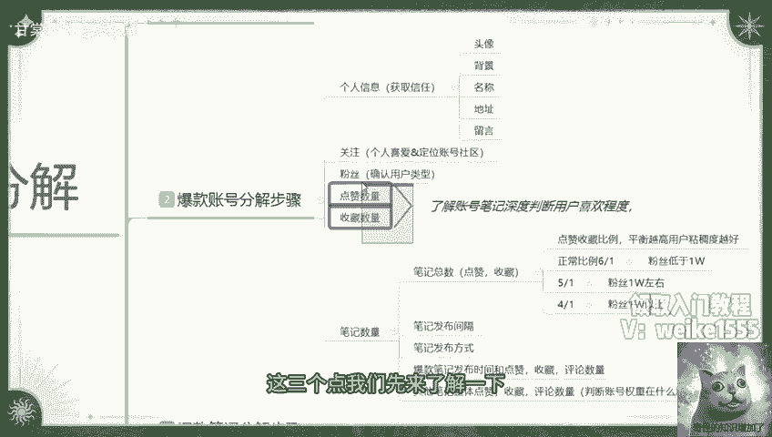

# 40分钟学会小红书运营-原来打造爆款笔记这么简单！！！小白零基础入门必学的小红书笔记公式拆解，最简单的起号教程，快来学！！！ - P1 - 甘棠驿站 - BV1WusTe7Evr

大家好，今天给大家分享的是小红书账号分解，这一节课呢，水大雅把它分了三个段，第一个呢是爆款属性的一个基础规则，第二个是爆款账号的一个分解步骤，第三个呢是爆款笔记的分解步骤啊，他们是一个整体的。

而且呢这个三个大点的内容，我是通过这一个课时给大家进行，完全的一个分享，这个小红书的账号分解，它的主要作用的话，就是让我们了解其他的小红书爆款账号啊，不管不管是他的账号也好，他的笔记也好。

他到底是怎么做起来的啊，为什么会获得那么多的一个曝光展现和流量，我们先来了解一下第一个大点，爆款属性的一个基础规则，因为我们只有了解小红书整体的一个，规则属性以后，你才能知道它的一个呃报关权重有多高。

流量是通过什么渠道，什么方式过来的，爆款属性的一个基础规则，这里面的话我是把它分了很多个重点啊，我只把重点列出来了，其他的一些小红书账号的那个基础规则的话，我是没有列出来的。

因为他跟我们这个账号分解的话额有关系，但是关联的话没有那么严重，这个几个点的话是最重要的几个点，第一个呢是账号的一个基础流量成绩，你们如果说对小红书有一定了解的话，基本上都知道的啊。

小红书它分为八个层级啊，账号基础展示是1000的展示量，什么意思呢，就是说我们刚开始创建小红书的时候，你不管是新手也好，老手也好，你创建了一个新的小红书账号以后，只要你去发送笔记，他基本上都有技术展示。

1000左右的一个曝光量，这个曝光量的话根据我们的类目选择不一样，它所给的一个曝光的一个属性点不一样，基本的话都是在800~1200左右，所以说我取了一个中间值账号，基础曝光数据展示的话是1000啊。

大家了解一个这个点啊，就是你的账号主要是笔记发放出去以后的话，第一篇笔记绝对有1000左右的一个基础曝光量，除非说你的账号有问题，或者说你绑定的微信啊或者手机啊，影响到了你的一个账号权重。

会导致的话没有1000左右的一个技术曝光量，内置你自己的话就是经常删除那个小红书账号，创建以后，删除创建以后删除时间长了以后的话呃，系统没有录入你的一个整体权重，就是你前期的权重已经用完了以后。

就不会有这个技术展示曝光，如果说你没有重复怎么操作过的话，基本上都有，就是你的手机账号基本上能用，小红书账号没有问题，他的一个基础曝光量的话都是800，在1200左右，正常展示的话基本上就是1000。

看你选的类目，大类目的话是接近1200啊，中型类目的话，或者说类目人群还可以的话，基本上就1000，小类目的话就是800左右的一个曝光量，然后呢第二个点呢就是曝光的一个基础倍数，什么叫基础倍数呢。

就是说基础曝光量，给了你1000的一个技术曝光量，然后它里面有一个技术曝光倍数，你要获得就是你的笔记发出去以后，获得11%以上的点击率啊，就是给了你1000曝光曝光，展示里面有四个同款的一个笔记。

或者说相同左右的一个内容，你要获得110个点击率，就是小眼睛数量啊，才会给你增加它的一个额外流量，大概额外流量增加的话，是在往20%左右去增长的，如果说你到达了13%，就是点击率1000的基础曝光。

点击率达到了130左右的话啊，他这个量继续往下面增长，十五十七十九二十一两个点提升一个比例，一个比例的话，大概就是10%左右的一个技术曝光量，也就是说你如果说发放了第一篇笔记以后，给了你1000。

展示你的小眼睛数量，大概的话就是达到了150左右的话，他大概会给额外给你300个基础曝光量啊，通过这种方式去做的一个呃，小红书基础的一个流量成绩评价，然后这个里面的话它还会根据我们的一个账号。

把整个账号的话设为八个等级，八个等级的话就是说笔记浏览量，就是我们技术曝光倍数的一个数据属性，里面的话，第一层级是零到200，就是技术曝光量，第二层级的话就是200到500，第三层级是500到2000。

这个是呃小眼睛的一个数量啊，就是进入你的账号以后观看小眼睛的一个数量，第四层级的话是2000到2万，第五层级是2万到10万，第六层级是10万到100万啊，第七层级和第八层级就是100万以上。

即靠靠近500万，但是678这三个层级的话，如果说呃怎么说呢，你在小红书上面去操作以后，你操作起来了，基本上就在第五层级，2万到10万左右的一个基础权已经曝光，这就是最大化了，你要往第六层级。

第七层级和第八层级去靠的话，你第六层级最多也就是超过10万，往第七层级去靠，但是想往这个上面去靠的话，你必须去做小红书的聚光推广，或者说跟小红书官方有广告投入的一些合，作等等啊，就是官方渠道的。

你才能升到第六第七第八层级，不然的话我们基础的一个小红书账号创建的话，前期的一个笔记，基础浏览量大概也就是10万封顶啊，就是小眼睛数量是10万封顶，它的一个基础倍率的话是11倍，什么意思呢。

比方说我们在第五层级的话，你获得了10万的小眼镜，那小红书的话，他给你的基础曝光量，大概就是110万的一个展示曝光啊，是11倍的一个倍数比例，第二个点啊，这个呢是记录单个比基计算的。

单个笔记计算里面的话是一个cs额，小红书笔记的一个评分，点赞评分，收藏评论，转发评分啊，评论评分和关注评分，这个的话评分他是记录分数的评分，整体影响的呢是啊笔记的一个展示排名，同类型的笔记进行竞争。

你比方说你在一个类目里面对吧，你比方说你是服装内幕，然后你在第三层级，大概的话笔记浏览量是5000到2000的一个啊，小眼睛笔记浏览量数据，那按照同层级进行具体的一个排名划分，每一个层级就是一个战场。

那你的战场就是第三层级，500到2000的这个战场，在这个战场范围以内呢，你没点赞，就是有用户进来对你的笔记进行了一次点赞，一次收藏，一次转发，一次评论，一次关注啊，获得对应的分数，然后呢。

小红书他根据这个评分影响笔记的一个排名，展示，你获得的分数越高，你的排名就越高，所获得的一个报工展示也就越高啊，他和这个账号的基础流量不冲突啊，账号基础流量的话，这个是你自己所在层级。

比方说你在第三层级，你现在是额500到2000左右的一个小眼睛对吧，那你的基础曝光量的话，大概就是500×11啊，这是最低等的第三层级，500×11，大概也就是5500左右的一个曝光量。

然后你再计算这个基础曝光的一个倍数，是11倍啊，500×11倍就是你的一个基础曝光量，你然后再通过这个基础曝光量，计算你的一个小眼睛获得的一个数量，就能得到嗯，怎么说呢。

就大概的知道你自己在这个第三层级，所在的一个范围，五百一千一千五两千，这四个阶段他按照基础层级去划分的阶段啊，大概的话也就是500跳一段，你在上面的话就是200跳一段，或者说是100跳一段啊。

对应的一个小红书笔记，用户按照这个里面的排名去进行划分，你获得的评分越高，你获得的展示曝光率也就越高，这个是曝光属性的一个基础原则啊，大家不要把它弄混了，这是一个权重，就是账号的基础层级。

流量是一个全座第一层级到第八层级，权重不一样，获得的技术曝光量不一样，然后你获得的技术曝光量不一样，你比方说在第三层级，通过这个cs的评分，你的评分数据的话大概在2000左右的范围，那你的排名越高。

权重也就越高，通过这个权重来提升你的权，提升你账号的权重，然后获得这个属性点啊，也就是说你第三层级大概突破2000以后，就是你比方说你在第一名对吧，你在第三层级，第一名技术曝光给你了2万2技术曝光点。

然后的话你的平均小眼睛数量是在额，2万2的11%，大概的话也就是4400左右，也就是4400个小眼睛左右，那你就可以进入下一层级，当然了，你没有获得那么高的属性点啊，就是超过2000了以后。

大概获得了2500，你也会进入第四层级，但你不是以第一名的成绩进去的啊，你的话可能会是在第四名，第15名，第20名，第30名等等，只要你超过了这个数据量，你就会进入下一个层级。

这个就是小红书成绩的一个跳跃，他是通过你的CES排名评分啊，来获得排名，排名的话，然后通过你的基础曝光倍数，换算他的一个点击率和你的一个技术展示之，当你达到下一层级之后时候，你就自然进去了。

那你下一篇笔记发出去的时候啊，和你上一篇笔记的一个技术曝光成绩，有没有作用呢，没有啊，这个是单独计算的，这个就是单独笔记计算，就是说每一篇笔记，你基本上都是从第一层级开始计算，然后第二层级，第三层级。

第四层级，第五层级，第六层级，第七层级，第八层级，它的一个基础账号的一个权重流量，给你的一个曝光，就是基础账号1000展示，你无非在这个展示里面获得的一个基础属性，曝光点是800~1200之间跳跃。

然后通过你笔记的一个点击曝光属性，来提升你整个账号的一个权重属性，这个就是账号基础流量层级，然后呢单独计算你的笔记，通过你的笔记获得的一个点赞，收藏转发评论和关注获得的一个分数，然后呢给你获得第二层级。

第三层级，第四层级对应的一个流量曝光，也就是说你的点击率小，眼睛数量越多，那么你所跨越的成绩数据也就越好，而且这个里面呢它还有一个时间效应啊，时间效应是什么意思呢，笔记上新以后的话。

基本上都是在三天到15天左右，最好的一个笔记流量持续时间就是15天，那你每跨越一个层级，他基本上都会给你增加相应的一个天数，你的点击率越高，获得的天数推广效果也就越好，正常的话我们新账号刚创建完成以后。

你去发一篇笔记，这一篇笔记的话可以给你引流三天，第一天的流量占比的话可能是80%，第二天可能就只有15%，第三天就是5%，第四天就基本上没有流量进来了，也就是说你的笔记不会再获得额外的曝光数据。

但是如果说你进入到第二层级以后，他这个天数就会给你增加一天，而且他的一个曝光量就会给你对应的增加，你比方说我们在第一天，基础账号的一个曝光量是1000，懂我意思吧，技术曝光量是1000。

你获得了15%的一个点击，也就是150个左右的小眼睛，那么你在第二天的时候啊，你的单篇笔记的小眼睛数量可能会达到230，第四天的时不，第三天的时候的话，大概可能会达到270啊，它是对应比利率的一个增长。

如果说你这一篇笔记啊，浏览笔记量突破200以后，他就会进入第二阶段，但是不能超过三天，超过三天以后的话，你就算是超突破了200的一个浏览记录量，你这篇笔记想把它抱起来也很困难，什么意思呢。

就是说你在第一层级的时候，他只给了你三天展示时间，你突破了200的一个流量基数点，那么他在第二天或第三天的时候，就会把第二天的一个流量层级，对应的一个基础曝光量给你，如果说你的笔记超过了三天。

你就不会获得额外的一个基础流量曝光属性，你比方说我们第一层级是1000的展示量，第二层级的话就相当于是2000对吧，2000的一个展示量，那你就需要获得220的一个左右点击率。

也就是说你的笔记在第二天上新的时候，需要有两最少220个小眼睛，你才能获得第三层级，不能说是获得第三层级，你才能获得第二层级的一个基础曝光量，就是第一天的啊，笔记浏览量必须得超过100，接近200啊。

突破200以后，你才就是三天以内突破200，第三天突破，他给你的一个权重就基本上就减慢了啊，第一天，如果说你就能突破200的一个点击量的话，那你可以直接跨越到第二成绩，也就是在第一天你笔记发放出去以后。

已经获得1000基础展示，1000技术展示大概在半个小时左右，获得了200个小眼睛数量的一个点击，那么你这一篇笔记就已经跨入第二层级了，就在第一天跨入第二层级以后的话。

他就会给你额外2000的一个浏览笔记量，然后在第二天第三天的话给你增加到5000，第一天比方说你获得了3000的一个攒金啊，技术曝光展示，为什么是3000呢，是第一层级加第二层级就是3000了。

然后获得这3000的点击量，然后你的小眼睛数量超过600以后，第二天他就会给你再加2000的一个基础曝光，展示量，合并起来的话就基本上有5000的曝光展示量，那你的第二天这一篇笔。

单篇笔记小眼睛数量突破1000以后，第三天他会把剩下的大概有1000左右的展示量，再给你，如果说你在这三天之内啊，突破到第三层级，那恭喜你，你的笔记效果的话，大概会往第七天左右去靠。

基本上你进入第三层层级以后的话啊，笔记效果就在第七层，七天左右，七天左右的范围，你需要突破第四层级，突破第四层级以后，你的属性的话，就要往2000到2万的一个小眼睛数量去靠啊。

就是展示曝光2000到2万，同样的第五层级，第六层级，第七层级，第八层级，理论上来说都是这样的，但是你第三层级突破到第四层级的时候，这个时间段是七天的一个展示曝光量，到第五阶段啊。

也就是第四层级进第五层级的时候，基本上就是15天的一个曝光量，那15天的曝光量，你的小眼睛数量突破10万，你才有概率进入第六层级，但正常的话，你的一篇笔记想从第五层级突破到第六层级。

15天的展示量获得10万的一个小眼睛数量，难度系数是非常大的，所以说为什么说自然的流量，就是笔记发放出去以后，你和小红书官方没有合作，你没有做聚光，或者说没有做其他的一些推广。

你是到达不了第六第七第八层级的啊，就是这个原因，他的计算公式啊都是一样的，都是通过这个cs评分，然后的话评分影响笔记的一个排名展示，通过排名获得对应的一个曝光属性，当然了，你的属性没有别人好。

那你获得的曝光肯定就没有那么多啊，曝光属性每天小红书他搜索的属性上限，搜索的人数是有上限的，你这个里面的话可能在我们去操作的时候，你还要去考虑他的一个时间规划啊，所以说有时候这个小红书的笔记。

你发出去以后不是越晚越好啊，因为你凌晨的时候是没有人去啊，观看他的这个呢就是小红书三个观点，第一个账号的基础流量，第二个CES评分，第三个笔记效果关联，然后笔记效果关联，这个里面呢还有隐藏的属性加成。

隐藏的属性加成是这几个点啊，点击点赞互动完播，我来给大家解释一下，这四个额属性点所对应的一个属性权重，什么意思呢，点击率就是我刚刚给大家说的，这个小眼睛的一个数量啊，这个小眼睛数量的话，说实话。

你没有办法去观看别人账号的一个小眼睛数量，你只能看到你自己账号下面的啊，你去看别人这个小眼睛数量，以前可以，现在不行了啊，这个呢现在只能个人观察，第二个呢就是点赞概率，观点超过11%，增加曝光基础啊。

就是基础曝光量，就是这个基础曝光倍数，大概的话比例就是11%左右，这个的话数据呢是五呃，怎么说呢，就是说玩小红书，了解小红书这么久以后啊，我自己计算出来的一个评分结果，这节课呢那个评分数据的话。

我怎么计算的公式我就暂时不给你们了啊，你们如果说了解的话，你们基本上都能把这个公式给计算出来，你多发几篇笔记，然后多了解几个账号啊，多去看一些数据的话，你基本上就是能从他最基础的数据量里面去啊。

把这几个基础数值给他计算出来的，计算方式还是比较简单的啊，这个是点击率啊，就是我们最关联也是最核心的一个，基础数据数据啊，眼睛的一个数量超过11%，就是增加你的一个技术曝光量，如果说你没超过11%。

那你就只有1000个的一个技术曝光量，就是你的笔记质量不行，或者你自己呃没有把握到一些细节，比方说笔记的发放时间啊，你自己所在的一个社区群体范围有没有偏离，就是你自己账号创建支出账号有没有啊。

偏离你自己的主营行业啊，了解的朋友的话，你们可以去多看看这个同类型的一个视频啊，我之前的话给大家讲的时候，包括那个账号定位啊，属性定位啊，基本上都讲过这里，我那我就不重复了好吧。

然后第二个属于重点的一个属性点，就是点赞概率啊，点赞概率的话超过11%到35，突破下一层级啊，类目不同的话概率不一样，基础比例的话就是11%，就是我刚刚给大家说的啊，你在第三层。

其实想不应该说是从第一层级突破，到第二层级的话，概率就是11%啊，这是最基础的，而且要小类目，不能大类目，大类目的话，11你肯定是突破不了第一层级的，你只能说是在第一层级换挡。

也就1000左右的一个曝光，你想突破第一层级的话，你基本上的话额点击概率的话，大概是在十三十五左右，你第二成绩的话，你的一个小眼睛数量的点击率的话，大概是要接近17了，第三层级的话。

你基本上就是建议49，第四层级接近20%了啊，可能是21%，第五层级的话，你就是四个人里面的话，最少有一个观看你，你才能说是往后面的一些属性点去靠，当然了呃，小红书这个里面的话，其实它有一个点啊。

这个点我不知道你们观察过没有，就是很多小红书的笔记啊，只要你的笔记浏览量破千以后的话，那个小就是小眼睛点赞数量破千以后的话，你的数据会越来越好啊，那是因为小红书上面，他那个你很多新产品发放出去之后。

因为新红现在小红书的笔记越来越多，很多新产品发放完之后，它的吸引力并没有那么强啊，懂我意思吧，就是老的小红书用户，他知道怎么去选择好的啊，一个笔记来观看，提升自己的一个啊。

个人升华就是是否需要自己寻找的目标，就比方说什么一两百个点赞呐，或者几十个点赞，哪几个点赞那种看的人很少，所以说为什么说现在小红书这个爆款越来越少，好老的爆款越来越越好啊。

好的新的那种小爆款做起来越来越困难，就是这个原因啊，因为小红书的话那个用户所观看的数据量啊，越来越熟悉，他知道怎么寻找比较适合自己的一个内容，就是说点赞的一个概率啊，小红书点赞的一个概率超过11%。

到35%，有概率突破下一层级，但是的话内幕不同，它的概率不一样，基础比例的话是11%，以前的话基础比例是11%，第一层级突破到第二层级，也就是说你给了你1000技术曝光，你最少有110个眼镜。

你比方说给了你1200的一个基础报告，那你最少的话也就是说130，接近140的一个小现金数量啊，这是第一天的数据，如果说你第一天突破不了数学，那后天明天第二天第三天的话，你还是吃的第一天的那个。

暂时曝光的后续属性啊，所以说你想突破第一层级，你必须第一天啊，你的小眼睛数量和点赞的一个概率，必须超过11%才可以啊，第三个呢是互动率，互动率是什么呢，互动率是评论互动的一个数量。

就是你的笔记发放出去以后，用户去你的笔记里面进行评论啊，评论的一个互动数量整体超过5%，它会有一个曝光提升，你比方说我们在第一天我笔记发放出去以后，给了我1000基础的曝光，然后进来了110个访客。

然后里面大概有六个人去进行了评论，然后呢我和这些评论的人有互动，他大概会给我增加10%到15%的一，个基础曝光量，也就给你额外的100~150的一个基础曝光，展示你之前是1000，过一会的话。

如果说有六个评论以后的话，他会给你额外，10%到15%的一个记录曝光量，当然了，你的评论数量越多，获得的曝光属性也越好，呃具体的一个曝光加成的话，我没有计算过，但是不会低于5%啊。

基本上的话就是在10%到15%之间，就是说这个评论互动数量啊，你不能低于5%，越高越好，低于5%的话，属性点跟不上来，还有一个点啊，这个评论数量不要超过30%，评论数量如果说超过30%的话。

你有可能会涉嫌违规啊，就是造假，造假过后的话，你整体数据的话会下降，反而不会上升，就说你尽量的话控制在10%，5%以上啊，30%以下啊，用户的一个评论沟通里面，第二个点呢就是互动值。

互动值的话就是主账号的一个回复比例，隐藏属性的一个关键属性啊，它没有显示在我们小红书已知的属性上面，这个评论比例的话，我是把它给测出来了，然后属性点呢就是在这个地方。

就说你的一个小红书比例评论低于100，账户账号的一个回复要超过20%，什么意思呢，比方说呃你获得了100个评论，那你最少要回复20个用户的一个数据量，如果说你的评论低于1000。

那你的回复量的话大概是在100倍100左右啊，就是100以内接近10%就可以了，如果说你的评论低于3000，就是没有超过3000的话，大概有5%左右就可以了，这个这个范围内。

给你增加的一个曝光权重是最高的啊，当然你也不用一个一个去计算啊，因为你有这个计算的一个时间的话，你还不如自己去把那个小红书的笔记优化一下，然后排版优化一下，账号属性优化一下啊，超过3000以后的话呃。

评就是你的评论超过3000以后的话，就是小红书系统，它不会再记录你的一个互动值，这个里面的话他不进入你的互动值以后，包括点赞收藏转发评论，关注增加值的话，就说不超过整体设置的5%，到8%以后。

你的一个账号权重就已经开始掉了，这个点赞收藏转发评论关注值啊，增加不超过8%，是每天，你比方说你第一天的话大概有，这个我怎么给你们解释一下呢，稍等，这个数据线我们这么看啊，你们可能会好接受一点啊。

评论超过3000以后啊，就是你的这个整体评论超超过3000，然后呢每天增长数值，你比方说点赞今天是1万7对吧，以下一天第二天的一个点赞数据，啊要超过8%的一个比例，懂意思吧。

你比方说你第一天的话点赞是一点，点赞是1700啊，1万7，1万7的数据在这啊，如果说是1万7，那你的操作比例的话是超过了8%，5%到8%，也就是1万的话，大概是额500，500的话接近800。

那你第二天的属性点，如果说没有超过1万7800，那代表你的整体权重在下降，也就是你的曝光属性点在下降，这个数据啊，好的笔记最多也就15天，如果说没有超过8%，那你代表你整体的一个这个单篇笔记的账号。

权重在下降，也代表你账号的权重在下降，这个的话不要去强求啊，就是小红书给你最好的笔记，推广时间已经快到现场啊，时间已经快到点了，你需要去准备下一篇报关笔记了啊，评论超过3000以后啊。

他整体评论数据以后的话，就是不再记录你的互动值了，就是你们双方评论来评论去，然后在里面聊天啊，说话之类的啊，通过这种笔记的聊天方式去了解以后的话，账号回复率额大概有5%左右就可以了，你不要超过太高啊。

也不要太低，偶尔回复一下，一天回复个几条，十几条，二十二十三四条都可以，第一天操作一下也行，第二天操作一下也行也行，第三天操作也行啊，就是说在这个时间段以内，你的评论速度的话基本上就是3000。

你要有5%左右的一个数据量，超过3000以后，你就不用管它了啊，让他自动去推广就行了，然后超过三天以后，你的整体数据量低于5%到8%以后，就是每天增长的一个幅度，低于5%到8%以后。

就代表你这个啊笔记的寿命已经差不多了啊，每天都开始降权以后的话，它的一个增长幅度，就寿命就已经达到差不多一个，差不多的一个属性点了啊，这个呢我只是模式的啊，大概给你们测试的一个数据数据点。

这个数据的话基本上都是我自己做的啊，包括怎么说呢，就是为了给你们进行这个分享的话，我需要做很多的一个啊属性点的一个测试，你只有了解他的一个大概属性点，测试以后的话，你才知道你自己所对应的一个小红书。

自己目前在什么位置，下一步应该怎么去优化啊，去操作，所以说我在这个小红书上面的话，是做了很多测试好吧，我们继续跟进那个主题，第四个点呢就是完播率啊，这个完播率的话，它其实是属于隐藏属性的范围之内啊。

为什么说是隐藏属性呢，他这个隐藏属性的话，它整体的话是关联你的一个收藏属性的，基础比例的，一个比例点的话，大概是15%左右，有曝光，就说你自己也没办法去看的，你不知道别人在你的那个笔记里面待了多久。

但是小红书后台系统的话，它相当于是有一个那个计算值的，有多少用户在你的那个小红书里面，平均待了多久，计算值超过15%以后的话，就有报告提升，这个很容易达到，但是的话你也不能说是太低了。

但是你基本上定有15%以上的一个整体，平均停留时长，就差不多这个15%的一个曝光与提升，是什么意思呢，同类型的笔记，你们比方说给了我1000的一个用户，给了你1000用户，然后咳我以前的用过。

在我这边的话，平均停留时长是啊，30秒，50秒，一分钟或者2分钟，你的平均停留时长只有百分之呃，只有30秒，然后的话他会把我们这个获得的这个，完播率的隐藏属性按照排名啊，他还是按照排名的。

然后的话进行换算，谁的停留时间长啊，通过综合比例给你进行判定，你只要数据点啊，没有低于15%以下，基本上都有曝光增加，但是这个曝光增加的话有增加，但是曝光量不会太多啊，这里面要弄清楚啊，它是隐藏属性。

它不会给你增加太多的一个曝光量，大概的话也就是5%到7%左右，的一个技术曝光门架，就是说我们操作小红书的时候啊，你的笔记发布出去以后，这个里面只是单独计算的啊，单独计算的一个笔记。

每一篇笔记他都是从零开始的，你比方说你，你觉得你第一篇笔记发发放完成以后的话，你在第四层级了，第二篇笔记发放的话，在第一层级是不是有点不公平了，其实小红书就是这样啊，所有的原则属性给你把它摊开以后的话。

就公平了，也不能说是你，不然的话那个小红书用户的新号的话，他起不来啊，你想在小红书上面做网红，做博主啊，卖商品做引流啊之类的，如果说你小红书没有这个平衡系统的话，其他用户都做不起来，越大的越强。

越小的越废啊，他通过这种方式的话，就是每一个单独的笔记，按照这种计算方式去单独计算的话，那么谁都有可能做爆款啊，小红书这一点优势还是非常明显的，啊嗓子有点不舒服啊，然后我们看完这几个属性点啊。

就是点击点赞互动啊，完播这几个属性点你们大家都了解一下，因为这个关系到我待会给你们实操进行分解，那个账号啊，爆款步骤的话，你们不了解这些属性点，你就不会明白我在讲什么，别人的账号是怎么报起来的。

你的账号为什么爆不起来啊，小红书笔记整体流量的话，就是说呃笔记效果的话，它整体原则是不变的，我们笔记小红书你发笔记的话，就说为什么要保持一个特定的时间发数，就是说因为小红书笔记发布的话。

它效果有时间效应啊，超过一段时间以后啊，笔记就会失去引流的作用，当然了，他为了保证小红书整个后台系统的一个数据量，不至于太过庞大，基本上就是最好的笔记，也就坚持四五天左右，新笔记的话基本上就一天左右。

两天三天啊，第二天第三天的话，基本上也就是额外的一个余量曝光而已，那基本上没什么用，最主要的属性点的话，你基本上就在第一天开始能不能上去，能上去能突破到第几乘几，获得多少的一个展示曝光量啊。

就看大家自己怎么去努力啊，怎么自己把笔记啊做的更好，我们来看这个啊，这个属性点基本上都是一样的啊，这是我随便找的一家店铺啊，我包括后续给你们做分享也是一样的，然后呢去记录他的一个发布笔记。

节奏时间获得的一个曝光展示，他这个里面的话，还有其他的很多的同类型的一个笔记，但是我没有去怎么说呢，就是我没怎么太去掉那些没有用的数据啊，这个属性量不行啊，这个父子版的吧，7月15号发的一篇数据量。

然后的话他整体的话点赞当天发的啊，这个的话我是在十，我是在18号查到他的一个数据量，这个是过了三天的一个数据量，3000多的一个点赞，包括第二天，第三天的话基本上就到达了4000多，接近5000。

但是再往后面走的话，额我就没怎么看了，因为我已经得到了我自己所需要的一个结果，这个里面的话我们大家可以自己看啊，点赞收藏评论技术曝光啊，这个点赞概率是我自己加上去的。

这个的话正常倍数的话应该是11倍的啊，但是11倍的话，他的点赞数据的话，我是拉十倍，因为好计算数据，我才拿到十倍，你们正常算的话要拿11倍去算的啊，就说不要不要因为我这个东西误导了正常数。

基数倍数的话是11倍来去计算的，然后这个里面是他的数据属性的一个收藏点，然后评论概率的一个评论点，这个评论概率的话他没有跟进啊，因为他的爆款的话，就说他单篇这是一个账号里面的数据啊。

他单篇笔记爆款的话数据量还是比较可以的啊，包括你们看他前面这个评论数据收藏数据，技术曝光，评论收藏点赞这些数据，你们直接看这个数据，你就知道他的账号是通过什么方式去起来的啊，当然如果说你们自己想去啊。

跟踪同类目同属性的一个账号的话，拿这个公式啊，把自己公式换算一下，然后拿这个格式自己去编辑一下，跟进个三天，你就知道他是怎么做的了，好吧，这个呢就是小红书啊，账号分解的一个爆款属性基础原则。

就说你只有了解这几个基础属性点的一个，基础原则以后，你才知道为什么别人的小红书笔记能报，我的小红书笔记发出去以后的话，每天也有获得几十个上百个的一个小眼睛，偶尔好一点的话，也就多个几百个。

为什么爆不不能进入第三层级，第四层级甚至第五层级啊，区别点就在这个地方，如果说你不了解这个啊，这几个点一起把小红书想做爆难啊，好吧，那下面进入我们的一个爆款账号分解步骤，爆款账号分解不够啊。

这个里面的话其实还是比较好理解的，这个里面的一个信息量呃，个人信息关注粉丝点赞收藏，然后的话是笔记数量，这个是我们所需要观察的，你只有了解观察这些对应的信息以后，你才知道什么叫爆款，什么不叫爆款，好吧。

呃下面的话我用手机来给大家进行一下演示，我会把那个手机屏幕的话啊，导到这个所录播的一个课程里面，给大家进行一个完全的一个分享，大家需要稍等一下。

好额我这个是自己创建的一个小号。

然后的话给大家进行那个现场演示啊。

这个我们手机打开小红书以后啊。

基本上就是这个样子，我们来先看一下啊，账号报告，爆款账号的一个分解信息，我们首先要关注的是个人信息，这个里面的话内幕包括属性点，我就不不做什么那个预判了，我就随便选了好吧。

这个里面的话嗯先看个大类目服装好吧。

我们找对应的一个属性点，不管是服装或者说是其他的什么东西，我们随便找一个啊对应的一个账号，进行它的一个属性点，分析账号属性的话，我也不挑太高的，大概挑个3000左右，2000左右的一个点赞吧，好吧。

从上往下拉，找到哪个是哪个，这个就这个就先不算好吧，我们从这往后下面走，碰到哪个我就给大家讲哪个这个2000，这个从他的一个属性账号进来以后的话，我们直接点击他的一个头像，进入他账号内部就可以了。

因为我们现在的话还没有做他的一个账号，笔记分析，我们现在做的是他的账号分析，而不是账号里面的一个笔记分析啊，这个属性点是刚刚看过的，是这个2000的一个属性点对吧，我们先来了解他个人的一个信息量。

女装这是它的名称头像，头像这是他自己所做的一个logo，然后是背景，这个背景墙大家看见了吧，这是我随便选的啊，背景墙，然后的话背景墙这边是一根衣架，后面呢是他的一个服装展示位置，背景墙做的还可以。

头像做的可以有自己的一个定位，就代表他不是一个小的一个作坊，什么意思呢，他给自己定位非常清楚啊，包括他自己是做什么的，想做什么的就已经非常清楚了，头像有了背景，有了名称，有了啊。

品牌名称自己给自己做了一些小广告，这个品牌的话你们去网上面搜啊，我都不用猜，去网上面搜也是一个小类目啊，然后是地址成都市啊，这个我就不练了，因为有些东西的话是不能念的好吧，地址名称，弟子留言。

他的留言板块的话是啊，谢谢你们的一个关注和喜欢啊，这个留言板块的话，说实话你有时候留些邮箱啊，或者说是呃留些其他东西都是可以的，然后再看这里啊，他这个地址后面就是说实体店私信没办法回复。

说为什么他做引流没有办法去回复你们的私信，因为小红书在上面做引流啊，他把流量引进来以后的话，私信是没有办法回复的，也就是说你发私信给他，想了解他的一个所发的啊，产品内容也好，所发的一个商品价值也好。

就是你想咨询他的东西，人家已经直接告诉你了，我私信没有办法回复你啊，但是他这个里面肯定是有其他方法，去做引流的啊，而且他这个账号的话是没有开店的，开店以后的话，这边是有一个额店铺信息的。

也就是说他主要做的是线下，然后呢想通过小红书这个方式的话，去扩展一下他那个线下店铺的一个名气，或者说是通过其他的引流方式引流到小号以后，你们想咨询他店铺里面的一个产品，它通过啊其他的渠道。

然后的话你们下单，他给你们发货啊，这就是做引流的啊，很明显的小红书账号做引流的头像，背景名称地址留言，这五个点都有了吧，关注啊，个人喜爱和账号的一个社区，什么意思呢，他自己给这个账号。

也就是说给他这一整个账号，自己所设定的一个范围，我们来看一下啊，关注88，大家可以看到啊，他还是比较聪明的，该用户啊已设置关注列表不可见，什么意思呢，就是说我没有办法去关注他的那个。

查看他自己所对应的啊关注了哪些人，大家放心啊，这88个人绝对是做的账号定位，我不用去看，我都知道什么叫账号定位呢，就是关注的同行的一个啊，就是同行同内部的一个数据属性，在这个地方，他是卖什么的。

然后他去关注什么做的一个账号，定位88个不少了啊，还是比较有耐心的一个账号，然后粉丝1万也是不可见，也就是说我没有办法关注他，有这1万个人里面有多少个人啊，是真号，有多少个人是假号，然后呢。

这个当前发布笔记数量70或者点赞1万2啊，获得收藏是7000，那么也就是说他如果说去做引流的话，从这个7000里面我们播不说多的，只说播50%，他也有3500个用户，这3500个用户我啧怎么说呢。

转化率不算太高，只算10%，他也也有350单啊，而且我这个是这个算法的话，比例是非常小的啊，正常的话你在小红书上面做私域啊，做引流啊，各种方式你去引流的话，数据绝对不止这么点了啊，因为他这个账号的话。

整体算下来的话还是非常不错的啊，包括这个头像啊，名称，整个背账号的背景墙留言对吧，地址，然后的话呃也提前跟我们说了，他的一个账号私信没办法回复，然后的话他通过其他方式去联系你们。

因为你只要在他的评论区里面进行评论，他就可以找到你，他找到你的方式无无外乎换一个账号，把你拉到群里面，然后的话用小号去跟你聊，我是谁谁谁啊，什么店，你想咨询的东西啊，我加什么什么的联系方式。

然后我告诉你有什么问题，你可以直接问我等等这些方式，看你自己怎么去做了对吧，这个是小红书的一个嗯，怎么说呢，做引流基本必备的一个条件好吧，而且他这个账号我是没有关注的啊，我只是说去了解看一看啊。

然后他这个里面的笔记和收藏的话，都是没有打开的对吧，然后我刚刚我们看的这个里面啊，70分笔记啊，他关注刚刚看了没给我们看，然后粉丝也没给我们看，点赞数量，收藏数量，这个给我们看了，然后还有一个笔记数量。

这个里面啊这三个点我们先来了解一下。

这个我还得拉上来，按个人关注，个人喜欢喜好，就是他的一个账号社区的一个定位，粉丝确认用户的一个类型，但是我们现在的话，没有办法去确认他整个账号的一个用户类型，然后点赞收藏数量。

这个的话就是了解它整体对应账号，笔记的一个深度和判断用户的一个喜欢程度，从哪几个点去看啊，我们就去了解一下，然后是笔记的一个数量啊，这后面的话你没办法去了解，因为他给你把粉丝给关闭了。

也就是说这个账号的话，你只能看70%的，60%，了解它大概的一个操作属性点而已，然后看笔记数量，笔记数量的话是70个笔记总数，点赞收藏正常的比例在这个地方啊，点赞收藏比例平衡越高的用户的话。

他的粘稠度越好，也就是说你的这个点赞比例的话，他越平衡，那代表你这个作品，你的笔记在小红书里面获得的喜爱程度就越高，只是说你自己目前的话，没有把自己账号权重给做起来，那今天的课先到这了。

大家可以给个三连支持一下哦，另外给大家准备了视频资料大礼包，从零基础入门到高阶运营技巧都有包含，学完自己独立运营账号是没什么问题的，当然如果有小伙伴想要诊断优化账号，也可以在评论区留言找我。

帮你诊断店铺。