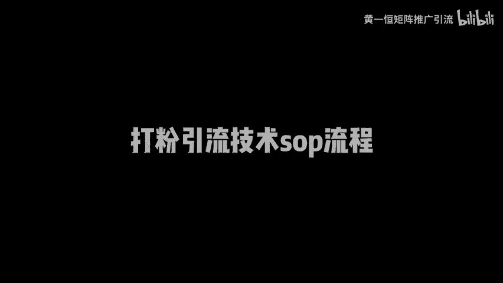
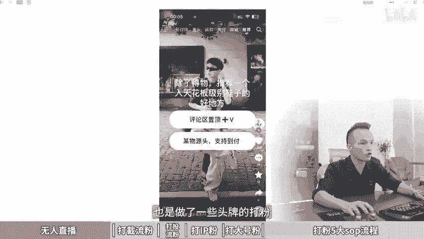

# 5大打粉引流渠道，打粉引流技术sop流程！打粉引流教程，打粉教程，打粉是什么意思，创业粉引流教学，男粉引流方法，线上引流渠道有哪些，引流吸粉，卖课程哪个渠道引流 - P1 - 黄一恒矩阵推广引流 - BV146421f7TR

想知道打粉一个月能挣多少钱吗？一个很小的工作时，3到5个人一个月能做出小10万的利润，你有逼。今天给大家掰开揉碎的裁剪，市面上所有的打粉路径，以及他们的一些成本，季节废话。

一个视频给你分享五大打粉引流渠道。打粉引流技术SOP流程，视频有点长，记得先收藏。一起来看我给你分享如何打5人直播粉，截流粉头留粉，个人IP粉以及大号粉还会给你分享打粉的五大SOP流程。

现在看第一个如何打5人直播粉，5人直播打粉效益是比较高的。一天晚上或者一个白天就能打500到1000粉，一个粉的单价能做到接近20块钱左右，主要的成本在一号的成本大概在300到1000。口子在不常开。

有的时候啊一个月只能打7天或者打5天。打完之后啊，有可能咱们就要休息一个月，再去找号了，收益几个人的团队有的时候一天就能做到1到2万块钱。具体什么是5人直播。这里面我特地收集几个数。

给大家做了录屏，一起来看一下什么是无人直播打粉。比如这里面有一个做大牌的衣服的，我们来播放看一下。我们拆解一下这个直播间这个直播间的账号呀，如果你点击它的主页去看，可以发现它其实就是一个普通的熟人号。

是租了别人的账号过来，然后来单独拿过来做这个直播，上面有一条评论唯一看款。只有粉丝群哈，相当于就是把流量导到粉丝群，再通过粉丝群里面来进行转换。这样的直播间啊其实非常多。比如这里还有一个直播间。

我们来点击看一下。なかず。这个直播间他是卖衣服的，可以看到上面写了1个993件任选。目前的在线人数啊有70多人，大家不要小看这个70多人的在线人数。如果直播下来几个小时，他的场关能做到几万。

甚至有的能达到十几万。这里面呢能够加个几百上千个人，是完全可以做到的。这的直播间大家如果稍微留意一下，其实非常多。比如这一个它是专门用真人来进行直播的，也是993件。那么点关注车车就出来了。

平均在线人数有86个人，这种场关异场也能做到几万。主要就是这个直播间的话，有小姐姐长得非常好看啊，能够提高性的流量。这种直播间呢其实非常多。好，这里面还有一个咱们可以来看一下。好。

这里面呢他是做的一个视频类的啊，是咱们后面讲的一种打法。那，除了得物推荐一个天花板鞋子的好地方，怎么怎么样。你看啊，这种就是引流到自己的评论区里面来，也是做了什么一些头牌的啊打粉。

相当于就是什么FK行业。

第二个来看一下打截流粉，截流粉的效益在于什么，一个人一天能够大概打50到100分左右，但是很难超过200个粉。因为他每天需要很大的工作量，所以你每天都加班，转换率呢相对来说会比较低。

但是截流如果你玩的好的话，账号呢也是很难费的一个账号也能够玩几个月，甚至更长的时间，比如说像在我的评论区里面就有很多伙伴在打这个截流。比如说这个伙伴他是做这个流量卡的，哎。

他就在评论区里面发了自己的一个表情，再比如说这里面有一个买这个项链的，哎，这个怎么买，你看有很多人就在评论区里面啊，告诉你你收什么什么样里面有的这种就是什么，就是在评论区里面做截流的。

其实目前呢其实很多人都在玩。而且他主要是凭这个人力做起来比较简单，粉价的话一般也比较低一点，大概在十几块钱左右一个那么收益就在于说咱们一天打几十个粉，大概能创造啊，如果比较高的，能达到。

00到2000收益。那第一点的呢一天也能做到几百块钱收益，整体的话还是比较不错的。那么第三种是打这个投流粉，那投留粉就需要花钱去投广告，比如投这个信息流或者投平台的一些。

搜索广告主要的目的就是为了拼素材，它的粉价来一般在20以上。有的行业粉的价格要达到50块钱，甚至100块钱以上。目前头流这一块呢，它的这个成本可以说是越来越高，主要就是拼团队的力量。

比如说考验团队力量存在一些暴利的行业才会通过付费投流打粉。一些客单价客利润比较低的，很少有人会去投流打粉。因为连广告费都赚不回来，更别说你要去赚钱，所以咱们头流的前提是什么？产品的客利润要高。

客流润太低的话，无法支撑我们的广告费。第四个，打个人IP粉。那么前面讲的几种方法，其实它对账号呢都是一定消耗的，属于费耗流的玩法。那咱们在操作的时候，如果想长期的打那怎么办？其实可以做这个个人IP粉。

它是一种超稳的打法。IP的话是很难封号的，能做很长时间有累积，你前面的操作它会不断的累积跟大家流量，这些流量都可以进行变现。IP粉的价值在于什么？它是。最值钱的，而且呢具备这个高客单高复购。

如果你做的是那种客单价比较高的，而且想不断的形成复购，那么IP粉就非常有价值。而且IP粉的转换率非常高。一般正常都是只要是精准粉，100个进来基本上都能成交30个左右。如果你一天打100个粉。

相当于能够接到30个订单，30个订单乘以你的客单价，你计算一下，大概能够做出多少的销售额，那么还有一种就是打这个大号粉，大号粉呢，它的效益啊也是比较高的，要找那种几十万粉丝大号，一次能打几百甚至上千粉。

成本就在于说我们要去租号，号有的时候啊一个号租过来用个一天就得花1000到3000块钱，或者单独去买一个号，比如说花个啊6000或者1万直接买一个后来看这个号能做多久。为什么这种大号粉需要选择去租号来。

因为这种大号粉，它的号也是有生命周期的啊，一天下来有可能就。挂掉了，有的账号的运气比较好，可能能扛个3到5天啊，基本上只要你能扛3天以上，也就代表这个账号打到粉来，基本上也就赚钱了。

这种呢比较适合一些有一定实力的，有经验的人去打。一般对于新手小白来说，打的比较多的，大部分都是打这个啊截流粉会比较多。有实力的都是玩无人直播，玩这个大号粉，以及做个人IP。那具体如果咱们想去打粉。

打粉有个什么流程？这里给大家整理了1个SOP流程，一共分解为5个步骤。第一步，咱们打粉的话，首先是需要准备电脑或者手机的电脑的话，其实一台电脑就可以了。如果你需要搞很多个，其实可以选择一些模拟器啊。

或者租服务器都是可以的。一个电脑呢可以控制很多个模拟器，然后直接实现什么？一个电脑上面开10个开20个都可以操作。那手机这一块呢就得多搞一些手机的啊，手机一般我们做打粉的人都会选择那种多开手机啊。

不借助任何第三方软件，从底层上面多开。比如说这个摩托拉手机是打粉里面用的比较多的。那么摩托罗拉有很多个型号，比如说G34G53G54G71SS30pro这些手机它自带6开功能。

也就是说所有的软件只要是能装到手机上面的，都能实现6开，不过呢配置大家要稍微买高一点的，至少得买这个8加1。28GP否则你多搞几个平台，多搞几个账号，加起来一个手机上面几十个账号啊。

手机卡的像PPT1样的那你操作起来的时候肯定是觉得说很难搞的那接下来我们有了手机之号，手机这一块呢肯定要多搞几台啊，这个结合自己的时间来看，时间多的话，多搞几台，时间少就少搞几台。

然后我们需要去注册社交账号。那账号类型这一块可以注册很多。比如说什么抖音视频号，快手B站小红书探探陌陌这些都可以需要根据自己打的粉的画像来，比如说你打的是S台。那我们这种啊探探摸摸上面就很容易打了。

包括小红书B站这些快手你就需要去注册。那如果你打的是一些女装粉，那么就需要重点打这个小红书打抖音，它是不一样的那么账号的货起来，我们可以去购买一些营业租的注册卡，中注册卡的话。买过来之后。

直接自己注册就可以了。账号这一块呢，目前都不见大家去购买。因为账号这一块呢很难买到啊，成本非常高，而且买过来异地登录的话，它是没有常用IP和设备的，很容易封号。你也租注的卡。

如果你买个10张一张的成本也就3到5块钱，相当于你花3到5块钱就可以搞到一个账号。而且一个人呢可以使名30到50张卡，一个人就能搞30到50个账号，这个只是什么，只是一个平台，如果你做多个平台加起来。

账号还是非常多的啊。第三步呢我们需要挂上失意的联系方式，比如说你去搞了什么碳探陌陌呀，或者一些这种交友平台相亲平台，你需要想办法把你的这个微或者QQ的联系方式给他挂上去。

那么正确的挂联系方式需要掌握一些技巧，这种其实标好的办法，就是在你的这个平台里面去搜索一些对标，对标怎么挂，你就怎么挂看他这个账号就多久了。如果他挂这种方式做了3个月半年，说明这个方式是比较稳的。

你就模仿着，千万不要这己尝试啊，自己尝试有可刚上去账号就挂掉了，那就没有办法。去开展了，然后呢自然引流再结合上引导，相当于发作品自然引流，然后来配合上钩子就可以什么导流到咱们的一个事业。接下来第四步。

我们需要放上钩子素材，什么叫钩子素材。比如说你搞这种交友粉，那每天就得去发这种什么人设的一些日常素材，每天持续发素材做曝光。那如果你做小红书，那每天也得更新笔记。那如果你做抖音，每天也得发视频。

同时呢要配上相应的钩子，否则光有曝光也不行。钩子就是有曝光之后，可以把流量勾过来。然后呢进入到我们的摄影量词这一块来啊，非常非常重要。那么第五步啊就是统计粉丝。我们后台可以查看粉丝的一个数量。

有个计数器，通过计数器可以查看粉丝的数量啊，每天加了多少粉，每个粉多少价格就能够平均评估出来。我们今天投入是多少，产出是多少，这些呢都能够计算出来。好了，各伙伴，我是黄一涵，只做落地推广方法。

刚才咱们学习的怎么去打粉以及各种粉的玩法。那如果我们想去实地落地操作，这里面我给大家准备的18个平台的详细打法，教大家如何布局多流量管道打多个平台的粉，这些呢都是我原创的，可以通过主页来林姐进行学习。

如果觉得今天视频比较不错的，请大家一键三连，感谢大家支持。咱们下个视频来再会。