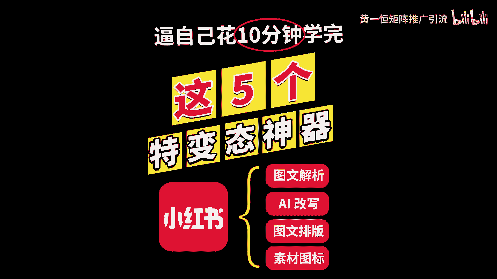
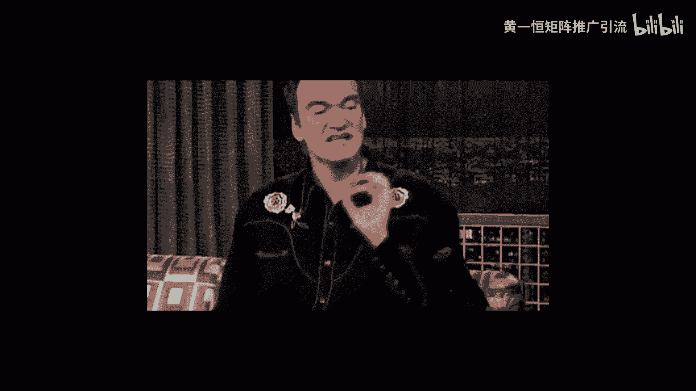
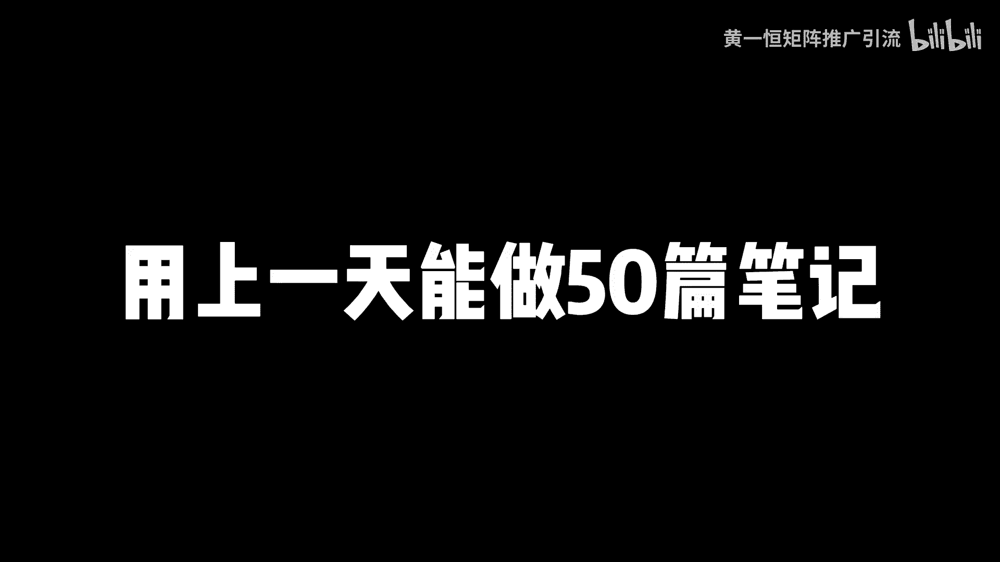
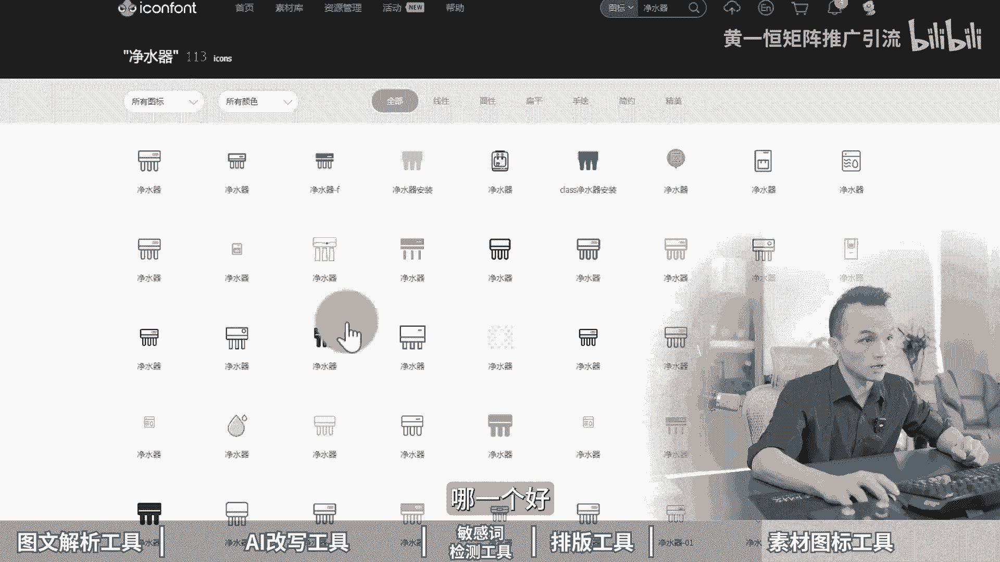
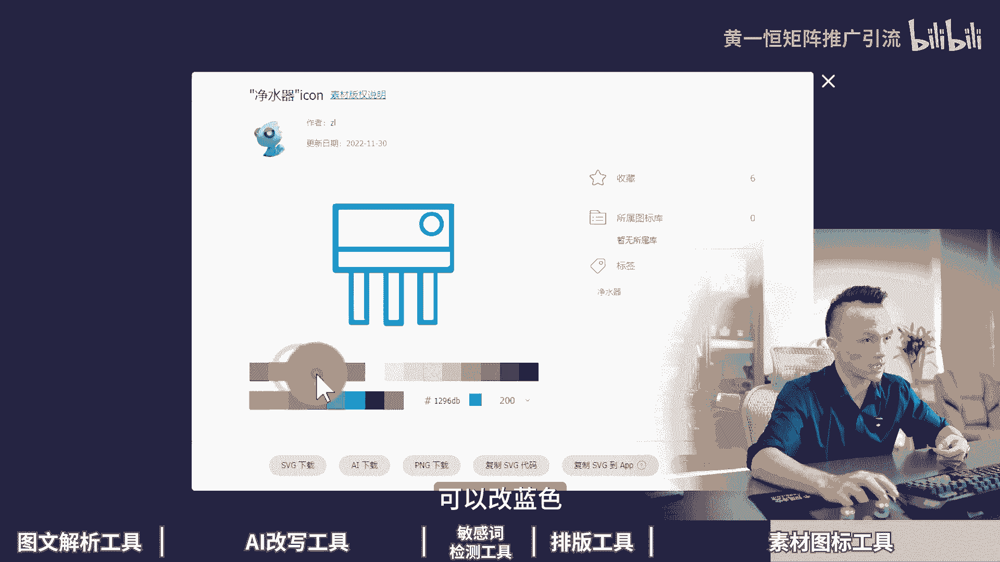
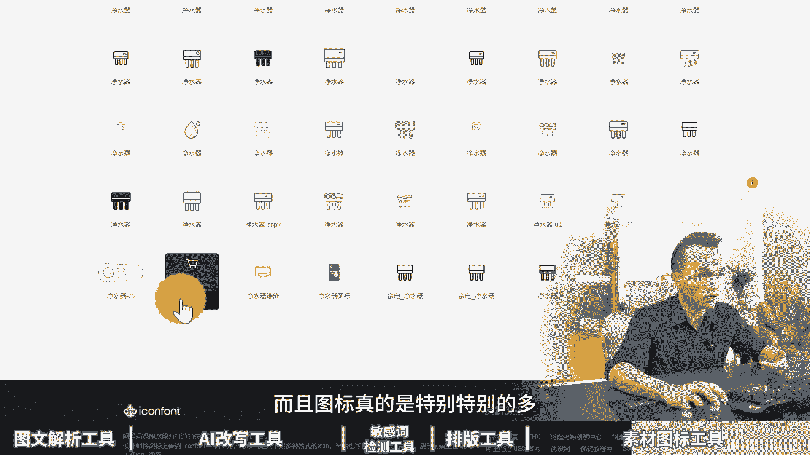

# 5款小红书运营必备工具，用上一天能做50篇笔记，小红书矩阵打法！2024版小红书运营教程，小红书工具箱，小红书运营工具，小红书图文批量排版工具，小红书图文制作工 - P1 - 黄一恒矩阵推广引流 - BV18a4beZEde

这五个变态神器打死都不能删除，我们公司新来实习生，我叫他去做小红书笔记，他一天做了50篇，而且都是高质量的牛逼。

后面一看才发现原来是用的这五款小红书工具，一个视频跟你分享五款小红书，一银必备工具，用上一天能做50篇笔记。

落地教程有点长，记得先收藏，一起来看，我给你分享我们每天都在使用的图文解析工具，AI改写工具，敏感词检测工具，图文排版工具以及素材图标工具，现在看第一个图文解析工具，当我们在抄爆款的时候。

很多内容如果靠纯手打会非常的慢，那怎么办，我们可以通过图文解析工具，直接获取高清无水印的图片，然后嘞就能够直接复制上面小幅度的内容，然后粘贴到自己的排版软件里面，具体来给大家演示一下，我们打开投屏软件。

这里面比如说像这一篇笔记，它的内容非常多，咱们靠手打走字比较慢，那怎么办，我们点击右上角的分享按钮，然后来获取一下这个链接，点击复制链接，复制完之后，我们打开这个图文解析的工具里面，把这个粘贴进来。

然后点击立刻解析，这时候稍微等待几秒钟，我们就获得了真实的图片地址，双击打开，你会发现这个图片清晰度直接拉满，而且没有任何的水印，重点是我们能够直接选中上面的文字，你看进行复制，也可以。

也可以选中里面的某一段，所以咱们如果需要复制上面文案的时候，点击复制，然后呢我们给它连接下来，是不是我们的操作效益立马就提高了好几倍，那么这个工具呢，一定要配合最新版的这个微信来进行使用啊。

那么才可以实现这个OCR的识别，而且识别下的准确度的话非常高，重点是完全免费的啊，不需要单独花钱，好来看，第二个叫做AI改写工具，当我们在做这个图案的时候啊，如果全部都靠我们这严重，说实话太慢了。

一天只能做三五篇笔记，如果你想做十篇，20篇，50篇，那怎么办，我们就要用到批量生成笔记的工具，想怎么做呢，我们是先通过这种在线做图的平台，做好我们的框架模板，比如说哎像这一个笔记，咱们做好模板之后。

那这里面的内容，我们是可以对它进行一个替换的，怎么替换呢，我们通过AI去填充里面内容，比如说改一下标题，改一下文案，改一下内容，重新保存一下，就获得了一篇新的笔记，所以咱们不用动脑，用AI。

它可以进行无限次的改写，这里面我们用到了一个C流AI，我给大家来演示一下啊，用的功能叫做小红书重写功能，比如说我们打开这个AI平台，打开之后啊，找到这个AI创作，在AI创作里面选择上这个小红书。

然后点击小红书重写，我们把刚才识别好的文案粘贴进来，比如这一段文案我们可以生成N多个版本，我们只要点击立刻生成，它就可以生成很多版本出来，那现在我们是一个窗口啊，如果我们把它复制多个窗口出来。

比如说这是一个窗口，我们又把这个文案给他什么，粘贴到我们的这个新窗口里面，它又可以对这个文案进行改写，可以看一下啊，现在AI正在对它进行改写，改写出来之后呢，意识不变，然后文字发生了变化啊。

你可以对比一下，比如说咱们的净水器一般分为超滤净水器，好净水器成分为四种类型，你看他还帮我们加入了这个emoji表情，并且这里面的你看啊，滤芯为pp棉活性炭，那么其逆行采用pp棉活性炭等材料。

你会发现它个别值发生变化，这种系统就会判定为什么你是原创的，而且我们可以复制多个窗口同时进行改写，比如你复制十个窗口粘贴十次，点击十个按钮就可以什么生成十个版本，所以咱们在做的时候，你要多少笔记。

通过AI就可以什么做多少笔记出来，速度非常快，就连我们这个标题都可以改，比如说净水器选购不纠结好，你放进来之后，这个标题我们也可以改成其他的，比如说我们稍微等待一下啊。

我们可以复制到两个窗口里面同时改写啊，这样的话我们就可以获得什么不同的，两个版本出来啊，比如说净水器显个不纠结，净显个净水器不用愁了，或者换成什么，或者换成轻松选购净水器，不再纠结。

他又帮你把关键词替换了，变成不一样的好，接下来看一下第三个叫做敏感词检测工具，咱们在发小红书的时候，很多伙伴发上去之后啊，流量都只有十个，20个，30个没有破百，结果发了很多条都是这样的。

最后呢账号违规了，重则来直接封号，那常见的四种敏感词有哪些，首先是我们的标题里面放的敏感词，比如说违反了这个新广告法，或者加了一些医疗词，或者加了一些比较敏感的词，或者文案里面有敏感词。

还得是笔记内容里面有敏感词，或者加了什么新广告法的敏感词，像什么第一呀，最好呀，或者说是啊比较夸张的词，这些词都会导致你限流了，怎么办，我们要做之前，可以通过敏感词检测工具先过一遍啊。

比如说这里面我打开这个敏感词检测工具，打开完之后啊，我就复制了一篇医疗行业的这个文案，复制进来之后我们勾选，你看他有这个医疗行业，化妆品行业，房地产行业放进来之后，它就提示国家两个字是比较敏感的。

那么敏感红肿也比较敏感，这两个词我们就需要给它删除掉，如果你不删除掉的话，你去发肯定是很容易什么啊，被限流的这个点呢咱们需要注意啊，这个工具呢也是免费的啊，直接就可以使用好，来看一下。

第四个叫做图文排版工具，咱们在做小红书的时候，到底我们的这些笔记都通过什么工具做出来的，记住这个图文排版工具，它可以做任何类的，只要是排版那场，除了实拍那场，然后得单独去排，只要是排版类的。

我们都可以通过这个平台来进行制作，而且来这个平台重点可以免费用，没有水印，不过来，你得有两个技巧，第一个不要使用他的模板，也不要使用VIP的素材，我给大家演示一下，咱们打开这个平台。

打开之后来我们点击这个创建设计，可以看到我的账号也是一个免费的啊，也是没有开通的，我们点创建设计，然后找到这个叫做小红书配图，在这里面就可以去制作了，它的功能特别的强大，里面的什么皇冠图标的。

像这些什么，包括字体啊，只要是带皇冠图标的，你不用用了之后就得开会员，不用的话就可以免费，一直在什么进行一个使用啊，像我们的这些模板给大家看一下，我们做了几百上千篇笔记，全部都是用这个工具来做的。

而且没有开任何的慧眼，就是白嫖免费，那就可以对他怎么进行使用啊，非常好用好，接下来看一下第五个叫做素材图标工具，那么当我们在做这个图文的时候，你会发现在图文里面纯文字类的人会比较枯燥。

所以会有很多的他们在里面加了这个嘛，加了这个图标，加图标之后呢，会让我们的这个图文呀看起来更加的轻松，所以素材图标包括你看我这个思维导图里面，那么用了这些图标，我都是用这个平台上面去找的。

首先它可以帮助我们升级为图文并茂笔记，更加高级，更加直观，更加生动，重点是这个平台你知道它有多少图标，它有2800万的图标库，第一个免费使用，第二个下着下都是透明背景的，第三个可以自定义颜色。

重点是什么，多种格式支持，有什么AI格式，PNG格式，还有一些编程用到的，这个什么SVG格式和代码都可以下载，我来给大家演示一下，比如说咱们打开这个平台，在平价的输入框里面，你看有2872万的图标。

我们搜索关键词叫做净水器，我们来搜索试一下，看能不能找到净水器相关的图标，那么搜索完成之后，净水器一共有113个图标，那么这些图标呢，比如说我们觉得哪一个好。

我们点击这个下载按钮就可以下载，而且它可以改颜色，可以改红色，可以改绿色，可以改蓝色啊。

可以改其他颜色都可以的，那么任何赛道都可以下，而且图标真的是特别特别的多啊。

多到根本就什么用不完，用不完好了，各伙伴，那这些平台所有工具啊，我都打包好了，因为有些平台网址啊暂时可能会比较敏感，会违规，所以没办法给大家直接分享，那么大家如果需要的话啊，我在这里都给他准备好。

你找我，我直接一次性打包给你，这些工具都不用花钱，都可以免费的进行使用，那么有的工具它只是帮助我们提高效益，如果咱们想玩好小红书，每天能够搞个100个顾客的话，主要是能够打几针，比如说十个几账号。

一个号一天加十个人，十个账号就能够一天加100个人，这些呢我给大家准备了系统化的资料，比如说小红书的应用入门硬干货框架，跟你分享小红书的收录机制，运营工具，企业号的运营，KY的投放，还有店铺的管理。

重点是还给大家准备了，这个小红书的爆款选题表格，当我们在做小红书的时候啊，那么我们的笔记肯定不能随心而发，这种等于什么盲人摸象，我们要学会开卷考试，用好工具啊，整理很多收藏比，评论比，分享比比较高的。

比如说这一篇笔记，它的收藏比达到147%，相当于100个人点赞，会有147个人收藏，那这些数据很多伙伴不会做怎么办，不会做没关系，你找我，我把这些资料统统打包分享给大家。

而且还有小红书的三个小时的系统课，会讲到小红书的全流程，钩子设计，导流方法，常见问题及编辑项目，这些来都打包好了，记得找我，咱们做一下资源共享，毕竟这是互联网里面什么最大的一个优势，搞别同学。

我是黄一恒，只做落地推广方法，刚才给大家分享了，我们自己每天都在使用的这个小红书工具啊，确实非常好用，咱们如果想获得更多流量，搞到更多的顾客来，我们得学会打造多流量管道，也就是在多个平台上面做权益推广。

这里面我给大家准备的18个平台的详细打法，教大家如何布局多流量管道，小红书啊，就其中一个，这些呢都是我原创的，可以通过我的主页来领取进行学习，如果觉得今天视频比较不错的，请大家一键三连，感谢大家支持。

