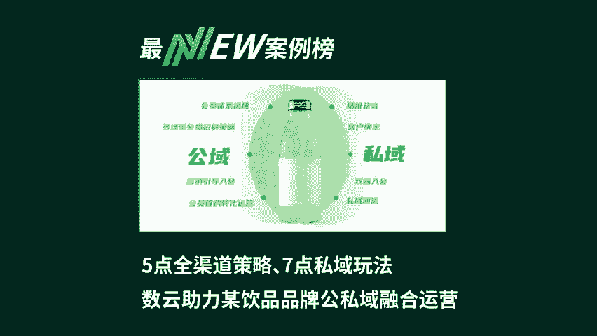
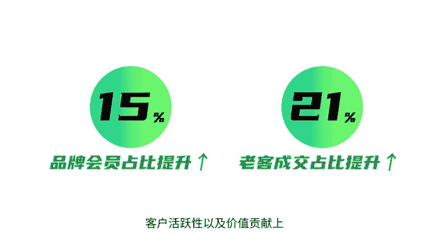
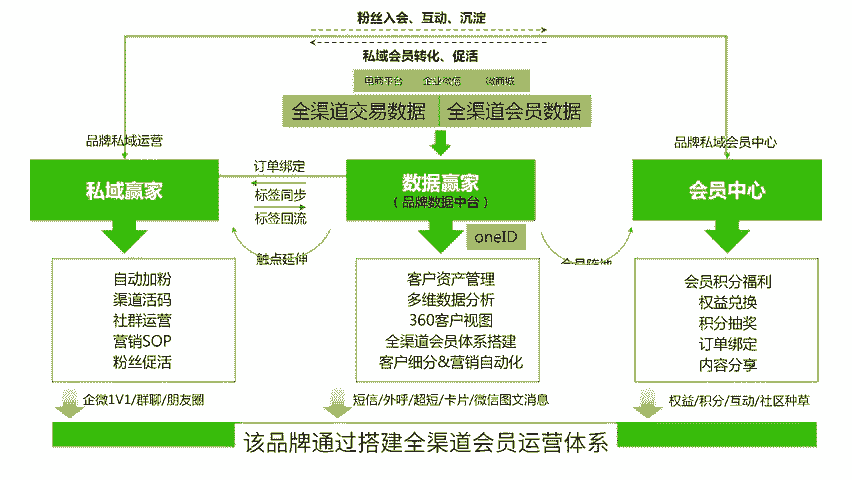

# 5点全渠道策略、7点私域玩法 数云助力某饮品品牌公私域融合运营 - P1 - 数云营销学院 - BV191421b7M1

🎼近年来，平台电商otto社交电商、直播电商各种渠道层出不穷，而为了链接更多消费者，只要出现一个新渠道，品牌就会想办法去做覆盖。在此背景下，全渠道经营布局，成为酒水饮料企业关注的核心课题。

随着全渠道的布局，某饮品品牌面临着会员数据分散，店铺会员基数低，私域运营基础弱等一系列难题。数云助力该品牌搭建统一数据中台和会员中台通过全渠道会员数字化和营销数字化，提升会员占比实现会员精准营销。

经过一年的客户运营，品牌会员占比提升了15%，老客成交占比提升了21%，客户活跃性以及价值贡献上有明显提升。下面我们看看具体是怎么实现的。

🎼该品牌通过搭建全渠道会员运营体系，实现全平台会员数据接入，通过全渠道winID识别，实现全渠道会员等级身份统一，积分同增同憬。

🎼一、全渠道多场景会员招募策略，品牌在各平台店铺前端用丰富的资源场景透出入会引导。2、全渠道会员营销引导入会，通过多渠道的高价值引购非会员圈选精准触达入会权益和链接引导入会。3、全渠道会员首购转化运营。

圈选各平台入会后无购买转化的客群，利用大促或会员日节点触达会员专属权益，引导转化。4、周期性的会员与营销。在品牌会员日形成周期性的自动化营销触达。

同时圈选近一个月内有下单无入会的客户和近两个月内有入会单无消费的会员对应触达入会引导和消费引导。5、会员运营阵地搭建，在微信会员中心搭建全平台统一的会员运营阵地，培让品牌会员在微信会员中心互动的心智。

🎼一、精准获客，多渠道引流获客品牌通过客户精选，引导加入启微，通过微信端服务做更好的客户体验。2、客户绑定高价值客户个性化包裹运营。品牌使用个性化包裹卡活动，获得客户信息，完成客户账号绑定。

沉淀更多高价值客户。3、非会员通店铺订单绑定完成身份识别。基于订单绑定能力，完成会员更多店铺平台的订单绑定，丰富会员画像绑定后，启微侧编栏即可查看会员更多信息，分析更全面画像。

4、双端入会品牌开通了天猫会员通2。0获得双端入会能力，消费者在微信小程序端注册入会，即可同时成为天猫会员，并完成身份绑定。5、摸清私域用户画像，做好关联产品推荐。品牌在引导A矿泉水消费者之私域的同时。

同时增加了比饮料的购买消费者以此扩大私域的客户量，同时做商品关联推荐。🎼6、私域回流天猫成交大促运营主阵地在天猫品牌批量选择了全渠道引流的私域客户，触达天猫主推款活动链接，引流至天猫转化。

提升天猫活动的GMV7、私域基础运营和会员互动玩法。引流至私域后，通过好友圈日常维护等方式，保持品牌信息曝光与客户活跃，提供丰富的权益与互动，促过私域用户。关注我，学习更多营销案例。

