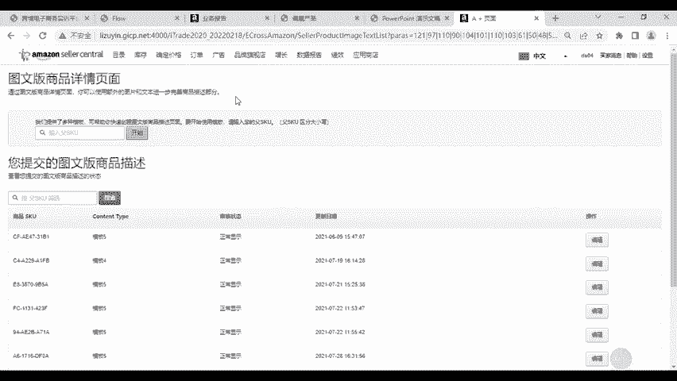
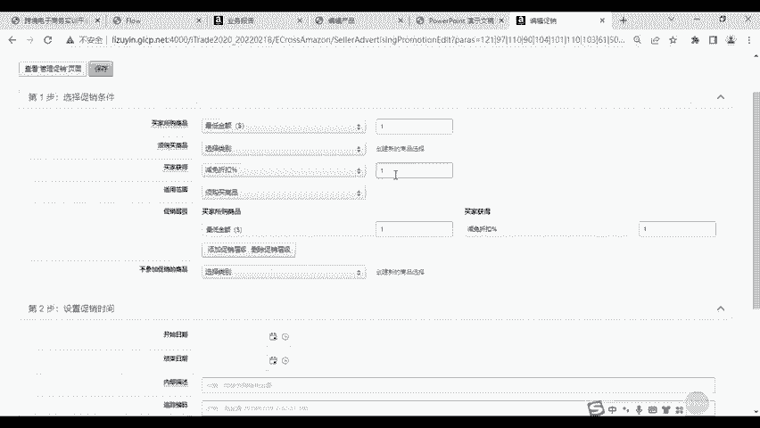

# 6-亚马逊平台推广促销与数据报告-第五届全国数字贸易技能大赛跨境电商赛（亚马逊） - P1 - 步惊云软件 - BV1mRmGY6EpL

卖家在运营过程中需要引入各种推广促销工具，帮助店铺引流，提升转化率。亚马逊广告模块提供了多种营销工具，供卖家选择操作，有作为推广工具的广告活动，有丰富产产品详情页的A加页面设计。

还有用来设置打折促销的工具，包括普通折扣的管理促销和惠券会员专享折扣以及折扣幅度很大的秒杀活动。首先来了解什么是A加页面。

它是一个可以丰富你商品详情页的工具。通过它，你可以使用额外的图片和文本，进一步去完善商品的描述部分。从网购者的视角来看，一款图片精美，文案布局工整，产品功能讲解细致的详情页将会很快抓取买家的目光。

从而获取店铺流量。而我们从前面的商品上架过程当中可知。

亚马逊的产品长描述，它只能以纯文本的方式去介绍，是不能够添加图片的。所以这一块描述通常会显得比较单调，不能引人关注。而如果我们使用了A加页面进行完善的话，就能将以往没有人关注的长描述。

变成展示我们品牌和产品优势的黄金位置。我们在创建的时候呢。平台会给你提供几个不同的模板样式，你可以根据需要任选一个去编辑排版。

可以在其中去自定义编写一些信息，充分来体现你的品牌产品的细节和公司的理念等等。A加页面设置完成后将会非常的美观。我们根据实际数据表明。带有A加页面的产品转化率比普通产品高出40%以上。但是要强调的是呢。

并不是所有的卖家他都有资格使用A加页面功能，只有品牌店铺才能够享有该项权限。实际中是需要卖家预先申请到品牌商标以后，再将品牌在平台中进行登记与审核。在模拟平台当中呢。

就需要大家在操作前去完成品牌旗舰店下的这个亚马逊品牌注册流程。具体你可以去参考我们的流程说明指导。然后按照页面的引导，逐步的去完成店铺品牌的登记工作。完成以后，你就可以去操作A加页面了。

这个是从完善我们产品详情页的角度进行店铺的引流工作。那此外呢，我们还可以配合一些促销打折工具来帮助提升引流后的转化。首先是购买折扣。购买折折扣呢，它是亚马逊免费促销方式的一种。

在我们的这个管理促销模块下。

它的功能是给产品做满减及折扣活动，也就是我们常常听到的类似满多少减多少这样的一个常规促销方式。那在现实当中呢。

卖家一般会在新品刚刚推出来，着力于去打造热销或爆款，或者说想将这款商品作为样品赠送给买家，以获取好评等等这些情况下来使用这款工具。那么第二款打折工具是优惠券。

优惠券它的作用在于呢，我们设置了优惠券的商品，将会拥有这种独特亮眼的标识，能够快速的吸引消费者的目光。同时，它对卖家的门槛要求比较低。在实际当中，只要我们的店铺评分不低于3。5星就可以使用。

而且费用是可控的。因此，在我们模拟平台当中对卖家无相关资质要求，跟上面的购买折扣一样，任何的卖家都可以操作该项功能。

优惠券活动同样是适用于刚上架不久，没有评价的商品，那可以大大的去提升产品的点击率和短点转化率。第三种打入工具叫做prim专享折扣。

亚马逊的prim是它的一种VIP收费会员制度，就是类似于我们的国内电商平台，京东的plus会员购物者他需要缴纳一定的会员费，即可以享受亚马逊购物的增值服务。我们以美亚为例。目前。

美国亚马逊preme会员的年费为139美金。

那参加prim会员服务的消费者，可以获得包括0元包邮，提前参加闪购、免费听试听音乐，更能够拿到会员专属折扣等等多重的会员增值服务。因此呢，prim专享折扣，它是面向会员买家的这个折扣活动。

我们带有prime专享折扣标志的商品，将会显示折扣价格。正常的价格会被划掉。但是呢这种价格我们普通买家是看不到的。它的优势是在于通过向会员买家提供优惠信息，从而促进买家下单，提升我们产品的销量。

并且能够帮助店铺快速的去积累一批忠实的客户群体。在长期的优化运营下，能够吸引更多的消费会员来关注店铺。那此类活动，它最主要的要求是在于只有。FBA配送的状这个配送状态下的商品才能够制定会员折扣。

而且折扣必须比实际价格优惠至少10%。此外，其他的这些要求就是我们实际平台当中的一个操作要求。比如说店铺评新，卖家的评分等等，都要达到一定的条件才可以。

第四种打折活动叫做秒杀。秒杀呢它一般分为三种。

由LD每日秒杀BD7天秒杀和DOTD秒杀。我们模拟平台中所提供的是第一类LD秒杀。因为实际当中，另外两类秒杀活动，一般卖家很难申请到，需要满足一定条件后。

通过官方的招商经理或者说平台特邀才可以有相关的权限。LD秒杀是一种限时的这个呃促销优惠，活动时间通常为4到12个小时。我们根据站点不同略有差异，具体活动时间是由我们亚马逊官方去排期决定的。

我们卖家每一次参加秒杀活动都需要支付相应的秒杀费用。美国站的收费标准是每次150美金，参加秒杀活动的商品需要采用FBA配送，而且折扣至少要达到8折。实际当中，对于店铺评新和评价也是有要求的。

对于参加这一类活动的卖家来说，我们的建议是首先要明确自己的产品。是否适合或者满足参加秒杀活动的条件。秒杀活动它不全是免费的。像我们模拟平台中，它这个提供的LD秒杀，我们卖家每一次参加都要收取。

都要去缴纳150美金。这个嗯。秒杀的费用还是比较高的。因此呢我们可以去选择一些客单价相对比较高的店铺主打商品，那太低廉的就不太适合做秒杀。如果说是在现实当中，我们还要保证产品的这个质量。

否则我们有了订单，有了流量以后，但是如果之后出现差评、退货，那这种问题。也是得不偿失的。最后要介绍的就是亚马逊的广告。

推广工具在你们平台中的广告活动管理当中可以去创建。它是平台推出来给卖家的一款付费引流工具。当我们的购物者在前台通过搜索关键字。

并显示相关的产品结果的时候呢，我们部分的产品就会带有这个sponor的字体。那就表示亚马逊，它是他们是亚马逊的这个呃广告产品。广告的类型，它有这个商品推广品牌推广和展示性推广。目前。

我们模利平台支持前两种推广。商品推广呢是根据卖家投放的商品关键词展示的站内广告，买家可以使用相关关键词搜索以后。就能够查看到相应的推广产品。那品牌推广呢就是让卖家在广告中去推广自己的品牌头条logo。

或者说至多三项品牌产品。那这一类广告将会将我们的买家引导到品牌商店的首页或者说特定的着陆页。高的收费方式均为点击扣费平台呢会根据商家设定的竞价，买家每点击一次就会扣除相应的费用。

我们投放的时候呢。可以任选是自动投放还是手动投放。如果自动投放的话，我们选定相应的。推广商品以后是不需要卖家去设定相应的关键词的。亚马逊会根据商品信息中所嵌入的这个关键词信息以及产品的类目。

自动的来匹配关键词。那如果说选择手动投放的话。那我们就是需要我们卖家在这边去设定好相应的关键词，然后平台会根据关键词的匹配程度来决定展示，或者说不展示你的广告。那这种方式下。

卖家还可以建立自己的否定关键词词库。也就是在特定关键词下，我们不展示广告，从而避免浪费无关的广告费。以上就是亚马逊平台的几种推广和促销工具。建议大家在运营的过程当中呢，根据商品的销售情况来搭配各种活动。

活动的设置原则是短时多次。也就是说，各类活动并不是你们只需要做一次就行了，应该频繁的去做。每一次活动的时间可以设置的短一些，要根据商品的销量判断活动的效果，如果效果不佳的商品应该及时的调整或者替换掉。

在这个数据报告模块下，我们在亚马逊销售指导当中，可以去查看店铺所有的商品的变体。在过去30天和14天的销售情况，或者你也可以根据商品的各个编号到我们的订单模块当中去查看各个产品的销量情况。

在我们的这个嗯业务报告模块向下，你还可以去定位观察某一天针对我们的。FBA或者自配送下的这个商品的销售数量和销售额，从而判断商品的销售走失，为我们店铺制定合适的运营策略。另外，在这个付款模块下。

我们可以查询商铺所有订单的入账情况，可以看到在这个结算一览当中，我们显示的是这个商铺当前还没有体现出来的订单入账总资金点击请求付款，可以将资金提现。

建议大家在运营的过程当中隔断时间就来将累积的资金提现出来。提现是提现到你所绑定的第三方收款账户当中，只有提现出来才会算入到你的公司总资产中，否则是不会算的。

在这个所有结算里会记录每一笔订单的这个呃收款情况，付款就是统计卖家每一次提现出去的这个金额的记录。以上呢就是我们亚马逊模拟平台当中，卖家所需要操作的总体的工作流程，前后分为注册和选品工作。

店铺的这个后台设置工作，还有商品的上架物流的处理。包括我们呃卖家自配送和FBA配送。还有就是利用平台的营销工具去引流与转化，最终就是进行销售数据的分析和平台资金的体现。

