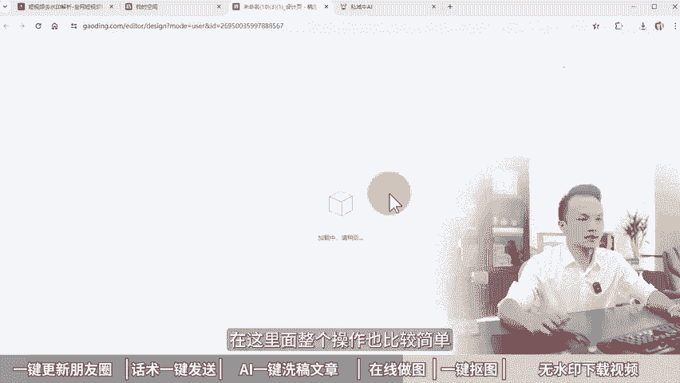

# 6个做私域流量必备软件，提升3倍工作效率！私域运营工具，私域流量运营工具有哪些，私域运营怎么做，私域流量运营如何做，私域流量搭建与运营，私域流量怎么做，私域引流 - P1：9.做私域必备软件——4K导出-2 - 黄一恒矩阵推广引流 - BV1A4421X7ry

🎼如果你再不用整6款C软件就会被淘汰。我们公司一名老员工，我给他安排了一周的实习任务，谈两天时间就完成了。我们来看看他怎么做的。🎼用软件批量操作的呀，真是个人才。nice这个方法不错。

软件化操作来键时间，季节废话，一个视频教会你6个做事意的必备软件，提升3倍工作效应。详细教程在这里进下收藏，一起来看，我给你分享如何一键更新朋友圈，客服话术，如何一键发送。如何通过AI一键洗稿原创文章。

如何在线PS时做图，如何一键免费抠图，如何污水印下载视频，现在看一键更新朋友圈。当我们有大量账号，每天都需要发圈。我们就可以配合上专业的跟签软件，一键转发就可以进更新。

特别是一些公式和团队有超过100个上账号，每天发圈都得浪费大量时间。比如像我们团队每个账号要求每天至少得发3条朋友圈，有的伙伴手上附责10到20个账号，每天就得发30到6条朋友圈，那怎么办？

我们就会配合这个软件给大家演示一下，我们打开图屏手机，找到这个软件，这个软件在使用的时候，它是需要先用一。

账号把更新的内容呢先提前发布，然后在其他手机上面去关注这个账号。接下来我们只需要找到需要发送手机，点击一键分享。然后选择朋友圈，在这里面因为我开了应用双开，我需要手动选择一下。如果你没有做应用双开。

接下来整个操作都是软件自动化的。大看。现在我的手是没有动的，手机在这里它我也没有去操作它，整个过程它会自动的帮助我们去保存素材，然后来粘贴文案，因为我开启了半自动，所以最后啊我是需要点击这个发表按钮。

如果咱们开启了全自动，连发表按钮都不需要操作。所以有了这个软件，大家只需要把手机摆起来。10个20个，然后接下来我们只需要咔咔咔把软件点好，它就会自动的帮你去发送，节省了咱们的一个时间。

来看第二个客服话术，一键发送。当我们在聊客户的时候，为了提高效益，我们就会配合上专业软件，帮助我们去鉴定话术后，当有客户询问这个问题的时候，我们一键就可以进行发送。特别是专门做私意流量承接。

每天负责聊客户的伙伴，一定要用上账的专业软件给大家演示一下。这里我们已经建立了很多的话术分类，在这里面有不同的板块，有不同的问题。那么当客户过来咨询我们地计化发什么，我们可以双击。

然后呢可以进行编辑发送。如果不需要编辑发送，我们只需要点击一个按钮，它就可以直接把整个内容发送出来。那么这就是这个软件的好处。有这个软件，我们的话术还可以不断的更新迭代1。02。03。0版本。

当客户过来询问某个问题，咱们不需要思考，只需要找到标准答案，然后直接给他发过去就可以了。这个软件还有个强大支处。如果咱们是团队化操作，可以通过管理员更新话术，所有的员工子账号，他都会同步这个话术。

还可以单独建立自己的话术库。为了提高效益。来看第3个AI一键洗稿原创文章。现在咱们做互联网，经常需要写内容，搞原创，那怎么办？我们就可以配得上AI不管是重写短视频文案还是重写文章内容，想变成原创的。

想修改一下，手动修改需要花20分钟30分钟。用AI2到5分钟就可以搞定，给大家演示一下。好，我们打开AI平台，在这里面找到AI创作，选择上智能重写。这里面有5种重写方式，精准重写整体的框架和字数不变。

只是简单的做一部分修改，同意重写，使用同义词进行替代宽泛重写，这样的内容重新进行改写一遍，扩写，把一段内容改写为2到3段内容改写优化输入内容之后，它会按照要求来进行改写。比如说现在如果我们想提高原创度。

我们可以通过宽慢重写。在这里面我们只向输入相应内容，然后选择上通道点击列个生成。这时候AI它就会帮助我们把这篇文章进行改写。每天早上起床的时候，每天每当清晨醒来。我感觉皮肤都是干干的。

我总感觉肌肤略显干燥，很不舒服，令人不适。你会发现他帮我们把每一句话都做了改写，但是整体的意思还是什么颜练意思。就相当你给我讲了一个故事，这个故事呢，我又给别人讲了一遍，虽然咱们都在讲一个故事。

但是讲出来内容呢和表达方式稍微会有点差异。那除了这些之外，如果大家做短视频重写，可以找到短视频这里面有短视频文案重写，小红书也可以单独用小红书文案重写，这就可以帮助我们提高原创度。那么AI重写这个内容。

大家一定要手动的润色修改一下。这样拿过来用啊，质量才会比较高。来看第四个在线PS做图。那么当我们需要去设计图片，比如说制作海报或者设计产品图片，搞一个朋友圈方面。这时候啊，如果咱们通过专业软件来做出来。

而且非常费时间，那怎么办？我们直接通过在线PS平台给大家演示一下，我们打开平台，在这里面。可以看到我们很多的这些小红书的图文。都是用这个平台来进行制作的，而且我们用的是免费版，都没有花钱就可以使用。

比如说我们打开一个给大家参考一下，点击编辑。在这里面整个操作也比较简单，它都是可以模块化的。好。点击之后啊就可以编辑，没有什么太大的难度。不像我们用PS软件啊，按钮在非常多，不经过学习。

连创建画布你可能都不知道。而这个软件里面它有模板，有元素，还有各种各样的文字样式。

还有图片素材，这些我们都可以直接使用。不过很多素材带皇冠图标的呢，需要开通会员才可以使用。好来看第五个一键免费抠图。有的伙伴想把里面的人物抠出来，用专的软件来觉得太麻烦，或者根本不会用，那怎么办？

我们就可以用一键抠图来去除背景给大家演示一下。那这里呢我已经提前准备好了一个图片，我们来看看效果。这个图片我已经进行了抠图，这是我们原来的。图片我们来打开一下。这个图片是我们原来从视频上截出来的。

现在我需要把这个人物抠出来，我只需要通过这个平台上传图片之后就可以一键抠图，抠出来效果。大家可以看一下啊，整体其实还是什么？非常不错的。抠完之后，我们只需要点击一键下载按钮。好，视频和图片就下载好了。

下载之后可以看到整个背景的话都是透明的操作方法非常简单，我们只要打开这个平台，然后点击上传图片，软件就会自动的帮助我们免费的抠图这个背景。

来看第六个无水印下载视频。我们想在互联网里面下载一个素材，很多伙伴会直接选择保存，保存之后呢，它会有水印，而且清晰度也会受到影响。那怎么办？我们就可以通过无水印下载的方式下载各大平台。

这里给大家演示一下，比如说。我们切换到视频平台里面，我想下载这一个视频，那怎么办呢？我只需要点击分享，然后把链接复制下来，复制下来之后，我们打开平台，在这里面粘贴地址粘贴完成之后，我们点击解析视频。

然后可以下载研画视频，也可以下载封面。比如说我们想下载这个研画视频，点击之后接下来我们只需要点击右键，在上面选择视频另存为点击这个保存按钮，我们就把视频下载下来了啊操作非常简单，而且整个视频的清晰度啊。

你会发现是非常高的。并且呢它没有任何的一个水印。所以大家如果想下载某个平台的素材。这样的平台就能够帮助我们去提高效益。刚才给大家分享的这六大平台。有部分平台呢，它是需要收费的。如果你用它免费功能。

会有很多功能限制。大家如果是团队化操作，也可以去考虑开通一个收费的版本，能够提升我们的效益，帮助我们接更多的客户。搞更多的订单。那这里面比如说像这个一键免费抠图，无属性下载视频，这两个呢是完全免费的啊。

不需要花任何一分钱就可以使用。前面这四个它都是需要开通会员，才可以享受更多的功能，能接受的伙伴也可以搞一个，毕竟啊能够提高效益，而且价格也不贵，也就几10块钱。

另外这些平台啊有个伙伴觉这个网址手动输入啊，太麻烦了。所以这里面我给大家做了一个平台汇总，这个平台汇总，大家可以通过主页来找我，我把它分享给你，你就可以直接去使用这些平台，省得自己去什么手打这些平台了。

好了，各伙伴，我是黄一涵只说落地推广方法。当我们学会了使用这些C软件，他能够帮助我们大幅度提升效益。但是如果我们想搞到更多客户，通过这些软件还是不够的，我们得学会各大平台的流量打法。

这里面我给大家准备的18个平台的流量打法，教大家如何做多管告流量。这些呢都是我原创的，可以通过主页来领取进行学习。如果觉得今天视频比较不错的，请大家一键三连。感谢大家的支持，咱们下个视频呢再会。😊。

