# 7,IP打造私域运营的详细攻略 - P1 - 胖张私域打粉 - BV1HZ2oYWEqz

大好是判长，今天讲一下胖张打造IP课程的体验课第七课IP4运营的详细攻略。这一个比证相当于是啊。整个一个攻略流程啊。首先呢我们要知道这个IP打造的基本逻辑哈。这道两个概念，一个是公寓，一个是私域。

什么叫公益的公寓流量，就是比如抖音、快手啊，视频号小红说这些东西就是大家都能在这里面留点记号的啊，发点广告，做点什么事情，做点这个宣传的，就是做点IP打造，这个就属于公寓流量啊。

我刚刚我之前说的这个快手啊抖音啊，是不是视频号小红书，这个属于公寓流量。我们都是在公寓流量进行导粉IP打造等等。在私域当中这种成交啊。公寓的话一般是用来导流的啊，卖低价产品或者说直播间啊，然后呢。

私域一般卖啊呃高价产品，比如说微信公众号，这个属于私域啊。公基本逻辑是公寓向私域导流，然后呢进行复私域卖复购高价格产品。那个公寓的卖低价的或者是导流的产品啊。比如说我这个。啊。

这个这个叫这个这个这SOP流程图，这个就属于公寓的产品。这个公寓是公寓免费产品啊，有人他需要我就把这个发给他，或者是398块钱，这个也属于公寓流量的一个低价产品，在直播间卖呀等等，挂车啊。

挂小黄车小风车啊等等是吧？然后私域当中我会卖这个3980是吧，或者是啊几万或几十万的这个IP孵化业务是不是这个是这就是一个区别啊，这个你看你自己看你自己怎么样去操作吧。这个课程或者是内容设计，对不对？

这个如果说你不会你看这个同行的是吧？这个人郝老师带你餐饮这个人是这个就是公寓是吧？这个是公寓流量，那这个就是公寓流量，这个都是然后呢加到他的。加入他的思域当中啊，这里。这些地方有些地方呢。

比如说关注啊私信他，有些地方他就会产生一个啊加私域的过程。那么加思维过程，你就看到他里面卖什么东西，你就知道了是吧？同行估计其实大家同行都有按道理都有这个内容，是不是都有产品，我要卖什么卖什么。

我应该很清楚，对不对？这个东西不过多讲啊，就是我告诉他IP公寓到思域整个一个流程的一个内容是这样操作的，大家可以按照这个思维去操作啊。那么这个公寓到思域的IP打造逻辑是所有IP打造的一个基本基本逻辑啊。

就是短视频IP打造直播小课。然后呢，最后是到思域大客或者复歌课，这是整个一个。整个一个逻辑圈层啊，就是有个步骤的，大家注意啊。或者是像这种免费的啊，这个小免费的是吧，你要从那个公寓里面导到思域。

你发个小资料，这个也属于公寓导思域的一个整个IP打造思域运营那个详细详细课件是吧，详细教程。对。是有一个这样的逻辑才这里啊，先有这个逻辑之后，你然后按照这个思路去做你的产品。那其实很多的产品啊。

包括什么各种产品是吧，包括卖股票软件啊啊，法律啊、情感啊、心理咨询啊、国学、小孩教育啊，全部按照这个模式。😡，全部按照这个思域就是公寓获取流量，私域进行啊运营卖高价复购产品的一个逻辑。是这样来的。

这个就是IP打造的一个思域详细功略啊。然后呃讲一下短视频IP打造。短视频的就是你的备注啊，头像名字背景啊，这个是属于短视频的，包括短视频内容。大家看一下，我刚刚说的这个人这个人就属于。

看到没有这个人就属于这个短视频的IP打造啊，短视频在这里是吧？然后备注头像。不过我建议这个地方呢，我建议这个地方以以这个人的头像为主会更好一点啊就是这个女的就是把这个女的放在这里啊，这个会更好一点。

你看同行的啊，那看到没有？像这个人的。

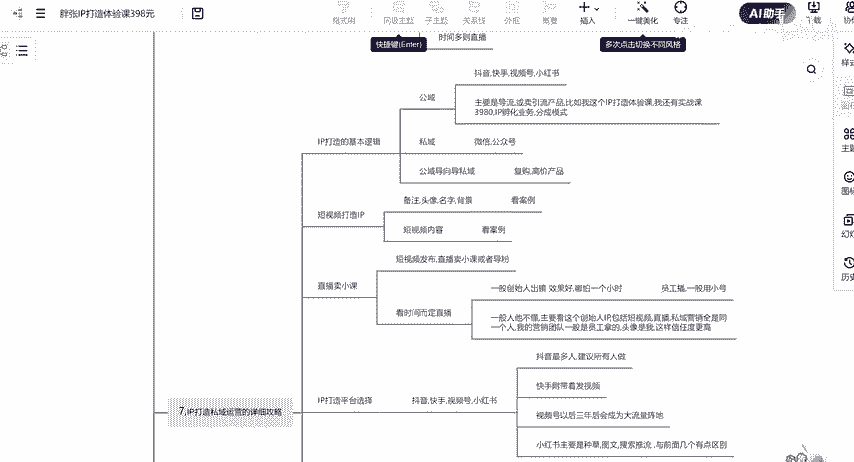

这个人的这个人的看到没有？啊，以人头像为为为主会更好一点点啊。当然也可以。但是这种啊人设打造IP这个人设打造IP就是人嘛，对不对？那有的人他可能是企业的，但是我觉得企业的话也可以，但是呢好最好是以人啊。

就是我们打造一个人设嘛，那就是人事有人设IP的一个账号，对不对？像这个你看这里面就有同行的是吧？这个参与的啊，这是头像，然后你看他里面的内容啊，那备注备注看到没有？这个就是备注看到没有？

这个人的备注这个女的。

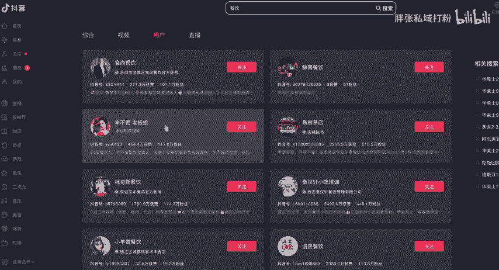

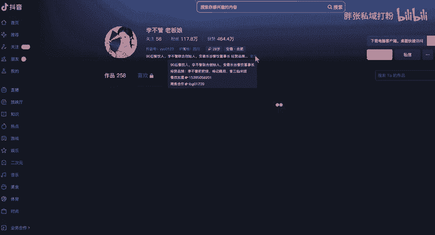

这个就是你看这个粉丝1178万，明显的比那个要牛逼。为什么？第一个他这有头像，有IP你不管老板娘有私欲导流的这个玩意看到没有？这个其实就是啊这个也是看到没有？看到没有，然后这里面的这内容呢。人社IP啊。

我刚刚说的人社IP是吧，那个就是更多的是加盟店。啊，这个人的啊，你这个人的，你看他播放量可能会更高一点。这个人运营方面你看到没有？你这个人讲一些东西。啊，达到。不过这个这个号没有那么垂直啊。

大家虽然看到这个账号的粉丝更高一点，但是呢未看情况变现啊，看招商加盟变现，这个人可能更多的不是以这种啊，这种以这个人可能是以招商招商加盟店为主。看你的定位啊，这个是招商加盟店为主，看到没有？

就是他品牌招商的，这个人属于品做品牌招商的这个人呢，这个人就属于这个啊餐饮的这个项目项目招商的，就是属于这个产品系列。这个人可能他里面有很多的SKU，比如说他有啊有米线啊、烧烤店啊，各种店铺的啊。

有各种店铺的，有可能啊，我只是猜的啊，有可能有其他的嗯店铺，然后这个店铺开店的个成本可能会更高一点点啊。这个开店的成本可能更高一点的。这个人呢就是说直接直接做这个实体店铺啊，实体店铺参饮一下店。

然后教你卖这个羊肉汤的。这两个IP打造定位是不一样的啊，吸引的人群也不一样，这个人群可能更高级别一点，这个可能会价格更低一点的。这个可能收个三五三五千块钱1万两一万两万的这种这个可能就是三五十万这种啊。

大家注意啊，就是IP定位不一样。所以说I短视频的IB定位不一样。达到结果不一样，你想收谁的钱，你最后收到多少钱啊，达到什么结果，这个跟你短视频的IP打造是有关系的。😡。

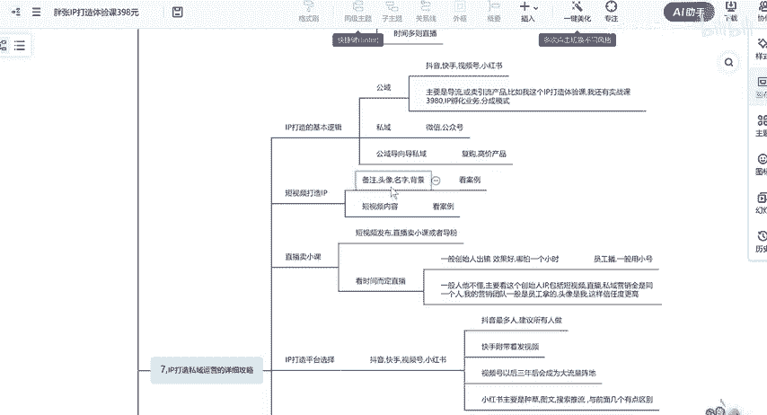

然后呢，你的短视频内容短视频内容什么呢？你看这个人这个女的主要是讲一些啊。这个其实办娱乐化，就是办娱乐化的这个账号。嗯。看没有？大家好，我是你博馆老板娘。现在是到上的6点41分啊，我们已经开始排队了。

带大家看一下，我们店门口这边都是可以停车的。那我们去电影来看一下。二次。一个状况。差不多点。期待着您的到来。这个定位很重要吧，这个定位呢就是开这个小吃，你不管这种店铺的啊，这个人定位包括短视频。

就是讲这个店铺里面的一些内容。那这个加盟费可能会更高一点。因为你要开店，你至少得开个店至少几十万要有吧，拿得出来吧。那你收个三五十万或者上百万都有可能啊，那这个呢就是小吃的这个属于小餐饮店啊。

这种这个呢就是啊收个万八千的是不是这种就不一样。两个人这个店呢可能几万块钱就可以开得起，是不是这个店可能几十万开得起两个群体是新引的人群定位不一样，内容展现形式不一样，视频不一样，包括拍摄的东西不一样。

那么定位啊结果产出的结果就不一样，的客户群体就不一样。大家吗？那比如说像这种啊，这里面还有其他的啊。

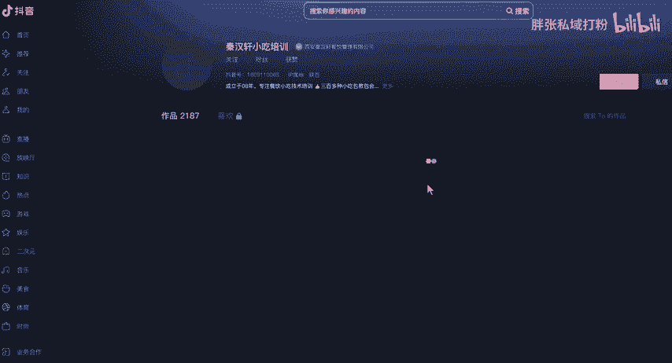

啊。你看像这个这个人就是属于教别人一些摆摊啊啊。摆摊是不是你看这个或者一些小那烙饼啊、饺子啊，对不对？这种就属于这个类型的，看到没有？串串啊，是不是交给了一些小吃类型的，你看到没有？这个定位又不一样。

这个定位是那些想做小吃的人就摆摊的那些人啊，就这种人人群为主，就是你别看到这三个账号，三个账号在这里啊，但这三个账号就是三个定位，大家注意啊。这三个短视IIP打造的定位就不一样啊。看到没有？

这里明显的就有三个账号，就三个定位，三个不同的人群。大家注意啊，这个呢是啊虽然他都是做短视频。然后呢，还有一个我们附带着直播卖些小课什么的啊。

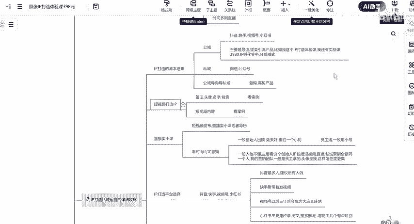

但是这三个账号的定位不一样，人群标签不一样。这个人就是适合于那个做两三万块钱的人，给个万了八千的这种招商啊，这个人呢可能给个10万8万，然后开个三四十万的一个店铺啊，这个是高端客户可能更多一点点。

这个人呢就是摆摊的，摆摊的，就是你像你像摆个摊，说个做个什么小小吃生意啊什么东西的包子啊，卖的小包小哎，这看到没有？就属于这种类型的啊，摆摊类型的啊，就个摆摊的就是摆个摆个摊啊，对不对？人在上面。

是不是啊，就属于这种类型的三个账号的这个定位是不一样的啊。你看这个这个人的参与啊。

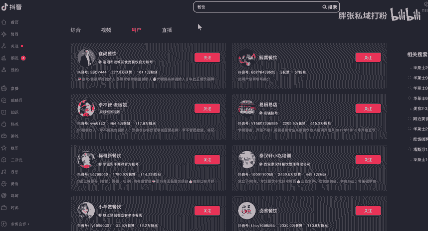

，这个人的。

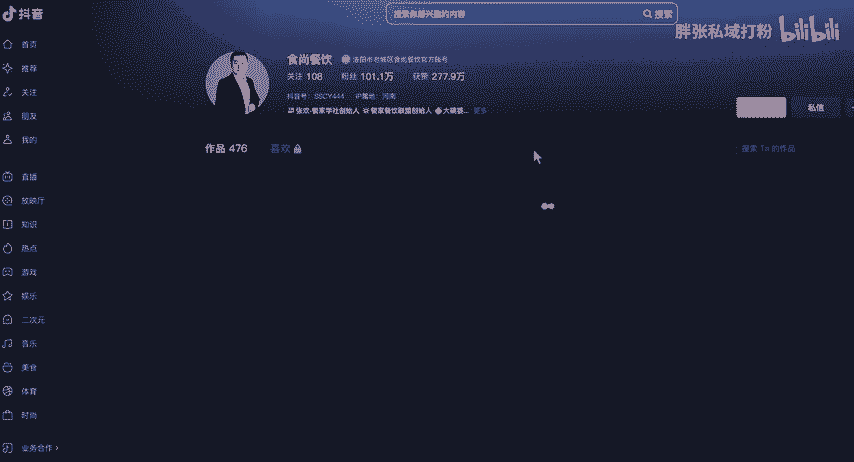

嗯，看到没有？这个就是看到没有？这个就是品牌加盟了，这就是品牌加盟了。这个呢是品牌加盟店的，是不是这个是做品牌加盟，这个呢可能稍微更高一点点啊。啊，收个35万块钱，10万块钱，8万块钱都有可能啊。

因为这个是做餐饮加盟的，就是他可能有商标，然后呢，那他还会教你做这个啊招商加盟，对不对？这个人可能还会教教你做招商加盟，教你做IP教你做这个短视频，这个人可能会是会更搞一点点啊，大家注意啊，看到没有？

嗯，也是这四个账号的话，四个类型，他的群体。面对的群体是不那么一样的哈，客户群体你看一个账号的内容就不一样。所以说IP打造这个是相当重要的IP打造的话，我建议从这个短视频开始啊。不是从直播开始啊。

直播只是我们短视频的啊一个附加。就是我们比如这个人哈，那这个人。😡，然后这个人他签着有IP打造之后，然后呢，在里面开个直播这样操作的啊啊，我们直播的话可以在里面卖些小课件和捣粉啊。

直播的话也可以可以听可以经常直播，也也可以不经常直播，看你时间点时间短一啊。啊。啊，一般的话我们呃看时间直播啊，有你看这个些人他们也没有直播，因为有有时候可能直播一下，有时候不可能天天直播嘛，对不对？

有时间就直播，因为有些时候你还做这个接待客户啊，对不对？还有签约，是不是搞做成事情挣钱是不是？那么这个首先这个IP定位应该是在这个账号里面就产生了。直播的话更多的是一个转化一个过程啊。转化的一个过程。

一个或者是卖小客田的一个过程。有人说他直播也可以起号，是可以起号。没错，但是直播你不直播的时候呢，别人看的是空的，对不对？那就不行了，对不对？所以短视频跟直播都要有啊。😡。

而且的话我们短视频尽量多发一点点，不行的，我们把短视频给这个家伙这个人的这个视频其实不咋地啊。这个人其实有个运营点没运营好的，就是像这些点赞比较少的，我们应该把它隐藏掉给客户展示的。

我这里有比如只有30个作品，把这个删。隐藏掉啊，这里只有30个作品，看起来播放量很高，然后这种效果会更好一点的啊，比这个更好一点的。所以这个呢不太会运营。说实话还有一些其他的一些运营的手法嘛。🤧啊。

然后的话。嗯。就是短视频IP打造，直播连卖小客或者导粉这样操作的啊。啊，这是一个这是一个基基本的一个套路。然后IIP平台的选择呢，我建议选抖音、快手视频和小红书。目前抖音的人是最多的，建议所有人都做啊。

嗯，反正我也做抖音为主，抖音为主啊，一定要以抖音为主。这两三年35年之内是抖音的天下，没有之一啊，没有之一必须做快手的可以附加发点短视频呃，做点小直播。你看你情况吧，你愿意做做不愿意做，没关系。啊。

视频号的以后3到5年之后可能会超过超过抖音啊，成为成为这个下一个阵地。但是无所谓，他其实换他不光样嘛，就换个平台内容其实IP打造模式这个到私域的一个整个逻辑完全一样吧？完全一样。

我自己也做视频号的播放啊方法啊完全运营模式也是一样的，就抄他们那个视频号就抄他们那个抖音的手抄抖音的小红书的话有点区别。小红书主要是种草啊图文以投为主。

并且以搜索为主与前面三个还是有点小区别的啊小红书你可做可不做IP打造的话建议前面三个为主小红书的话卖一些其他产品导粉啊或者思域会好一点点啊。啊，建议前面三个为主，后面呢也可以做做。但其他的平台呢。

我建议就得了吧，算了吧，就差不多了。就这三三四个平台，三个平台够你了。就其实做好了就这一个平台，抖音把它做好了，就给一个平台够了，对不对？没有没有。好。再一个讲一下这个。IP思打造的一个内容内容的话。

我们以半锤直内容为主啊，不能只讲产品，也不能只娱乐。你看到没有这个人啊。这些人他们其实这个人的，你看到没有？这个就是这个人其实就属于只讲产品。只讲产品。没有任何娱乐，所以他的点赞播放量也很少。啊。

你看这个人呢，他有产品。有娱乐。这个就属于半垂直状状态下。所以我说这个人他不会怎么运营啊啊。这个人呢就属于全产品，其实这个东西其实怎么讲呢？这个人应该也要讲点产品之类，讲点娱乐啊，讲点内容上面。

那这个成教学的啊，这教学的这个这个账号又定位又不一样。其实我觉得最好是像这种类型最合适这种类型或者是。这种类型啊口播啊带一点娱乐性的，当是半娱乐啊，像这种啊，我是觉得这种会更合适一点点啊。

这种或者刚刚那种是最合适一点点。就是说带有一点点这个内容，带点的半娱乐，带点产品就是还是你这个人在弄，对不对？第一个播放量起来了。第二个的话没那么单调啊，也能而且的话别人也愿意有更多的播放量。

有更多的这个客户进来，而且这个粉丝也是非常垂直的，对不对？就看你这么定位啊，看你怎么定位。实讲产品，我刚刚说的真的产品不行，质量娱乐也不行。口播代的个人观点，就是我刚刚说的。我们可以啊，也可以这样子。

就是如果说你不会的话，你就找这个同行的优质作品进行翻拍。因为市场这个验证的一个试标比较容易火。就是我刚刚说的，比如说这个人的啊。

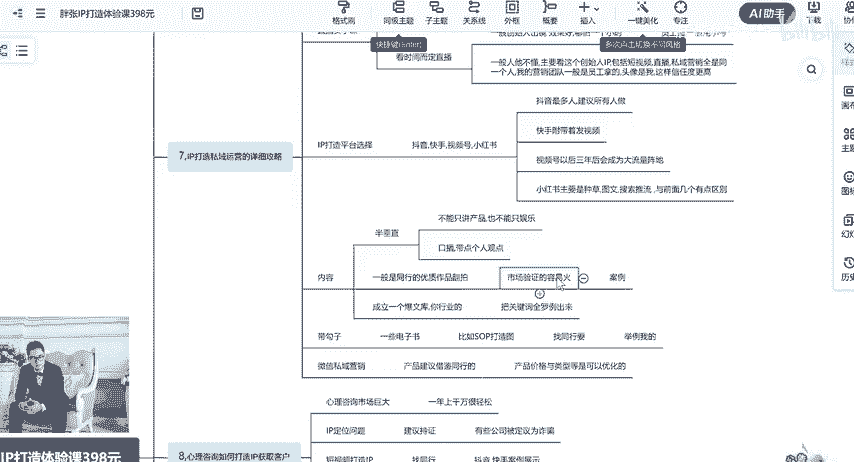

这里面这些作品有好的，肯定有没好的是吧？那这里面哎看到0到一打造片品牌是不是自己点赞不是很高的那我们可以模仿一下里面的东西，比如说哪个视频呢，这个视频一般的，我们就不模仿了。哎，播放量很一般的。

是不是就这个人运营的也就是一般啊，好像一般啊，我跟大家看一下，就是。😊。

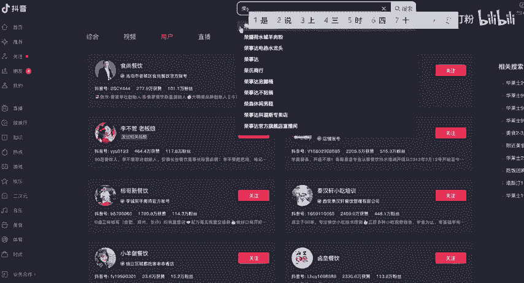

嗯，像这个假的。

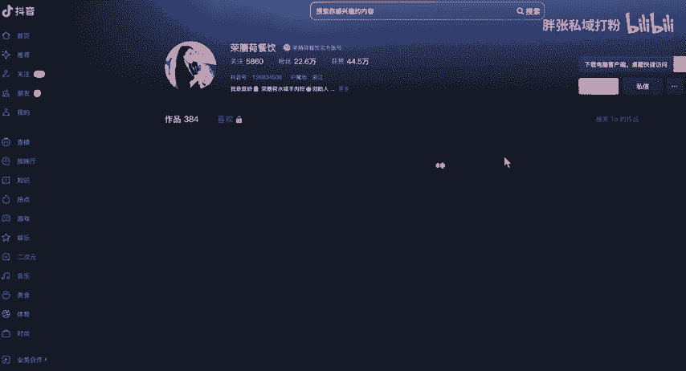

这个新号来的。啊，你看下这个这个人呢，这个人好多账号啊，看到没有？

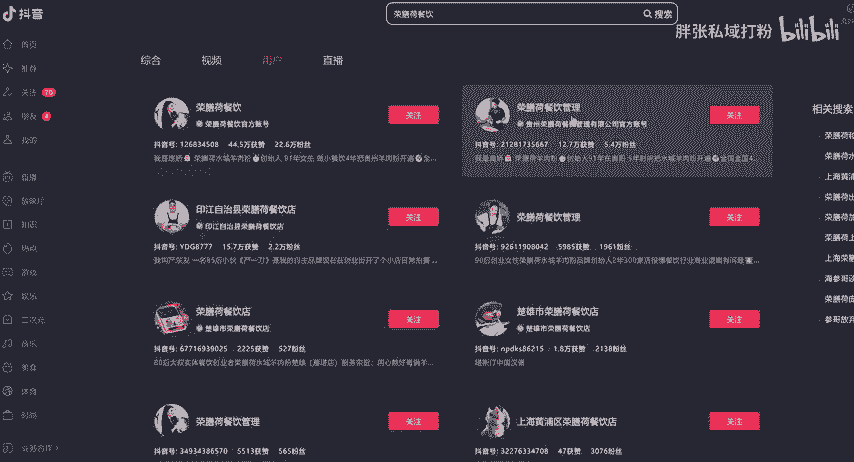

啊，这个章那这种就是半娱乐半内容。办产品，但是这个也是垂直账号。不单单讲了，你像这个人呢，就是呃我刚刚讲的这个就是一个不太成功的，不太合适的，不太就是这种就是lowlow的这种性格啊。

就是这种类型的会较合适，有点讲内容，有点讲这个娱乐。讲了一些其他的参与选址啊，然后讲其他的那附带着相关的关键词都加上去。你看到没有？那我们哪个内容呢？其实这个女的其实本身她是不做餐饮的。

本来她是后面进来的啊，那哪些内容，比如说这个内容她的话题比较不错的啊，然后我们就把她弄下来拔下来，是不是？😡，那，像这个啊。你看到没有？像这个嗯，比如说这个他说的三三件好事。

而且我说2023年三件好事嘛，对不他是什么内容，1000多点赞的，我们就把这个人扒下来，对不对？然后自己自己操作啊。其实怎么讲呢？呃，我们的内容的话呢，一般是优质的作品进行一个翻拍啊。

然后又成立一个爆款文库，你行业的把所有的关键词罗列出来。那比如说像我这个行业，比如说IP孵化IP孵化的话，行业就是门店啊，生意、获客线下电影流是吧，企业等等。因为它企业需要获客嘛。

那我们的关键词我就把它弄下来，是不是？然后用这些关键词生成我相关的关相关的产业的。啊，需求的内容就做这个小短视频啊，这个就可以了，是不是？那你看看你们看看看餐饮是不是？

那比如说你想比如说你想去卖摆摊的人是吧，摆摊。

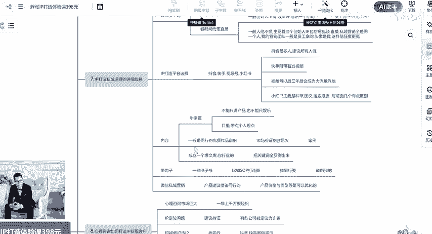

摆摊是不是摆摊人的是什么摆摊人呢就是想摆摊的人是吧？那这个账号又跟之前又不一样，是不是？那这个账号的话，我们看这里这里面摆摊的这个我们跟。

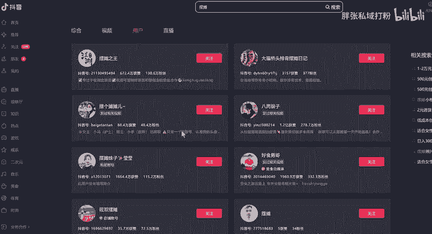

欢迎收看00后摆摊日常生活。你看像这种是不是这种内容，你看这些人明明显的喜欢看，是不是然后我们找到它里面的这个比较好的一些内容。那举个例我假如说这个是就是你是做做摆摊卖这个摆摊教程的，卖的小小产品。

那像这个内容的啊，像这个内容呢就可以啊，像这个内容你看对。

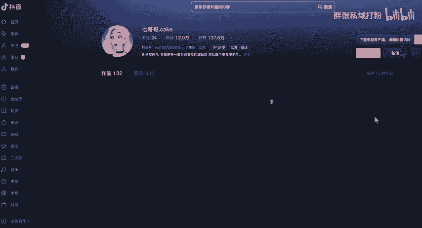

是吧像这个人呢，你就可以抄他的是吧，看看第一个讲啊讲什么东西的，你就把它弄一下，把它搞成这个自己的作品，就这么简单。啊，成立一个自己的爆款文案库，然后哪个容易报，哪个不容易爆哪个容易报的，你可以再拍。

然后呢，一个视频拍个一年两年，天经常拍经常拍这种爆款视频啊。然后呢，还有一个带钩子，什么叫带钩子的？钩子就是说我们啊有有一些东西要给到他，对不对？你因为现在很多人其实说实话啊，人跟人之间交流是什么。

是价值交换，是不是我能从你那里得到什么好处，你能给我什么东西，我才会啊在你这里买单。那么首先我应该是付出给给一些电子书SOP比如说我这个是SOP流程图，这个东西从哪里来呢？从同行那里来啊。😡，嗯。

从头往那里来调的那比如说。比如说这个啊这个流程图是吧，SOP的流程图这个玩意我就要从别人抄过来呗，对不对？反正免费的，是不是他写的同行你看这个东西很优秀的是吧，他做的很优秀的是吧。

我在从里面抄过来就好了，是不是就直接抄过来就好了，就这么简单。啊，我们直接从别copy过来就好了，对不对？我们不需要就是钩子的，还花很大的精力去搞这个事情，没有必要是吧？

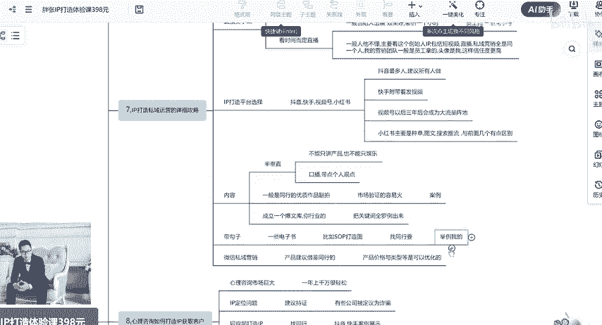

啊，你的钩子是什么呢？比如说你的餐饮的是不是你餐饮的开门店的一个呃，我跟他看一下举个例子哈，这个叫什么来着嗯。😊，啊，叫李。那比如说这个人的是吧，这个人也是你看有1000万粉丝。

这个人就是卖一些那个苍饮的小课件，我在。上100万粉丝的时候就看到这个人了吧。这个人应该赚了不少钱，一年搞个几千万，上千万利润是搞得到的。你看这个人就是分享餐饮的小小餐饮的这些内容。

然后来卖一些小餐饮的课件，19802980卖这个东西的啊，我也进了他群里面，我看到他了，看到他卖啊。那这个的IP打造的就是。就是一个很憨厚老实的一个人，看起来很可以信任度比较高嘛，是不是？

那这个也没有说完全做视频做做直播偶尔直播吧。那直播不能是天天做的，天天做的累死人了是吧？啊，短视频火了或什么的，就偶直播一下是吧？增加丝信任度是不是短视频用来打造IP的直播用来转转化的或倒粉的啊。

大家注意啊啊这个点啊。有但凡那个人，他说直播间啊一定是靠直播间做，直播间做是没错，但是呢他没有任何的IP打造，没有任何的形象展示的话。你不直播的时候，别人就看不到，对不对？啊，那这个就是一个短视频。

加上直播的一个啊一个一个展示，对不对？这个就是啊，而且这个人他是有有有钩子的啊，有钩子的。你加到他里面去的之后，他会发一份小资料给你我加过去啊。

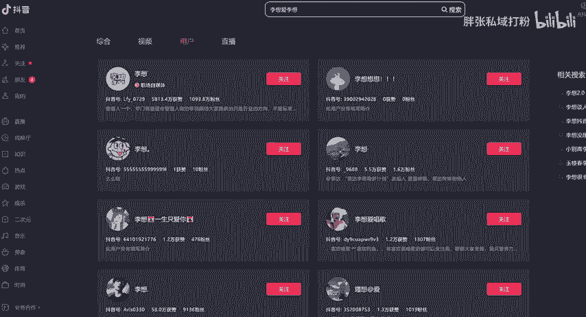

这个人这个应该是他的微信，没有。加过去加过去之后呢，然后他会有个小资料发给你，然后卖些小课件给你那个那个餐饮小课件，相应小小小课件，它后面它有他也有那个什么小小钩子的啊，就是我建议大家尽量带一个钩子啊。

带钩子，我给大家看一下吧。大哥，我要腿糖，这个汤熬好了，这锅，然后就开始蒸个粉。好了是吗。😊，那我们调好了啊，差不多就是这个流程，老板嗯，你卖烤，那这里中间我们他会有一个配方啊，很容易把这个。

然后那你这个没找到是吧，他中间视频当中这个视频太长了啊，视频当中会有一个这个小的这个配方，对不对，他会让你去让让你去获取什么东西的。啊，你会你然后你会找到他，或者说问他什么东西的。

他就他就会他就会有小资料留给你就钩子的，我建议大家都要都要准备一个啊。然后呢，还有一个就是除了钩子之外，还有一个小小课件叫什么。小客件。小课件啊，这个大家准备一下啊，小课件比如说1019。929。

9块是吧，29。9块是不是？需要科件。啊，29。9块的。但是这个是一个体验课来的啊，体验课啊，举个例子啊，这体验课这个体验课跟这个钩钩子有什么区别呢？钩子就是存储的一个免费的一个文档。

是不是那个体验课就29。9块啊，挂直播间啊卖啊，或者是卖的这个东西啊，这个跟这个有点小区别啊啊，这两个有小区别。然后呢，我们微信当中呢，我们微信私域当中营销卖大客是吧？大客。啊。

比如3980是不是3980或19800呃，加盟费是吧，30万。这个就是。好，大家明白没有？这个就是啊。再这个就是微信卖这个啊思域端卖这个大客产品。其实我你如果没有了话，你看同行的吧，同行卖产品。

你就模仿就行了。我是建议这样子啊，如果说你有的话，自己弄一个没有就差别。我是觉得这样子比较快需省事啊，产品价格类型啊可以优化，就是可以换的，就是可以换的，你可以卖包装奶茶什么的乱七八糟的啊，这个东西啊。

这个这个就是整个思域打造的一个啊流程。啊，流程就是很多的这种啊思域的这个打法呢，全班按照这个思思维模型为操作啊，公寓流量啊进行一个导流短视频IP打造，直播间卖小客或者是抖粉，然后呢，思域卖大客。

是卖大客或者高价产品或者加盟费这样的一个整套的1个IP打造的一个流程啊。你的看你什么店铺嘛，你的内容，你的你的你的产品对不对？所以这个需要一个很强的一个定位的。就跟我刚之前说的定位是很重要的啊。

丁位之前说的一个丁位。有定位啊。这个定位还是很这样的，如果你个定位定位，你要定位为什么人群，是不是？你要定位为什么人群，你的目标群体，你的目标群体喜欢干什么？😡，目标群体。需要什么？喜欢看什么内容。

你这个得你这个得把它。把它给全部给弄出来啊，这个是很重要的，这个是非常非常重要的。因为你不同的展示的，你的人群不一样，标签不一样，你收的钱不一样，就是我们以结果为导向，肯定是以这个人群的标签为主啊啊。

啊，大家记住了吧，今天讲的大概就这个意思吧啊，定位好了之后，然后短视频IP啊直播小课件、微信营销啊就完完事了。

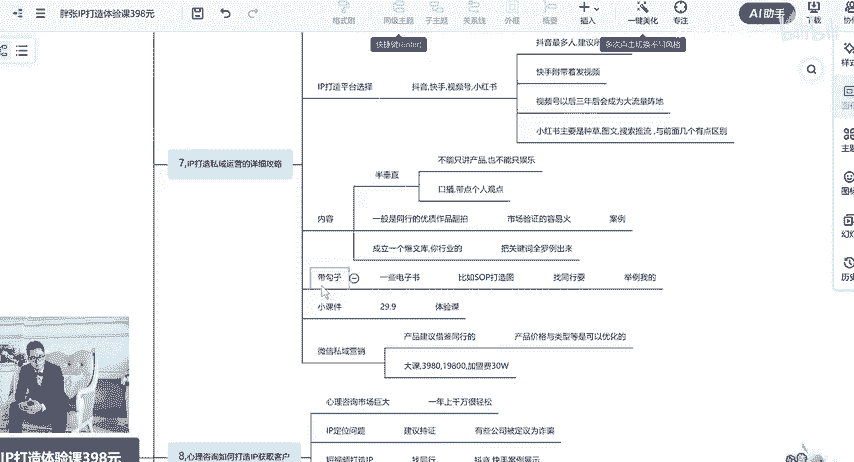

今天的讲解到这里。