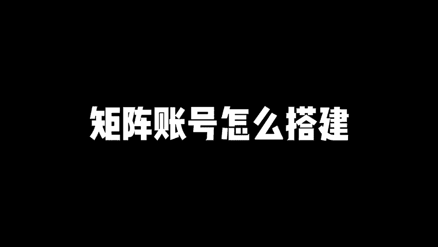

# 7大短视频矩阵玩法，矩阵账号怎么搭建 分享短视频矩阵号怎么做，短视频矩阵运营，短视频矩阵教程，短视频矩阵玩法，短视频矩阵系统搭建，矩阵账号怎么做，矩阵账号搭建！ - P1 - 黄一恒矩阵引流技术 - BV1NyHre6EZs

天天有人讲几证系统都流叉，但没人跟你讲明白几证系统到底有哪些玩法。今天我一次给你讲完7种主流几成打法，全部掰开揉睡的给你讲清楚，细节废话一个视频给你分享七大短视频几证玩法。几证账号怎么搭建视频有点长。

记得先收藏，一起来看我要给你分享怎么做原创授权几证，单平台纵向几证权益横向几证以及内容分发几证IP复制几证，还有消费者裂变几证，员工放大几证。现在看第一个原创授权几证。

这应该是目前几证打法里面最简单的一个几证方法。同一个视频发布到10个账号里面还不会备叛搬译，它是平台的自带功能。只不过呢入口很隐长，很多伙伴基本上都不知道。但是一个条件。

我们的主账号必须要满足原创作者的标准，才可以做这个授权。当我们授权之后。

我们就可以在其他账号里面发布这个作品的视频，不会涉及到搬译，也不会涉及到原创度过低，更不会涉及到版权问题。那具体该如何操作，这里给大家分享两个平台，怎么做原创授权。首先是抖音。抖音的话。

我们需要有1万个粉丝才可以玩。所以前期啊你需要先做一个号，这里给大家演示一下，我特地找了一个没有开通过授权的账号给大家做示范。我们打开创作者中心，在创作者中心里面，我们先要点击前部。

然后找到账号安全原创保护，进来之后，在这里面找到冒用治理，然后就可以进行开通，可以看到开通条件，必须要满足1万粉丝的指标。接下来我们勾选协议，点击下一步，在这里面搜索你的其他子账号就可以添加添加完之后。

我们就可以去发表同样的作品了。那如果是视频号，我们又该如何去做这个原创授权的方法非常简单。给大家示范一下。好，我们打开视频号，在视频号右上角，我们进入到创作者中心里面。

这里我们也找了一个新号给大家做演示。进来之后，我们点击创作的服务，点击更多。在更多里面找到账号安全，选择原创保护记录。在这里面点击右上角的这个叫做添加授权，在这里面就可以添加5个授权。

并且呢可以发表原创声明，不会受到流量限制。好，这就是原创授权矩阵。最简单的，大家赶紧去试试。第二个单平台纵向指阵。这也是目前我们正在用的方法，目的是为了挖掘深度，一个平台做多个账号。

一个人可以玩3到10个账号。但是呢我们前期啊需要先跑一个MVP账号。一旦MVP账号跑出来之后，我们把这个账号的选题开场脚本包括呈现方式，直接重新拍摄发布到另外一个账号里面。咱们单平台做纵向矩阵。

视频是需要去虫的，每个账号里面视频都独立的，不会供应素材。所以我们需要换场景拍摄，换人物拍摄，换视频来进行呈现。比如说随手拍或者配上其他的素材，也可以换呈现方式。

比如说做成剪辑素材型动画特效型PPT拆剪型，导图分享型，这都可以。那这种方式呢，就是我们用原来的题材和内容换一个方式重新做一遍，时间就是节省了我们前期做脚本周内的时间，重新拍摄一遍就搞定的。

第三个权益横向集战，目的是为了扩大覆盖面，也就是覆盖多个平台。当我们剪辑一个作品之后，我们只发一个平台获取到一份流量。如果我们能够把主流的六大平台都做一下分发。我们就能够获取到六大流量。

比如说抖音、视频号、快手、小红书、西瓜B站都可以分发。而且这种分发的时候，视频是不需要去重的。一个手机。可以直接安装多个APP直接进行分发。

但是封面标题我们需要单独针对平台的需求和受众来做一下针对性的优化。这样的话我们获得流量更大。这个权益横向几站也比较简单，就是我们多花个半个小时，把你的视频发在多个平台就可以了。这里有个好处。

因为不同的平台，它的受众不一样，获取到的流量也不一样。有的特定内容在特定的平台上面它会有加成。所以原来你只做一个平台流量不一定大，结果你做了6个平台之后。

游个平台流量可能是现在平台的2倍5倍10倍都有可能。而且比如说像B站，它的完波力非常高，加快的客户非常精准，横滨视频西瓜流量也是什么非常不错的。好，第四个内容的分发集成。什么叫分发集成？

当我们做了一个月，做了两个月，已经搞了几十上百个作品，这里面就会有些爆款。这个爆款能爆，是因为题材非常热，内容非常好，呈现方式呢，用户比较喜欢，那怎么办？我们可以把它拿过来，做成文章。

发布在这些文章平台上面，是不是又能够获得比较不错的流量，而且你发的这个选题内容都是已经测试过的爆款，拿过来发流量绝对是比较可观的，还可以做成这个图文，发不到小红书图文，抖音图文又能够获取到流量。

这个方法呢非常不错，但是只适合我们测试出来之后，流量比较大的爆款题材以及内容相当于把它单独做成一个版本。这也是你会发现在有些平台里面。做的比较好的，他们会做什么文字版账号，图文版账号、视频版账号。

甚至有的做的全的，还单独去做了什么音品牌的账号。目的就是为了做内容分发，覆盖更多的平台，做更大流量。好来看第五个叫做IP复制集蛋。也就是1个IP老师拍摄原创视频，我们需要架设好多个机位。

比如说我们架设5个机位，正面一个侧面各两台，一共5个机位，拍摄不同的素材。这样的话我们就能够获取到5个完全不一样的画面素材，每天拍一条，一周拍7条，一个月至少能搞30条。

接下来我们可以通过剪辑来复制咱们的分身。比如说我们有团队配上10个剪辑师剪辑不同的50条内容出来。那这里面要做50个内容呢，还是有难度的，咱们得配合上这个切片混剪。那什么叫做切片混剪呢？

正能量得配合上两个库。第一个库就是我们IP录制的视频库。这个库的话，也就是我们驾设的5个机位。第二个呢就是咱们的切片库。切片库里面我们的素材是只用一次。

谁用了我们就换这样的话我们一个视频有50%的是切片库，这样切出来的作品啊就是原创的。而且我们会穿插混剪，这样的话就可以让系统识别为原创，然后呢搞上几十个账号，一条视频一万播放。

如果50条视频每日就可以获得50万播放，将咱们的流量放到50倍。但这种方式啊只适合团队有专门的剪辑师才可以操作。普通人呢做起来都比较大，它的核心逻辑就在于什么？不拼大号，也不拼上热门，重点就在于堆积阵。

让我们的数量来提升流量，让咱们的流量生生不息。重点在于我们的剪技人员需要做好这个激励机制。因为收入跟他们的流量变现相关。他们捡起来也比较动力，而且在减的时候都是用我们前期的MVP账号来减的。什么开场。

什么剪辑手法，怎么分镜，用什么素材，怎么切片都有流程和模板直接套就可以了。所以账号流量变现业绩呢跟它的比例是相关的。比如简例，咱们账号流量100万业绩，那剪辑人员收入2万，那收入2万已经是什么？

相对来说比较可观了。好，接下来看一下第六个消费者裂变提证。这种方式啊适合有门店的伙伴让消费者参与来制作视频，拿取奖励。但是有伙伴发现消费者。来参与视频制作会有很大的障碍。比如说发布视频非常繁琐。

很多人觉得哇，十几个步骤直接不做了，或者说是奖品。太小了，缺发动力。用户呢不愿意来完成。所以咱们在做的时候，需要激励消费者来发视频。那么首先策划一个活动，提供打卡奖励。

在我们店里面拍1个60秒的视频打卡就可以获得饮品或者甜品。这个饮品和甜品又是咱们店的爆款自然会来参与。甚至我们单独针对。这个消费者页面挤赞作一个独特的产品。这个产品呢只有参与打卡才可以获得。

然后咱们提供技术支持。比如说扫码自动生成视频，生成视频的时候，我们只要自己用手机啊拍上几个固定的画面。第一个画面，第二个画面，第三个画面，第四个画面。

第五画面文案映测话题映测团购地址映测直接就生成出来啊，提高发布的便携性。而且我们测试的这个MVP它是能够带来流量，能够带订单的。每个人过来都帮你做了一个推广。那是不是我们就可以获得比较不错的流量。好。

接下来看一下最后一个员工放大几证。这个方法也就是每个员工发布不同的视频。每个员工呢做一个独立的账号，这里面的账号视频，他是不重复的。但是呢我们做员工账号，利用员工自己的号来发，他肯定不愿意，那怎么办？

我们需要去用自己的营业执照去注册一个栏V号，每个企业的员工呢，他是可以注册一个员工账号的。那么如果你有100个员工，相当于我们就可以生成100个员工账号出来。那么个人实名，他和这个员工号是完全不冲突的。

那如何注册这个企业员工账号，我们是需要到栏微号的后台，找到一个己证管理，在这里面点击几证账号，添加账号，输入登录邮箱密码。那么填写员工的身份信息设置在职证明，这个员工信息呢，当用户拿到邮箱密码。

登录的时候，他也是需要人脸验证的。所。

一个人只能够搞一个员工账号。那么这样的话员工有的账号，并且由你提供了开场话术和模板，让他去套，利用员工的自营号来获取流量红利。目前自运营的流量红利呢还是比较不错的。通过这种方式，让普通员工发布作品。

也能够获得大量的流量咨询。每个员工就是个几阵账号，特别是有这种连锁店的。每个连锁店有5个员工，10个员工有100家连锁店加起来。你想一下，500到1000个员工都搞了几阵账号，这个几阵威力就非常大的。

它就是一个蚂蚁雄兵策略，虽然每个账号不厉害。但是呢这100个账号，500个账号凑在一起，就是什么非常厉害的打法。好给同学，我是王一涵只做落地推广方法，刚才给大家分享的7种挤阵打法。那如果我们想去落地。

该怎么操作呢？这里面我给大家准备的是8个平台的详细打法，这些呢都是我原创的，教大家如何打造挤阵多流量管道，可以通过主页连挤店学习，如果觉得今天这个视频比演收获的，现在在一键三连，感谢大家支持咱们下个。

明呢就会。