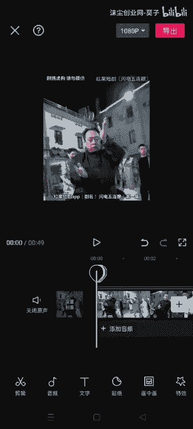

# 8月份最新短剧去重技术 卡模板去重 起号嘎嘎牛 效果不用说 - P1：IMG_2137 - 沫尘创业网-莫子 - BV1rbete4Exh

目前社群的兄弟们，大家中午好啊，今天给大家带来一个这个短剧的一个驱虫办法，所有的驱虫办法都是来源于网络拆解，OK废话少说，我们直接开始实操，我们下载完视频之后，直接打开剪映。

然后点击开始创作。

然后导入我们提前下载好的视频，然后这个时候我们给它裁剪一下，我看一下啊，在哪来着，编辑裁剪，然后去把他一个字幕给他去掉，只要不是只要把头露出来就行了，只要没有踩掉脑袋就行。

然后下一步我们给它识别一下他的字幕。

识识别字幕的这一步。

你那个画的重点也给他点上啊，然后把他的这个无用片段给它清除掉。

然后同时删除视频呢。

划重点保存好，就是这个样子的，可以看一下，我们给他就是分了很多段，然后把一些没用的给它裁剪裁剪掉了，我们原来是1分07秒，现在只有49秒钟，这也是一个驱虫，就是起到一点驱虫的作用啊。

然后这个时候我们给它添加两个字幕，第一个就是假如说我这个视频是从红果断举，就是我搬的是红谷团聚的，我去，然后这个片名他叫嘶求，suspect that球mete，加闪电五连鞭，OK样式给他编一下。

放到右上角，拉满，给他拉满一点。

OK拉满之后我们再给它添加一个剧情虚构，请勿模仿。

这个我们给它放到右上角，然后放上这一步呢，我们给他导入一个嘶。

就是给他画中画，新田画中画，去素材库里面找一张纯黑的。

给他放到下面，拉满，给他复制一段，拖到下面一层啊，卧槽这个也看不到，然后上面再给他来一个。

OK上下两边都有，然后弄完这一步呢，我们给它添加几段文字，嘶嗯就剧名先给他打一个app的名字啊，就是嗯我这就假如说我这是用红果短剧推广的，我就先打一个红果短句，短距APP，然后再给他打一条斜杠。

打一条杠，我找一下打一个杠，然后句名。

双引号，闪电五连鞭，再打条杠，然后再打第几集，给它放到这个位置，也是一样的，给他拉满，然后这个时候这一步我们再给它添加一个，再给它添加一个画中画。

这画中画的话最好是自个儿去做一个，做一个动作图片啊，我这里就在素材库里面找了，我看一下啊，找一个风景的吧。

OK给它添加一段，就正好大概就是正好盖住这个红，果断句一丁点就行了，我们给它再添加一个，再添加一个关键帧，啊在这里这关键帧怎么怎么添加呢，先加一个给他拖到最旁边，然后滑到最后面给他，哎呀。

就你们做的时候一定要把这个拉满了，我这里就不给他拉满了，然后这个时候把它拖过来，再给他加一个对，然后还有一步啊，我们再给它新建一个画中画，或者你不新添也行，我们这里不是有黑色的吗，给他复制一段。

拖到最下面，给他脱下来，盖住这里就行了，好我们可以看一下，看到没，他这个字幕是有一点点在变动的，我们给每一段视频都给它添加一个关键帧，就是给他放大一点点啦，好我给他放放左边一点，然后这个给他。

给他放大点，放到右边点，嗯放到右边点，这个的拖到左边，我们可以看一下，闪电五连鞭，看来他视频是有一点点在变动的，就是你这样看是看不出来的，因为我们上面也是上，下面两边都是添加了一个黑色的画中画。

所以他整个就是整个光感是不会变的，但是机器检查的话，他是会有变化的，跟一跟别的的话，因为这个短句太多人代做了，然后我们隔几段给他镜像一下，静香在哪来着，嗯我找一下啊，反正你们这隔几段给他镜像一下。

然后我这一时半会儿忘记在哪个位置了，然后最后一步啊。

我们给它添加一张图片，就是这种彩色的图片。

给它添加一个，彩色的图片，点击混合模式滤色给它拉低一点，只要能看到一点点就行了，然后做完这一步呢，直接给它导出。

导出完之后呢，我们打开我们这个驱虫大师，然后选择视频，选择我们刚才做好的视频，给它添加一个扫光，然后调色智能边框，高清帧率，然后把这两个都给他点上，然后直接给它导出就行了，因为是演示啊。

我这里就不给大家导出了，因为节约点时间。

那这个时候我们再返回剪映，点击这个剪同款。

在某版里面搜索量程，搜索一个量程，我看一下是哪个这个疯子醒，然后给他选两个图片。

不在我直接。

嗯OK导出完之后呢。

它会跳转到一个抖音啊，这个时候我们点击这个编辑，就是这个剪辑给它添加一段，我们刚才做好的视频拉到前面来，我们把后面这个后面这个你可以给他删掉，也可以给他拉到最小，然后点击保存。

然后选一个比较热门点的音乐啊，我这里就随便选一个了，你们要选择一个比较热门点的音乐，然后这个配音的音乐能听到一丁点就行了啊，这个这个时候点击下一步，然后他这里就会卡出来一个模板。

然后话题的话就看着你们随便选就行了。

就是选一些你想发的话题什么的啊。