# B站最牛新媒体运营零基础入门课程！小红书运营从0到1新手起号干货教学！抖音直播带货／短视频剪辑实战教程／年度巅峰自媒体运营课，一套学完！ - P33：15：新媒体运营-小红书平台关键词的玩法和关键词工具 - 方老师运营课堂 - BV124421D749

OK好欢迎大家来到我们这一堂课，那么这一堂课呢，我将给大家推荐一个，非常非常有用的一个工具啊，也就是我们屏幕前的这样一个，关键词的一个工具，那么关键词这个东西呢，很多时候它是与我们的行业里边去。

就是做产品息息相关的一个东西啊，我们知道前面的课程，我们跟大家讲过一个内容啊。

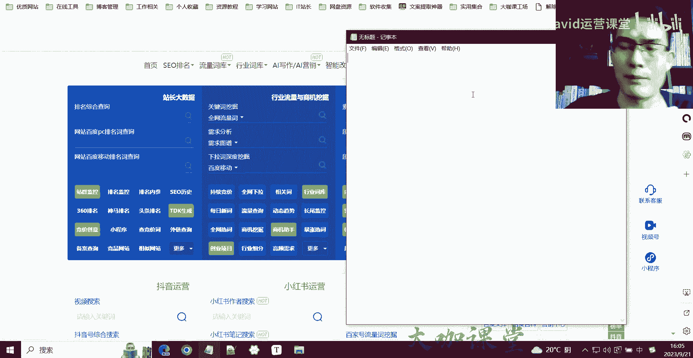

这是长尾关键词以及核心关键词，对不对，我不知道有有没有同学记得啊，长尾关键词以及核心关键词啊，首先呢长尾关键词我们来看啊，核心关键词啊，首先第一个啊核心关键词，什么是核心关键词。

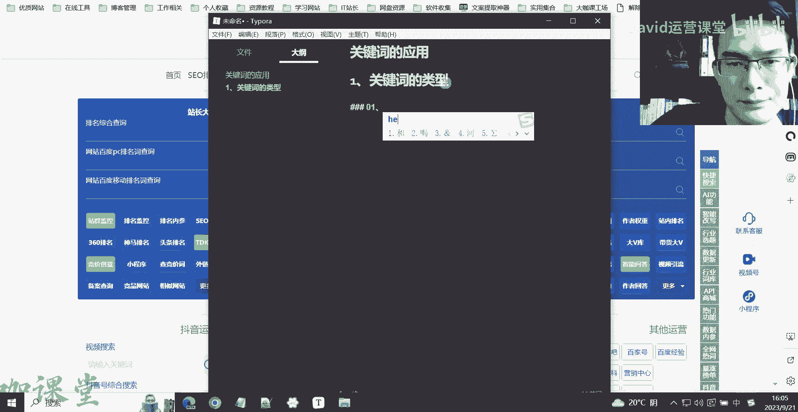

我们来举个例子，比如说啊啊，那么我这里搜索了一下吧。

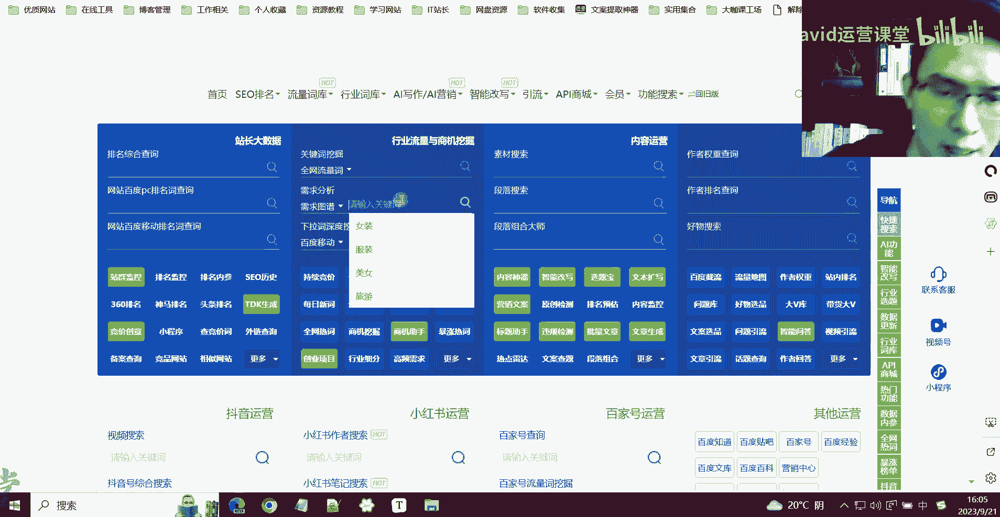

哈我就点一个吧，OK我们看到我们现在搜索了一个词，这个词呢叫女装啊，女装这个女装这个词呢它就是什么呀。

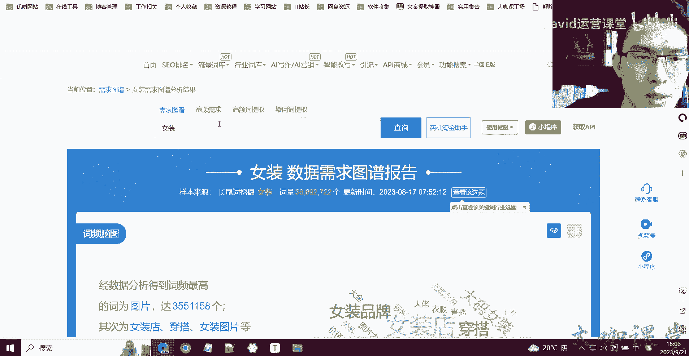

它就是我们的一个核心关键词啊，举个例子，比如说，女装对吧，呃然后还有什么来着，奶粉是不是啊，这也是一个核心关键词，然后我们的一个比如说压缩机等等等等，OK那么这些呢其实能够通过这样的一个统称。

也就是行业里边大家所所所了解的，这个产品的一个通灵，它叫做核心关键词。

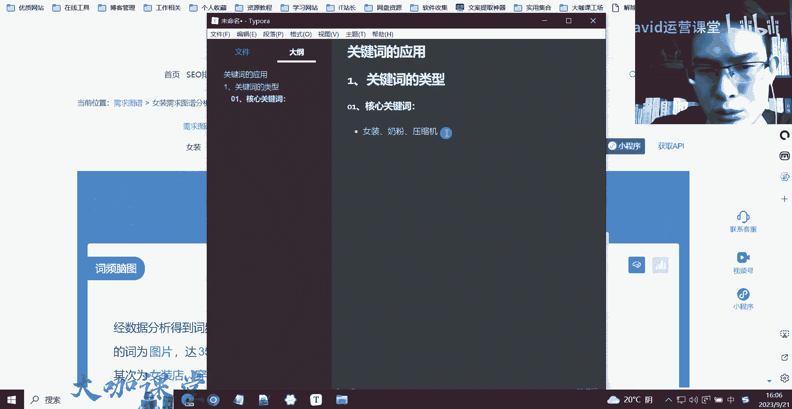

OK也就是我们这里搜索的，那么我们再来看一下啊，这个呢是这个词的一个云图，所有的东西呢都是这里边展示，这些词都是跟它的核心词相关的啊，跟核心词相关的，比如说出现概率最大的这个这个这个图片。

这两个字是最显眼也是最大的，那代表着搜索女装的更多人，他可能搜索的女装图片，也就是说100个人来搜索，里边有可能有六成以上啊，也就是80%以上啊，60%以上的人他都喜欢去搜索什么呀，图片女装图片。

然后呢啊其次是什么，其次是女装店啊，也是最大的，对不对，然后穿搭女装图片这些，那么这些东西是什么呀，这些东西就是根据我们这样的一个核心关键词。

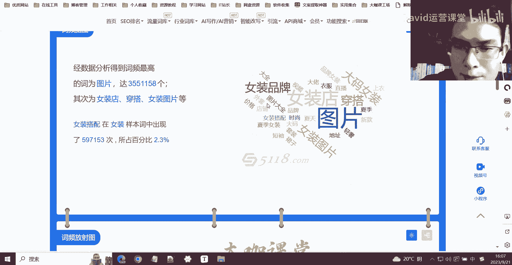

拓展而来的一个什么东西，长尾关键词一定要明白这个概念啊，这个在这个这个词，也就是说现在平台的，我们我现在教给大家，这个点还是很重要的一个点，这个点是在现在在这个抖音以及小红书里边啊。

运营讲究的最多的一个叫做SEO的一个概念啊，SEU也就是我们去做搜索啊，做搜索的时候要用到的一个东西，那么长尾关键词，比如说呃我们刚才列举的女装图片，然后女装穿搭对不对。

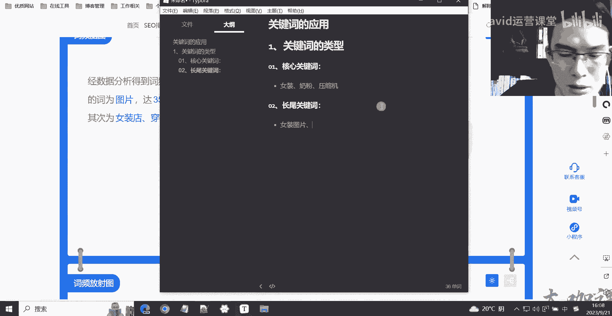

然后女装什么来着啊，女装店啊，还有那么这些根据我们的核心词拓展开来。

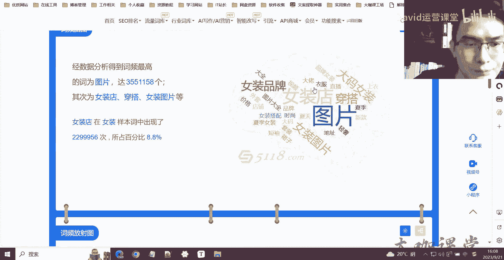

这些都叫长尾词啊，那么之前呢你们看过我的视频，应该记得我跟大家讲过长尾词和核心词，它之间的一个流量啊，一个流量，那么我们今天给大家讲的这个工具啊，主要是教大家明白这个工具怎么去帮我们拓词。

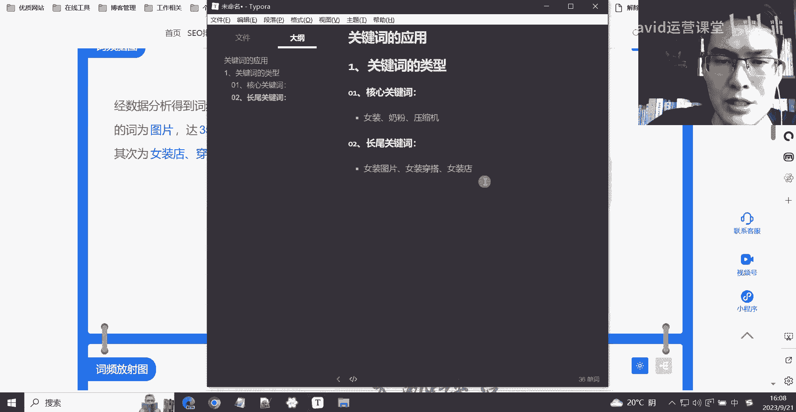

好吧，怎么去帮我们拓词，那么首先这个呃关于需求图谱这块啊，需求图谱这一块，我让大家重点要注意的就是这个地方啊，就这个地方，那么我这里搜索的指标可能比较简单，我们换一个比较明确的明确的产品。

比如说79元的眉笔，好吧啊，我们就打眉笔的，OK那么我们搜索眉笔之后，我们来看一下对每笔这个产品感兴趣的用户，他们现在最关心的点有哪些，眉笔砍刀，这是什么玩意，这个我不太熟悉啊，然后颜色眉毛对不对。

图片啊，图片可能就是想看一下眉笔的一个效果，还是去抄图什么的，品牌视频眉毛，然后这一些其他的东西，那在这个地方呢，呃我们可以通过这样的一个云图来分析，得到什么呀，得到一个用户。

当下他去搜索每笔这个产品的时候，他更关心的价值点，比如说他更多喜欢想去看眉笔的颜色啊，他更想去看图片，很多人都在这一块关注这个点，那么我们后期做内容的方向，我们就可以往这个地方去偏一偏。

我们考虑去做一下关于图片这块的内容啊，当然呃呃这个数据啊，我在这里给大家讲一讲啊，我给大家提供提提供的这个工具，是一个全网性的这样的一个数据平台，它不代表着就是完全准确啊，完全准确。

这是我给大家推荐的一个方法之一，因为为什么要用到这个工具，因为我们在平台上面去做内容的时候，我们会有更精准的参考，但是这个精准是定义在它的内容量，比较少的情况下，比如我们去在抖音上面。

抖音上面我们会去搜索，看一下这个最近的一些呃平台热点对吧，但是很多东西它跟我们的内容不挂钩，我们没有办法根据这些热点去阐述内容，那么这个时候我们就要考虑跟我，我们这个行业相关的更多其他用户的需求对吧。

比如说你的账号发了十条视频，你不可能十条视频全部都是平台给你提供的，这些关键的热点，你肯定有一些内容，你需要去覆盖一些用户的潜在的，这种少量的小众的需求，对不对，那么这个时候你就要通过这样一个。

关键词的工具去分析得到用户更多的需求，OK那么这是第一个点啊，也就是我们的这个啊视频导图啊，我们这也叫做他这个需求图谱，然后的话这里有一个高频需求，好吧，我们来看一下啊。

这个高频需求的话还要分析需要点时间，那么这个时候呢也是我们所提供的一个产品，里边能得到的一个其他的一些词啊，其他的一些词，呃那这里比如说现在关于眉笔，眉笔之后是什么眉笔颜色。

然后那么这后面就是关于眉笔颜色，所推荐出来的一些词，比如说眉笔的颜色，眉笔颜色怎么选，怎么选眉笔颜色，然后没比什么颜色好看，对不对，那么它的一个整个的逻辑，也就是说我们拓词的方法和逻辑就是这么来的。

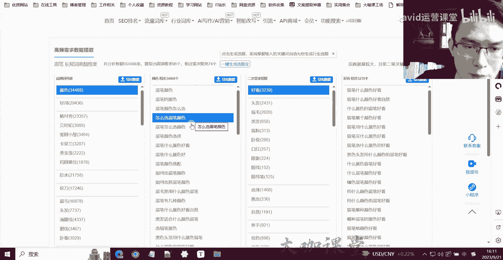

嗯第二个点我们讲的是拓词啊，关键词拓词，第一个呢是讲的这个核心词和长尾词，的一个关键词需求对吧，这个你们应该能明白，然后关键词拓词它的一个完整的逻辑，其实就是首先比如我们提供的是一个眉笔。

然后眉笔之后呢，眉笔后面啊就是我们这里的对吧，颜色啊颜色，然后呢还有什么啊，那么颜色之后呢，比如说眉笔的颜色怎么选对吧，眉笔的颜色怎么选，那么这就是我们去策划其他内容来的啊，这样一个完整的途径。

还有一些，比如说啊眉笔每笔型号总有吧，有没有型号，防水评价啊，色号吧好吧，比如色号，那么色号上面有哪些词呢，我们点击下看一下关联的词，眉笔色号对吧，还有植村秀。

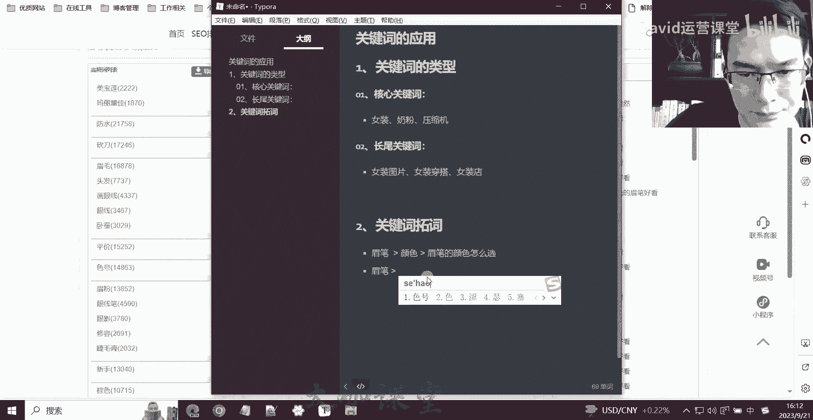

这个应该是个产品吧，对吧啊，我们就看一下每一笔的色号啊，那我这里只是举个例子啊，这个后面你们应该看到的是，后边有很多很多的内容去供我们去挑选的。

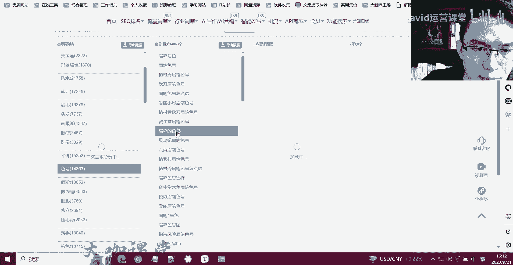

也就是说我们在日常做内容做选题的时候，你可以通过这样的一个关键词分析工具，来得到你这个行业里的用户，他们所急需要的一些需求。

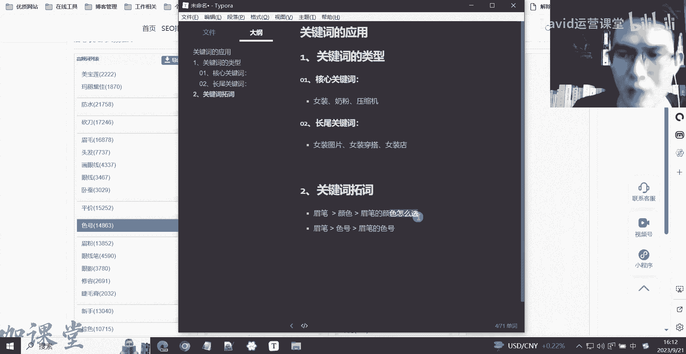

或者说他们渴望的一些需求，这些需求可能它并不是特别集中的点，但是它能够覆盖一些，就是在这一块有独特价值需求的这种用户，那么这种用户在刷到你的内容和视频的时候，他就会特别关注你，尤其是我们做小红书。

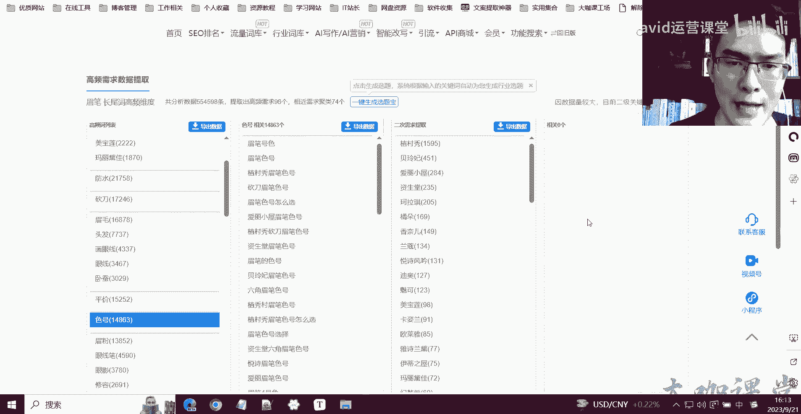

因为小红书它是一个图文推荐类型的笔记，他特别特别关注什么呀，小红书特别特别关注关键词这个东西啊，关键词这个东西，那么说到这里啊，我就不得不跟大家讲一个，就是关于小红书上面，很神奇的一个关键词的玩法啊。

诶，这是键盘要换了小红书的关键词玩法，OK我们给我们，我来跟大家科普一下啊，比如说我们现在找一篇小红书的笔记，我们来看一，啊这个我之前试过啊，因为没有登录，不能搜索。

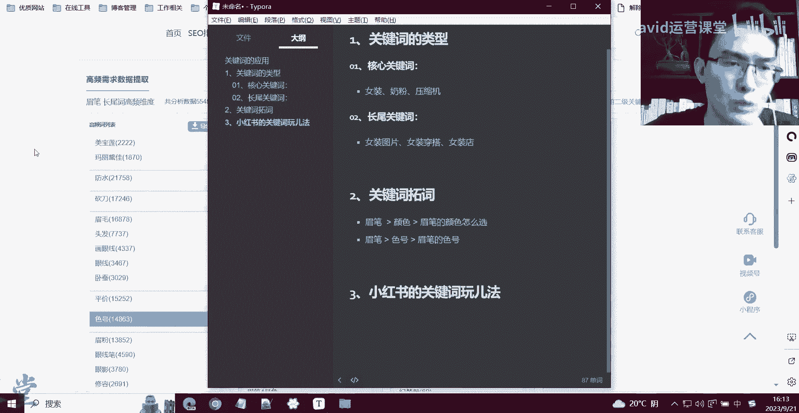

我们就随便找一篇吧，找一篇图文笔记。

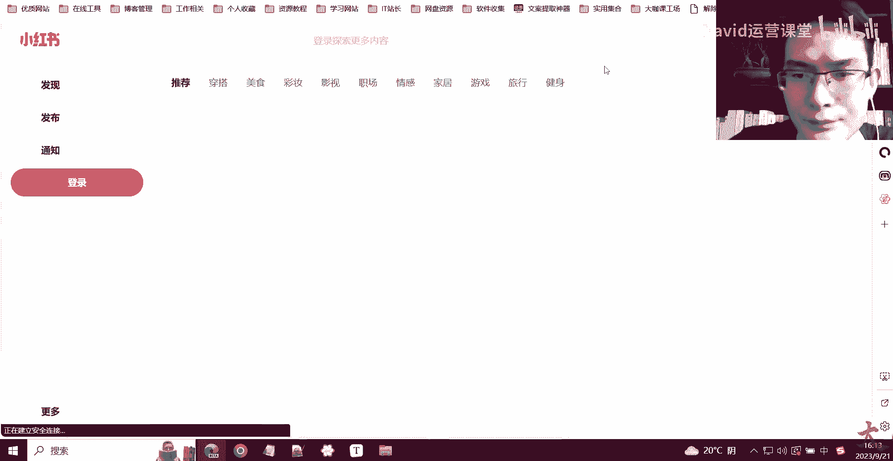

就这篇吧，比如说他现在有这样的一个文案好吧，然后呢呃这是他的标题，我们来拆分一下这个结构，然后我再给你们演示一下一个神奇的东西吧，嗯嗯嗯这是标题，然后这是文案对吧，文案完了之后还有个什么东西啊。

还有一个叫标签对吧，小红书里边缺一不可的三要素啊，比如说我把这个标签拿过来，OK这是正常的嗯，OK那么标签拿过来了好，接下来我就给大家展示一下，现在小红书有些人在玩的一种玩法，那么这是他的一个内容对吧。

标题文案其实都在一个页面，这个时候好标签填完了，很多人会这样啊，比如说他是瑞幸拿铁对吧，瑞幸拿铁，然后拿个玩意给它隔开，然后瑞幸，瑞星校园，OK我们就简单这么展示一下，然后我们来看一下效果。

现在有些人他做小红书，他就会这样玩，他在这个标签完了之后，在内容完了之后，他会在下面贴一堆这么没有用的东西啊，看似跟标签相关的，但是其实这个东西就是他为了来干什么呀，他就为了实现一个东西啊。

我们叫什么叫堆砌关键词，啊堆砌关键词，这是现在小红书的一个玩法，因为很多人有些人他现在确实在用啊，这这些人呢，可能跟我们以前做SEU转变过来的一群人，有点像啊，有点像，那么这个什么意思呢。

就是他会在下面堆砌这些内容，这些内容里边关键词，全部都跟他这篇文章的一个核心的内容，比如说呃他的标题就是啊瑞星咖啡啊，有什么用啊，我们不管这个东西讲的是什么啊，它的标题里面包含瑞幸咖啡，然后他这个笔记。

他就想把瑞幸咖啡的关键词搜索排名做上去，然后希望更多人通过搜索来看到这篇笔记，Ok，那么这个下面这个地方，就会起到一个一定的作用啊，这个作用我们暂时没办法去判断它很大，但是我可以实打实的告诉大家。

这个东西是有一点点作用的啊，有一些作用的，只不过这个作用呢分不同的产品和趋势啊，因为这个东西对用户来讲不是特别友好啊，不是特别友好，但是对于小红书，他去他这样的一个系统去爬取，我们的笔记的时候。

它来识别你的内容，它能识高，识别到一个非常高的一个你的这个频率啊，也就是你的这个频率，那么之前呢其实我跟大家讲过，有一个关键词的一个分词的啊，我们来看一下啊，词。

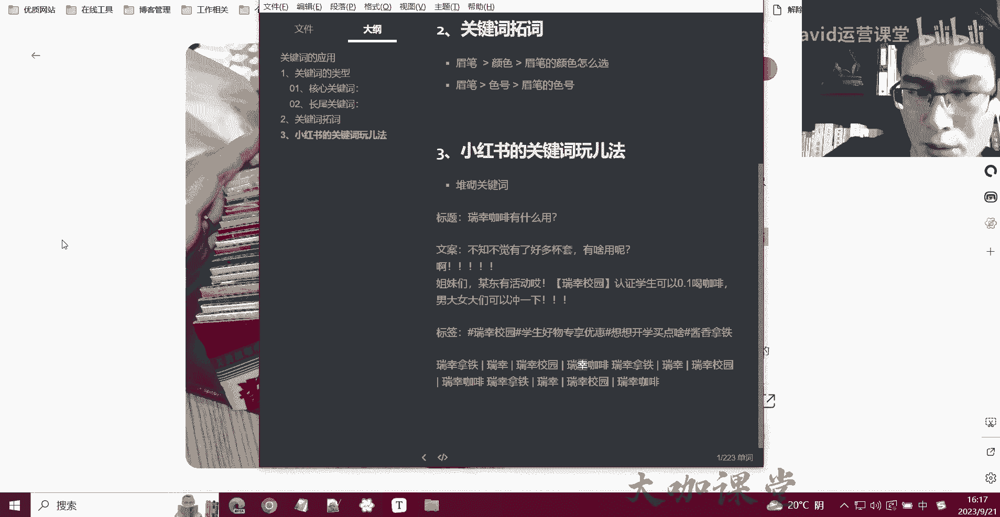

啊我们上一节啊跟大家讲过，就是关于关键词呃，就是说用户标签这一块，其实这个地方还有一个东西，可以来给大家分析一下。

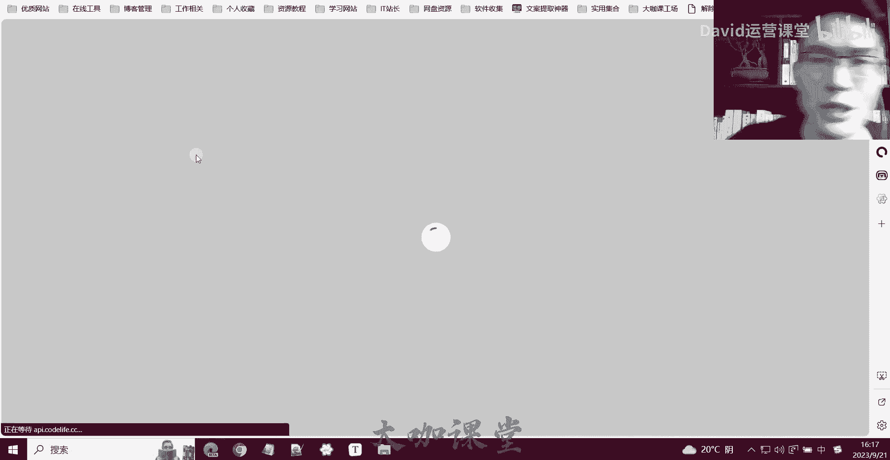

比如说你输入你的内容，在这个地方，它可以分析出来你的这些里边哪些词，它的一个比例啊，比如说我们做个简单的示例好吧。

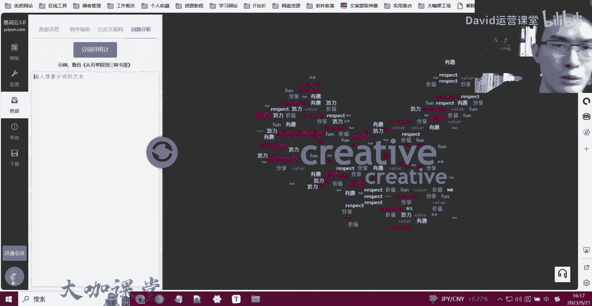

嗯我们来看一下，我们来完整演示一下系统以及平台，它是怎么来识别你的这个词的。

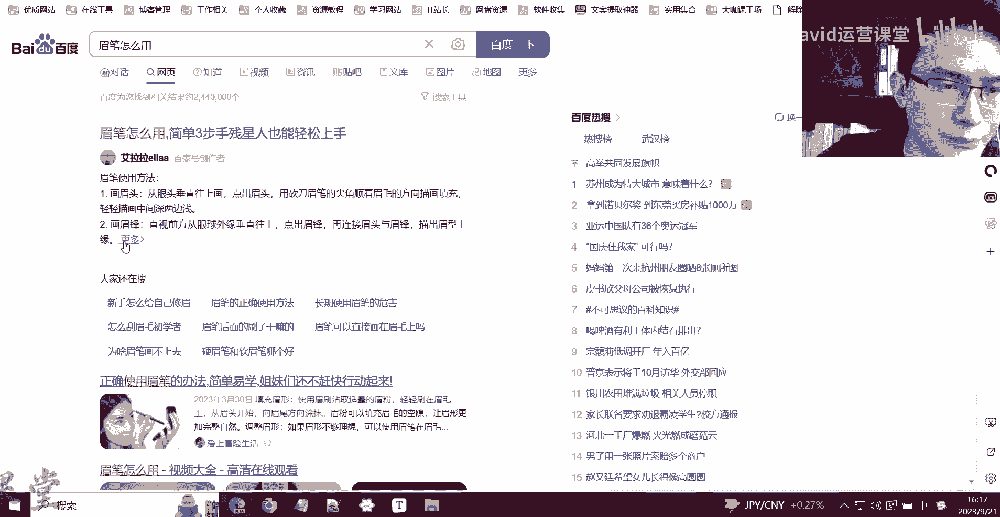

OK那么这里呢其实它就会有你的名词，形容词里边有每一个有多少数量对吧，有多少数量，那么这个数量就是系统拆分你的这个文案，得出来的一个结果，那假如说你通过你这样的一个操作手法，你故意让他在名词。

也就是说这个地方去识别你的瑞幸，这两个字是最多的这个频率，那么是不是代表着系统它可以去判断诶，你这篇笔记有非常高的概率，是完全讲瑞幸咖啡这个这个这个话题的，那么我用户假如说他有这样的一个需求。

他想搜索这样内容，我又想把这些内容呈现给他，那么你的这篇笔记是不是就有可能被系统选中，这是很多人在玩的一方一个玩法，其实呃对于机器来讲，它的一个识别呃是可以的，但是对于正常用户来讲。

这个文案就有点不是那么好玩了，那么我们以前是怎么玩的啊，我们以前做SU在关键词这一块玩的更牛。

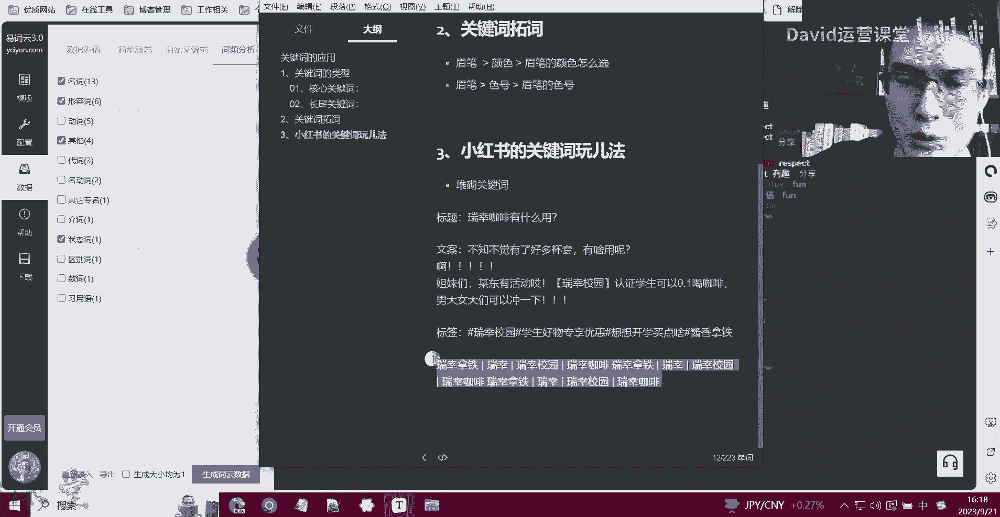

那么我来给大家演示一下啊，啊就在这里吧，比如说现在他的一个标题叫仓鼠啊，养乐多去哪了啊，在这好，我来演示一下啊，好仓鼠养的多，那么比如说这个时候我来在这里，我打一个仓鼠，OK那么你看啊。

这是我在标题里面堆砌的，我标题里边什么东西都没有，那么我正常文案里边我也可以这么去做，那么假如说我这个标题现在是这样的，或者说我的文案是这样的，我的关键词就是仓鼠，我想让系统识别到我这个内容。

就是关于仓鼠的所有的信息，那这个时候我这样去写没问题。

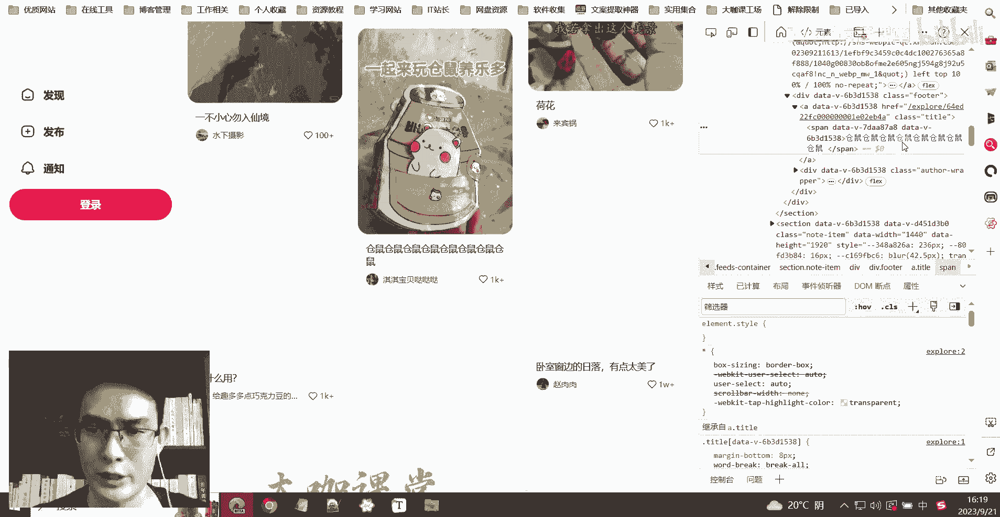

系统可以识别，但是对于用户非常不友好，那么我们以前会用有什么办法呢，我们会来改变它的颜色，让这个东西让用户看不到，但是让这个平台的它的一个机器，也就是抓取爬取我们内容的这样一一个机器，它可以识别。

然后这个机器呢在我们业内被称为这个spider，就是蜘蛛啊，你们了解一下就可以了，那比如说我现在怎么去改变它啊，我给它加个颜色，看一下这里是不是就消失了啊，是不是就消失了，但是如果说你正常这样去选。

是看得见的，但只不过对于用户来讲，用户是看不到的，那比如说我们刚才所演示的这个，我把下面这个字体颜色给它一改，诶用户看不见，但是这个平台它确实能识别的啊，那这是不是就一种很高级的玩法。

这其实就是我们以前做SEO，做战场的时候玩的那一套啊，去维系关键词这个玩法，小红书呢，现在这一块呢，嗯他也没有办法去改变这个字体的颜色，这样一个功能，但是啊，有些人确实在想办法去用这种方式去蹭啊去蹭。

你们呢也可以自己去尝试一下，如果自己有小说账号，你做的这个类目还可以的话，你可以去尝试一下，但是如果啊这个东西也分具体类目的啊，有些东西有些类目你这样做了没有用，但是有些比如说像知识分享类的呀。

或者是一些工具类的呀，或者说一些啊公司产品类的这种东西，还是有点作用的啊，有点作用的，你可以去试一下啊，你可以去试一下，Ok，那么这是我们本节课跟大家讲的一个关键的点，也是让大家能够认识和明白。

现在我们做新媒体运营，你像抖音小红书，还有哔哩哔哩，以及像知乎啊等等各种类型的平台，他们在关键词这一块的运用，很多人在之前是没有去注意到的，你的标题里边所包含的内容，还有你的内容当中所包含的内容。

是给这个平台的这个东西，我给大家写一下啊，是给平台的这个机器，也就是这个系统啊，Spider，啊蜘蛛，识别的啊，爬取蜘蛛识别的一个这样的，我应该没写错吧，我搜一下啊。

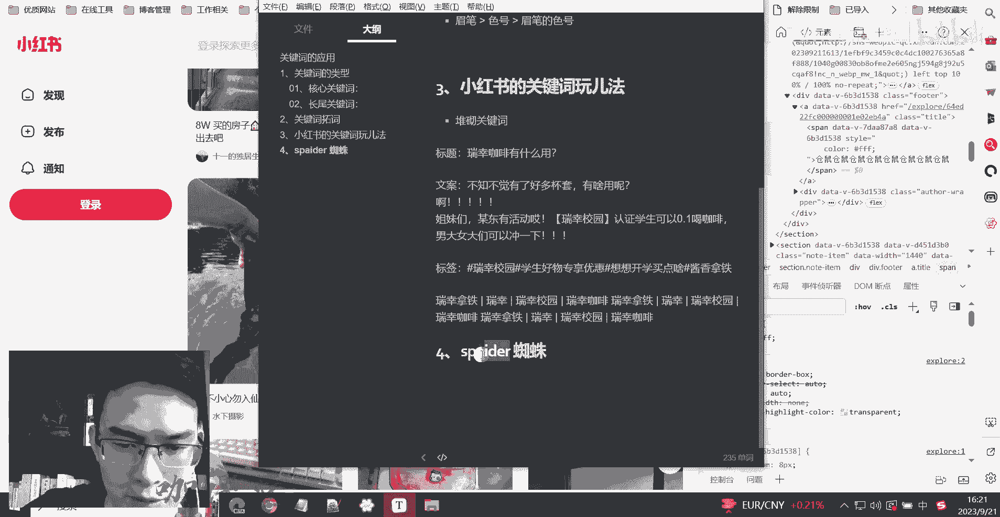

这很多年写错了就尴尬了。

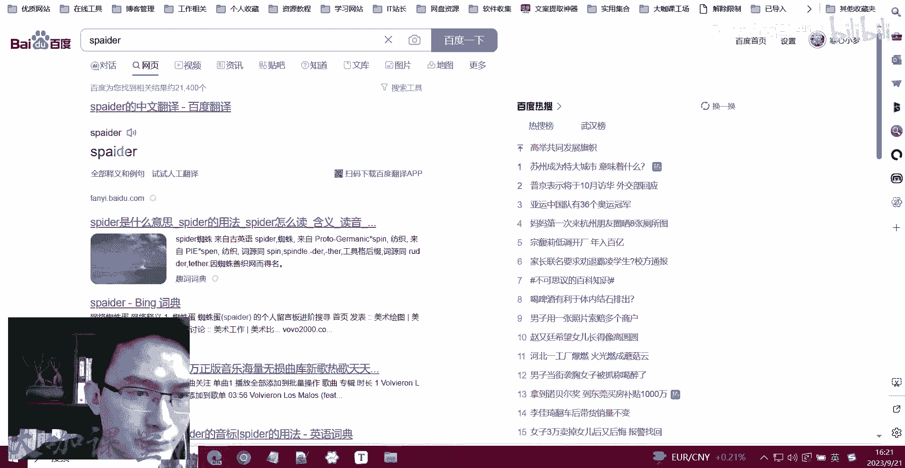

嗯没错啊，没错，蜘蛛对，这个蜘蛛呢就是可以理解为，在互联网上去爬取各种各样信息的，网页的一个东西，一个程序，那么抖音有它自己的这个spider，然后小红书也有他自己的spider。

他们在抓取这种我们做的关键词，标题里边，文案里边所包含的这些内容，就能有效帮助这个啊这个蠢蠢的蜘蛛，去帮助它识别我们的内容啊，去左右他的一个判断，能理解吧，OK好。

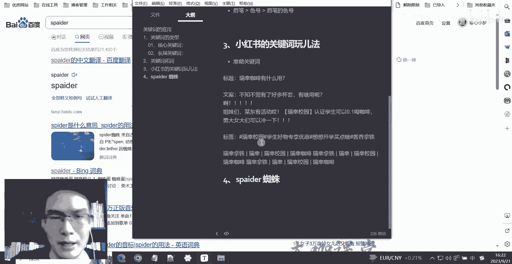