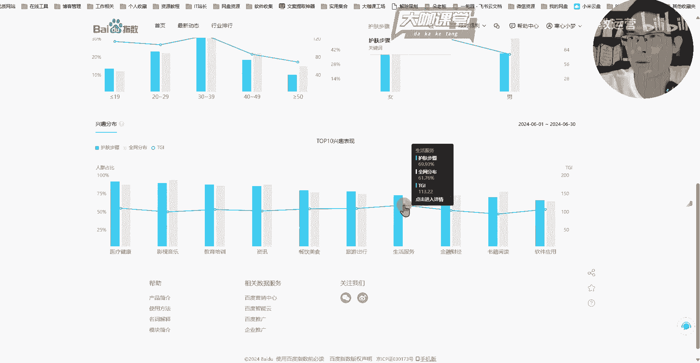

# B站最详细的新媒体运营教程，小红书运营零基础新手起号必学课，抖音短视频引流／涨粉，这个视频全讲清楚了！ - P8：7、新媒体运营第四课：账号定位补充知识点 - 大咖教运营 - BV13ds7edEGt

Hello，大家好，我是方宇老师，欢迎大家来到我们这一堂课，那么前面呢我们仔细的去跟大家聊了一下，关于IP人设如何打造，以及我们账号定位这一块的一个简单的讲解，那么这一堂课呢。

我们来针对账号定位这么一个事儿呢，来仔细的再跟大家呃来深入讲解一下，也就是说我们账号的一个详细的定位，要涉及到的几个点，那么首先第一点呢就是我们做这个账号，我们的这个号呢他到底要做什么内容。

或者说我们要做什么赛道对吧，这是第一点，这一点要决定了我们后续的整个账号的一个，运营方向，或者说我们可以在我们的这个赛道里边，提供什么内容，那么在这个地方呢，我们有很多的赛道可以供大家去选择。

我们也可以尝试去做一些自己能够了解的，或者说目前当下这个各平台上面比较火的，这种平台，去参照一下这种数据，看一下哪些是自己可以做的，比如说你像某图文笔记平台，上面的这种时尚女装穿搭。

然后呢我们的健身旅游减肥，还有养生啊，最近比较火的，以及这个母婴赛道等等，这些还有护肤我们都可以考虑去做，那么这个时候你要考虑赛道，你要想的一个事情是什么呢，我们要想我们要去做一个赛道，首先你就要考虑。

我要在这个赛道做这一块的内容，这个平台我是否合适，对不对，那么比如说我们可能说我们做一个美妆护肤的，哪些短视频平台，我们可以做，对不对，呃，然后呢图文笔记的平台我们也可以做。

那么有哪些平台是我们目前不适合去做这个，美妆护肤的赛道的呢，这个你们可以想一下对吧，有一个平台是不合适做的，OK那么这个时候呢我们想赛道，比如说呢我们以这个啊就以护肤为例对吧。

我们先定下来我们要做的这个赛道，Ok，然后其次第二步我们就要开始确定我们的人群，客户群体是哪些，OK客户群体是哪些，怎么来判定呢，比如说我们做护肤的，我们从目前我们已有的这种数据上面来看，做护肤的内容。

我们的客户群体有这个，比如说大学生群体呃，像这种，还有一些嗯社会精英，职场女性，或者说呢呃是一些年纪比较大的，想做这种皮肤的管理，皮肤的修复这一类呢，它也是属于护肤的，对不对。

那么每一类人群他们喜好的内容方向，或者说这一类人群，他们关注的点会有一定的不同，那么我们就以刚才我们举例的三个方向来讲，首先第一个大学生，然后呢其次是这个职场精英女性。

然后呢再者说就是呃我们按年龄来分吧，40岁以上呃，这个皮肤问题关注皮肤问题的女性，那么他们有什么样的一个区别呢，首先从大学生的角度来讲，我们很多大学生他们想去考虑护肤呃，他们最关注的一点是什么。

我们想一想，作为大学生群体，如果说我们的用户现在是大学生，他们我们想做他们的这个赛道，我们想给他们提供这个护肤相应的知识，护肤相应的产品，那么他们关注的点是什么，那么肯定是性价比对吧。

他们更关注这种好用的，便宜的，然后具有高性价比的这种护肤产品，或者说护肤攻略，比如说大学生的很多这个呃女同学，她们呢比较容易长痘，或者说呢嗯脸上的这种油性肌肤啊，呃这种护理呀。

想要这对这个皮肤进行调理呀，他们可能会更考虑一些什么，比较具有性价比的这种产品，那么这个是不是我们可以做切入的点是吧，又便宜又好用的一个这种好物种草分享，然后呢我们自己在这个宿舍里边化妆的。

整个搭配的工具，我们化妆的流程，护肤的流程，这些是不是我们可以做的方向，对不对，关注性价比对吧呃便宜好用嗯，然后呢护肤的流程，然后呢不同肤质的，不同肤质的一个护肤攻略，这个是一个方向好。

那么我们简单分析一下大学生群体，那么其次还有什么呢，还有职场精英女性，对不对，职场精英女性她们更关注的是什么，他们更关注的是什么，职场精英女性她们的一个，首先我们看一下他们的年龄群体，大部分都是在多少。

都是在23~35岁以内对吧，或者说23~30，32，33，30岁以内的这样的一个职场精英女性，她们更关注的是什么东西，我们可以简单讲一下这一类群体，他们更更关注的是一个精致护肤对吧。

在职场上的这这部分女性，她们在使用某图文笔记平台的时候，他们更关注的是诶某好用的一个护肤品，诶最近很火的，或者说有点小贵的这种护肤品，它到底适不适合我用，它用到什么样的。

它用完之后可以对我皮肤有什么样的一个改善，或者说有什么样的一个保养，比如说我使用电脑比较多，然后呢我使用电子设备比较多，不曝光，包括这个辐射啊，或者说呃我们平时的这个紫外线啊等等，这种情况下。

我们该用什么样的一个情况，什么样的一个产品，什么样的一个护肤的思路，来打造我们比较好的这种肤质，对不对，这个叫做精致护肤，OK那么我们再来关注一下，40岁以上关注皮肤问题的女性，她们更关注的是什么。

我们前面也讲过对吧，40岁以上年纪稍微大一点的女性，她们可能更关注的是对吧，皮肤的一个恢复，对不对，然后呢皮肤的保养，比如说你像我们的这个呃眼角纹啊，对不对，然后呢我们的这个呃皮肤上面的这种暗黄啊。

其实这个呢据我了解，这一点呢也不光是年龄比较大的群体，他们会遇到的问题，但是相对来讲，我们从呃一个目前我们能分析到的结果来看，这一类的群体他们更关注的是什么，更关注的是我们皮肤的一个恢复的问题。

然后配合我们护肤的一些在这个年龄层阶层，他们比较适合的内容，那么我们相对来讲，如果说你现在你去做的这个产品啊，它具有一定的这种功效，或者说你要做的这个笔记，你要做的这个内容比较偏什么呢。

偏皮肤的一个恢复，或者说呃提拉这些，那么你做这一块的内容，你如果说针对大学生群体去做，那么你想一想这一块的内容，是他们现在感兴趣的点吗，那么你的这篇笔记推送到他们的面前的时候。

他的点击率又会是怎么样的呢，对吧，这个是我们可以构思一下的，那么这个是我们的客户群体，我们分析的一个方法，除此之外，还有什么方法可以来分析我们的客户群体。

还有一个工具，我们也需要借助相应的工具来分析，比如说呃我们这里打开一个平台好，这个平台呢它叫做百度指数好吧。

我们呢在这个上面可以初步来分析一下，我们的人群，它代表不了我们全网的一个数据呃，所有平台的一个精准数据，但是它可以给我们一个大的方向指引，也就是说通过这个，我们能大致看到我们这个赛道，我们的客户群体。

他们在什么年龄阶层，或者说他们更感兴趣的，除了我们护肤的这类内容，他们还对什么内容可能更感兴趣，那么我们来试一下，比如说呃我们来这个地方呢，我们就不能去用这个护肤这么一个大词了啊。

我们可能可能要考虑一下。

我们用精致护肤来试一下呃，或者说我们用中年护肤吧，这个词还没被收录好，我们换一个词，我们换一个，精致护肤好像也没有，我们来看一下护肤下面儿还有什么其他的词儿，我们来看一下护肤的步骤吧，护肤的步骤呢。

首先第一个这个搜索指数，它代表的是这个是指数哈，呃这个指数是什么意思呢，是所有目前在这个使用百度搜索引擎的搜索，关于护肤步骤这个词的它的一个量化的标准，它并不代表具体的一个搜索数量对吧，比如说我们打开。

百度这么一个搜索框，然后呢我们输入这个护肤步骤，它指的是输入护肤步骤，这一个人群的一个变化趋势，这个指数那相当于是个趋势。

它并不去，并不代表说目前只有这么多人，比如说呃，在15号只有200多个人来搜索这个词，它指的是一个变化趋势，好吧，这一点要理解一下OK那么其他的我们不用管，我们来看一下关于人群画像这个地方。

在人群画像这个地方，首先你可以关注到第一个是关于地域，地域这个这个点也就是说有多少地区的人，目前搜索这个词儿的这个量比较高一些，你像目前这里呢能看到广东山东，河南江苏，它会有一个排序近30天的。

你还可以写选择近一年的来观测一下，这个数据整体的大差不差。

那么这个地域呃，目前对于我们分析用户的一个需求点，没有什么特别大的帮助。

但是如果说我们后续要涉及到投流，我们要投这个聚光，或者我们投其他的这种呃付费平台，我们要投这个投信息流等等，这种方式呢，你就可能要去着重关注某一个地区，它这个地区的一个投放的效果和水平。

这个是地区带来的一个帮助，其次呢就是关于下面的一个人群属性，那么搜护肤步骤的，我们可以看，主要围绕在首先20~29岁，以及30~39岁，可以理解为40岁以内的，他这个30跨越十岁的这个年龄阶层。

也就是说30岁以上的人群，40岁以下的人群呢搜索的人数会比较多啊，会比较多关注护肤步骤，那么这个词儿呢，这是我们初步判定的，这么一个年龄段的一个范畴，那么我们在这里得到这个词。

我们后续呢还需要用这个护肤步骤，这个词去其他的平台，通过一些其他的方式来分析，具体我怎么去判断，关注护肤步骤的群体到底有哪些，他们的人群的年龄阶层啊。

这个是一个初步的分析方法，然后呢这里呢性别就不用谈了，女性居多嘛，护肤步骤的话相对来讲女性居多。

这个是性别，然后还有年龄，除此之外呢，下面有一个兴趣表现，这个兴趣表现是什么意思呢，就是说同样在搜索护肤步骤的人群，他们除了搜索护肤步骤之外，还搜索对哪些内容比较感兴趣，他们还有哪些搜索行为。

比如说餐饮美食它的占比，然后呢影视音乐它的一个占比，还有生活服务的占比，生活服务代表什么呢，比如说我们考虑一下，30岁以上的这种女性群体，他们搜索生活相关的是由什么呀。

比如说我们生活上遇到的一些生活问题呃，一些污渍怎么处理呀，家庭的这个呃呃家庭的这些呃用品啊等等，这些是他们比较关注的对吧，这也比较符合我们人群的一个导向，OK那么这个地方呢。

其实在我们后期会有一些这个应用，也就是说我们拿到这个感兴趣的范畴，也就是说用户的一个兴趣点。

比如说我们在这里做一个简单的列举吧对吧，那么在职场精英女性这里呢，她的一个精致护肤，那么他的一个兴趣点嗯，兴趣点比如说影视对吧，我们新出的某个剧，我们新出的某个电影最近还比较火的。

然后除此之外呢还有什么呢，还有生活方式等等，我们拿影视来举个例子吧，比如说你做的是护肤相关的内容，那么最近有一个这个电影或者电视剧，他很火，电视剧里边有某个演员是大众熟知的演员。

他最近使用了什么样的一个妆容造型，她的皮肤看起来怎么样，那么我们做护肤的，我们能不能模仿对应的妆容，来做一个这样的一个话题诶，把这个影视的话题相关的话题给他带上，然后除此。

我们其次呢我们在内容上面呢去做一些模仿，去靠近，这个叫什么呀，这个其实也理解为叫做蹭热点，蹭人物的一个方式，那么这个兴趣点，对我们后期我们用户人群的一个，需求点的分析呢。

对我们这个内容的一个扩展是非常有帮助的，也就是说我们其实做账号做到了后期，我们比较难的，就是我们要去看我们今天做什么内容，后期做什么内容，那么你在内容思想这一块枯竭了，你就可以结合什么呀。

结合用户的需求来考虑一下，OK那么这是第二点，客户群体是哪些，那么第三点就是我们之前也强调过的，我们的产品或者是或者服务，那么这一块，你既然想在新媒体或者互联网上，去做一个赛道起来。

或者你做一个产品账号起来，你的自己你有自己的产品，有自己的服务，有自己后续的这个收费的一些标准，那么你在这个当中，你能够给用户提供什么跟别人不一样的优势，这个是你一定要去做的一个点，你一定要去分析的点。

我们之前跟大家讲，你要去做差异化对吧，差异化其实除了内容上的差异化，还有什么，还有我们服务上的差异化，你比如说呃前期很火的这个某某汽车对吧，他呢就把营销做的非常优秀，他出了一台这个年轻人的这个超跑对吧。

虽然是模仿某某某的，但是呢他就把很多其他车企他们去造的这种，这这其他车企呢，他觉得我做的这个某个底盘的这个呃呃研发呀，是所有其他车企都在做的，这个没什么好吹的，但是呢在我们这个车企手下。

他就能把自己做的这个呃，底盘上面的一些调教啊，底盘上面的一些优化呀，他就能把它包装成一个亮点，那么这个亮点单独一个算不了什么，但是如果说他把每一个他觉得都算亮点的东西，给他拿出来，最后做一个整体的包装。

我这个有哪些哪些先进的科技，然后呢我同样的东西别人也在做，我也在做，但是我有什么不同的，那么这个就相当于是你能给用户留下，留下一些你跟别人不一样的印象，在我们产品营销方面，产品销售方面。

或者说我们后期的这个服务的转化方面，这点都是非常重要的，好吧，我们一定要能够总结出自己的产品，或者服务的优势，我们也可以理解是什么呀，你也可以理解为是包装好吧，你一定要能懂得包装自己，包装自己的产品。

你的品牌，你的优势和能力，因为用户的角度来讲，他始终没法去看到你所有所有的优势点，那么只要你做的好的，你做的还不错的，你就得让用户去知道，OK那么这是我们要考虑的，其次呢还有什么呢。

还有就是我们账号定位这一块，我们的一个变现方式嗯，这个变现方式通常来讲现在有哪些变现方式，首先最广泛的就是接商单对吧，接商单广告，目前市面上我们绝大部分的账号类型，都可以实现接商单。

广商单广告的这么一个呃变现的方式对吧，你不管是做这个泛流量娱乐类型的内容，或者说你是做某个垂类赛道的内容啊，你做专业化的内容，你做情感的，你做旅游的，或者说你做什么方向的这些内容。

这些这些方向的这个账号，都是可以去实现一个商单变现的，那么除此之外，除了商单还有什么，除了商单呢，最常见的就是私域变现了对吧，我们很多比如说你像做这个呃，做服务类型的产品对吧。

做本地同城生活的这种类型的，你的这个账号他就比较趋近于做这个私域，也就是说客户呢到了你的这个呃，你的私下联系他的这个方式或者渠道，你才能对他去做更广泛的一个营销，这个也是我们私域获客。

私域获客呢也分两种，一种呢就是投流投广告对吧，然后呢另外一种呢就是纯自然流的，这个获客投流的呢，就相当于是我直接给钱给平台，然后呢把我的这个内容花钱推出去，那么这个就是我拿钱去打广告对吧。

那么这是一种自然流是什么呢，自然流就是我通过账号运营的方式，要么就是把我一个账号做起来诶，然后呢我这个账号可以给我带来很多的流量，要么就是什么呢，要么就是我能够通过举证的方式把所有的账号。

每一个账号我不一定做的特别优秀，但是我所有的账号我都能做得还不错，还有一定的数据啊，我不一定涨粉，特别恐怖，但是每个账号都能为我带来流量，那么这就是我们自然流的一一种两种方式对吧，单一账号做数据。

单一账号呢一般就是做IP了对吧，然后呢矩阵账号做做流量对吧，这个就是我们思域的几种形式，这个大家一定要了解一下，你如果说做这一个赛道，你这四个步骤去分析之下，你大概能清楚你后面的一个内容规划了。

你是做护肤的，那么你的用户人群有哪些，然后呢你怎么去包装你自己的角色，包装你的产品，包装你的服务，然后你的流量怎么来，你到底是呢接商单广告，还是说去做自然流，OK这个是变现方式啊。

还有一个点就是我们现在的电商了对吧，电商呢这个我们暂时就不说，电商，其实就是我们要在每个平台上面，去上架自己的产品，你包括我们B站平台上也是一样，它也有这个自己的电商系统，包括直播，对不对。

这些都是呃一个变现方式的一个来源啊，我们目前讲的最多的就是我们账号的一个，整体的运营，直播运营呢在后续的课程当中会讲到好吧，私域和接商单广告，这是我们做个人账号和做企业账号，最常见的方式了。

OK那么这节课关于账号的一个定位，我们再度梳理盘点，就先讲到这里。

